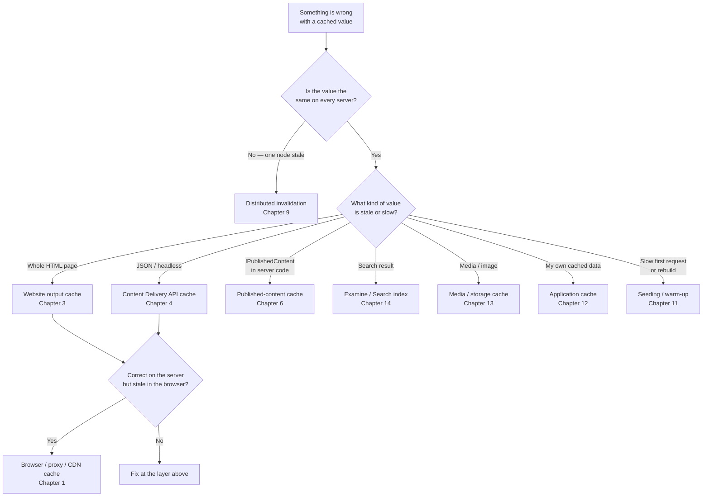

# How to Find Things

> **Read this page like a map, not a chapter.** There is no theory here — just four tables and one diagram that take you from *what you are seeing* to *the paragraph that explains it*. If you already know your topic, jump straight to the chapter. If you have arrived with a problem, start below.

There are two honest ways to use this book:

- **Front to back.** The chapters are written to build on each other. Read them in order and the rest of the book makes sense.
- **Jump in.** You have a stale page, a slow request, or a confusing name, and you want the answer now. The tables below are built for you.

Whichever way you read, keep the one rule the whole book circles back to:

> Deciding *when to throw cached data away* is harder than storing it. Cache busting and invalidation matter at least as much as cache creation.

---

## 1. Find by symptom

Match what you are actually seeing. The "most likely" column is a hypothesis to test, not a verdict.

| The symptom you are seeing | Most likely cache | Start at |
| --- | --- | --- |
| Old HTML / whole page is stale after publishing | Website output cache, or browser/CDN copy | [Ch 3](./03-website-output-caching.md), then [Ch 1](./01-the-big-picture.md) |
| Old JSON or headless response after publishing | Content Delivery API output cache | [Ch 4](./04-the-content-delivery-api.md) |
| Headless JSON is correct inside Umbraco but stale at a CDN, API gateway, or edge cache | Edge cache in front of the CDA — needs its own purge signal | [Edge Cache Chapter](./05-edge-cache-in-front-of-the-cda.md) |
| Content is stale on **one** front-end server only | Distributed invalidation not reaching that node | [Ch 9](./09-cache-busting-and-invalidation.md) |
| Backoffice/preview is correct but the front-end is stale | Published-content cache or output cache | [Ch 6](./06-published-cache-and-load-balancing.md) / [Ch 3](./03-website-output-caching.md) |
| Your own cached data will not clear | Application cache — key, tag, or notification mismatch | [Ch 12](./12-small-local-cache-example-with-tags.md), [Ch 16](./16-reading-the-cache-code.md) |
| Search result is old, missing, or duplicated | Search index freshness, not "the cache" | [Ch 14](./14-examine-indexes-and-cache-adjacent-querying.md) |
| A media file or image URL shows the old file | Media / storage / CDN cache or URL versioning | [Ch 13](./13-storage-providers-and-media-caching.md) |
| First request after startup is slow, or a rebuild is expensive | Seeding, warm-up, or traversal cost | [Ch 11](./11-cache-settings-talks-and-field-notes.md), [Ch 6](./06-published-cache-and-load-balancing.md) |
| An upgrade left you confused, or you see `NuCache` names | Version behaviour or legacy naming | [Ch 8](./08-nucache-vs-hybrid-cache.md) |
| A known bug is biting you | Issue-tracker patterns and workarounds | [Ch 15](./15-lessons-from-the-issue-tracker.md) |

---

## 2. Find by cache layer

If you already know *which* cache you are in, this table tells you what it holds, what should clear it, and where it is explained. Notice the two columns are deliberately separate: **where a value is stored** and **what invalidates it** are different questions, and most cache bugs live in the second one.

| Cache layer | What it stores | What should invalidate or refresh it | Chapter |
| --- | --- | --- | --- |
| Published-content cache | Read-model objects: `IPublishedContent`, `IPublishedElement`, media, members | Publish/unpublish, cache refreshers, distributed messages, rebuilds, seeding | [Ch 6](./06-published-cache-and-load-balancing.md) — engine in [Ch 7](./07-hybrid-cache-engine.md) |
| Website output cache | Server-rendered HTML responses | Output-cache tags, content-derived eviction, vary rules, publish events | [Ch 3](./03-website-output-caching.md) |
| Content Delivery API output cache | Server-side JSON for CDA endpoints | CDA tags, relation-based eviction, publish/unpublish | [Ch 4](./04-the-content-delivery-api.md) |
| Browser / proxy / CDN cache | Client or intermediary copies of a response | `Cache-Control` headers, CDN purge/versioning, URL changes | [Ch 1](./01-the-big-picture.md) |
| Edge cache in front of the CDA (Cloudflare, Azure API Management, Azure Front Door) | Whole CDA JSON responses, cached outside Umbraco entirely | Vendor purge call from a publish/unpublish notification handler | [Edge Cache Chapter](./05-edge-cache-in-front-of-the-cda.md) |
| Application cache | `IAppCache`, `AppCaches`, request/runtime caches, custom `HybridCache` entries | Your own keys, tags, notification handlers, refreshers, explicit removal | [Ch 12](./12-small-local-cache-example-with-tags.md), [Ch 16](./16-reading-the-cache-code.md) |
| Media / storage cache | Blobs, derived images, blob metadata | Storage provider behaviour, URL/versioning, CDN/browser expiry | [Ch 13](./13-storage-providers-and-media-caching.md) |
| Search index | Examine or Umbraco Search index state | Reindexing, indexing notifications, provider sync, rebuild | [Ch 14](./14-examine-indexes-and-cache-adjacent-querying.md) |
| Distributed invalidation | Per-node cache state across a cluster | Cache refreshers, server messenger, load-balancing role/config | [Ch 9](./09-cache-busting-and-invalidation.md) |

---

## 3. Which cache am I looking at?

When the symptom alone is not enough, walk this diagram. It sorts on one question at a time and never mixes layers.

---

## 4. Find by task

Arriving with a goal rather than a bug? Jump straight to the chapter that covers it.

| I want to… | Chapter |
| --- | --- |
| Understand the whole cache family and the mental model | [Ch 1](./01-the-big-picture.md) |
| Tell `IContent` from `IPublishedContent`, and blocks from elements | [Ch 2](./02-the-published-object.md) |
| Write a custom output-cache tag, duration, or vary rule | [Ch 3](./03-website-output-caching.md) |
| Bust the headless JSON cache precisely after a publish | [Ch 4](./04-the-content-delivery-api.md), [Ch 9](./09-cache-busting-and-invalidation.md) |
| Put a shared edge cache (Cloudflare, Azure API Management, Azure Front Door) in front of the CDA | [Edge Cache Chapter](./05-edge-cache-in-front-of-the-cda.md) |
| Get load-balanced correctness right | [Ch 6](./06-published-cache-and-load-balancing.md), [Ch 9](./09-cache-busting-and-invalidation.md) |
| Write a cache refresher or notification handler | [Ch 9](./09-cache-busting-and-invalidation.md), [Ch 16](./16-reading-the-cache-code.md) |
| Cache my own expensive data safely, with tags | [Ch 12](./12-small-local-cache-example-with-tags.md), [Ch 16](./16-reading-the-cache-code.md) |
| Tune settings, seeding, payload size, or rebuild mode | [Ch 11](./11-cache-settings-talks-and-field-notes.md) |
| Understand how the Hybrid Cache engine works | [Ch 7](./07-hybrid-cache-engine.md) |
| Know why `NuCache` names still appear in v17 | [Ch 8](./08-nucache-vs-hybrid-cache.md) |
| Decide between the cache and Examine for a query | [Ch 14](./14-examine-indexes-and-cache-adjacent-querying.md) |
| See the caches used by Forms, Deploy, Engage, Commerce, Search | [Ch 10](./10-hq-extensions-and-cache.md) |
| Read the actual source and check a claim | [Ch 16](./16-reading-the-cache-code.md), [Ch 17](./17-appendix-sources.md), [Ch 18](./18-appendix-umbfyi-archive-notes.md) |
| Look up what a term means, or which chapter covers it | [19 - Glossary](./19-appendix-glossary.md), [20 - Index](./20-appendix-index.md) |

---

> **Version note.** Unless a passage says otherwise, the book describes **Umbraco 17**. Notes for Umbraco 18 and the current `main` branch are labelled where they change the mental model — especially the separate element cache. Treat **Hybrid Cache** as the active published-content cache implementation in v17+, and **NuCache** as its historical predecessor.
