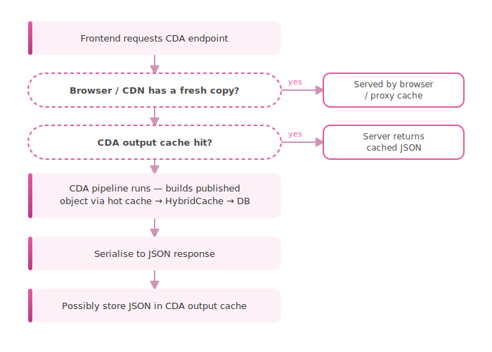
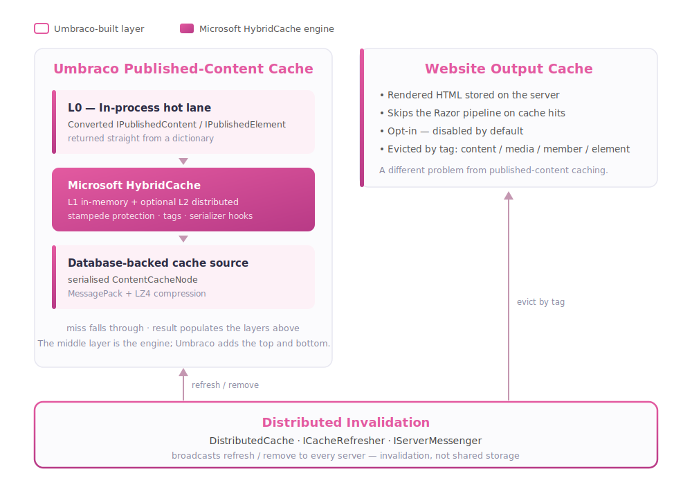
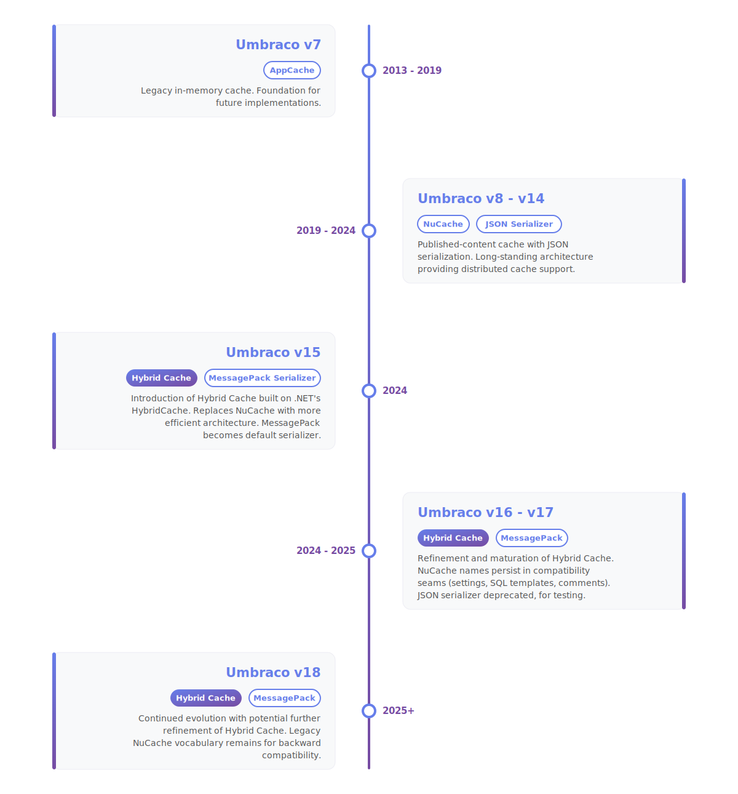

# 01. The Big Picture

> **Start here.** This chapter is the map for everything that follows. By the end you will know that Umbraco has not one cache but a small family of them, what each one is for, and the single idea the rest of the book keeps circling back to: *deciding when to throw cached data away is harder than storing it.* No setup required — just the lay of the land.

If you only remember one thing from this chapter, make it this:

> "Umbraco cache" is not one single cache. It is a small family of caches with different jobs.

A lot of confusion around Umbraco caching comes from treating it as one thing. Once you see it as a family, the individual members start to make sense. Four surfaces cover almost every cache in this book: the **database** is the source of truth but slow to reach; the **published content cache** holds published data ready to assemble; the **output cache** holds finished responses ready to serve; and the **browser and proxy cache** serves responses without the server doing any work at all.

## The three most important cache stories

### 1. Published content cache

This cache holds published data prepared ahead of time, so a request rarely has to go all the way to the database. Every time Umbraco needs to serve a published document, a media item, a domain, or a related published model, it goes through this cache first.

- Used when Umbraco loads published documents, media, domains, and related published models
- In Umbraco 17 it is built on Microsoft's `HybridCache`[^01-hybrid]
- It also keeps a small in-process cache of already materialised published objects
- This is not the same thing as website output caching

The fast-lane cache is worth knowing about: if the same published object was already resolved earlier in the request, it is handed back immediately from in-process memory without touching `HybridCache` at all.

> **Key term — materialised object.** When Umbraco turns raw cached data into a ready-to-use `IPublishedContent` object, it has *materialised* it. The small in-process cache stores those already-materialised objects, so the next request can skip the assembly step entirely.

### 2. Content Delivery API output cache

Rather than rebuild a response from scratch, Umbraco hands out the JSON it already prepared. If you are running Umbraco as a headless CMS — feeding JSON to a Next.js frontend, a mobile app, or anything else that is not a Razor view — this is the output cache that matters to you.

- Stores ready-made JSON responses on the server
- Skips re-fetching from the published content cache on repeated requests to the same URL
- Varied by route and Delivery API headers such as `Accept-Language`, `Accept-Segment`, and `StartItem`; custom vary providers can add more dimensions
- Invalidated automatically when content is published or unpublished
- Opt-in, disabled by default

The clever part is *how* that automatic invalidation stays precise. Rather than wiping the whole cache, Umbraco stamps each stored response with **tags** derived from the content it contains, and publishing evicts only the matching tags — right down to the pages that merely *embed* a changed item via a picker. That machinery — tag-based eviction, relation-based eviction, and the code behind them — has a chapter of its own: [Chapter 4 - The Content Delivery API](./04-the-content-delivery-api.md).

> **Using Razor views instead?** If your project renders HTML server-side through Razor views, Umbraco 17 also ships a website output cache built on ASP.NET Core output caching[^01-output]. The idea is the same — store ready-made responses on the server — but it stores HTML rather than JSON. The rest of this book assumes headless-first, so that path is not covered in depth.

### 3. Browser, proxy, and CDN cache

This is ordinary HTTP caching, and it ranges from a browser quietly obeying a header to a CDN, API gateway, or edge network you deliberately put in front of Umbraco. Nothing Umbraco-specific runs here — when a response is served from this layer, it never reaches the server at all.

- Controlled with `Cache-Control` headers
- Described in the Umbraco docs as "Response Caching"[^01-response]
- Great for static assets, and sometimes useful for API responses with stable content
- Worth remembering: a cached response at this layer does not stop the server from doing work if the request still makes it through

At browser scale this needs no design of its own — the platform just does it. Run deliberately as production infrastructure in front of the Content Delivery API, the way Umbraco Cloud itself runs Cloudflare, it needs the same care as any other cache layer in this book: a cache key, a TTL source, and a purge path. That is worth a chapter of its own: [Edge Cache in Front of the CDA](./05-edge-cache-in-front-of-the-cda.md).

## Mental model

Put all three layers together and a headless request looks like this:

## How the cache families relate

The diagram above follows a single request from top to bottom. This next diagram steps back and shows how the main cache families sit *alongside* each other — what Microsoft provides, what Umbraco builds on top, and where invalidation crosses the boundaries.

## What changed in Umbraco 17, and why it matters

In older versions, people often talked about "NuCache" as the main published-content cache. That name has mostly faded, but it still appears in configuration keys and settings — which can be confusing if you upgrade an existing project.

In Umbraco 17:

- the published cache is now built on Microsoft's `HybridCache`
- old configuration names still appear under `Umbraco:CMS:NuCache` for backward compatibility[^01-nucache]
- output caching for API and website responses became a first-class documented feature

One thing worth clearing up straight away: those `NuCache` config names are *just names*. The NuCache engine itself was retired in Umbraco 15, so v17 does **not** ship two cache engines for you to choose between. Anything still labelled `NuCache` — settings, serialiser options, SQL templates — is quietly feeding Hybrid Cache under the hood. [Chapter 8](./08-nucache-vs-hybrid-cache.md) walks through this in detail if you want the full story.

Looking ahead beyond v17, the documentation also reveals where the platform is heading next:

- element cache settings are becoming first-class
- cache seeding is described for documents, media, and elements
- cache entry settings are documented for documents, media, and elements

A useful way to frame the whole topic for a headless project:

1. "How do we cache Content Delivery API responses?"
2. "How does Umbraco cache published content internally?"
3. "How does invalidation stay correct across multiple servers?"

Each of those questions has its own answer, and they are mostly independent of each other.

## Quick glossary

These terms come up constantly. Getting them straight early saves a lot of confusion later.

### Microsoft cache stack

Umbraco is built on top of .NET's own caching primitives. The three you will encounter most often are:

- `IMemoryCache` — plain in-process memory caching
- `IDistributedCache` — an abstraction for distributed cache storage (Redis, SQL, etc.)
- `HybridCache` — a higher-level API that combines a fast local memory layer with an optional distributed second level[^01-msstack]

Why does this matter? Umbraco's published-content cache is built on `HybridCache`. Once you know that `HybridCache` is already sitting on top of those lower primitives, the rest of Umbraco's cache architecture becomes much easier to picture.

### `AppCaches`

Umbraco's own helper object for general application caching. You will reach for this when you need to cache custom data in your own code.

It exposes three caches:

- `RuntimeCache` — lives for the lifetime of the application
- `RequestCache` — lives for a single HTTP request
- `IsolatedCaches` — per-entity caches, one per entity type

### `DistributedCache`

This one trips people up, so it is worth being explicit: Umbraco's `DistributedCache` is **not** about storing content in Redis. It is an invalidation messenger.

What it actually does:

- Umbraco broadcasts refresh and remove instructions across all servers
- every server receives those instructions
- each server clears or refreshes its own local caches in response

This is related to, but meaningfully different from, Microsoft's `IDistributedCache`.

- Microsoft `IDistributedCache` is a **storage** abstraction — it holds data
- Umbraco `DistributedCache` is an **invalidation** abstraction — it coordinates what to forget[^01-distributed]

That distinction is one of the most common sources of confusion for developers new to Umbraco. When someone says "set up distributed cache," they could mean either thing, and they are very different tasks.

### `ICacheRefresher`

The standard Umbraco contract for telling all servers:

> "This thing changed — clear or refresh the matching cache entries."

It is how a change on one server tells every server to stop serving a stale entry the instant it is no longer valid. You will see implementations of this throughout the codebase, one per entity type (content, media, members, and so on).

## Things to keep in mind

A few rules of thumb that will save you from the most common misunderstandings:

- To speed up Content Delivery API responses, enable the CDA output cache — that is the right lever.
- To cache your own custom app or service data, reach for `AppCaches`.
- If your data can change from backoffice actions and you run more than one server, learn about `ICacheRefresher` and `DistributedCache` — you will need them.
- "Response caching" and "output caching" sound similar but are different things. Do not conflate them.
- "Distributed cache" in Umbraco usually means distributed *invalidation*, not distributed *storage*. Check which one the conversation is about.
- The HTML output cache (for Razor pages) and the CDA output cache are separate features. Enabling one does nothing to the other.

## What is coming in Umbraco 18

The biggest cache-related addition in the Umbraco 18 codebase is first-class element cache handling:

- `ElementCacheRefresherNotification`
- `ElementCacheService`
- `WebsiteElementOutputCacheEvictionHandler`

The practical difference this makes:

- in v17, publishing content clears element caches broadly because individual elements are hard to target precisely
- in v18, element caching and element-driven output-cache eviction become explicit, with relation-based page eviction and full-cache eviction for element refresh-all cases

This should make the cache story considerably easier to reason about for projects that use block-based content heavily.

## A brief history of Umbraco caching

If a timeline helps, here it is in one line per era:

- **Umbraco 8–14:** Published content cache was "NuCache" — load almost everything, think NuCache.
- **Umbraco 15–17:** The NuCache *engine* is gone. HybridCache takes over, with a local hot lane, smart seeding, and careful invalidation.
- **Umbraco 18 onwards:** Elements become first-class in both cache storage and cache busting.

## Cache Architecture Evolution (v7 - v18)

For more detail on the differences between NuCache and Hybrid Cache, see [Chapter 8 - NuCache vs Hybrid Cache](./08-nucache-vs-hybrid-cache.md).

## In a nutshell

If you remember nothing else from this chapter, remember the four surfaces:

- The **database** is the source of truth, but slow to reach.
- The **published content cache** holds prepared published data, ready to assemble (built on `HybridCache` in v17).
- The **output cache** holds a finished response ready to serve (JSON for the Delivery API, HTML for Razor).
- The **browser and proxy cache** serves a response without the server doing any work.
- **Cache refreshers** and `DistributedCache` tell every server to drop a stale entry the moment content changes.

### Three takeaways

1. There is no single "Umbraco cache" — there is a family, and knowing which member you are touching saves hours.
2. "Distributed" in Umbraco usually means distributed *invalidation* (telling servers what to drop), not shared *storage*.
3. The hard, interesting part is not storing data — it is throwing it away at exactly the right moment. That thread runs through the whole book.

### Where to go next

- [Chapter 2 - The Published Object](./02-the-published-object.md) — `IPublishedContent`, the read model every cache in this book serves. **Read this next.**
- [Chapter 3 - Website Output Caching](./03-website-output-caching.md) — server-side output caching for Razor HTML.
- [Chapter 4 - The Content Delivery API](./04-the-content-delivery-api.md) — headless JSON output caching, and the surgical tag-eviction machinery.
- [Edge Cache in Front of the CDA](./05-edge-cache-in-front-of-the-cda.md) — the browser/proxy/CDN box in the diagram above, built deliberately with Cloudflare, Azure API Management, or Azure Front Door.
- [Chapter 6 - Published Content Cache, AppCaches, and Load Balancing](./06-published-cache-and-load-balancing.md) — the published content cache, up close.
- [Chapter 9 - Cache Busting and Invalidation](./09-cache-busting-and-invalidation.md) — cache invalidation, the heart of the book.

[^01-response]: See [U2 in the appendix](./17-appendix-sources.md#u2-response-caching).
[^01-output]: See [U3](./17-appendix-sources.md#u3-website-output-caching) and [C6](./17-appendix-sources.md#c6-website-output-cache-implementation) in the appendix.
[^01-hybrid]: See [M2](./17-appendix-sources.md#m2-aspnet-core-hybridcache), [C1](./17-appendix-sources.md#c1-umbraco-17-source-checkout), and [C4](./17-appendix-sources.md#c4-umbracopublishedcachehybridcache-on-main) in the appendix.
[^01-msstack]: See [M1](./17-appendix-sources.md#m1-caching-in-net) and [M2](./17-appendix-sources.md#m2-aspnet-core-hybridcache) in the appendix.
[^01-distributed]: See [C7](./17-appendix-sources.md#c7-core-cache-types-and-refreshers) and [M1](./17-appendix-sources.md#m1-caching-in-net) in the appendix.
[^01-nucache]: See [08 - NuCache vs Hybrid Cache](./08-nucache-vs-hybrid-cache.md) and [C1](./17-appendix-sources.md#c1-umbraco-17-source-checkout) in the appendix.

## Sources

- Docs:
  - [Caching overview (v17)](https://docs.umbraco.com/umbraco-cms/17.latest/develop-with-umbraco/caching.md)
  - [Server-side cache extensions (v17)](https://docs.umbraco.com/umbraco-cms/17.latest/extend-your-project/server-side-extensions/cache.md)
  - [Application cache (v17)](https://docs.umbraco.com/umbraco-cms/17.latest/extend-your-project/server-side-extensions/cache/application-cache.md)
  - [Cache settings (v17)](https://docs.umbraco.com/umbraco-cms/17.latest/develop-with-umbraco/configuration/cache-settings.md)
  - [Cache settings (latest)](https://docs.umbraco.com/umbraco-cms/develop-with-umbraco/configuration/cache-settings.md)
- Code:
  - `umbraco-v17/src/Umbraco.PublishedCache.HybridCache/DependencyInjection/UmbracoBuilderExtensions.cs`
  - `umbraco-v17/src/Umbraco.Core/Cache/AppCaches.cs`
  - `umbraco-v17/src/Umbraco.Core/Cache/DistributedCache.cs`
  - `umbraco-v17/src/Umbraco.Cms.Api.Delivery/Caching/DeliveryApiOutputCachePolicyBase.cs`
  - `umbraco-v17/src/Umbraco.Cms.Api.Delivery/Caching/DeliveryApiDocumentOutputCacheEvictionHandler.cs`
  - `umbraco-v17/src/Umbraco.Web.Common/Caching/RelationOutputCacheEvictionHandlerBase.cs`
  - `umbraco-v17/src/Umbraco.Core/Constants-DeliveryApi.cs`
  - `umbraco-v18/src/Umbraco.PublishedCache.HybridCache/Services/ElementCacheService.cs`
  - `umbraco-v18/src/Umbraco.Web.Website/Caching/WebsiteElementOutputCacheEvictionHandler.cs`
