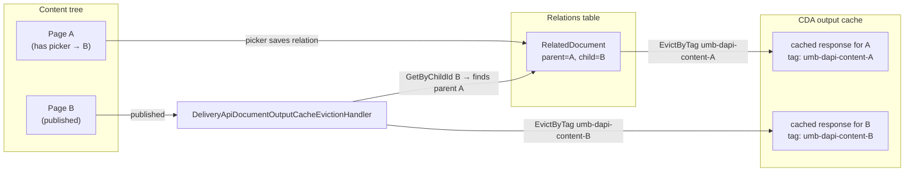
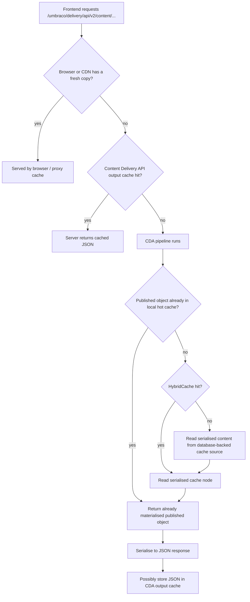
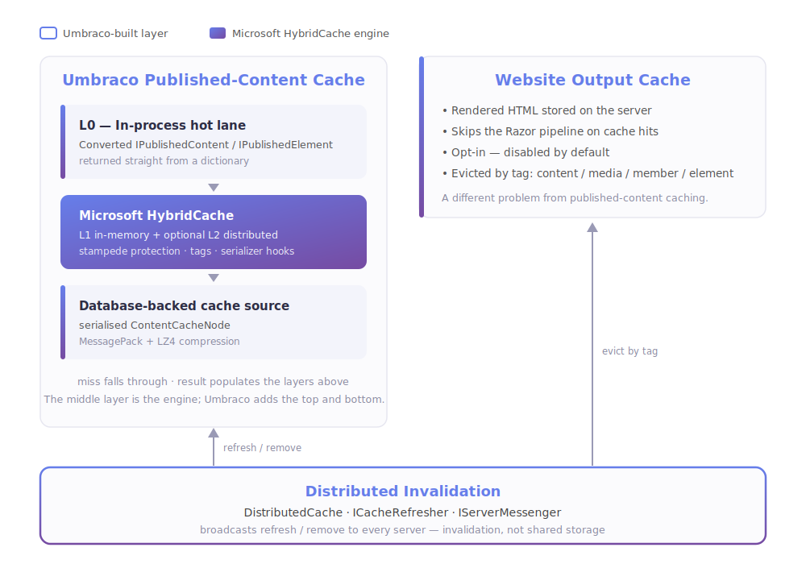

# 01. The Big Picture

> **Start here.** This chapter is the map for everything that follows. By the end you will know that Umbraco has not one cache but a small family of them, what each one is for, and the single idea the rest of the book keeps circling back to: *deciding when to throw cached data away is harder than storing it.* No setup required — just the lay of the land.

If you only remember one thing from this chapter, make it this:

> "Umbraco cache" is not one single cache. It is a small family of caches with different jobs.

A lot of confusion around Umbraco caching comes from treating it as one thing. Once you see it as a family, the individual members start to make sense.

> **Analogy — the restaurant kitchen.** Picture a busy restaurant on a Friday night. There is a walk-in fridge holding every raw ingredient — that is your *database*. There are prep stations with ingredients already chopped and ready to assemble — that is the *published content cache*. There are finished plates under the heat lamp, ready to carry straight out — that is the *output cache*. And there is a shelf by the front door where takeaway bags wait for customers to grab without ever talking to staff — that is the *browser and proxy cache*. Almost every cache in this book is one of those surfaces, and we will keep coming back to this kitchen.

## The three most important cache stories

### 1. Published content cache — the prep stations

This is the kitchen's *mise en place*: content prepped ahead of time so nobody has to sprint to the walk-in fridge in the middle of an order. Every time Umbraco needs to serve a published document, a media item, a domain, or a related published model, it goes through this cache first.

- Used when Umbraco loads published documents, media, domains, and related published models
- In Umbraco 17 it is built on Microsoft's `HybridCache`[^01-hybrid]
- It also keeps a small in-process "fast lane" cache for already materialised published objects
- This is not the same thing as website output caching

The fast-lane cache is worth knowing about: if the same published object was already resolved earlier in the request, it is handed back immediately from in-process memory without touching `HybridCache` at all.

> **Key term — materialised object.** When Umbraco turns raw cached data into a ready-to-use `IPublishedContent` object, it has *materialised* it. The "fast lane" stores those already-materialised objects, so the next request can skip the assembly step entirely.

### 2. Content Delivery API output cache — plates under the heat lamp

This is the finished plate kept warm and ready to serve: rather than re-cook a response from scratch, Umbraco hands out the JSON it already prepared. If you are running Umbraco as a headless CMS — feeding JSON to a Next.js frontend, a mobile app, or anything else that is not a Razor view — this is the output cache that matters to you.

- Stores ready-made JSON responses on the server
- Skips re-fetching from the published content cache on repeated requests to the same URL
- Keyed on URL, query string, and culture
- Invalidated automatically when content is published or unpublished
- Opt-in, disabled by default

> **Going deeper — skim on a first read.** The next two sections crack open the machinery behind "invalidated automatically" with real code, and they are some of the most satisfying detail in the book. If you only want the big-picture map for now, skip ahead to the third cache (browser and proxy) and circle back once the lay of the land has settled.

#### How invalidation actually works: tag-based eviction

The bullet above says "invalidated when content is published." That is true, but the *how* is worth understanding — it explains why only the right responses get dropped instead of the whole cache being wiped.

When the CDA stores a response, it stamps it with tags derived from the content it contains. Think of a tag as a sticky label on a cached entry. Every tag is a string constant defined in `Constants.DeliveryApi.OutputCache`:

```csharp
// src/Umbraco.Core/Constants-DeliveryApi.cs
public const string ContentTagPrefix    = "umb-dapi-content-";        // + content GUID
public const string MediaTagPrefix      = "umb-dapi-media-";          // + media GUID
public const string AncestorTagPrefix   = "umb-dapi-content-ancestor-"; // + ancestor GUID
public const string ContentTypeTagPrefix = "umb-dapi-content-type-";  // + content type alias
public const string AllContentTag       = "umb-dapi-content-all";
public const string AllMediaTag         = "umb-dapi-media-all";
public const string AllTag              = "umb-dapi-all";
```

So a cached response for a page with GUID `a1b2...` gets the tag `umb-dapi-content-a1b2...` stamped on it at store time. This happens in `DeliveryApiOutputCachePolicyBase.ServeResponseAsync`, which runs once per unique response before it is written to the cache:

```csharp
// src/Umbraco.Cms.Api.Delivery/Caching/DeliveryApiOutputCachePolicyBase.cs
foreach (IPublishedContent item in items)
{
    // Tag with specific item key for targeted eviction.
    context.Tags.Add(ItemTagPrefix + item.Key);
    // ... plus ancestor tags, content-type tags, and custom provider tags
}
```

When an editor publishes content, Umbraco fires a `ContentCacheRefresherNotification`. The `DeliveryApiDocumentOutputCacheEvictionHandler` picks that up and evicts by tag — not by URL:

```csharp
// src/Umbraco.Cms.Api.Delivery/Caching/DeliveryApiDocumentOutputCacheEvictionHandler.cs
await OutputCacheStore.EvictByTagAsync(
    Constants.DeliveryApi.OutputCache.ContentTagPrefix + contentKey,
    cancellationToken);
```

The result is surgical: only the responses that actually contain the changed content are dropped. A homepage that has nothing to do with the updated article keeps its cached response perfectly intact.

**Branch publishes** need a wider sweep. If a whole branch of the content tree is refreshed (`TreeChangeTypes.RefreshBranch`), the handler also evicts by the ancestor tag — so any response that listed the changed node as an ancestor is cleared too:

```csharp
await OutputCacheStore.EvictByTagAsync(
    Constants.DeliveryApi.OutputCache.AncestorTagPrefix + contentKey,
    cancellationToken);
```

**Full-tree refreshes** fall back to evicting `AllTag`, which clears every CDA cache entry at once. This is the sledgehammer, used only when precision is not possible.

#### Relation-based eviction

There is a subtler case worth knowing about. Imagine page A has a picker property that points at page B, and the CDA response for A embeds B's data inline. If an editor publishes B, A's cached response is now stale — but A's GUID was never in the change payload, so the tag for A would not normally be touched.

Umbraco handles this through its relation system. When content is saved with a picker property, Umbraco automatically records a `RelatedDocument` relation from A (the referencing page, treated as parent) to B (the picked item, treated as child). After every content change, the eviction handler queries those relations and evicts the referencing pages too:



The code in `RelationOutputCacheEvictionHandlerBase.EvictRelatedContentAsync` looks up all `RelatedDocument` relations where the changed content is the child, then evicts the cache tag for each parent it finds. This is why publishing a referenced item correctly clears the pages that embed it — without needing to know their URLs in advance.

> **Using Razor views instead?** If your project renders HTML server-side through Razor views, Umbraco 17 also ships a website output cache built on ASP.NET Core output caching[^01-output]. The idea is the same — store ready-made responses on the server — but it stores HTML rather than JSON. The rest of this book assumes headless-first, so that path is not covered in depth.

### 3. Browser and proxy cache — the takeaway shelf

This is the bag waiting on the shelf by the door: ordinary HTTP caching, nothing Umbraco-specific, just the web platform doing its job. The customer grabs it and leaves without the kitchen lifting a finger.

- Controlled with `Cache-Control` headers
- Described in the Umbraco docs as "Response Caching"[^01-response]
- Great for static assets, and sometimes useful for API responses with stable content
- Worth remembering: a cached response at this layer does not stop the server from doing work if the request still makes it through

## Mental model

Put all three layers together and a headless request looks like this:



## How the cache families relate

The diagram above follows a single request from top to bottom. This next diagram steps back and shows how the main cache families sit *alongside* each other — what Microsoft provides, what Umbraco builds on top, and where invalidation crosses the boundaries.



## What changed in Umbraco 17, and why it matters

In older versions, people often talked about "NuCache" as the main published-content cache. That name has mostly faded, but it still appears in configuration keys and settings — which can be confusing if you upgrade an existing project.

In Umbraco 17:

- the published cache is now built on Microsoft's `HybridCache`
- old configuration names still appear under `Umbraco:CMS:NuCache` for backward compatibility[^01-nucache]
- output caching for API and website responses became a first-class documented feature

One thing worth clearing up straight away: those `NuCache` config names are *just names*. The NuCache engine itself was retired in Umbraco 15, so v17 does **not** ship two cache engines for you to choose between. Anything still labelled `NuCache` — settings, serialiser options, SQL templates — is quietly feeding Hybrid Cache under the hood. [Chapter 11](./11-nucache-vs-hybrid-cache.md) walks through this in detail if you want the full story.

Looking ahead beyond v17, the documentation also reveals where the platform is heading next:

- element cache settings are becoming first-class
- cache seeding is described for documents, media, and elements
- cache entry settings are documented for documents, media, and elements

A useful way to frame the whole topic for a headless project:

1. "How do we cache Content Delivery API responses?"
2. "How does Umbraco cache published content internally?"
3. "How does invalidation stay correct across multiple servers?"

Each of those questions has its own answer, and they are mostly independent of each other.

## Quick glossary

These terms come up constantly. Getting them straight early saves a lot of confusion later.

### Microsoft cache stack

Umbraco is built on top of .NET's own caching primitives. The three you will encounter most often are:

- `IMemoryCache` — plain in-process memory caching
- `IDistributedCache` — an abstraction for distributed cache storage (Redis, SQL, etc.)
- `HybridCache` — a higher-level API that combines a fast local memory layer with an optional distributed second level[^01-msstack]

Why does this matter? Umbraco's published-content cache is built on `HybridCache`. Once you know that `HybridCache` is already sitting on top of those lower primitives, the rest of Umbraco's cache architecture becomes much easier to picture.

### `AppCaches`

Umbraco's own helper object for general application caching. You will reach for this when you need to cache custom data in your own code.

It exposes three caches:

- `RuntimeCache` — lives for the lifetime of the application
- `RequestCache` — lives for a single HTTP request
- `IsolatedCaches` — per-entity caches, one per entity type

### `DistributedCache`

This one trips people up, so it is worth being explicit: Umbraco's `DistributedCache` is **not** about storing content in Redis. It is an invalidation messenger.

What it actually does:

- Umbraco broadcasts refresh and remove instructions across all servers
- every server receives those instructions
- each server clears or refreshes its own local caches in response

This is related to, but meaningfully different from, Microsoft's `IDistributedCache`.

- Microsoft `IDistributedCache` is a **storage** abstraction — it holds data
- Umbraco `DistributedCache` is an **invalidation** abstraction — it coordinates what to forget[^01-distributed]

That distinction is one of the most common sources of confusion for developers new to Umbraco. When someone says "set up distributed cache," they could mean either thing, and they are very different tasks.

### `ICacheRefresher`

The standard Umbraco contract for telling all servers:

> "This thing changed — clear or refresh the matching cache entries."

In kitchen terms, this is the head chef calling "86 the salmon!" — telling every station to stop serving a dish the instant it is no longer good. You will see implementations of this throughout the codebase, one per entity type (content, media, members, and so on).

## Things to keep in mind

A few rules of thumb that will save you from the most common misunderstandings:

- To speed up Content Delivery API responses, enable the CDA output cache — that is the right lever.
- To cache your own custom app or service data, reach for `AppCaches`.
- If your data can change from backoffice actions and you run more than one server, learn about `ICacheRefresher` and `DistributedCache` — you will need them.
- "Response caching" and "output caching" sound similar but are different things. Do not conflate them.
- "Distributed cache" in Umbraco usually means distributed *invalidation*, not distributed *storage*. Check which one the conversation is about.
- The HTML output cache (for Razor pages) and the CDA output cache are separate features. Enabling one does nothing to the other.

## What is coming in Umbraco 18

The biggest cache-related addition in the Umbraco 18 codebase is first-class element cache handling:

- `ElementCacheRefresherNotification`
- `ElementCacheService`
- `WebsiteElementOutputCacheEvictionHandler`

The practical difference this makes:

- in v17, publishing content clears element caches broadly because individual elements are hard to target precisely
- in v18, element caching and element-driven output-cache eviction become explicit and surgical — the same tag-based precision that the CDA cache already uses

This should make the cache story considerably easier to reason about for projects that use block-based content heavily.

## A brief history of Umbraco caching

If a timeline helps, here it is in one line per era:

- **Umbraco 8–14:** Published content cache was "NuCache" — load almost everything, think NuCache.
- **Umbraco 15–17:** The NuCache *engine* is gone. HybridCache takes over, with a local hot lane, smart seeding, and careful invalidation.
- **Umbraco 18 onwards:** Elements become first-class in both cache storage and cache busting.

## Cache Architecture Evolution (v7 - v18)


For more detail on the differences between NuCache and Hybrid Cache, see [Chapter 11 - NuCache vs Hybrid Cache](./11-nucache-vs-hybrid-cache.md).

## In a nutshell

If you remember nothing else from this chapter, remember the kitchen:

- The **database** is the walk-in fridge — the source of truth, but slow to visit.
- The **published content cache** is your *mise en place* — prepped content, ready to assemble (built on `HybridCache` in v17).
- The **output cache** is the plated dish under the heat lamp — a finished response ready to serve (JSON for the Delivery API, HTML for Razor).
- The **browser and proxy cache** is the takeaway shelf — served without the kitchen doing a thing.
- **Cache refreshers** and `DistributedCache` are the head chef shouting "86 the salmon!" so every station, on every server, stops serving the stale dish.

### Three takeaways

1. There is no single "Umbraco cache" — there is a family, and knowing which member you are touching saves hours.
2. "Distributed" in Umbraco usually means distributed *invalidation* (telling servers what to drop), not shared *storage*.
3. The hard, interesting part is not storing data — it is throwing it away at exactly the right moment. That thread runs through the whole book.

### Where to go next

- [Chapter 2 - Website Output Caching](./02-website-output-caching.md) — the heat lamp, for Razor HTML.
- [Chapter 3 - Published Content Cache, AppCaches, and Load Balancing](./03-published-cache-and-load-balancing.md) — the prep stations, up close.
- [Chapter 4 - Cache Busting and Invalidation](./04-cache-busting-and-invalidation.md) — the "86 the salmon!" chapter, and the heart of the book.

[^01-response]: See [U2 in the appendix](./10-appendix-sources.md#u2-response-caching).
[^01-output]: See [U3](./10-appendix-sources.md#u3-website-output-caching) and [C6](./10-appendix-sources.md#c6-website-output-cache-implementation) in the appendix.
[^01-hybrid]: See [M2](./10-appendix-sources.md#m2-aspnet-core-hybridcache), [C1](./10-appendix-sources.md#c1-umbraco-17-source-checkout), and [C4](./10-appendix-sources.md#c4-umbracopublishedcachehybridcache-on-main) in the appendix.
[^01-msstack]: See [M1](./10-appendix-sources.md#m1-caching-in-net) and [M2](./10-appendix-sources.md#m2-aspnet-core-hybridcache) in the appendix.
[^01-distributed]: See [C7](./10-appendix-sources.md#c7-core-cache-types-and-refreshers) and [M1](./10-appendix-sources.md#m1-caching-in-net) in the appendix.
[^01-nucache]: See [11 - NuCache vs Hybrid Cache](./11-nucache-vs-hybrid-cache.md) and [C1](./10-appendix-sources.md#c1-umbraco-17-source-checkout) in the appendix.

## Sources

- Docs:
  - [Caching overview (v17)](https://docs.umbraco.com/umbraco-cms/17.latest/develop-with-umbraco/caching.md)
  - [Server-side cache extensions (v17)](https://docs.umbraco.com/umbraco-cms/17.latest/extend-your-project/server-side-extensions/cache.md)
  - [Application cache (v17)](https://docs.umbraco.com/umbraco-cms/17.latest/extend-your-project/server-side-extensions/cache/application-cache.md)
  - [Cache settings (v17)](https://docs.umbraco.com/umbraco-cms/17.latest/develop-with-umbraco/configuration/cache-settings.md)
  - [Cache settings (latest)](https://docs.umbraco.com/umbraco-cms/develop-with-umbraco/configuration/cache-settings.md)
- Code:
  - `umbraco-v17/src/Umbraco.PublishedCache.HybridCache/DependencyInjection/UmbracoBuilderExtensions.cs`
  - `umbraco-v17/src/Umbraco.Core/Cache/AppCaches.cs`
  - `umbraco-v17/src/Umbraco.Core/Cache/DistributedCache.cs`
  - `umbraco-v17/src/Umbraco.Cms.Api.Delivery/Caching/DeliveryApiOutputCachePolicyBase.cs`
  - `umbraco-v17/src/Umbraco.Cms.Api.Delivery/Caching/DeliveryApiDocumentOutputCacheEvictionHandler.cs`
  - `umbraco-v17/src/Umbraco.Web.Common/Caching/RelationOutputCacheEvictionHandlerBase.cs`
  - `umbraco-v17/src/Umbraco.Core/Constants-DeliveryApi.cs`
  - `umbraco-v18/src/Umbraco.PublishedCache.HybridCache/Services/ElementCacheService.cs`
  - `umbraco-v18/src/Umbraco.Web.Website/Caching/WebsiteElementOutputCacheEvictionHandler.cs`
