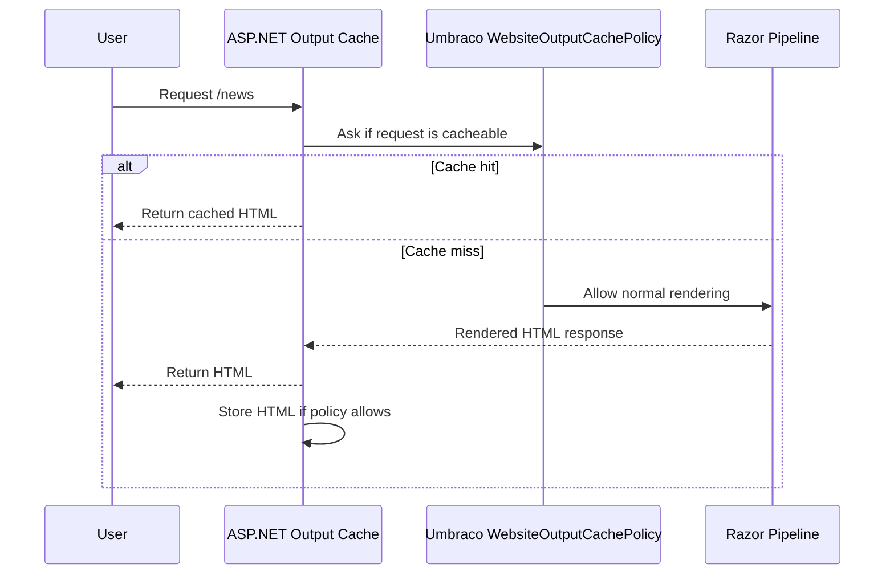
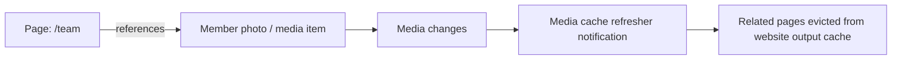

# 02. Website Output Caching

> **Start here.** This chapter covers website output caching for server-rendered sites. If your project renders HTML through Razor views, this cache lets Umbraco return finished pages without re-running the full rendering pipeline on every request. By the end you will know how to enable it, what makes a request non-cacheable, and how eviction keeps cached pages correct.

This is the cache most people mean when they say:

> "Can Umbraco avoid rerendering the whole page every time?"

In Umbraco 17, the answer is yes.[^02-output]

In [Chapter 1](./01-the-big-picture.md), output caching is introduced as a separate cache family. This chapter focuses on the Razor HTML path. (The headless Content Delivery API uses a similar output-caching pattern for JSON.)

## Plain-English definition

Website output caching stores the final rendered HTML on the server.

So on the next request:

- Umbraco does not run the full Razor rendering pipeline again
- your controllers, views, and value converters do less work
- the user gets the response faster

## It is not enabled by default

You must turn it on in `appsettings.json`:

```json
{
  "Umbraco": {
    "CMS": {
      "Website": {
        "OutputCache": {
          "Enabled": true,
          "ContentDuration": "00:00:30"
        }
      }
    }
  }
}
```

## How the request flows

<div class="pdf-keep-together" style="break-inside: avoid; page-break-inside: avoid; -webkit-column-break-inside: avoid; margin: 1rem 0;">



</div>

## What makes a request cacheable in v17

The main decision logic lives in `WebsiteOutputCachePolicy` plus `DefaultWebsiteOutputCacheRequestFilter`.

By default, Umbraco refuses to output-cache:[^02-rules]

- preview requests
- authenticated requests
- requests where `PublishedRequest.SetNoCacheHeader` is set
- responses with `Set-Cookie`
- responses marked `Cache-Control: no-store`

> **Gotcha — forms quietly opt out.** That last rule bites more often than you would expect. A page using `@Html.AntiForgeryToken()` usually becomes non-cacheable because anti-forgery sets `Cache-Control: no-store`; first requests may also be blocked if the response carries `Set-Cookie`. Form-heavy pages need special care for exactly this reason.

## Default tags Umbraco adds

When Umbraco stores a page in the website output cache, it tags the cached entry with:

- the page's own content key
- the keys of all ancestors
- the "all content" tag
- custom tags from registered `IWebsiteOutputCacheTagProvider` implementations

The docs also explain the intended model in broader terms:

- content key
- ancestor keys
- content type alias
- relation-driven tags for referenced items

In the code, content type tagging is provided by a registered tag provider, not hardcoded directly into the policy.

## Why tags matter

Tags are the trick that makes eviction precise.

Example:

- cache `/products/shoes/nike-air`
- tag it with its own key
- tag it with ancestors like `products` and `shoes`
- later, if `shoes` moves or refreshes as a branch, Umbraco evicts descendants by ancestor tag

## Eviction after content changes

This is the most important part of the whole feature. Creating a cache is easy; creating one that *disappears at the right moment* is the hard part — and it is where Umbraco does most of its real work.

The eviction handler for website pages in v17 is `WebsiteDocumentOutputCacheEvictionHandler`.

It listens for `ContentCacheRefresherNotification`.

Then it can:

- evict one page by content key
- evict descendants by ancestor tag on branch refresh
- evict everything on `RefreshAll`
- evict related pages through Umbraco relations
- run custom `IWebsiteOutputCacheEvictionProvider` logic

So the website output cache is not mainly a "storage feature".

It is really a combination of:

- ASP.NET Core output-cache storage
- Umbraco cacheability rules
- Umbraco tagging
- Umbraco invalidation handlers

## The relations part is easy to miss

This is one of the nicest features. If page A references media item B through a picker relation, and B changes, Umbraco can evict page A's cached HTML too.

In other words:

- the page itself did not change
- but something it depends on changed
- so Umbraco still invalidates the page cache

<div class="pdf-keep-together" style="break-inside: avoid; page-break-inside: avoid; -webkit-column-break-inside: avoid; margin: 1rem 0;">



</div>

## Load balancing story

By default the output cache store is in-process memory on each server.

That means:

- each server has its own HTML cache
- a content publish triggers notifications
- each server evicts matching entries locally

This is distributed invalidation, not shared storage.

If you want shared storage, the docs recommend replacing the default store with a Redis-backed `IOutputCacheStore`.

## The non-obvious busting triggers

Besides content publish/unpublish/move/delete, website output cache can also be busted when:

- media changes and pages reference that media
- members change and pages reference those members
- custom eviction providers return extra tags to evict
- a global content refresh happens

That means the busted page is often not the thing that changed directly.

It might be a page that depends on the changed thing.

## Extension points you should know

### `IWebsiteOutputCacheRequestFilter`

Decides whether a request should be cacheable.

Use this when you want to skip cache for a specific content type or loosen a default rule.

### `IWebsiteOutputCacheDurationProvider`

Lets you vary cache duration per content item.

### `IWebsiteOutputCacheTagProvider`

Adds extra tags to entries.

### `IWebsiteOutputCacheEvictionProvider`

Lets you define extra tags to evict when content changes.

### `IWebsiteOutputCacheVaryByProvider`

Controls what creates separate cache entries, for example:

- query keys
- custom cookies
- culture markers

## Debugging tips

The docs recommend enabling debug logging for:

```json
"Umbraco.Cms.Web.Website.Caching": "Debug"
```

This helps answer:

- why was this request skipped?
- which content key got cached?
- how many tags were attached?

Also check the `Age` response header on cached responses.

## Good beginner use cases

- content-heavy public pages
- landing pages
- article pages
- catalogue pages without per-user server-side personalisation

## Bad beginner use cases

- pages with member-specific HTML rendered on the server
- pages that must show publish changes instantly with zero delay
- form-heavy pages that set anti-forgery or cookies

## What changes in 18

In Umbraco 18, website output caching gains explicit element-based eviction support via `WebsiteElementOutputCacheEvictionHandler`, with relation-based page eviction and full-cache eviction for element refresh-all cases.

That is a clue that block and element dependencies are becoming more first-class in the cache invalidation model.

## In a nutshell

- Website output caching keeps a **fully rendered HTML page** ready for reuse, so Umbraco can skip the Razor pipeline on a repeat request.
- It is **off by default** — switch it on in `appsettings.json`.
- Umbraco refuses to cache anything risky: preview, authenticated requests, `Set-Cookie` responses (hello, anti-forgery tokens), and `no-store`.
- The clever part is **eviction by tag**: a page is tagged with its own key and its ancestors', so the right pages — and pages that merely *depend* on changed media or members — drop out at the right moment.
- By default each server keeps its own cache; a publish broadcasts *invalidation*, not shared storage. Want shared storage? Swap in a Redis-backed `IOutputCacheStore`.

### Three takeaways

1. Output caching is not just storage — it is storage plus cacheability rules plus tagging plus invalidation handlers, working together.
2. The page that gets busted is often not the page that changed, but one that depended on it.
3. If a page must show changes instantly, or renders per-user HTML, do not output-cache it.

### Where to go next

- [Chapter 4 - Cache Busting and Invalidation](./04-cache-busting-and-invalidation.md) — how the "evict at the right moment" machinery works across every cache.
- [Chapter 3 - Published Content Cache, AppCaches, and Load Balancing](./03-published-cache-and-load-balancing.md) — the layer that feeds the renderer in the first place.

## Sources

- Docs:
  - [Website output caching (v17)](https://docs.umbraco.com/umbraco-cms/17.latest/develop-with-umbraco/caching/website-output-caching.md)
  - [Caching overview (v17)](https://docs.umbraco.com/umbraco-cms/17.latest/develop-with-umbraco/caching.md)
- Code:
  - `umbraco-v17/src/Umbraco.Web.Website/DependencyInjection/UmbracoBuilderExtensions.cs`
  - `umbraco-v17/src/Umbraco.Web.Website/Caching/WebsiteOutputCachePolicy.cs`
  - `umbraco-v17/src/Umbraco.Web.Website/Caching/DefaultWebsiteOutputCacheRequestFilter.cs`
  - `umbraco-v17/src/Umbraco.Web.Website/Caching/WebsiteDocumentOutputCacheEvictionHandler.cs`
  - `umbraco-v17/src/Umbraco.Web.Website/Caching/RelationOutputCacheEvictionHandlerBase.cs`
  - `umbraco-v18/src/Umbraco.Web.Website/Caching/WebsiteElementOutputCacheEvictionHandler.cs`

[^02-output]: See [U3 in the appendix](./14-appendix-sources.md#u3-website-output-caching) and [C6](./14-appendix-sources.md#c6-website-output-cache-implementation).
[^02-rules]: See [U3](./14-appendix-sources.md#u3-website-output-caching) and [C6](./14-appendix-sources.md#c6-website-output-cache-implementation).
