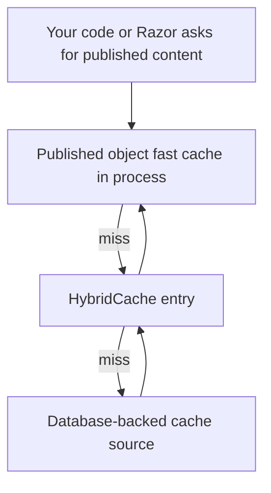
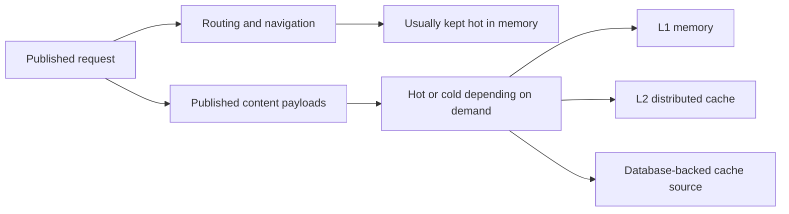
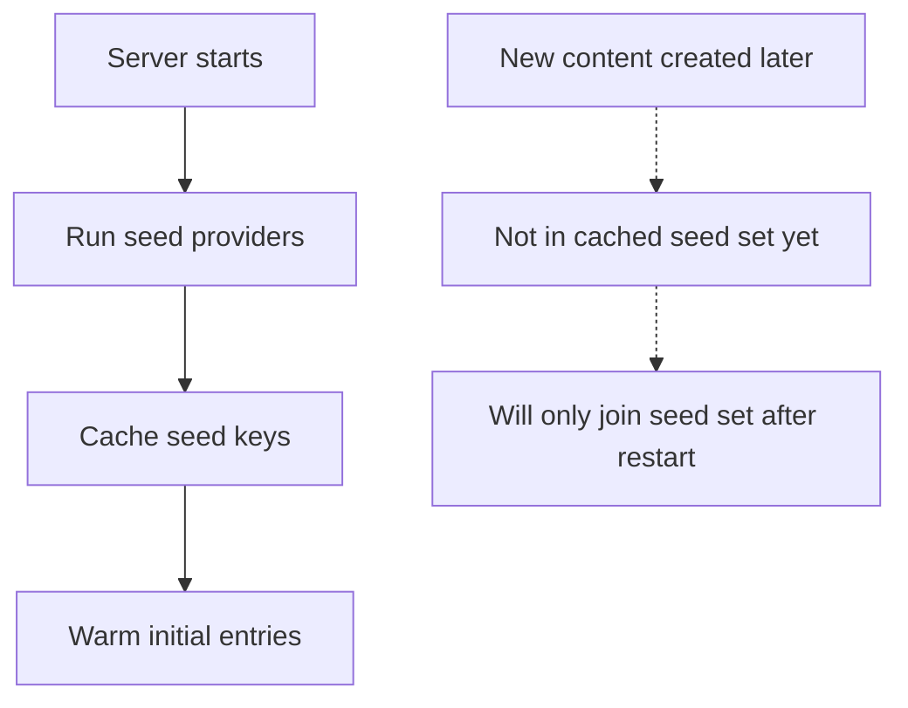
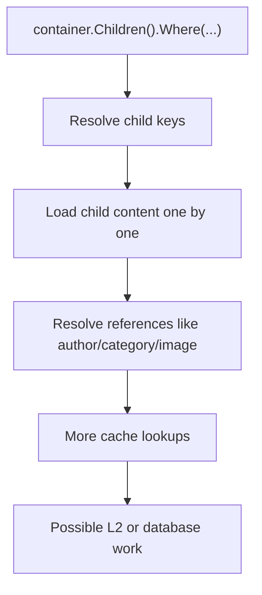
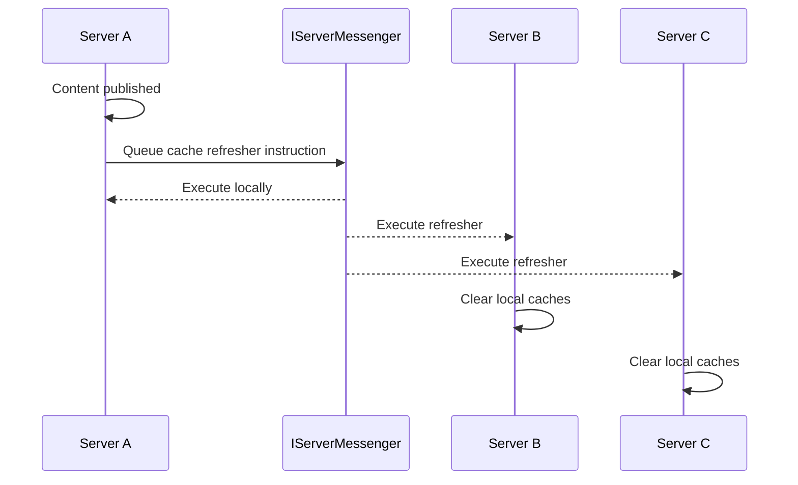
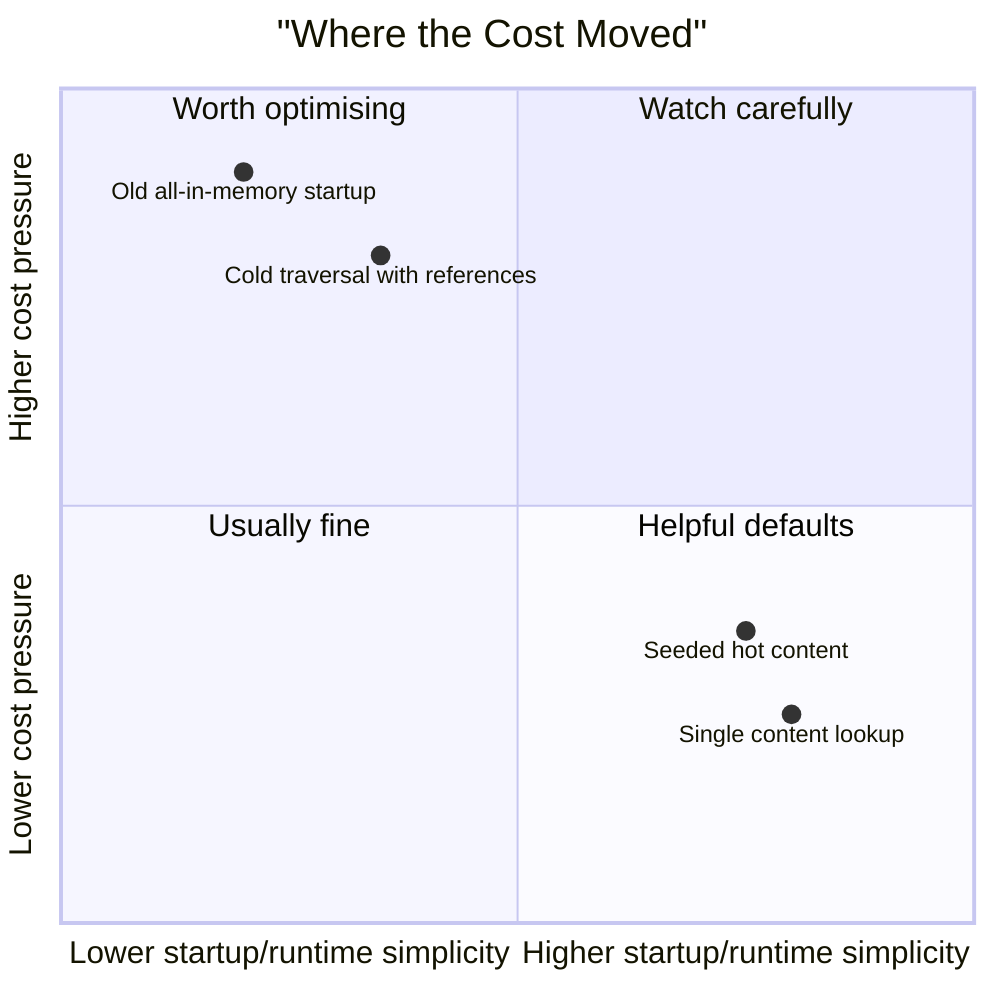

# 03. Published Content Cache, AppCaches, and Load Balancing

> **Start here.** This is the deep dive on the cache path Umbraco uses whenever it loads published content. We will break it into its three layers, show why `AppCaches` exists separately for your own data, and finish with the key load-balanced question: how do multiple servers stay in sync?

This chapter is about the part people usually find fuzzy:

> "When Umbraco loads content, where is it really cached, and how do multiple servers stay in sync?"

The published content cache is easiest to understand as a layered lookup path: local converted objects first, then `HybridCache`, then the database-backed cache source.

## First: separate three layers in your head

### Layer 1. Materialized published objects

In `DocumentCacheService`, Umbraco keeps a local concurrent dictionary of already built `IPublishedContent` objects.[^03-l0]

That is the fastest path.

In the newer `main` branch architecture, this pattern also exists explicitly for elements, not only documents.

### Layer 2. `HybridCache`

If the materialised object is not already there, Umbraco tries Microsoft's `HybridCache`.[^03-hybrid]

This can use:

- local memory
- and optionally a second-level remote cache

### Layer 3. Database-backed cache source

If the `HybridCache` misses, Umbraco falls back to its database-backed cache repository and then repopulates the cache.[^03-db]

So even though old blog posts still say "NuCache", in v17 the living implementation is now centred around `HybridCache`.

## The "split the problem" model

One of the most helpful ideas from the HybridCache presentation is that Umbraco no longer treats all published concerns the same way.

## What Umbraco registers in v17

From `AddUmbracoHybridCache()` in the source, Umbraco registers:

- `IPublishedContentCache`
- `IPublishedMediaCache`
- `IPublishedMemberCache`
- `IDomainCache`
- `IElementsCache`
- services like `DocumentCacheService`, `MediaCacheService`, `MemberCacheService`

It also sets `HybridCacheOptions.MaximumPayloadBytes` to 100 MB by default because the Microsoft default of 1 MB is too easy to hit for real Umbraco content.[^03-payload]

That detail is important for multilingual and block-heavy sites.

It also lines up with the HybridCache talk and slide material we looked at:

- Microsoft defaults are too small for real Umbraco payloads
- block-heavy and multilingual sites are exactly where cache payload size starts to matter

## Why there is still `AppCaches`

`AppCaches` is still the standard helper for your own application caching.

It gives you:

- `RuntimeCache`
- `RequestCache`
- `IsolatedCaches`

Use `AppCaches` when you want to cache your own service/repository results.

Do not confuse that with the internal published-content cache machinery.

> **Tip — which cache for which job.** Use website output caching for rendered HTML, the published cache APIs for published content, and `AppCaches` for your own app-level data. Three jobs, three caches — mixing them up is the root of a lot of confusion.

## Cache seeding

Umbraco 17 uses lazy loading by default:

- first request for content may pay the cache-fill cost
- later requests are faster

Cache seeding prewarms selected keys on startup.

The built-in seed providers include:

- content types configured in settings
- breadth-first traversal of document tree
- breadth-first traversal of media tree

In newer docs and code direction, element seeding joins that list too.

The union of seed keys is cached at startup.

Important consequence:

- if your seed logic is dynamic, new matching content is not considered seeded until restart

## How a document lookup works in v17

The `DocumentCacheService` logic is roughly:

1. decide preview or published mode
2. check the local in-process published-content dictionary
3. check `HybridCache`
4. if missing, load from database cache repository
5. if safe, store result back in `HybridCache`
6. materialise `IPublishedContent`
7. store that materialised object in the local fast cache

In the future Hybrid Cache code on `main`, the same layered idea is even clearer:

- local converted-object cache first
- `HybridCache` second
- database-backed cache source third

That is one reason the future architecture deserves its own chapter.

One especially careful bit:

- if a content item exists but its published ancestor path currently fails validation, Umbraco avoids caching that null result in the distributed cache because it may be a transient rebuild race
- in newer code, there is also a cache-generation guard to stop stale in-flight reads from writing old data back over freshly refreshed entries

That is the kind of detail that explains why the implementation is more subtle than "just cache by key".

## Why traversal feels different now

The deck makes this change very concrete: traversal and filtering patterns that felt cheap in the older world can become much more expensive in the HybridCache world.

That does not always mean "add another cache".

Sometimes it means "use an index instead of traversal", which is exactly where Examine fits. See [12 - Examine, Indexes, and Cache-Adjacent Querying](./12-examine-indexes-and-cache-adjacent-querying.md) for the full comparison.

## Invalidation after content changes

The main content refresher in v17 is `ContentCacheRefresher`.

It coordinates more than one thing:

- memory cache cleanup
- document cache updates
- routing/url updates
- navigation updates
- domain cache handling
- partial view cache clearing when appropriate
- distributed notification fan-out

## Load balancing: what actually happens

When cache refresh is triggered through `DistributedCache`, Umbraco tells every server:

"run this refresher"

That means:

- server A publishes content
- Umbraco sends refresh instructions
- servers B, C, and D also run the matching cache refresher
- each server clears or refreshes its own local caches

This is why the docs say:

- if you cache business data affected by backoffice actions
- and you are not using `ICacheRefresher`
- your load-balanced setup may become inconsistent

## Why `ICacheRefresher` matters for custom code

If you build a package or custom service that caches database-backed business data, a single-server solution may look fine even with naive caching.

But in multi-server production:

- one server may see the edit
- the other servers may keep stale memory

`ICacheRefresher` plus `DistributedCache` fixes that by standardizing invalidation.

## Partial view cache note

`ContentCacheRefresher` also clears the partial view cache in specific published-change scenarios.

That is a useful reminder:

- not every cache invalidation in Umbraco is about published-content keys only
- some refreshes are there to keep rendered fragments honest too

## What changes in 18

Umbraco 18 makes element caching much more explicit:

- `ElementCacheService`
- `ElementCacheRefresherNotification`
- output-cache eviction for changed elements

Why that matters:

- in v17, element cache invalidation is broader because published elements are hard to address precisely
- in v18, the platform is moving towards more explicit element-level cache management

That is especially relevant for modern Umbraco builds using blocks heavily.

For the fuller future direction, see [09 - Future Hybrid Cache Architecture](./09-future-hybrid-cache-architecture.md).

## The practical performance trade-off

The HybridCache presentation material gives a useful warning for beginners:

- lower memory usage and faster startup are wins
- but tree traversal and broad in-memory filtering patterns can become more expensive

> **Gotcha — traversal is not free any more.** Code like `.Children().Where(...)` deserves more suspicion than it did in the old "keep everything hot" world: walking the tree can now hydrate and cache every node you touch. When the hard part is *finding* items, prefer an index (see [Chapter 12](./12-examine-indexes-and-cache-adjacent-querying.md)); when it is *recomputing* a small result, prefer `RuntimeCache`.

## Cost moved, not vanished

## Practical checklist

- For whole-page speedups, start with website output caching.
- For custom app/service caching, use `AppCaches`.
- For multi-server-safe custom invalidation, implement `ICacheRefresher`.
- For hot content, consider cache seeding.
- For huge multilingual or block-heavy payloads, remember the `HybridCache` payload size story.

## In a nutshell

- The published content cache is **three shelves**: an in-process fast lane of already-built objects, then `HybridCache`, then the database-backed source. Umbraco checks them nearest-first.
- `AppCaches` is a *separate* cupboard for **your own** data — do not confuse it with the internal content cache.
- **Seeding** deliberately pre-warms chosen content at startup; it is not magic, and dynamically-matched new content is not seeded until a restart.
- On multiple servers, correctness comes from **distributed invalidation** (`DistributedCache` and `IServerMessenger` running the right `ICacheRefresher` everywhere), not shared storage.
- In the HybridCache world, **broad traversal has a real cost** — reach for it deliberately, not by habit.

### Three takeaways

- Think in layers: L0 converted objects, then `HybridCache`, then database-backed cache source.
- Keep cache creation and cache invalidation as separate design problems, especially on multiple servers.
- If the hot path is discovery rather than retrieval, broad traversal may be the wrong shape in the HybridCache model.

### Where to go next

- [Chapter 4 - Cache Busting and Invalidation](./04-cache-busting-and-invalidation.md) — the invalidation choreography, in full.
- [Chapter 12 - Examine, Indexes, and Cache-Adjacent Querying](./12-examine-indexes-and-cache-adjacent-querying.md) — when *not* to solve a problem with a cache.
- [Chapter 9 - Future Hybrid Cache Architecture](./09-future-hybrid-cache-architecture.md) — where this architecture is heading.

## Sources

- Docs:
  - [Server-side cache extensions (v17)](https://docs.umbraco.com/umbraco-cms/17.latest/extend-your-project/server-side-extensions/cache.md)
  - [Application cache (v17)](https://docs.umbraco.com/umbraco-cms/17.latest/extend-your-project/server-side-extensions/cache/application-cache.md)
  - [Cache seeding (v17)](https://docs.umbraco.com/umbraco-cms/17.latest/extend-your-project/server-side-extensions/cache/cache-seeding.md)
  - [Cache settings (v17)](https://docs.umbraco.com/umbraco-cms/17.latest/develop-with-umbraco/configuration/cache-settings.md)
  - [Cache settings (latest)](https://docs.umbraco.com/umbraco-cms/develop-with-umbraco/configuration/cache-settings.md)
- Supporting material:
  - [Hybrid Cache förändrar allt — Umbraco Kalaset session (YouTube)](https://www.youtube.com/watch?v=JyXlvDoreS8)
  - [Hybrid Cache förändrar allt — Umbraco Kalaset slides (PDF)](https://www.umbracokalaset.se/media/ccvhwzvs/hybrid-cache-forandrar-allt.pdf)
- Code:
  - `umbraco-v17/src/Umbraco.PublishedCache.HybridCache/DependencyInjection/UmbracoBuilderExtensions.cs`
  - `umbraco-v17/src/Umbraco.PublishedCache.HybridCache/Services/DocumentCacheService.cs`
  - `umbraco-v17/src/Umbraco.PublishedCache.HybridCache/NotificationHandlers/CacheRefreshingNotificationHandler.cs`
  - `umbraco-v17/src/Umbraco.Core/Cache/AppCaches.cs`
  - `umbraco-v17/src/Umbraco.Core/Cache/DistributedCache.cs`
  - `umbraco-v17/src/Umbraco.Core/Cache/Refreshers/Implement/ContentCacheRefresher.cs`
  - `umbraco-v18/src/Umbraco.PublishedCache.HybridCache/Services/ElementCacheService.cs`

[^03-l0]: See [C1](./10-appendix-sources.md#c1-umbraco-17-source-checkout) and [C4](./10-appendix-sources.md#c4-umbracopublishedcachehybridcache-on-main) in the appendix.
[^03-hybrid]: See [M2](./10-appendix-sources.md#m2-aspnet-core-hybridcache) and [C1](./10-appendix-sources.md#c1-umbraco-17-source-checkout) in the appendix.
[^03-db]: See [C4](./10-appendix-sources.md#c4-umbracopublishedcachehybridcache-on-main) and [C5](./10-appendix-sources.md#c5-claudemd-for-umbracopublishedcachehybridcache) in the appendix.
[^03-payload]: See [M6](./10-appendix-sources.md#m6-hybridcacheoptions), [U4](./10-appendix-sources.md#u4-cache-settings-for-umbraco-17), and [T1](./10-appendix-sources.md#t1-releasing-hybridcache-into-the-wild-with-umbraco) in the appendix.
