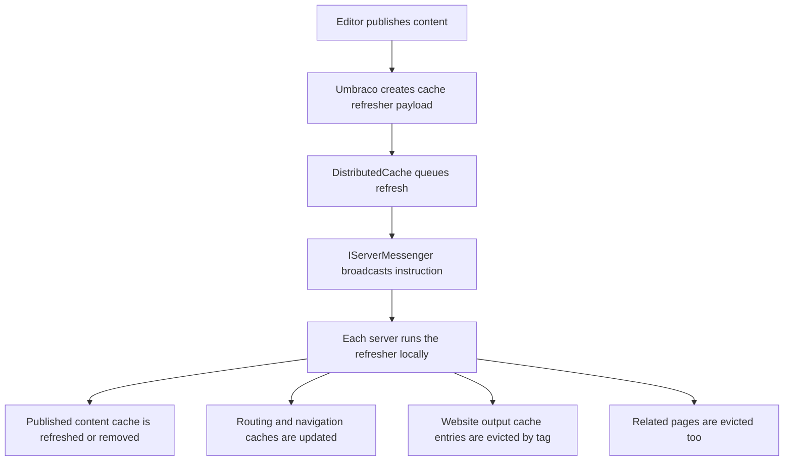
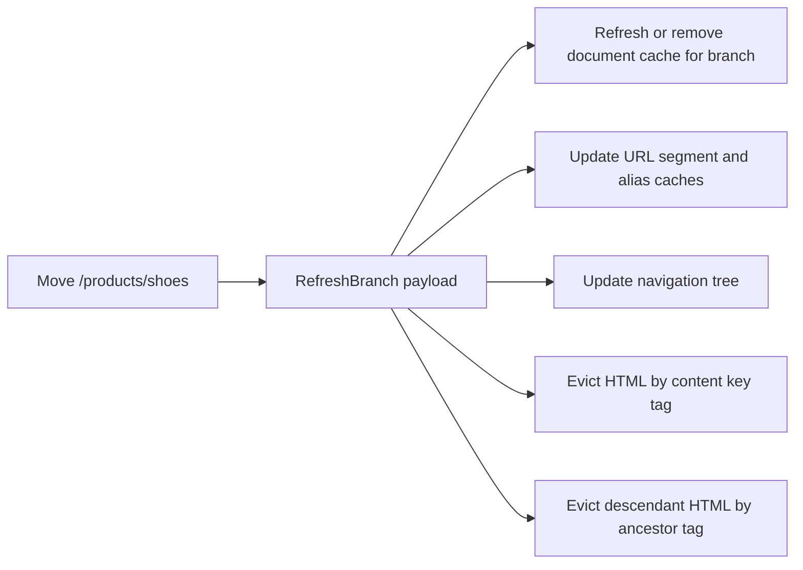
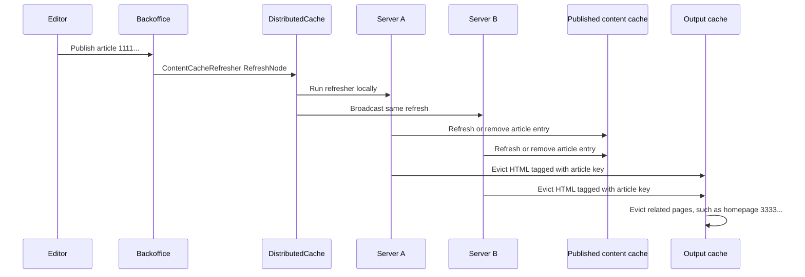

# 04. Cache Busting and Invalidation

> **Start here.** This is the heart of the book. Storing data quickly is the easy half; deciding *when to throw it away* — across every cache layer and every server — is the half that decides whether your site can be trusted. By the end you will know what a single publish actually busts, how the different "refresh types" behave, and why invalidation, not storage, is the real architecture.

If cache creation is the easy half, invalidation is the half that decides whether your site is trustworthy.

This chapter is the real centre of the Umbraco caching story.

The key theme of this chapter is coordination: when content changes, refreshers and `DistributedCache` ensure every server invalidates the same stale state.

## The main idea

When something changes in Umbraco, the system usually does not ask:

> "How do I build cache?"

It asks:

> "Which layers are now stale, and how do I tell every server to stop trusting them?"

## The short version

In Umbraco 17, cache busting is mostly driven by:[^04-core]

- `ContentCacheRefresher`
- `MediaCacheRefresher`
- `MemberCacheRefresher`
- `DistributedCache`
- `IServerMessenger`
- output-cache eviction handlers listening for refresher notifications

## The core mental model

## What `ContentCacheRefresher` actually busts

This class is much broader than its name first suggests.[^04-refresher]

For content changes, it coordinates all of these:

- document memory cache refresh/removal
- branch refresh/removal for descendants
- full document cache clear on `RefreshAll`
- URL cache updates
- URL alias cache updates
- navigation tree updates
- publish status updates
- ID/key map cleanup on delete
- partial view cache clearing in relevant published-change scenarios
- domain cache refresh when deleted content had assigned domains

So if someone says "publishing busts the cache", the honest version is:

> publishing busts several related caches, not just one

## Refresh types matter

Umbraco uses tree-oriented change types.

The important ones are:

- `RefreshNode`
- `RefreshBranch`
- `RefreshAll`
- `Remove`

These do not mean the same thing at all.

### `RefreshNode`

Think:

- one item changed
- refresh that item's cache entry
- update routing for that item

### `RefreshBranch`

Think:

- one item and descendants are affected
- maybe a move
- maybe branch publish/unpublish
- maybe restore/trash flow

This is where Umbraco often refreshes or removes a whole branch of document cache entries.

### `Remove`

Think:

- item should no longer exist as a cacheable published thing
- remove it from caches
- clear routing before navigation loses the tree shape

### `RefreshAll`

Think:

- stop trying to be precise
- rebuild or clear broad layers

## How document cache is busted

Inside `ContentCacheRefresher.HandleMemoryCache()`:

- `RefreshNode` calls `RefreshMemoryCacheAsync(key)`
- `RefreshBranch` refreshes or removes the node plus descendants
- `RefreshAll` calls `ClearMemoryCacheAsync()`
- `Remove` calls `RemoveFromMemoryCacheAsync(key)`

The important branch rule is this:

- if a branch is in the bin, or fully unpublished, Umbraco removes those entries
- otherwise it refreshes them

That is smarter than just nuking everything.

## What refresh vs remove means in published cache terms

In `DocumentCacheService`:

- refresh means re-read current serialised state and write it back into `HybridCache`
- remove means delete the relevant cache entry and local materialised object

That distinction matters because:

- some changes still leave the content as a valid published thing
- other changes mean it should disappear from published resolution

## Output cache busting is tag-based

Website output cache invalidation is separate from published object cache invalidation.

It works through tags.

### Document changes

`WebsiteDocumentOutputCacheEvictionHandler` can evict:

- one page by content-key tag
- descendants by ancestor tag during branch refresh
- all pages on `RefreshAll`
- related pages through relations
- extra custom tags from `IWebsiteOutputCacheEvictionProvider`

### Media changes

`WebsiteMediaOutputCacheEvictionHandler` evicts pages that reference the changed media.

### Member changes

`WebsiteMemberOutputCacheEvictionHandler` evicts pages that reference the changed member.

This is a big deal because many stale-page bugs are dependency bugs, not page-key bugs.

## Example: one publish, many busts

Imagine `/products/shoes` is moved under `/catalogue/shoes`.

What may need busting?

- the page's own published content entry
- descendants' published content entries
- URL caches for the moved branch
- navigation tree entries
- cached HTML for the moved page
- cached HTML for descendants
- cached HTML for other pages that reference moved content

## Worked trace: publishing one article

Now make it concrete.

Suppose an editor publishes this article:

- URL: `/news/cache-busting-101`
- article content key: `11111111-1111-1111-1111-111111111111`
- parent `/news` key: `22222222-2222-2222-2222-222222222222`
- homepage key, because the homepage lists latest news: `33333333-3333-3333-3333-333333333333`

The exact payload depends on the operation, but a normal already-published article update follows this shape.[^04-worked-trace]

The important part is not the sample GUIDs. The important part is the direction of travel:

1. The publish creates a cache-refresher payload for the changed content.
2. `DistributedCache` and the server messenger make every node hear the same instruction.
3. Each node updates its own published-content cache state.
4. Website and Delivery API output-cache handlers listen to the same refresher notifications and evict rendered responses by tag, relation, or custom eviction provider.
5. The homepage can be evicted even though the homepage was not published, because relation-aware eviction can follow dependencies from the changed article back to pages that reference it.
6. The next request rebuilds the missing rendered response and, if needed, rehydrates published content from the database-backed cache source.
7. Browser and CDN caches are outside this automatic in-process pipeline; they obey their HTTP headers, URLs, and any separate purge mechanism you have configured.

That is the beginner mental model: the publish does not merely replace one object. It sends a trust-revocation notice through every layer that might now be lying.

## Why distributed invalidation matters more than distributed storage

This is the key production lesson.

On a multi-server setup, each server can have:

- its own in-memory output cache
- its own local materialised published objects
- its own local runtime cache entries

So the important question is:

> "How do all servers learn that content changed?"

That is why `DistributedCache` and `IServerMessenger` are so central.

They ensure:

- the refresh instruction is broadcast
- each server runs the refresher locally
- each server clears its own stale state

This is why cache busting is more important than cache creation.

## Field note: stale instructions are data too

Two v17 forum reports show the operational version of this problem.[^04-field-instructions]

In one case, a staging site and a local site had both been connected to the same database. Umbraco treated the setup like a load-balanced environment, elected roles, and left old rows in `umbracoCacheInstruction`. The visible symptom was repeated log noise:

> `DISTRIBUTED CACHE IS NOT UPDATED. Failed to execute instructions ... Instruction is being skipped/ignored`

The useful lesson is not "clear the table whenever you see this". The lesson is narrower and more important: distributed cache instructions are themselves operational state. If environments share a database by accident, or if a node disappears after writing instructions for content that no longer exists, the instruction queue can become the stale thing.

Practical guardrails:

- do not point staging and local environments at the same Umbraco database
- set server roles deliberately when an environment is not meant to participate in load balancing
- inspect `umbracoServer` and `umbracoCacheInstruction` when repeated distributed-cache errors name old content
- remove only the offending instruction rows when you can identify them; clear the whole table only as an explicit recovery action

That is still cache busting. It is just cache busting for the control plane rather than for page data.

## Why partial view cache clearing appears here

`ContentCacheRefresher` also clears partial view cache for relevant published changes.

That is Umbraco being conservative in the right places.

If a partial depends on changed published content, leaving its fragment cache behind would produce confusing stale output even if the underlying content cache is fresh.

## When precision is hard

One revealing comment in the v17 code explains that element cache invalidation is difficult because published elements live inside JSON property blobs. Umbraco cannot always target element-level impact perfectly in v17, so in some areas it clears broadly instead. This is one reason the v18 element-cache work matters.

## What changes in 18

In Umbraco 18, the cache-busting model becomes more explicit for elements:

- `ElementCacheRefresherNotification`
- `ElementCacheService`
- `WebsiteElementOutputCacheEvictionHandler`

Practical takeaway:

- v17 sometimes has to invalidate broadly around element changes
- v18 is clearly moving towards more direct element-aware invalidation

## Publish vs Deploy vs output-cache eviction

These three busting paths share one spine — the cache-refresher notification — but they are triggered and shaped differently. It helps to see them side by side.

| Path | What triggers it | What carries the signal | What is distinctive |
| --- | --- | --- | --- |
| Normal publish | An editor publishes, saves, moves, or deletes content | `ContentCacheRefresher` → `DistributedCache` → `IServerMessenger` | Refreshes or removes published entries, routing, and output tags according to the change type (`RefreshNode` / `RefreshBranch` / `Remove` / `RefreshAll`) |
| Deploy | Schema or content transfer, import, or restore | The same cache-refresher notifications, emitted after the operation | Can batch or suppress some normal notification noise during bulk work, then emit cache-refresher notifications after the operation; some disk-read operations need a broader memory-cache reload afterwards |
| Output-cache eviction | Any of the above, observed downstream | `WebsiteDocumentOutputCacheEvictionHandler` and friends listening for refresher notifications | Tag-based eviction of rendered HTML; dependency-aware (media, members, relations), not just page-key based |

The key insight: a normal publish drives the refresher pipeline directly, Deploy can batch the work and emit cache-refresher notifications after the operation, and output-cache eviction is a listener sitting on the same notifications rather than a separate mechanism.

For the Deploy specifics, see [Chapter 5](./05-hq-extensions-and-cache.md). For output caching itself, see [Chapter 2](./02-website-output-caching.md).

## Beginner checklist for custom code

- If you cache custom business data, think first about how it is busted.
- If backoffice actions can change that data, do not rely on local memory only.
- In load-balanced setups, prefer `ICacheRefresher`-driven invalidation.
- If a page depends on external or related data, think in dependency graphs, not only in single keys.
- If you use output caching, design your eviction path before celebrating cache hits.

## In a nutshell

Umbraco caching works because it is aggressive about invalidation *choreography*, not because it stores things quickly. When content changes, Umbraco does not ask "how do I build cache?" — it asks "which layers are now stale, and how do I tell every server to stop trusting them?"

- One publish busts **several** caches: published content, routing, navigation, output HTML, and often related pages too.
- The **change type** (`RefreshNode` / `RefreshBranch` / `Remove` / `RefreshAll`) decides how surgical or broad the busting is.
- Output-cache eviction is **tag-based** and **dependency-aware** — the busted page is often not the page that changed.
- On multiple servers, the whole thing rests on distributed *invalidation*: broadcast the instruction, then let every server run the refresher locally.

### Three takeaways

1. Cache busting is harder — and more important — than cache creation.
2. "Refresh" and "remove" are different verbs: one re-reads current state, the other deletes the entry entirely.
3. Design your eviction path *before* you celebrate your cache hits.

### Where to go next

- [Chapter 5 - HQ Extensions and Cache](./05-hq-extensions-and-cache.md) — how Deploy deliberately changes this busting story.
- [Chapter 7 - Small Local Cache Example with Tags](./07-small-local-cache-example-with-tags.md) — the smallest possible fill-and-bust loop, in your own code.

## Sources

- Docs:
  - [Server-side cache extensions (v17)](https://docs.umbraco.com/umbraco-cms/17.latest/extend-your-project/server-side-extensions/cache.md)
  - [Website output caching (v17)](https://docs.umbraco.com/umbraco-cms/17.latest/develop-with-umbraco/caching/website-output-caching.md)
- Code:
  - `umbraco-v17/src/Umbraco.Core/Cache/Refreshers/Implement/ContentCacheRefresher.cs`
  - `umbraco-v17/src/Umbraco.Core/Cache/DistributedCache.cs`
  - `umbraco-v17/src/Umbraco.PublishedCache.HybridCache/Services/DocumentCacheService.cs`
  - `umbraco-v17/src/Umbraco.Web.Website/Caching/WebsiteDocumentOutputCacheEvictionHandler.cs`
  - `umbraco-v17/src/Umbraco.Web.Website/Caching/WebsiteMediaOutputCacheEvictionHandler.cs`
  - `umbraco-v17/src/Umbraco.Web.Website/Caching/WebsiteMemberOutputCacheEvictionHandler.cs`
  - `umbraco-v18/src/Umbraco.Web.Website/Caching/WebsiteElementOutputCacheEvictionHandler.cs`

[^04-core]: See [C7 in the appendix](./14-appendix-sources.md#c7-core-cache-types-and-refreshers) and [U6](./14-appendix-sources.md#u6-server-side-extensions-cache-docs).
[^04-refresher]: See [C7](./14-appendix-sources.md#c7-core-cache-types-and-refreshers) and [C6](./14-appendix-sources.md#c6-website-output-cache-implementation).
[^04-worked-trace]: See [C7](./14-appendix-sources.md#c7-core-cache-types-and-refreshers), [C6](./14-appendix-sources.md#c6-website-output-cache-implementation), and [C4](./14-appendix-sources.md#c4-umbracopublishedcachehybridcache-on-main). The GUID values in the trace are illustrative sample keys, not constants from Umbraco.
[^04-field-instructions]: See [F7 in the appendix](./14-appendix-sources.md#f7-distributed-cache-field-reports-v17).
