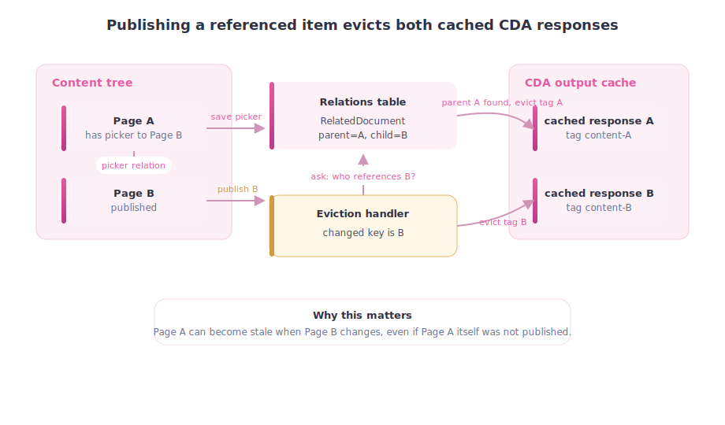

# 04. The Content Delivery API

> **Start here.** If you run Umbraco headless — feeding JSON to a Next.js front end, a mobile app, or anything that is not a Razor view — this is the chapter that matters most. The Content Delivery API (CDA) is how published objects leave Umbraco as JSON, and its output cache is the single biggest lever on delivery speed. We will cover what it is, how to cache it, and — the interesting part — how Umbraco throws those cached responses away at exactly the right moment.

Chapter 2 introduced the read model, `IPublishedContent`. Chapter 3 cached the HTML rendered from it. This chapter is the other projection:

> The Content Delivery API turns `IPublishedContent` into JSON over HTTP. Its output cache stores that JSON so repeat requests skip the whole pipeline.

The CDA output cache stores ready-made JSON responses on the server and serves them again on repeat requests.

## What the CDA is

The Content Delivery API is Umbraco's built-in headless read API. It exposes published content as JSON at routes like:

```
/umbraco/delivery/api/v2/content/item/{path-or-id}
/umbraco/delivery/api/v2/content?filter=...&sort=...
```

Under the hood it does exactly what Chapter 2 described: it queries the published content cache, materialises `IPublishedContent` objects, and projects them to a JSON shape. That projection is the expensive part on a busy site — which is why it has its own output cache.

## The CDA output cache

The output cache stores a **ready-made JSON response** on the server, keyed by request, so a repeat request to the same URL is served without re-running the pipeline.

Key facts to hold:

- **Opt-in, disabled by default.** You turn it on with a small `appsettings.json` section:

  ```json
  {
    "Umbraco": {
      "CMS": {
        "DeliveryApi": {
          "Enabled": true,
          "OutputCache": {
            "Enabled": true,
            "ContentDuration": "00:15:00",
            "MediaDuration": "01:00:00"
          }
        }
      }
    }
  }
  ```

  Both durations default to one minute in the v17 source (`OutputCacheSettings.StaticDuration = "00:01:00"`), so setting them explicitly is usually the point. The official docs still describe a 10-second default; where the docs and the source disagree, this book follows the source.[^04-outputcache-default]

- **Stores server-side JSON responses**, skipping the published-cache read and JSON projection on repeat hits.
- **Varied by route and Delivery API headers** — content responses vary by `Accept-Language`, `Accept-Segment`, and `Start-Item`; media responses by `Start-Item` only — so a request for the Danish variant does not receive the English response. Custom vary providers (`IDeliveryApiOutputCacheVaryByProvider`) can add more dimensions.
- **Invalidated automatically** when content is published or unpublished — and *how* that works is the heart of this chapter.

> **This is not "Response Caching."** The CDA output cache stores JSON on the server. HTTP response caching (Chapter 1's browser and proxy cache) is a separate, browser/proxy-level concern controlled by `Cache-Control`. Enabling one does nothing to the other.

## How invalidation actually works: tag-based eviction

"Invalidated when content is published" is true, but the *how* is what makes it trustworthy — it explains why only the right responses get dropped instead of the whole cache being wiped.

When the CDA stores a response, it stamps it with **tags** derived from the content it contains. A tag is a string marker attached to a cached entry. Every tag is a string constant defined in `Constants.DeliveryApi.OutputCache`:

```csharp
// src/Umbraco.Core/Constants-DeliveryApi.cs
public const string ContentTagPrefix     = "umb-dapi-content-";          // + content GUID
public const string MediaTagPrefix       = "umb-dapi-media-";            // + media GUID
public const string AncestorTagPrefix    = "umb-dapi-content-ancestor-"; // + ancestor GUID
public const string ContentTypeTagPrefix = "umb-dapi-content-type-";     // + content type alias
public const string AllContentTag        = "umb-dapi-content-all";
public const string AllMediaTag          = "umb-dapi-media-all";
public const string AllTag               = "umb-dapi-all";
```

So a cached response for a page with GUID `a1b2...` gets the tag `umb-dapi-content-a1b2...` stamped on it at store time. This happens in `DeliveryApiOutputCachePolicyBase.ServeResponseAsync`, which runs once per unique response before it is written to the cache:

```csharp
// src/Umbraco.Cms.Api.Delivery/Caching/DeliveryApiOutputCachePolicyBase.cs
foreach (IPublishedContent item in items)
{
    // Tag with specific item key for targeted eviction.
    context.Tags.Add(ItemTagPrefix + item.Key);
    // ... plus ancestor tags, content-type tags, and custom provider tags
}
```

When an editor publishes content, Umbraco fires a `ContentCacheRefresherNotification`. The `DeliveryApiDocumentOutputCacheEvictionHandler` picks that up and evicts by tag — not by URL:

```csharp
// src/Umbraco.Cms.Api.Delivery/Caching/DeliveryApiDocumentOutputCacheEvictionHandler.cs
await OutputCacheStore.EvictByTagAsync(
    Constants.DeliveryApi.OutputCache.ContentTagPrefix + contentKey,
    cancellationToken);
```

The result is surgical: only the responses that actually contain the changed content are dropped. A homepage that has nothing to do with the updated article keeps its cached response perfectly intact.

**Branch publishes** need a wider sweep. If a whole branch of the content tree is refreshed (`TreeChangeTypes.RefreshBranch`), the handler also evicts by the ancestor tag — so any response that listed the changed node as an ancestor is cleared too:

```csharp
await OutputCacheStore.EvictByTagAsync(
    Constants.DeliveryApi.OutputCache.AncestorTagPrefix + contentKey,
    cancellationToken);
```

**Full-tree refreshes** fall back to evicting `AllTag`, which clears every CDA cache entry at once. This is the sledgehammer, used only when precision is not possible.

## Relation-based eviction

There is a subtler case worth knowing about. Imagine page A has a picker property that points at page B, and the CDA response for A embeds B's data inline. If an editor publishes B, A's cached response is now stale — but A's GUID was never in the change payload, so the tag for A would not normally be touched.

Umbraco handles this through its relation system. When content is saved with a picker property, Umbraco automatically records a `RelatedDocument` relation from A (the referencing page, treated as parent) to B (the picked item, treated as child). After every content change, the eviction handler queries those relations and evicts the referencing pages too:

<div class="pdf-keep-together" style="break-inside: avoid; page-break-inside: avoid; -webkit-column-break-inside: avoid; margin: 1rem 0;">



</div>

The code in `RelationOutputCacheEvictionHandlerBase.EvictRelatedContentAsync` looks up all `RelatedDocument` relations where the changed content is the child, then evicts the cache tag for each parent it finds. This is why publishing a referenced item correctly clears the pages that embed it — without needing to know their URLs in advance.

## The interfaces you extend

If you need to customise CDA caching, Umbraco exposes a mirror set of interfaces around the output cache:[^04-interfaces]

- `IDeliveryApiOutputCacheManager` — the cache manager itself
- `IDeliveryApiOutputCacheTagProvider` — add your own tags at store time
- `IDeliveryApiOutputCacheEvictionProvider` — add your own eviction rules
- `IDeliveryApiOutputCacheRequestFilter` — decide which requests are cacheable
- `IDeliveryApiOutputCacheVaryByProvider` — add custom vary-by dimensions

The tag/vary providers are the common extension points: a custom tag provider lets you stamp responses so a domain-specific change can evict exactly the responses it affects, and a custom vary provider lets you cache separate responses per tenant, per role, or per whatever axis your API varies on.

## The trust problem past the output cache

Everything above keeps *Umbraco's own* cache honest. But the CDA usually feeds something further downstream — a Next.js build, a Cloudflare Pages site, a mobile app, a CDN. Umbraco's tag eviction does not reach any of those.

> **Gotcha — eviction stops at the edge.** Once JSON has left Umbraco and been baked into a static site or cached at a CDN, publishing content in Umbraco clears *Umbraco's* copy but not the consumer's. That last hop needs its own signal — a content-published webhook, a deploy hook, or a purge call.

This is the recurring theme of [Chapter 9 - Cache Busting and Invalidation](./09-cache-busting-and-invalidation.md), and the field notes there (Kenn Jacobsen's `NoCode.DeliveryApi` and the Azure/Cloudflare examples) are exactly about wiring that last hop.

## What changes in v18

v18 makes element-driven eviction explicit for the CDA too: `DeliveryApiElementOutputCacheEvictionHandler` joins the document handler, so a change to a block element can evict the responses that embed it without falling back to a broad sweep. In v17, element-level changes are handled more coarsely because individual elements are hard to address precisely. See [Chapter 8 - NuCache vs Hybrid Cache](./08-nucache-vs-hybrid-cache.md) for the v17→v18 arc.

## In a nutshell

- The CDA turns `IPublishedContent` into JSON; its **output cache** stores that JSON and is the main headless speed lever.
- It is **opt-in**, varied by route and Delivery API headers, and invalidated automatically.
- Invalidation is **tag-based and surgical**: responses are stamped with content/ancestor/content-type tags, and publishing evicts only the matching tags.
- **Relation-based eviction** clears pages that *embed* a changed item, even though their own key never changed.
- Umbraco's eviction **stops at the edge** — downstream CDNs and static sites need their own purge/webhook signal.

### Three takeaways

1. Turn on the CDA output cache before reaching for anything more exotic — it is the right first lever for headless.
2. Tags, not URLs, are how Umbraco keeps eviction precise; the sledgehammer (`AllTag`) is the exception, not the rule.
3. The cache you can see inside Umbraco is only half the story — the consumer's cache is the other half, and it is yours to invalidate.

### Where to go next

- [Edge Cache in Front of the CDA](./05-edge-cache-in-front-of-the-cda.md) — building the downstream cache this chapter just warned you about, with Cloudflare, Azure API Management, or Azure Front Door.
- [Chapter 6 - Published Content Cache, AppCaches, and Load Balancing](./06-published-cache-and-load-balancing.md) — the layer the CDA reads from.
- [Chapter 9 - Cache Busting and Invalidation](./09-cache-busting-and-invalidation.md) — the full invalidation choreography, including the edge.
- [Chapter 16 - Reading the Cache Code](./16-reading-the-cache-code.md) — the CDA output-cache types in the source.

## Sources

- Docs:
  - [Content Delivery API (v17)](https://docs.umbraco.com/umbraco-cms/17.latest/develop-with-umbraco/headless-and-apis/content-delivery-api.md)
  - [Content Delivery API output cache (v17)](https://docs.umbraco.com/umbraco-cms/17.latest/develop-with-umbraco/headless-and-apis/content-delivery-api/output-caching.md)
  - [Cache settings (v17)](https://docs.umbraco.com/umbraco-cms/17.latest/develop-with-umbraco/configuration/cache-settings.md)
- Code:
  - `umbraco-v17/src/Umbraco.Core/Constants-DeliveryApi.cs`
  - `umbraco-v17/src/Umbraco.Core/Configuration/Models/DeliveryApiSettings.cs`
  - `umbraco-v17/src/Umbraco.Cms.Api.Delivery/Caching/DeliveryApiOutputCachePolicyBase.cs`
  - `umbraco-v17/src/Umbraco.Cms.Api.Delivery/Caching/DeliveryApiDocumentOutputCacheEvictionHandler.cs`
  - `umbraco-v17/src/Umbraco.Web.Common/Caching/RelationOutputCacheEvictionHandlerBase.cs`
  - `umbraco-v18/src/Umbraco.Web.Website/Caching/WebsiteElementOutputCacheEvictionHandler.cs`

[^04-interfaces]: See [C7](./17-appendix-sources.md#c7-core-cache-types-and-refreshers) in the appendix; the full mirror set is mapped in [Chapter 16 - Reading the Cache Code](./16-reading-the-cache-code.md).
[^04-outputcache-default]: `OutputCacheSettings` in `umbraco-v17/src/Umbraco.Core/Configuration/Models/DeliveryApiSettings.cs` sets `private const string StaticDuration = "00:01:00"; // one minute`, with both `ContentDuration` and `MediaDuration` defaulting to it.
