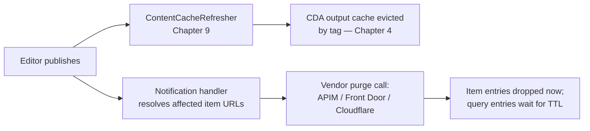

# 05. Edge Cache in Front of the Content Delivery API

> **Start here.** Chapter 4 covered the cache *inside* Umbraco that stores ready-made CDA JSON. This chapter covers the cache *outside* Umbraco entirely — a CDN, API gateway, or edge network sitting between the internet and your CDA endpoint. Umbraco Cloud happens to run this with Cloudflare, but there is nothing Cloudflare-specific about the idea. This chapter builds the pattern vendor-neutral, then gives concrete configuration for **Azure API Management**, **Azure Front Door**, and **Cloudflare** as three peers — because which one fits depends on what you already run, not on which one Umbraco HQ picked.

Chapter 1 already put a name to this layer: the **browser, proxy, and CDN cache**, the third member of the cache family, sitting in front of everything else in the request flow.[^04b-ch1] This chapter takes that box in the mental model and treats it as infrastructure you deliberately design, rather than something left entirely to individual browsers.

> An edge cache in front of the CDA stores the same finished JSON the CDA output cache stores — but outside Umbraco's process, closer to the visitor, and surviving even if Umbraco restarts.

## Where this sits, precisely

Three caches can hold the same JSON response, and it is worth being exact about which is which:

| Cache | Lives | Covered in |
| --- | --- | --- |
| CDA output cache | Server-side, inside the Umbraco process | [Chapter 4](./04-the-content-delivery-api.md) |
| Edge cache in front of the CDA | Outside Umbraco — a CDN edge, API gateway, or edge network | This chapter |
| Media/CDN cache | Outside Umbraco, but caching media *files*, not CDA JSON | [Chapter 13](./13-storage-providers-and-media-caching.md) |

It is not enough to say "don't confuse this chapter with Chapter 13" — the two CDNs are solving genuinely different problems, and seeing why makes the rest of this chapter easier to reason about.

Chapter 13's CDN sits in front of a **file**. An uploaded image is a fixed sequence of bytes at a blob path, and that path keeps meaning the same thing until the file itself is replaced — usually under a new path, since a fresh upload gets a new blob location. Because the URL and the bytes it points to are tied together for the file's lifetime, the CDN's job is almost purely geographic: move bytes that already exist closer to the visitor. Freshness is a solved problem the moment the path is stable — old bytes at an old path can simply be left to expire, because nothing is asking for that path expecting different content.

This chapter's edge cache sits in front of a **computed response**. A CDA URL such as `/umbraco/delivery/api/v2/content/item/homepage` is a stable address for a resource whose representation legitimately changes every time an editor publishes — while the URL itself never changes. The same request, made before and after a publish, is supposed to return different bytes. That is precisely why Chapter 4 needed tag-based eviction rather than relying on the URL alone, and it is why this chapter cannot lean on Chapter 13's "let the old path expire" freshness model: there is no new path to redirect to when a content node changes, only the same URL now meaning something else.

<div class="pdf-keep-together" style="break-inside: avoid; page-break-inside: avoid; -webkit-column-break-inside: avoid; margin: 1rem 0;">

![Side-by-side comparison of two CDN freshness problems. Left, the media file CDN of Chapter 13: a URL such as /media/a1b2/hero.jpg points at fixed bytes that stay the same for the file's lifetime, so when the file changes a new upload gets a new path and the old URL can simply expire — freshness equals URL stability and the edge never needs telling. Right, the CDA edge cache of this chapter: a URL such as .../content/item/home points at a recomputed answer that differs after every publish, so when content changes the same URL now returns new JSON, the old entry is wrong and nothing tells the edge — freshness equals explicit purge and the edge must be told on publish.](./assets/diagram-edge-cache-in-front-of-the-cda-02.svg)

</div>

So: same word "CDN," two different freshness problems. Chapter 13 caches an object whose identity is its address. This chapter caches an answer whose address stays fixed while the true answer moves underneath it.

## Why put a cache in front of the CDA at all

The CDA output cache (Chapter 4) already avoids re-running the published-content pipeline on repeat requests. An edge cache in front of it buys three more things:

- requests that hit the edge never reach Umbraco at all, protecting the origin from traffic spikes
- responses are served from a location closer to the visitor than your Umbraco origin
- the cache survives an app-pool recycle, a deploy, or a scale-in event that would otherwise cold-start the CDA output cache

Umbraco Cloud puts every custom hostname behind Cloudflare — DNS resolution, TLS, and edge caching all run through it in production.[^04b-cloud] That is one worked example of the pattern, not the only shape it can take: the same three benefits are available from an Azure-native stack, which is what most of this chapter is about.

## What the CDA actually hands the edge

An edge can only be as clever as the signals the origin gives it, so the first move is to look at exactly what a CDA response carries. A content response leaves Umbraco with headers like this:

```http
HTTP/1.1 200 OK
Content-Type: application/json; charset=utf-8
Vary: Accept-Language, Accept-Segment, Preview, Start-Item
```

Two facts about that response drive everything downstream, and both are visible in the source:[^04b-cda-source]

- **It sends `Vary`, listing four dimensions.** The CDA advertises that its representation varies by `Accept-Language`, `Accept-Segment`, `Preview`, and `Start-Item`. A cache that honours `Vary` in its key already keys on those four. (The server-side output cache itself varies by only three — `Accept-Language`, `Accept-Segment`, `Start-Item` — because it never stores preview responses in the first place, so `Preview` is redundant to it.)
- **It sends no `Cache-Control`, `Expires`, or `Age`.** The output-cache duration — one minute by default — is an *internal* server-side lifetime governing how long Umbraco reuses its own stored copy. It is never advertised downstream.

The consequence is the hinge of this whole chapter: **the CDA gives a downstream edge one instruction (how the response varies) and zero freshness instruction (how long it may be reused).** Every edge is therefore forced to invent a TTL, and *how each one invents it* is the sharpest difference between the three vendors below. It also means any advice of the form "let the edge respect the origin's `Cache-Control`" is a non-starter until you *add* a `Cache-Control` header yourself — with response-header middleware on the Umbraco side, or a rule at the edge — because by default there is nothing to respect.

> **Gotcha — `Vary` is a promise most edges quietly ignore for the cache key.** The CDA sends an honest `Vary`, but a CDN or gateway only obeys it if you configure the cache key to include those headers. Left at defaults, every product below keys on the URL alone and treats `Vary` as advisory. So the CDA telling the truth about variance does not save you — you still have to re-declare the vary dimensions at the edge yourself.

## The vendor-neutral pattern

Strip away product names and every edge cache in front of an API is the same four decisions:

<div class="pdf-keep-together" style="break-inside: avoid; page-break-inside: avoid; -webkit-column-break-inside: avoid; margin: 1rem 0;">


</div>

1. **Entry point.** The edge must own the hostname — DNS points at the edge, and the edge (not Umbraco) terminates TLS.
2. **Cache eligibility and key.** Only cache safe, anonymous `GET` requests. The cache key must include every dimension the CDA varies by — `Accept-Language`, `Accept-Segment`, and `Start-Item` for content responses, `Start-Item` for media responses. Get this wrong and the edge confidently serves the Danish response to an English visitor.
3. **TTL source.** The CDA sends no `Cache-Control`, so there are only two honest options: add a `Cache-Control` header at the origin and have the edge honour it, or set the TTL explicitly at the edge. What you must *not* do is assume the edge is "respecting the origin" when the origin said nothing — that is how you end up with a vendor's invented default (see Front Door below).
4. **Bypass rule.** Requests carrying an `Authorization` header, a Delivery API preview header, or a member/session cookie must skip the cache entirely — both on read and on write. Umbraco refuses to cache preview and protected responses server-side already, but the edge does not know that unless you replicate the rule; an edge that stores a preview or member-specific response and later hands it to an anonymous visitor is not a performance win, it is a data leak.

## Why the edge is coarser than Chapter 4's eviction

This is the part a vendor tutorial will not tell you, and it is the reason this chapter exists as more than a config recipe.

Chapter 4's eviction is *precise* because it works on the content graph. Each cached response is stamped with the item's key, every ancestor key, and the content-type alias, plus relation-based eviction for pages that merely embed a changed item. Publishing evicts by tag, so exactly the responses that contain the changed content are dropped and nothing else.

An edge cache has none of that. It knows URLs, not content keys, and it cannot follow a relation. So a purge handler has to answer a question Chapter 4 never faces: *which URLs did this publish invalidate?* For a single content node the answer spans:

- its **item-by-id** URL, `/content/item/{id}` — deterministic, one per culture/segment
- its **item-by-path** URL, `/content/item/{path}` — deterministic, but the path itself changes on rename or move
- any **`items` batch** response that happened to include it — membership unknown to the handler
- any **query/list** response it matches — `/content?fetch=…&filter=…&sort=…&skip=…&take=…` — an unbounded space of parameter combinations
- ancestors' **`children`/`descendants`** query responses
- other items' responses that **embed it via a picker** (`expand`) — the relation case, invisible from the node itself

The first two you can enumerate. The rest you cannot. The query endpoint is decisive: publishing one article changes the first page of `filter=contentType:article&sort=updateDate:desc`, but nothing tells the handler which of the effectively infinite filter/sort/skip/take URLs are now stale. This is the exact problem Chapter 4 solved with tags and relations — and those tags do not cross the wire to the edge.

So an honest chapter names the trade rather than pretending precise purge is available. There are three strategies, and real systems usually combine the last two:

| Strategy | Purged on publish | Stays stale until TTL | When it fits |
| --- | --- | --- | --- |
| Short TTL only | nothing — rely on expiry | everything, for the TTL window | content that tolerates a minute or two of lag; the CDA's own one-minute internal default is a hint this is the intended posture |
| Purge everything | the entire edge cache | nothing | low publish frequency and a cache small enough that a cold start is cheap; watch vendor rate limits |
| Item purge + short TTL on queries | the deterministic item URLs | list/query responses, for their TTL | the common headless case: item endpoints go fresh instantly, list endpoints lag by a bounded window |

The third row is the realistic recommendation for most headless sites: **purge what you can name, and put a short TTL on the endpoints you cannot.**

## Purge-on-publish, generalised

Chapter 4 ended with a gotcha: Umbraco's tag-based eviction "stops at the edge."[^04b-ch4] Chapter 9 makes the same point at the choreography level: a CDN needs its own purge or webhook signal, because it does not run `ContentCacheRefresher`.[^04b-ch8]

The shape of the fix is the same regardless of vendor: a notification handler listens for the same publish/unpublish/delete events that drive Chapter 9's invalidation choreography, resolves the item URLs the change affects, and calls the edge's purge mechanism. Per the section above, it resolves *item* URLs — the deterministic ones — and leaves query endpoints to their TTL.

```csharp
public interface IEdgeCachePurger
{
    Task PurgeAsync(IReadOnlyCollection<Uri> urls, CancellationToken cancellationToken);
}

public class EdgeCachePurgeOnPublishHandler
    : INotificationHandler<ContentPublishedNotification>,
      INotificationHandler<ContentUnpublishedNotification>
{
    private readonly IEdgeCachePurger _purger;
    private readonly ICdaItemUrlResolver _urlResolver; // item-by-id and item-by-path, per culture/segment

    public EdgeCachePurgeOnPublishHandler(IEdgeCachePurger purger, ICdaItemUrlResolver urlResolver)
    {
        _purger = purger;
        _urlResolver = urlResolver;
    }

    public void Handle(ContentPublishedNotification notification) => Purge(notification.PublishedEntities);
    public void Handle(ContentUnpublishedNotification notification) => Purge(notification.UnpublishedEntities);

    private void Purge(IEnumerable<IContent> entities)
    {
        // Deterministic item URLs only. Query/list responses are NOT enumerable here —
        // they are covered by a short edge TTL, not by this purge (see "Why the edge is coarser").
        IReadOnlyCollection<Uri> urls = _urlResolver.ResolveItemUrls(entities);
        _purger.PurgeAsync(urls, CancellationToken.None).GetAwaiter().GetResult();
    }
}
```

`IEdgeCachePurger` is the only part that changes per vendor. `ICdaItemUrlResolver` still has real work to do: one content item maps to several item URLs once culture and domain variants are counted, and item-by-path URLs shift when an ancestor is renamed or moved.

One piece of this you do not have to build from scratch: **the server-side CDA cache has a first-party eviction API.** `IDeliveryApiOutputCacheManager` exposes `EvictContentAsync(Guid)`, `EvictMediaAsync(Guid)`, `EvictByTagAsync(string)`, and the `EvictAll…` variants — each a thin wrapper over the output-cache store's `EvictByTagAsync`.[^04b-cache-manager] The in-process notification handlers of Chapter 4 already call these on publish, but you can call them yourself from a webhook when an *external* system changes data the CDA embeds. That evicts Umbraco's own copy; the edge purge above is the separate, downstream half.

The edge purge itself you write once per vendor — and it is worth reading a working implementation end to end before you do. The techniques below are drawn from studying one open-source Front Door purge handler line by line;[^04b-purge-packages] they transfer to any vendor, and the last one is a mistake to learn from rather than copy.

- **Resolve URLs per culture, then reduce to the path.** For each published item, iterate its cultures and resolve the absolute URL through the URL provider for each one, then purge the URL's *path*. Skip the `#` sentinel Umbraco returns for content that has no URL of its own, and skip drafts (`IsDraft()`) so an unpublished draft save does not trigger a pointless purge.
- **Walk ancestors explicitly, with a dedup guard.** For the item-plus-ancestors strategy, follow `.Parent` up the tree and stop when you reach a node already in the set — otherwise a batch publish re-adds shared ancestors many times over.
- **For media, purge the folder, not the file.** Generated image variants live under the media item's folder, so resolve the media URL, drop the filename, and purge the folder path with a `/*` wildcard — otherwise resized and cropped variants survive the purge. This is the Chapter 13 media-cache concern meeting the edge.
- **Fire-and-forget the purge.** Edge purge propagates over seconds to minutes; start the operation and return rather than blocking the editor's save on it. On the Azure SDK that is `WaitUntil.Started`; on a raw HTTP API it is simply not awaiting propagation.
- **Treat purge as best-effort, and monitor it.** A real handler wraps the call in try/catch and logs failures — which means a failed purge is invisible unless you *also* expose a health check that pings the purge endpoint. A silently failed purge is silent staleness.
- **Pitfall — hook publish and unpublish, not just save.** The implementation studied here listens to the *saved* notification and filters out drafts, but has no unpublish or delete handler — so removing a node never purges its edge entry, and the deleted page lingers at the edge until its TTL lapses. Trigger on `ContentPublishedNotification` *and* `ContentUnpublishedNotification` (plus deleted and moved), as the handler earlier in this section does, so removal is covered as well as publication.

<div class="pdf-keep-together" style="break-inside: avoid; page-break-inside: avoid; -webkit-column-break-inside: avoid; margin: 1rem 0;">



</div>

## The Umbraco Cloud blueprint, decision by decision

Umbraco Cloud is a complete, in-production edge cache in front of Umbraco, and every decision it makes with Cloudflare is one you have to make too — on whatever edge you run. Reading its setup as a checklist of *decisions* rather than *Cloudflare features* is the fastest way to build the same thing elsewhere. The table restates each decision as a vendor-neutral principle, with how to reproduce it on the three edges this chapter covers.

| What Umbraco Cloud does (via Cloudflare) | The transferable principle | How to reproduce it elsewhere |
| --- | --- | --- |
| The hostname resolves to the edge, and TLS is issued and auto-renewed there — Cloudflare for SaaS, 90-day certs via Google Trust Services[^04b-cloud] | The edge owns DNS and terminates TLS; a multi-tenant setup needs automated per-hostname certificate issuance | APIM custom domains with managed/Key Vault certs; Front Door managed certs (DNS TXT validation) or bring-your-own; any CDN plus ACME automation |
| `_acme-challenge` DCV records, or a manual certificate on higher plans, when a WAF sits in front[^04b-cloud] | If another proxy fronts the edge, prove domain control with DCV records or bring your own certificate | The same ACME DCV mechanism on any edge; BYO-cert on APIM and Front Door premium tiers |
| 56 static file extensions are cached automatically; the HTML/JSON response is *not* cached until "Cache Everything" is switched on[^04b-cf-caching] | Cache static assets by default; treat caching the dynamic response as a separate, deliberate decision | All three cache static assets by type; a dedicated rule or policy opts the CDA response in |
| Two independent TTL knobs — an Edge Cache TTL (default 120 minutes) and a separate Browser Cache TTL[^04b-cf-caching] | The edge's own retention and the downstream browser's retention are different knobs; set both on purpose | Cloudflare Edge + Browser Cache TTL; Front Door `cacheDuration` plus a rule that sets response `max-age`; APIM `cache-store duration` plus a `set-header` for downstream `max-age` |
| A minimum Edge Cache TTL floor per plan — 2 hours, 30 minutes, or 2 minutes[^04b-cf-caching] | Enforce a floor beneath which the edge will not drop, so a careless config cannot hammer the origin | Self-imposed on every vendor — none enforce it for you; encode the floor in your own rules |
| "Cache Everything" strips cookies from the cached response[^04b-cf-caching] | Full-response caching and per-user cookies are mutually exclusive; bypass on the auth/member cookie | Cloudflare bypass-on-cookie; Front Door does not cache with `Authorization`; APIM routes protected ops through a no-cache policy scope |
| A `Uc-Cache-Status` response header reports `HIT`, `MISS`, `BYPASS`, or `EXPIRED`[^04b-cloud-field] | Expose a cache-status header so HIT vs MISS vs BYPASS is observable per request — the first thing you check when a page looks stale | Read Cloudflare's `CF-Cache-Status`; read Front Door's `X-Cache`; APIM has none built in, so emit your own with a `set-header` policy |
| `Cache-Control: no-cache`/`private`/`no-store` are honoured; per-type exceptions use an outbound response-header rewrite rule[^04b-cf-caching] | Drive cacheability from origin headers, and carve exceptions with edge rewrite rules rather than bespoke logic | All three honour these directives and all three have response-header rewrite rules |
| Purge runs automatically on deploy; the purge budget is finite (2–20 calls per 24 hours), scoped per hostname, and propagates in up to 30 seconds[^04b-cf-caching] | Purge on deploy as well as publish; treat purge as scarce and eventually-consistent, so prefer targeted purge plus TTL over purge-everything | Cloudflare, Front Door, and APIM all rate-limit purge; propagation ranges from seconds (Cloudflare) to ~10 minutes (Front Door) |
| Cloudflare Workers handle auth routing and image transforms; Workers KV holds per-hostname feature flags[^04b-cloud] | Edge compute runs logic *before* the origin — auth normalisation, image manipulation, per-host configuration | Cloudflare Workers; Front Door Rules Engine (limited) or Azure Functions at the edge; APIM policies (rich, but at the gateway rather than every POP) |
| Argo Smart Routing cut origin latency by 43%[^04b-cloud] | Edge-to-origin path optimisation is a lever separate from caching, and worth reaching for once caching is in place | Argo on Cloudflare; Front Door's anycast backbone; premium routing tiers elsewhere |

Three of these rows are worth more than a table cell, because they are the ones developers most often miss when they build this themselves.

**Two TTLs, not one.** Umbraco Cloud exposes an Edge Cache TTL *and* a Browser Cache TTL because they answer different questions: how long the edge may reuse its stored copy, and how long a visitor's browser may reuse the response without asking the edge at all. A short edge TTL with a long browser TTL means a publish-plus-purge still leaves stale copies in browsers until their own TTL lapses; a long edge TTL with a short browser TTL keeps browsers honest but leans hard on your purge path. Decide both deliberately — the CDA hands you neither (it sends no `Cache-Control` at all), so every byte of this is yours to configure.

**A cache-status header is your first diagnostic.** When a page looks stale, the single most useful fact is whether the edge served it — and from where in its lifecycle. Umbraco Cloud answers that with `Uc-Cache-Status` (`HIT`, `MISS`, `BYPASS`, `EXPIRED`); a well-known symptom on Umbraco Cloud is a content page returning `Uc-Cache-Status: BYPASS` because full-response caching was never enabled.[^04b-cloud-field] Whatever edge you run, wire up the equivalent header before you go live — Cloudflare's `CF-Cache-Status`, Front Door's `X-Cache`, or a `set-header` you emit yourself in APIM — because without it, "is this stale response coming from the edge or the origin?" is unanswerable from the outside.

**The purge budget is finite, which is why the strategy from the coarseness section is not optional.** Umbraco Cloud caps purges at as few as 2 per 24 hours on the entry plan; Cloudflare's Purge Everything and Front Door's purge are rate-limited too. A design that purges on every publish will hit that ceiling on a busy editorial day. This is the operational reason the honest strategy is *purge the item URLs you can name, and let query endpoints ride a short TTL* — it keeps the purge count proportional to what actually changed, instead of proportional to how paranoid you are.

> **Field note — Umbraco Cloud's edge does not vary by `Accept` headers by default.** A logged Umbraco Cloud limitation is that its Cloudflare layer does not vary the cache by `Accept`-family headers out of the box.[^04b-cloud-field] That is the exact trap the vary-by discussion above warns about, seen in production: the CDA varies its response by `Accept-Language` and friends, but the edge, left at its defaults, keys on the URL alone. Re-declaring the vary dimensions at the edge is not a nicety — it is the difference between correct and silently wrong multilingual output, and even Umbraco's own managed platform has been caught by it.

With the blueprint mapped, the rest of this chapter is the per-vendor detail. All three edges are viable; the differences are in how they invent a TTL, how you re-declare the vary dimensions, and what purge they give you.

## Azure API Management

APIM fits when the CDA should sit behind the same governance surface — auth, rate limiting, versioning, subscription keys — as the other APIs you already publish through it. It is a gateway first and a cache second, which shapes every answer below.

**Cache eligibility, key, and TTL.** Caching is a policy pair: `cache-lookup` in the `inbound` section, `cache-store` in the `outbound` section, and only `GET` requests are eligible.[^04b-apim-policies] The vary dimensions are declared explicitly with `vary-by-header`, and `cache-store`'s `duration` sets the TTL in seconds:

```xml
<policies>
  <inbound>
    <base />
    <!-- Preview and protected operations use a separate policy with NO cache-lookup/cache-store. -->
    <cache-lookup vary-by-developer="false" vary-by-developer-groups="false" downstream-caching-type="none">
      <vary-by-header>Accept-Language</vary-by-header>
      <vary-by-header>Accept-Segment</vary-by-header>
      <vary-by-header>Start-Item</vary-by-header>
    </cache-lookup>
    <!-- Microsoft's guidance: rate-limit immediately after the lookup, so a cache outage
         does not translate straight into unbounded load on the Umbraco origin. -->
    <rate-limit-by-key calls="1000" renewal-period="60" counter-key="@(context.Request.IpAddress)" />
  </inbound>
  <outbound>
    <base />
    <cache-store duration="60" />
  </outbound>
</policies>
```

Because the CDA sends no `Cache-Control`, the `duration="60"` above *is* the TTL — APIM is not "honouring the origin," it is supplying the number the origin omitted. A policy expression can instead read a `Cache-Control` you add at the Umbraco side, if you would rather keep the TTL decision in one place.[^04b-apim-store]

**Multi-region consistency.** The built-in cache is shared across scale units within one region, but each region in a multi-region APIM deployment has its own independent cache.[^04b-apim-caching] Do not treat it as one global cache — a purge against one region does not reach another. The built-in cache is also absent on the Consumption tier, which needs an external Redis-compatible cache instead.

> **Gotcha — the whole-response cache has no purge primitive.** `cache-lookup`/`cache-store` cache an entire response keyed by the request, and Microsoft's docs describe removal only via TTL expiry — there is no "purge this URL" call for that pair.[^04b-apim-policies] To get publish-driven invalidation, you drop to the key-based primitives: `cache-store-value` to store a response under a key you choose (a content GUID, say), `cache-lookup-value` to read it back, and `cache-remove-value` to delete it by that key from a dedicated purge operation your publish handler calls.[^04b-apim-custom] That means giving up the automatic HTTP-response semantics of the pair and rebuilding key management by hand — genuinely more plumbing than the other two vendors need for the same outcome.

**Security note.** APIM's docs explicitly warn against caching responses that contain sensitive or personal data — worth restating because a CDA response embedding member-specific or protected content is exactly the shape of thing that should never reach `cache-store`.[^04b-apim-caching]

## Azure Front Door

Front Door Standard/Premium is the Azure-native anycast edge — the nearest equivalent in shape to what Cloudflare does for Umbraco Cloud. It terminates TLS, caches at points of presence worldwide, and configures caching through its Rules Engine. (Front Door *classic* is the legacy predecessor; check Azure's comparison before starting there.)[^04b-afd-compare]

**Cache eligibility and TTL.** The Rules Engine's cache-expiration action takes a `cacheBehavior` of `HonorOrigin`, `OverrideAlways`, or `OverrideIfOriginMissing`, with a `cacheDuration`.[^04b-afd-caching] This is where the "CDA sends no `Cache-Control`" fact bites hardest:

> **Gotcha — no origin cache header means a random 1–3 day TTL.** Front Door's expiration order is `Cache-Control: s-maxage`, then `max-age`, then `Expires`. If the origin sends none of those — which is exactly the CDA's default — Front Door does not fail closed to "don't cache." It picks a **random duration between one and three days** and caches anyway. A freshly published change can then sit stale at the edge for days. The fix is either `cacheBehavior: OverrideIfOriginMissing` with an explicit `cacheDuration`, or adding a real `Cache-Control` header on the Umbraco side. Do not leave it on `HonorOrigin` and assume "no header" means "no caching" — it means the opposite.

**Vary-by.** Front Door keys on the URL and, by default, the full query string (`UseQueryString`); the Rules Engine narrows that with `IgnoreQueryString`, `IncludeSpecifiedQueryStrings`, or `IgnoreSpecifiedQueryStrings`.[^04b-afd-caching]

> **Gotcha — `Accept-Language` never reaches the origin on a cache miss.** When caching is enabled, Front Door strips several request headers before forwarding upstream, including `Accept-Language` and `Vary` itself. Since the CDA selects the response culture from `Accept-Language`, Umbraco never sees the language a cache-missing request asked for. Move culture selection out of the header and into the URL or a query-string parameter that the Rules Engine explicitly includes in the cache key — the same lever the query-string behaviour gives you.

**Always-honoured directives.** `private`, `no-cache`, and `no-store` are respected even if a Rules Engine rule tries to override caching, and requests carrying `Authorization` are not cached unless the response opts in with `must-revalidate`, `public`, or `s-maxage`.[^04b-afd-caching] These are the levers for the bypass rule.

**Purge.** Purge runs from the portal, CLI, or PowerShell, by single path or root:

```bash
az afd endpoint purge \
  --resource-group my-rg \
  --profile-name my-afd \
  --endpoint-name my-endpoint \
  --domains www.example.com \
  --content-paths '/umbraco/delivery/api/v2/content/item/home'
```

Purges are case-insensitive and **query-string agnostic** — purging one URL clears every query-string variant of it — and can take up to ten minutes to propagate across all points of presence.[^04b-afd-purge] Query-string agnosticism is convenient for the item-URL purge above (no need to enumerate `Accept-Segment` variants), but it also means you cannot purge one query-string variant while keeping others.

**Purging programmatically, not from the CLI.** A publish handler calls the Azure Resource Manager SDK rather than shelling out to `az`. The shape (observed in a working handler[^04b-purge-packages]) is: resolve a `FrontDoorEndpointResource` from `(subscriptionId, resourceGroup, profile, endpoint)`, authenticate with a `ClientSecretCredential` (tenant, client ID, and secret from an Entra ID app registration), then call `PurgeContentAsync` with the content paths and the target domains. Start it with `WaitUntil.Started` so the editor's request is not held open for the up-to-ten-minute propagation, and pair it with a health check that verifies the endpoint is reachable — an ARM purge that throws is easy to swallow and never notice.

## Cloudflare

Cloudflare is the third peer, and the one Umbraco Cloud uses — so it doubles as a reference for what a managed setup looks like, without being the only right answer.

- **Entry point.** Umbraco Cloud points hostnames at Cloudflare via CNAME or fixed anycast IPs, with TLS issued and renewed automatically through Cloudflare's SaaS certificate product.[^04b-cloud] Self-hosted, this is a proxied (orange-cloud) DNS record; for a multi-tenant setup adding customer domains dynamically, Cloudflare for SaaS issues the certificates without you running a CA integration.
- **Cache eligibility and TTL.** Cache Rules (the current mechanism; Page Rules are the legacy predecessor) respect an origin `Cache-Control` by default — which, given the CDA sends none, means you set an **Edge Cache TTL** rule explicitly or add the header at the origin.[^04b-cf-default] A **Cache Eligibility** rule decides which requests are candidates at all.
- **Vary-by.** Cache Rules match on request headers, so `Accept-Language` and the other vary dimensions fold into the cache key with an explicit rule — not by default.
- **Bypass rule.** Cloudflare's "Cache Everything" mode strips cookies from cached responses, a real risk for member or preview routes.[^04b-cf-caching] The safe pattern is Cache Everything plus a **bypass-on-cookie** condition matched against your preview/member cookie name, rather than a blanket switch.
- **Purge.** Single-file purge by URL is fast and cheap — hundreds to thousands of URLs per second depending on plan — and is the right call from the publish handler.[^04b-cf-purge] **Purge Everything** shares the general API rate-limit bucket (as low as 5 requests/minute on Free) and cold-starts the whole cache, so it is wrong for routine publishes. **Cache Tags**, which would let you purge by tag the way Chapter 4 does internally, are Enterprise-only — on lower tiers, URL enumeration is the only option, which is exactly the limitation the coarseness section describes.
- **Edge compute.** Cloudflare Workers is how Umbraco Cloud handles auth routing and image transforms at the edge; optional for a pure edge-cache setup.

## Comparing the three

| Concern | Azure API Management | Azure Front Door | Cloudflare |
| --- | --- | --- | --- |
| Primary role | API gateway (cache is secondary) | Anycast CDN/edge | Anycast CDN/edge |
| TTL when origin sends no `Cache-Control` | You set `duration` on `cache-store` | **Random 1–3 days** unless overridden | You set Edge Cache TTL |
| Re-declaring vary dimensions | `vary-by-header` per header | Rules Engine query-string inclusion (`Accept-Language` stripped before origin) | Cache Rules matching on headers |
| Publish-driven purge | No purge on whole-response cache; key-based cache needs a custom purge op | Single path or root; query-string agnostic | Single URL (fast) or Purge Everything (rate-limited); Cache Tags Enterprise-only |
| Multi-region consistency | Independent cache per region | One global anycast cache | One global anycast cache |
| Query-endpoint precision | None (URL/key only) | None (URL only) | None (URL only) — even Cache Tags key on stored tags, not on live content relations |

The last row is deliberately the same for all three: the coarseness of edge purge is a property of *edge caching*, not of any one vendor. No product on the market re-derives Umbraco's content graph at the edge.

## Choosing between them

A judgement call shaped by what you already run, not a ranking:

- **Already standardised on Azure API Management** for your other APIs? Keep the CDA behind the same gateway for consistent auth, rate limiting, and versioning — and budget for building the key-based purge yourself, since the whole-response cache has no purge call.
- **Want an Azure-native global edge** without gateway features? Front Door is the closest Cloudflare-equivalent inside Azure — just handle the two gotchas up front (the random 1–3 day TTL and the stripped `Accept-Language`), because both surface as production incidents rather than config errors.
- **Already on Cloudflare**, or want the setup Umbraco Cloud runs? It has the cheapest, fastest URL purge of the three, with Cache Tags available if you reach the Enterprise tier.

Whichever you pick, the CDA-side work is identical: add a `Cache-Control` header (or accept the vendor's invented TTL), re-declare the vary dimensions at the edge, replicate the preview/protected bypass, and wire a publish handler that purges item URLs while queries ride a short TTL.

## In a nutshell

- An edge cache in front of the CDA is a fourth place the same JSON can live, distinct from the CDA output cache (Chapter 4) and the media/CDN cache (Chapter 13), which cache a computed answer and a fixed file respectively.
- The CDA hands the edge an honest `Vary` header but **no `Cache-Control`** — so every edge invents a TTL, and you must either add the header at the origin or set the TTL explicitly.
- Edge purge is fundamentally **coarser than Chapter 4's tag eviction**: the edge knows URLs, not the content graph, so item URLs can be purged precisely while query/list responses can only ride a short TTL.
- Azure API Management, Azure Front Door, and Cloudflare are three viable peers; they differ mainly in how they invent a TTL, how you re-declare vary dimensions, and what purge they offer.
- Each has a sharp edge: APIM's whole-response cache has no purge primitive, Front Door invents a 1–3 day TTL and strips `Accept-Language`, and Cloudflare's Cache Everything strips cookies.

### Three takeaways

1. The origin's silence is the story: because the CDA sends no `Cache-Control`, edge behaviour is decided by whatever default the vendor invents — know that default before you trust it.
2. You cannot enumerate the query-endpoint URLs a publish invalidates, so design for "purge items, TTL the rest" rather than pretending edge purge is as surgical as Chapter 4.
3. Pick the edge by what you already operate — APIM, Front Door, and Cloudflare all work; none of them re-derive Umbraco's content graph for you.

### Where to go next

- [Chapter 1 - The Big Picture](./01-the-big-picture.md) — where the browser/proxy/CDN cache first appears in the request flow.
- [Chapter 4 - The Content Delivery API](./04-the-content-delivery-api.md) — the server-side cache this chapter sits in front of, and the tag/vary machinery the edge cannot replicate.
- [Chapter 9 - Cache Busting and Invalidation](./09-cache-busting-and-invalidation.md) — the publish/unpublish choreography the purge handler listens to.
- [Chapter 13 - Storage Providers and Media Caching](./13-storage-providers-and-media-caching.md) — the sibling CDN story for media files, not CDA JSON.

## Sources

- Docs:
  - [Umbraco Cloud — CDN Caching and Optimizations](https://docs.umbraco.com/umbraco-cloud/optimize-and-maintain-your-site/optimize-performance/manage-cdn-caching)
  - [Umbraco Cloud — Manage Hostnames](https://docs.umbraco.com/umbraco-cloud/go-live/manage-hostnames)
  - [Azure API Management — Caching overview](https://learn.microsoft.com/azure/api-management/caching-overview)
  - [Azure API Management — Get from cache (cache-lookup)](https://learn.microsoft.com/azure/api-management/cache-lookup-policy)
  - [Azure API Management — Store to cache (cache-store)](https://learn.microsoft.com/azure/api-management/cache-store-policy)
  - [Azure API Management — Custom caching (cache-*-value)](https://learn.microsoft.com/azure/api-management/api-management-sample-cache-by-key)
  - [Azure Front Door — Caching with Azure Front Door (Standard/Premium)](https://learn.microsoft.com/azure/frontdoor/front-door-caching)
  - [Azure Front Door — Purge cache](https://learn.microsoft.com/azure/frontdoor/cache-purge)
  - [Azure Front Door vs Azure CDN comparison](https://learn.microsoft.com/azure/frontdoor/front-door-cdn-comparison)
  - [Cloudflare — Umbraco case study](https://www.cloudflare.com/case-studies/umbraco/)
  - [Cloudflare — Cache Rules settings](https://developers.cloudflare.com/cache/how-to/cache-rules/settings/)
  - [Cloudflare — Default Cache Behavior](https://developers.cloudflare.com/cache/concepts/default-cache-behavior/)
  - [Cloudflare — Purge Cache](https://developers.cloudflare.com/cache/how-to/purge-cache/)
- Code (Umbraco v17):
  - `umbraco-v17/src/Umbraco.Cms.Api.Delivery/Filters/AddVaryHeaderAttribute.cs` — the `Vary: Accept-Language, Accept-Segment, Preview, Start-Item` header; no `Cache-Control` is set.
  - `umbraco-v17/src/Umbraco.Cms.Api.Delivery/Caching/DeliveryApiOutputCachePolicyBase.cs` — server-side vary-by rules and tag stamping; internal duration only.
  - `umbraco-v17/src/Umbraco.Cms.Api.Delivery/Caching/DefaultDeliveryApiOutputCacheRequestFilter.cs` — preview/non-public requests are never cached.
  - `umbraco-v17/src/Umbraco.Core/Configuration/Models/DeliveryApiSettings.cs` — `OutputCacheSettings` default duration `00:01:00` (one minute).

[^04b-ch1]: See [Chapter 1 - The Big Picture](./01-the-big-picture.md), "The three most important cache stories."
[^04b-ch4]: See [Chapter 4 - The Content Delivery API](./04-the-content-delivery-api.md), "The trust problem past the output cache."
[^04b-ch8]: See [Chapter 9 - Cache Busting and Invalidation](./09-cache-busting-and-invalidation.md), "Field note: the edge does not hear Umbraco whispers" and "Focused scenario: cache busting a multi-server Delivery API."
[^04b-cda-source]: See [C15 in the appendix](./17-appendix-sources.md#c15-content-delivery-api-output-cache-implementation) for the CDA output-cache types, and the Code list in this chapter's Sources for the exact `Vary`, no-`Cache-Control`, and default-duration paths in the v17 source.
[^04b-cloud]: See [E5 and E6 in the appendix](./17-appendix-sources.md#e5-umbraco-cloud-cdn-caching-and-optimizations) for the Umbraco Cloud CDN and hostname docs, and [E1](./17-appendix-sources.md#e1-cloudflare-umbraco-case-study) for the Cloudflare case study describing that production architecture.
[^04b-cloud-field]: See [E13 in the appendix](./17-appendix-sources.md#e13-umbraco-cloud-cdn-field-reports). The `Uc-Cache-Status` header and the `Accept`-header vary limitation are observed in Umbraco Cloud responses and its public issue tracker rather than stated in the official caching doc; treat them as field observations, accurate as of the sweep date in the appendix.
[^04b-apim-policies]: See [E7 and E8 in the appendix](./17-appendix-sources.md#e7-azure-api-management-caching-overview).
[^04b-apim-store]: See [E8 in the appendix](./17-appendix-sources.md#e8-azure-api-management-cache-lookup-cache-store-policies).
[^04b-apim-caching]: See [E7 in the appendix](./17-appendix-sources.md#e7-azure-api-management-caching-overview).
[^04b-apim-custom]: See [E9 in the appendix](./17-appendix-sources.md#e9-azure-api-management-custom-caching-cache-lookup-value-cache-store-value-cache-remove-value).
[^04b-afd-compare]: See [E12 in the appendix](./17-appendix-sources.md#e12-azure-front-door-vs-azure-cdn-comparison).
[^04b-afd-caching]: See [E10 in the appendix](./17-appendix-sources.md#e10-azure-front-door-caching-with-azure-front-door-standardpremium).
[^04b-afd-purge]: See [E11 in the appendix](./17-appendix-sources.md#e11-azure-front-door-purge-cache).
[^04b-cf-default]: See [E2 and E3 in the appendix](./17-appendix-sources.md#e2-cloudflare-cache-rules-settings).
[^04b-cf-caching]: See [E5 in the appendix](./17-appendix-sources.md#e5-umbraco-cloud-cdn-caching-and-optimizations) for the Cache Everything/cookie-stripping behaviour as documented by Umbraco Cloud.
[^04b-cf-purge]: See [E4 in the appendix](./17-appendix-sources.md#e4-cloudflare-purge-cache).
[^04b-cache-manager]: `IDeliveryApiOutputCacheManager` is defined in `umbraco-v17/src/Umbraco.Core/Cache/IDeliveryApiOutputCacheManager.cs` and implemented in `umbraco-v17/src/Umbraco.Cms.Api.Delivery/Caching/DeliveryApiOutputCacheManager.cs`; each method delegates to the output-cache store's `EvictByTagAsync`. See also [C15 in the appendix](./17-appendix-sources.md#c15-content-delivery-api-output-cache-implementation).
[^04b-purge-packages]: The techniques and the pitfall are drawn from reading the source of `Umbraco.Community.FrontDoorCache` (with `CloudPurge` and `UmbracoFlare` as Cloudflare-oriented comparisons); see [E14 in the appendix](./17-appendix-sources.md#e14-community-cdn-purge-packages). These are studied as field examples of the technique, not endorsements — evaluate any package against your own security and maintenance requirements before depending on it.
