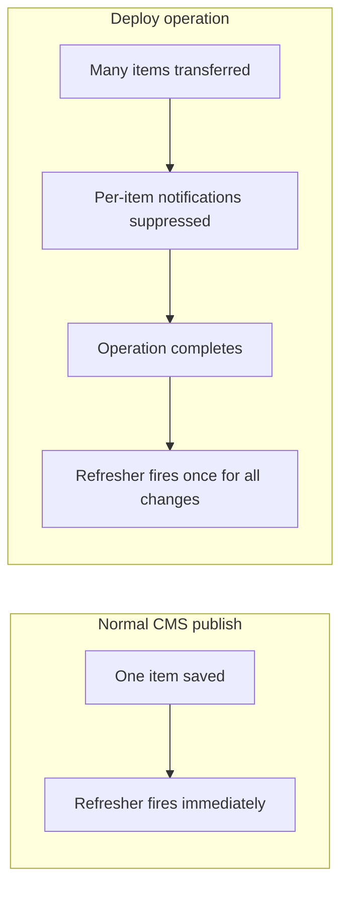
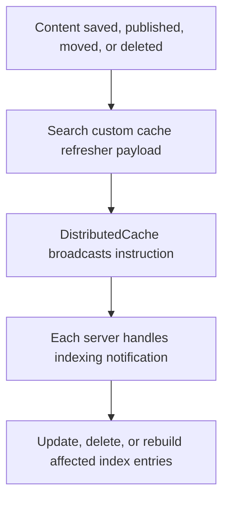
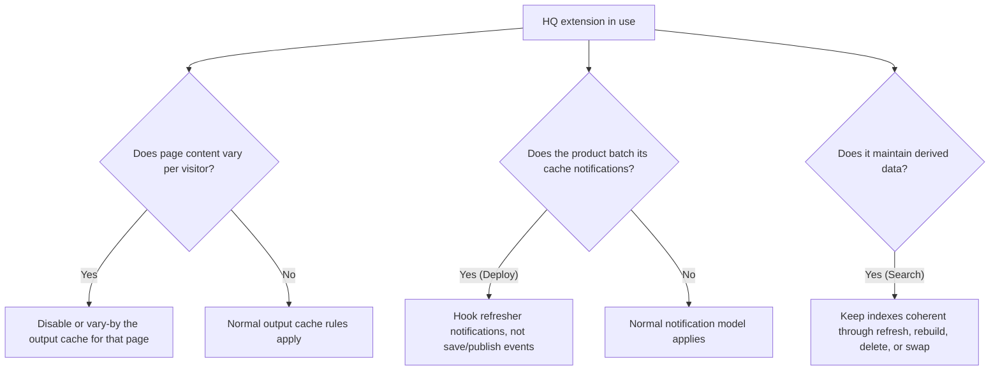

# 05. HQ Extensions and Cache

> **Start here.** You already know the standard Umbraco cache model. This chapter focuses on what changes when you add HQ extensions, so you can quickly see where behaviour differs for Forms, Deploy, Engage, Commerce, and Search.

Umbraco HQ ships several products and add-ons that extend the CMS. This chapter focuses on the cache-relevant ones: Forms, Deploy, Engage, Commerce, and Umbraco Search.

Each one interacts with the Umbraco cache in a different way. This chapter only covers the differences from the standard CMS cache behaviour described in the earlier chapters. If a product simply rides the normal cache refresher pipeline without doing anything unusual, that is not worth repeating here.

Each product changes a specific part of the caching picture. The goal here is to isolate those differences without repeating baseline CMS behaviour.

## At a glance

| Product | The one cache thing to know |
|---|---|
| Forms | Form pages are excluded from the website output cache by default |
| Deploy | Batches work across many items, suppresses per-item notifications, fires refreshers once at the end |
| Engage | Personalisation and A/B testing require vary-by or bypass of the output cache |
| Commerce | Cart and checkout pages cannot be output-cached; catalogue pages can be |
| Search | Search indexes are cache-adjacent read models kept fresh by cache-refresher signalling |

---

## Umbraco Forms

Forms has a narrow but important interaction with the website output cache.

### Why form pages are non-cacheable by default

The website output cache skips storing any response that sets a cookie or carries `Cache-Control: no-store`. Form pages that render `@Html.AntiForgeryToken()` trigger a `Set-Cookie` response header, which the `DefaultWebsiteOutputCacheRequestFilter` treats as non-cacheable.[^05-forms]

> **Gotcha — this is a feature, not a bug.** It is tempting to read "form pages are excluded" as a limitation to work around. It is not. Anti-forgery tokens must be unique per session, so a page that embeds one cannot safely be served from a shared cache entry.

### Splitting content from forms

If a page mixes static editorial content with a form, you can keep the benefits of output caching for the content area by loading the form separately:

- render and cache the content page normally
- load the form via a separate request, for example an AJAX-loaded partial

The partial is not cached; the content page is.

### Forms data is not published content

Form definitions, field configurations, entries, and workflow records are stored in their own database tables. They do not go through the published content cache (`HybridCache`, seeding, refreshers), so the standard published-cache behaviour simply does not apply to form data.

---

## Umbraco Deploy

### The core difference from a normal publish

A normal editor publish fires one cache refresher notification per changed item, immediately. Deploy instead batches work across many items: while the operation is in progress, per-item notifications are suppressed, and when the batch finishes it fires cache refresher notifications once, covering everything it changed.

Deploy's notification model is intentionally batched: less per-item signalling during transfer, and one coordinated refresh step after completion.

### The key setting

> **Key term — `SuppressCacheRefresherNotifications`.** This setting controls whether Deploy emits cache refresher notifications automatically after a batch operation.

- Default `false`: refreshers fire after the operation and cache is updated automatically.
- If `true`: the automatic cache refresh is skipped; you must rebuild cache and search indexes manually.

The Deploy docs advise leaving this at `false` in production.[^05-suppress]

### Advice for extension authors

> **Gotcha — save/publish events go quiet during Deploy.** If your extension needs to react after a Deploy operation, do not rely on `ContentPublishedNotification` or `ContentSavedNotification`. Because Deploy batches and suppresses per-item notifications, those events may not fire.

Hook into the cache refresher notifications instead:

- `ContentCacheRefresherNotification`
- `DictionaryCacheRefresherNotification`
- any other refresher notification that is relevant to your data

---

## Umbraco Engage

Engage handles personalisation, A/B testing, and visitor analytics, and personalisation creates a direct tension with output caching.

### The tension

The website output cache and CDA output cache both assume the same URL returns the same response for every visitor. Engage breaks that assumption deliberately: different visitor segments can see different content on the same URL.

### What this means for output cache

For pages where Engage personalisation is active, the output cache typically needs to either:

- be bypassed for that page, or
- vary by a visitor segment identifier so each segment gets its own cache entry

> **Gotcha — segment-safe caching matters.** Serving a cached response intended for one segment to a different segment is a correctness error, not a performance trade-off.

### The published content cache is unaffected

The tension lives entirely at the output cache layer. The underlying published content cache (`HybridCache`) is unchanged, and Engage still reads the same published content as other features.

### Practical guidance

- Disable website output caching on pages where Engage is delivering different content per segment, or configure a vary-by key based on the visitor's segment assignment.
- Pages that use only Engage analytics without content personalisation may still be safely output-cached.
- The CDA output cache has the same constraint for headless setups: personalised responses must not be shared across segments.[^05-engage]

---

## Umbraco Commerce

Commerce introduces per-user state — shopping carts, orders, personal pricing — which is fundamentally incompatible with shared output caching.

### Pages that cannot be output-cached

These pages must bypass the output cache:

- cart and checkout pages (per-user state)
- order confirmation and account pages
- any page that renders member-specific prices or promotions

> **Tip — logged-in journeys are already handled.** The existing `DefaultWebsiteOutputCacheRequestFilter` excludes authenticated requests, so most signed-in customer journeys are already excluded from output caching by default.

### Pages that may be output-cached

Catalogue pages without per-user pricing may be safe to cache:

- product listing pages
- product detail pages, if price and stock are stable or rendered separately
- category and brand pages

The normal rules apply: tag entries on content key, wire eviction to product or price changes.

### Commerce entities and the refresher pipeline

Commerce entities are not published content entries, so custom code that caches Commerce data should treat them as application data and pair `AppCaches` with refresher-driven invalidation in multi-server setups.[^05-commerce]

---

## Umbraco Search

Umbraco Search is different from the other products in this chapter because it is not mainly about caching rendered responses or storing published content. It is a free, open-source Umbraco add-on for building search experiences, and it can also power backoffice content search and the Content Delivery API.[^05-search]

For this book, the important point is that Search maintains search indexes: derived data structures that make discovery fast.

That makes it cache-adjacent rather than a normal cache.

### Search indexes are derived data

A search index stores a prepared representation of content so queries can find matches quickly without walking the published tree every time. That is the same distinction explained in [Chapter 13](./12-examine-indexes-and-cache-adjacent-querying.md): a cache remembers an answer; an index helps find answers.

The Umbraco Search docs currently describe compatibility with Umbraco 17, while the repository describes the project as the new search implementation that may replace the current one from Umbraco v19 onward.[^05-search]

### It uses cache refreshers as a signal bus

The interesting cache detail is not `HybridCache` storage. In the source inspected for this chapter, Umbraco Search does not appear to use `HybridCache`, `IMemoryCache`, `IDistributedCache`, or `RuntimeCache` as its ordinary storage layer.

Instead, it defines custom cache refreshers and cache-refresher notifications so search indexing can react to content changes across servers.[^05-search-cache]

The reason is written plainly in the source comments:

- core content cache refreshers are too coarse to distinguish every indexing case
- Search needs to know the difference between saved draft content and published content
- Search needs more detail for public access changes, because "refresh everything" is too expensive

So Search uses the cache-refresher pipeline in the Umbraco sense: not as a place to store data, but as distributed invalidation and re-indexing choreography.

### It keeps a database-backed index-document source

The docs call this the "Database Cache for Index Values". All content index data gathered by content indexers is cached in the database so indexes can be rebuilt more efficiently when needed.[^05-search-db-cache]

That is not the published content cache. It is better understood as a persisted cache of prepared index values: a representation that can be deleted, rebuilt, or replayed into a search provider. The source implementation stores serialised index fields in the database using MessagePack with LZ4 compression.[^05-search-docs]

The docs also make the operational trade-off explicit. If you change custom content indexers or property value handlers, already indexed content may need one of three levels of repair:

- save and publish the affected content
- trigger an index refresh for affected content
- flush the full index data cache and rebuild

That list is ordered by likely cost. A full cache flush is the broadest and most expensive option.

### Distributed reindexing matters on load-balanced sites

The official docs recommend `IDistributedContentIndexRefresher` when triggering content reindexing manually, because some providers, including the default Examine provider, operate per instance in load-balanced setups.[^05-search-reindex]

That puts Search very close to the rest of this book's invalidation theme: each node may have its own index, so the important question is not just "how do I rebuild it?" but "how do I make sure every relevant instance hears the instruction?"

### Examine provider: active and shadow indexes

The Examine provider adds another freshness pattern: zero-downtime rebuilds. It keeps an active index and a shadow index. During rebuild, Search can write to the shadow index while the active index remains readable. When the shadow index has committed and looks healthy, the provider swaps which one is active.[^05-search-shadow]

That is another cache-adjacent pattern:

- keep serving the old derived data
- build fresh derived data separately
- swap only when the new copy is ready

> **Gotcha — indexes go stale too.** It is easy to think "cache invalidation" only means clearing HTML or published content. Search shows the broader lesson: any derived representation can go stale. An index has to be refreshed, rebuilt, deleted from, or swapped just as deliberately as any cache.

> **Gotcha — indexing notifications are not cached.** The `ContentIndexingNotification` lets custom code manipulate data before it enters an index, but the docs warn that it fires for all content index updates and is not subject to the database cache. Expensive work belongs in content indexers or property value handlers instead.[^05-search-notifications]

---

## Common thread

Each product has one or more of these four cache concerns:

1. **Output cache exclusion** — the page cannot be served safely from a shared cache entry (Forms pages, Commerce cart/checkout, Engage personalised pages).
2. **Vary-by requirement** — the page can be cached, but differently per visitor or segment (Engage, member-specific Commerce pages).
3. **Notification batching** — the product uses the CMS refresher pipeline but fires notifications in a different pattern from a normal editor publish (Deploy).
4. **Derived-data freshness** — the product maintains data that is not the source of truth, but must still be kept fresh after content changes (Search indexes).

## In a nutshell

- Forms: pages carrying `@Html.AntiForgeryToken()` set a cookie, so they are excluded from output caching by design. Split the form out if you want to cache the surrounding content.
- Deploy: per-item notifications are suppressed during transfer, then a coordinated refresher step runs at the end; leave `SuppressCacheRefresherNotifications` at `false` in production.
- Engage: personalisation means one cached response cannot safely serve every segment. Bypass or vary-by the output cache on personalised pages; `HybridCache` itself is unchanged.
- Commerce: carts, checkout, and member pricing must skip the output cache; catalogue pages can be cached with tag-based eviction. Authenticated requests are excluded for you.
- Search: indexes are not ordinary caches, but they are derived data that can become stale. Umbraco Search uses custom cache refreshers as distributed re-indexing signals, and the Examine provider can rebuild a shadow index before swapping it into service.

### Three takeaways

1. The published content cache (`HybridCache`) is rarely the thing these products bend directly; most pressure lands on output caching, notification timing, or derived-data freshness.
2. Deploy and Search both prove that the cache-refresher pipeline is bigger than cache storage: it is also the distributed signal path for work that must happen after changes.
3. "Personalised or per-user" is the output-cache litmus test; "derived from content" is the Search litmus test. Both can go stale, but they go stale in different ways.

### Where to go next

- [Chapter 4: Cache busting and invalidation](./04-cache-busting-and-invalidation.md) — the refresher and `DistributedCache` mechanics Deploy batches on top of.
- [Chapter 2: Website output caching](./02-website-output-caching.md) — the exclusion rules that make Forms, Engage, and Commerce pages behave as they do.
- [Chapter 13: Examine, indexes, and cache-adjacent querying](./12-examine-indexes-and-cache-adjacent-querying.md) — why Search belongs near caching without being the same thing.
- [Chapter 7: Small local cache example with tags](./07-small-local-cache-example-with-tags.md) — the tag-and-evict pattern to use for cacheable catalogue pages.

## Sources

- [Website output caching (v17)](https://docs.umbraco.com/umbraco-cms/17.latest/develop-with-umbraco/caching/website-output-caching)
- [Handling cache refresher notifications (Deploy)](https://docs.umbraco.com/umbraco-deploy/extending/handling-cache-refresher-notifications)
- [Deploy settings](https://docs.umbraco.com/umbraco-deploy/getting-started/deploy-settings)
- [Umbraco Forms docs](https://docs.umbraco.com/umbraco-forms)
- [Umbraco Engage docs](https://docs.umbraco.com/umbraco-engage)
- [Umbraco Commerce docs](https://docs.umbraco.com/umbraco-commerce)
- [Umbraco Search docs](https://docs.umbraco.com/umbraco-search)
- [Umbraco.Cms.Search repository](https://github.com/umbraco/Umbraco.Cms.Search)

[^05-forms]: See [U18 in the appendix](./10-appendix-sources.md#u18-umbraco-forms-docs) and [U3](./10-appendix-sources.md#u3-website-output-caching).
[^05-engage]: See [U19 in the appendix](./10-appendix-sources.md#u19-umbraco-engage-docs) and [U3](./10-appendix-sources.md#u3-website-output-caching).
[^05-commerce]: See [U20 in the appendix](./10-appendix-sources.md#u20-umbraco-commerce-docs), [U3](./10-appendix-sources.md#u3-website-output-caching), and [U6](./10-appendix-sources.md#u6-server-side-extensions-cache-docs).
[^05-suppress]: See [U12 in the appendix](./10-appendix-sources.md#u12-deploy-settings).
[^05-search]: See [U21](./10-appendix-sources.md#u21-umbraco-search-overview), [U22](./10-appendix-sources.md#u22-umbraco-search-installation), and [S2](./10-appendix-sources.md#s2-umbracocmssearch-repository) in the appendix.
[^05-search-cache]: See [S2](./10-appendix-sources.md#s2-umbracocmssearch-repository), especially `src/Umbraco.Cms.Search.Core/Cache/UmbracoBuilderExtensions.cs`, `ContentNotificationHandlerBase.cs`, and the custom cache refresher types under `src/Umbraco.Cms.Search.Core/Cache`.
[^05-search-docs]: See [S2](./10-appendix-sources.md#s2-umbracocmssearch-repository), especially `src/Umbraco.Cms.Search.Core/Persistence/IndexDocumentRepository.cs`.
[^05-search-shadow]: See [S2](./10-appendix-sources.md#s2-umbracocmssearch-repository), especially `src/Umbraco.Cms.Search.Provider.Examine/Services/ActiveIndexManager.cs` and `src/Umbraco.Cms.Search.Provider.Examine/NotificationHandlers/ZeroDowntimeRebuildNotificationHandler.cs`.
[^05-search-db-cache]: See [U23 in the appendix](./10-appendix-sources.md#u23-umbraco-search-database-cache-for-index-values).
[^05-search-reindex]: See [U24 in the appendix](./10-appendix-sources.md#u24-umbraco-search-reindexing-content).
[^05-search-notifications]: See [U25 in the appendix](./10-appendix-sources.md#u25-umbraco-search-indexing-notification-handling).
