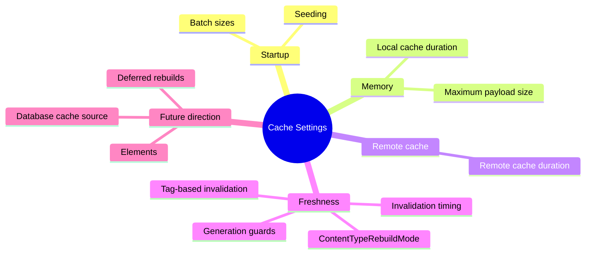
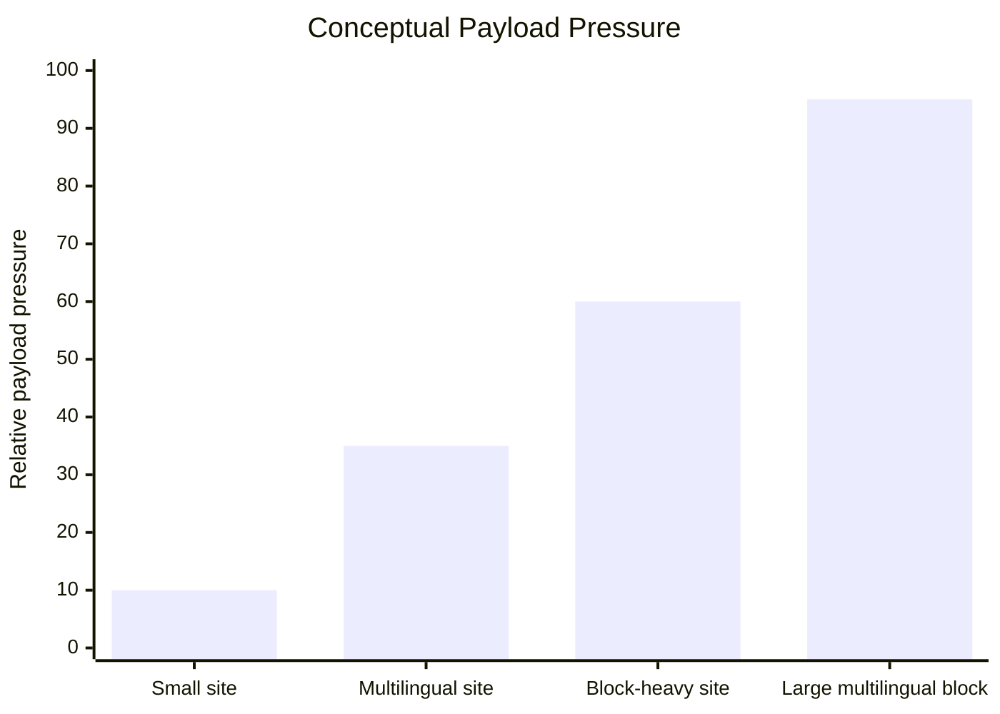
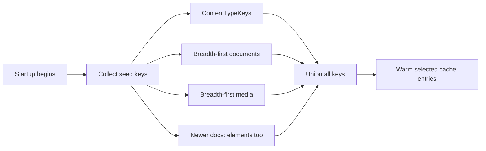
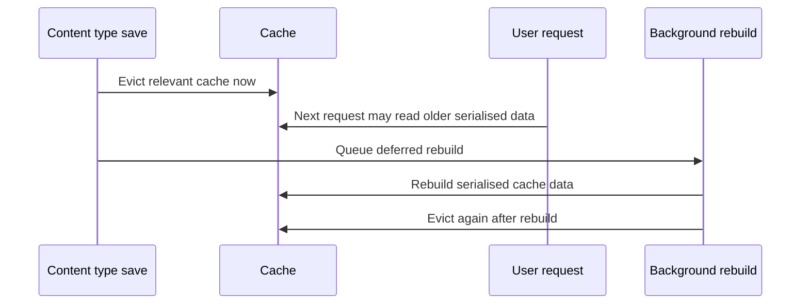
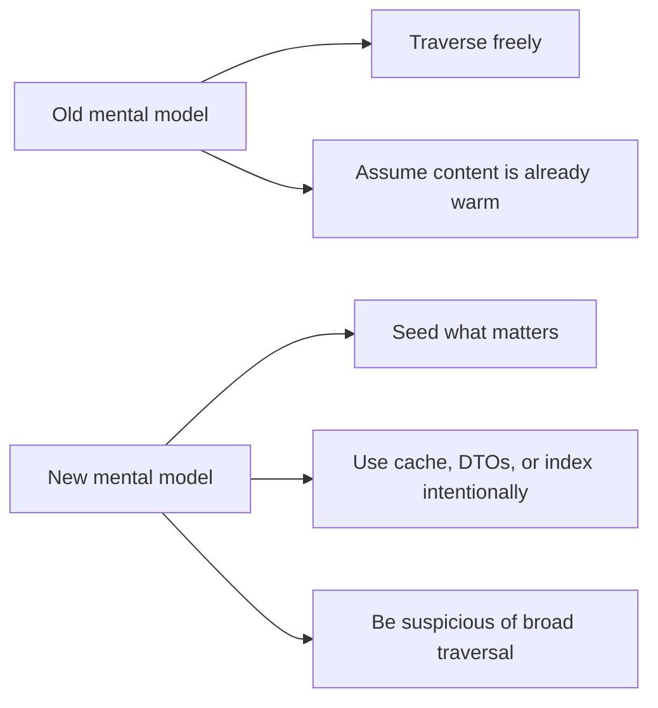
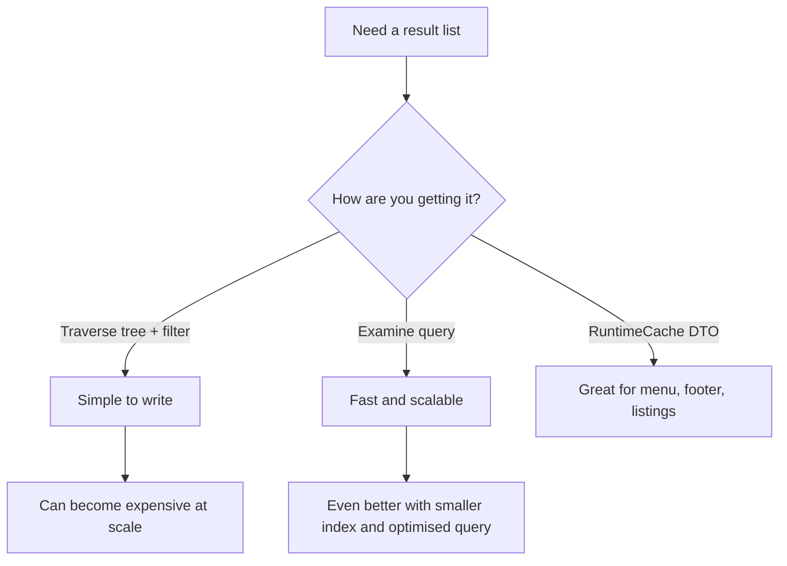
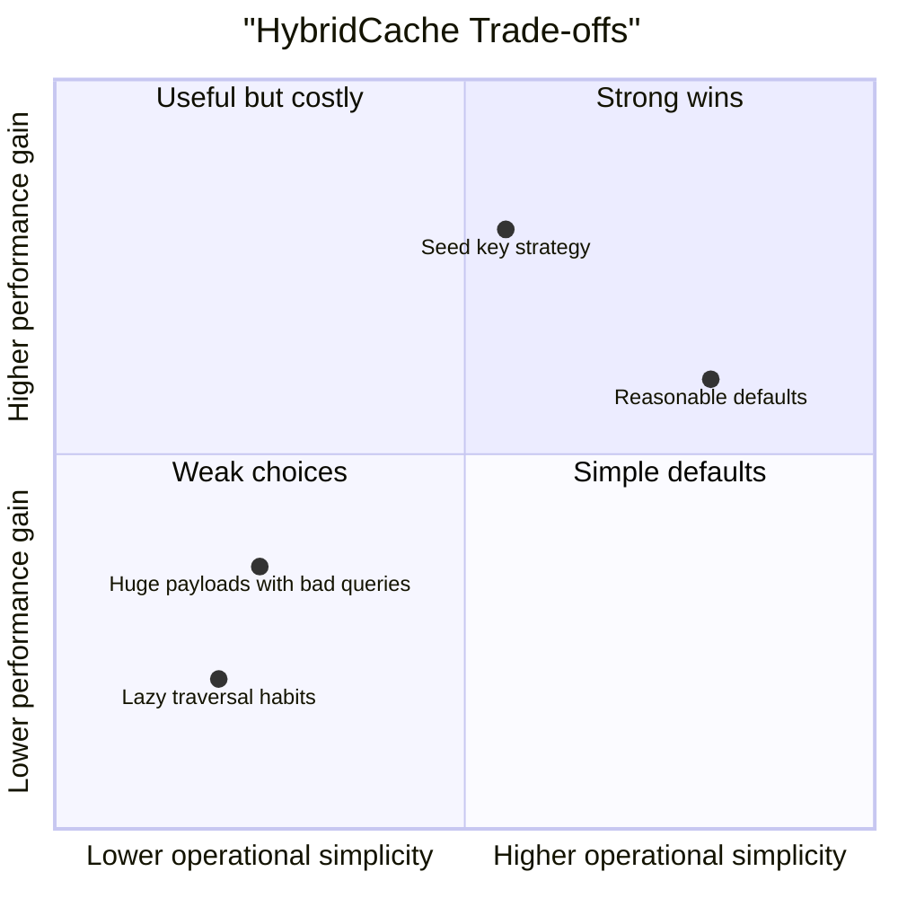

# 06. Cache Settings, Talks, and Field Notes

> **Start here.** This chapter is the control panel: the settings, talks, and field notes that explain not just what Umbraco caching does but why it does it that way. Once you have seen the earlier mechanics, these are the settings you actually tune. You will leave knowing which options control prewarming, payload limits, entry lifetimes, and content-type rebuild timing.

This chapter maps the most important cache settings to real operational outcomes: startup cost, memory pressure, cache lifetime, and rebuild behaviour.

This chapter gathers the settings and supporting material that help explain not just what Umbraco does, but why it does it that way.

## Why this chapter exists

Three sources each tell a different part of the story. The code tells us how the cache behaves, and the docs tell us how to configure it, but neither quite explains the pressure that shaped the new design. For that, the talk, PDF, and product posts are invaluable, because they name the problems the team was trying to solve:[^06-talks]

- too much startup memory
- too much warm-up cost
- too much assumption that all content should stay hot

The newer `main` branch code also reveals more of the actual mechanics behind those pressures:

- a local converted-object hot cache
- serialised `HybridCache` entries
- a database-backed cache source
- tag-based invalidation
- deferred rebuild workflows
- generation guards against stale write-back

## One-picture summary

## Two cache-settings pages matter

### The versioned Umbraco 17 page

Use this as the safest reference for confirmed v17 behaviour:

- [Umbraco 17.latest cache settings](https://docs.umbraco.com/umbraco-cms/17.latest/develop-with-umbraco/configuration/cache-settings.md)

### The newer unversioned page

Use this as a signal for where the platform is moving:

- [Current cache settings page](https://docs.umbraco.com/umbraco-cms/develop-with-umbraco/configuration/cache-settings.md)

It includes newer element-related settings that go beyond the earlier v17-focused page.

## Cache settings reference

Here is the quick "what does this dial actually touch?" reference. Some names still say `NuCache`; in Umbraco 17 and newer these settings feed the Hybrid Cache implementation rather than selecting the old NuCache engine.[^06-settings-reference]

| Setting or option | Layer | What it changes | Beginner caution |
| --- | --- | --- | --- |
| `HybridCacheOptions.MaximumPayloadBytes` | Microsoft `HybridCache`, as configured by Umbraco | Maximum size of one serialised cache entry; Umbraco raises the generic Microsoft default to 100 MB | If large pages appear not to cache, check this before blaming invalidation |
| `Umbraco:CMS:NuCache:NuCacheSerializerType` | Published-content Hybrid Cache | Chooses the serialiser used for database-backed cache payloads, commonly MessagePack | Old name, real effect; it is not a switch back to NuCache |
| `Umbraco:CMS:NuCache:SqlPageSize` | Database-backed cache source | Controls how many rows are read per SQL page during cache-source work | Bigger batches are not always better; they can increase database pressure |
| `Umbraco:CMS:NuCache:UsePagedSqlQuery` | Database-backed cache source | Chooses paged SQL query behaviour for large cache-source reads | Mostly a scale knob; leave it alone unless you are investigating large-tree behaviour |
| `ContentTypeRebuildMode` | Hybrid Cache rebuild flow | Controls whether content-type structural changes rebuild immediately or defer work | `Deferred` can briefly serve old structures while the background rebuild catches up |
| `ContentTypeKeys` | Seeding | Seeds selected content and element types during startup | Useful for hot paths; wasteful if you seed everything without intent |
| `DocumentBreadthFirstSeedCount` | Seeding | Warms the first N documents using breadth-first traversal | Good for shallow top-level navigation; less useful for deep long-tail content |
| `MediaBreadthFirstSeedCount` | Seeding | Warms the first N media items using breadth-first traversal | Can help media-heavy sites, but still costs startup work |
| `ElementBreadthFirstSeedCount` | Newer seeding docs | Warms element cache entries in newer Hybrid Cache builds | Treat as a newer-direction setting when comparing v17 with later docs |
| `DocumentSeedBatchSize` | Seeding | Controls document seed processing batch size | Tunes startup pressure, not request-time correctness |
| `MediaSeedBatchSize` | Seeding | Controls media seed processing batch size | Same trade-off: warmer startup versus more upfront work |
| `ElementSeedBatchSize` | Newer seeding docs | Controls element seed processing batch size | Relevant when element seeding is available |
| `LocalCacheDuration` | Local Hybrid Cache entry lifetime | Controls how long local entries stay warm | Duration does not replace invalidation; publishes still bust stale entries |
| `RemoteCacheDuration` | Remote/distributed cache lifetime | Controls how long remote cache entries can live | Longer remote lifetime improves reuse but increases reliance on correct invalidation |
| `SeedCacheDuration` | Seeded entries | Controls how long pre-warmed entries live | Seed what matters first; duration is the second question |
| `Umbraco:CMS:Website:OutputCache:Enabled` | Website output cache | Turns website HTML output caching on or off | Output caching is opt-in and needs a busting story |
| `Umbraco:CMS:Website:OutputCache:ContentDuration` | Website output cache | Default duration for cached website responses | A longer duration without correct tag eviction is how stale pages become visible |

## The settings that matter most

### `HybridCacheOptions.MaximumPayloadBytes`

> **Key term — `MaximumPayloadBytes`.** This is the cap on how large a single serialised cache entry may be. If an entry is larger than this limit, it is not stored. Microsoft's base `HybridCache` sets this default to 1 MB, but Umbraco overrides it to 100 MB.[^06-payload]

That hundredfold jump is not arbitrary. Multilingual payloads and block editors both grow fast, and a realistic Umbraco page tree can exceed generic defaults surprisingly quickly, so the modest 1 MB ceiling would silently drop exactly the rich pages you most want cached.

It is also a tidy example of Microsoft versus Umbraco responsibilities. Microsoft exposes `MaximumPayloadBytes` as a base `HybridCache` option; Umbraco raises it because real published-content payloads are much larger than the generic default expects. The `main` branch code makes the reason even clearer: entries are serialised `ContentCacheNode` payloads that may carry a lot of culture, property, and nested data. Compression helps, but realistic sites still produce large objects.

## Seeding settings

These decide what gets prepped before doors open: the content warmed into cache on startup rather than fetched cold on first request. Important settings include:

- `ContentTypeKeys`
- `DocumentBreadthFirstSeedCount`
- `MediaBreadthFirstSeedCount`

And in newer docs:

- `ElementBreadthFirstSeedCount`

## Seed batch sizes

These control how seed keys are processed during startup.

- `DocumentSeedBatchSize`
- `MediaSeedBatchSize`

And in newer docs:

- `ElementSeedBatchSize`

These are more than raw performance knobs. Because they govern how seed keys are fed through in chunks, they shape the startup profile itself: how much database pressure the warm-up creates, and how quickly a freshly restarted node becomes warm again.

## Cache entry durations

These settings control how long entries stay cached before they are considered stale and must be fetched fresh.

### `LocalCacheDuration`

How long entries stay in local memory on this node.

### `RemoteCacheDuration`

How long entries stay in a configured second-level cache. This one only matters if a remote cache actually exists.

### `SeedCacheDuration`

How long seeded entries stay cached, which is especially relevant for the deliberately hot content you never want to go cold: home pages, key landing pages, and frequently reused media.

> **Going deeper — seeded entries are special twice over.** The code makes an architectural point worth pausing on. Seeded entries are not only loaded first; they can also be given a deliberately different lifetime from ordinary entries.

## Newer element settings

The newer docs show the cache model becoming more explicit for elements:

- `ContentTypeKeys` now describes document types and element types
- entry durations are described for `Element`
- seeding counts and batch sizes are described for `Element`

This matches what we saw in the 18.0.2 code.

## `ContentTypeRebuildMode`

This is one of the most revealing settings in the whole file, because it exposes a genuine invalidation trade-off rather than a simple on/off switch. It has two values:[^06-rebuildmode]

- `Immediate`
- `Deferred`

With `Deferred`, the cache is still evicted immediately, but old serialised data may be served for a short while afterwards. A background rebuild finishes later, and the cache is evicted a second time once that rebuild completes. It is the difference between reprinting every menu the instant a dish changes and quietly reprinting them between orders while the old ones stay in use.

> **Going deeper — correct busting without instant freshness.** `Deferred` is a lovely demonstration that cache busting can be correct even when freshness is not perfectly immediate. Nobody is served wrong data forever; they may briefly be served slightly stale data, and the system guarantees a clean state once the rebuild lands. That distinction — eventually correct versus instantly correct — is at the heart of most cache design.

The `main` branch code also shows how this works operationally:

- structural content-type changes can be queued
- IDs are deduplicated
- a background worker rebuilds the database cache source
- matching `HybridCache` tags are removed
- matching converted-object caches are cleared

## Old `NuCache` settings that still linger

Some settings still live under:

- `Umbraco:CMS:NuCache`

Examples:

- `UsePagedSqlQuery`
- `SqlPageSize`
- `NuCacheSerializerType`

These exist mostly for backward-compatibility reasons.

> **Gotcha — old names, new engine.** Seeing `NuCache` keys in your configuration does not mean you are running the old system. The modern implementation is HybridCache-based, but not every old configuration name disappeared overnight, so a lingering key is a leftover label rather than a live gear.

For a clearer separation between the old architecture and the newer one, see [10 - NuCache vs Hybrid Cache](./10-nucache-vs-hybrid-cache.md). The deeper point is that the current architecture is no longer "just old NuCache with a new wrapper": it is a layered pipeline with explicit seeding, serialisation, rebuilding, and cache tagging, even if a few of the old names survive on the surface.

## Microsoft-first takeaway

The future Hybrid Cache story is easiest to understand in two layers:

1. Microsoft defines the generic cache primitive.
2. Umbraco defines the published-content system built on top of it.

That framing helps a lot when reading the code, because some behaviours belong mostly to Microsoft:

- primary and secondary cache flow
- stampede protection
- serialiser registration
- tags
- entry options

while other behaviours belong mostly to Umbraco:

- content and element seed keys
- `ContentCacheNode`
- database cache rebuild
- content-type rebuild strategy
- preview and published separation

## Video notes

The talk [Releasing HybridCache into the Wild with Umbraco](https://www.youtube.com/watch?v=JyXlvDoreS8) is useful because it frames the migration in plain language, without the code to slow you down. Its best high-level takeaways:

- the old model wanted too much in memory
- the new model warms what matters and lets colder entries miss
- startup and memory profile improve
- query and traversal habits matter more now

## PDF notes

The PDF [Hybrid Cache förändrar allt](https://www.umbracokalaset.se/media/ccvhwzvs/hybrid-cache-forandrar-allt.pdf) is useful because it states the trade-offs bluntly, with no diplomacy softening the edges.

Big wins:

- lower memory usage
- faster startup
- better scaling for large sites

Big warnings:

- broad traversal becomes more expensive
- in-memory filtering habits become more visible
- seed strategy matters more than before

## Query strategy graph

That is also the cleanest place to separate index and cache concerns:

- `Examine` is often the right answer when the hard part is discovery
- `RuntimeCache` is often the right answer when the hard part is recomputation

See [11 - Examine, Indexes, and Cache-Adjacent Querying](./11-examine-indexes-and-cache-adjacent-querying.md) for the full comparison.

## Best field note

The newer HybridCache world rewards:

- precise invalidation
- deliberate seeding
- better content-querying habits
- understanding which layer you are hitting
- knowing when a structural change needs rebuild rather than simple eviction

It punishes:

- lazy traversal
- assuming everything is already warm
- pretending startup and memory are free
- ignoring cache-busting complexity under concurrent refresh

## Upgrade troubleshooting field note

One practical lesson from early Umbraco 16 upgrade reports is that severe post-upgrade "slowness" is not always a straightforward cache-tuning problem.

In one community report, an upgrade from Umbraco 13 to 16 led to 30 to 40 second delays in the backoffice during login and editing, while the frontend also became temporarily unresponsive.[^06-upgrade]

That pattern matters, because if the backoffice hangs and the frontend stalls at the same time, the problem may be broader than "the editor UI feels slow". In Jacob Overgaard's reply, the likely explanation was database locking, including the long-running "Failed to acquire write lock" class of problems.[^06-upgrade]

The same thread also suggested that more than one regression could overlap:

- a login-flow bug being addressed for `16.3`
- a caching regression around missing dictionary-item null values in Umbraco 16

> **Tip — "slower after upgrade" is a symptom, not a diagnosis.** When teams report that a site became slower after a major upgrade, treat that as a description of symptoms first. It may reflect lock contention, a version-specific regression, query-shape changes under HybridCache, or several of those overlapping at once, so reaching straight for the cache-tuning dials can waste hours chasing the wrong cause.[^06-upgrade]

## What the `main` branch adds to the story

The newer source shows several details that are easy to miss in talks alone:

- the local converted-object cache is a first-class performance layer
- null entries are tagged so negative caching can also be invalidated correctly
- generation counters stop stale in-flight reads from clobbering fresher entries
- serialiser changes can trigger full database cache rebuilds at startup

None of these are small implementation details; they are the practical engineering that makes the whole architecture reliable rather than merely fast. See also [09 - Future Hybrid Cache Architecture](./09-future-hybrid-cache-architecture.md).

## Trade-off chart

## In a nutshell

- The dials fall into four groups: what to prep before service (`ContentTypeKeys` and the breadth-first seed counts), how fast to prep it (the seed batch sizes), how big one container may be (`MaximumPayloadBytes`), and how long food stays hot (Local, Remote, and Seed durations).
- `MaximumPayloadBytes` is the one to remember: Microsoft defaults it to 1 MB, Umbraco raises it to 100 MB, because real multilingual and block-heavy pages routinely outgrow the generic ceiling.
- `ContentTypeRebuildMode` names a real trade-off. `Deferred` evicts now, may serve slightly stale data briefly, rebuilds in the background, then evicts again — correct without being instantly fresh.
- Lingering `NuCache` config keys are old labels on a new engine, not proof the old system is running.
- Talks and the PDF frame the same lesson the code enforces: seed what matters, let cold entries miss, and watch your query and traversal habits.

### Three takeaways

1. Reach for the seeding dials before the duration dials — deciding what is warmed at all matters more than how long it lingers.
2. If pages larger than 1 MB start vanishing from cache, `MaximumPayloadBytes` is your first suspect, not a bug.
3. "Slower after an upgrade" is a symptom to investigate, not a cache setting to tweak.

### Where to go next

- [10 - NuCache vs Hybrid Cache](./10-nucache-vs-hybrid-cache.md) — the clean split between the old architecture and the new one.
- [09 - Future Hybrid Cache Architecture](./09-future-hybrid-cache-architecture.md) — the seeding, serialisation, and rebuild machinery these dials control.
- [11 - Examine, Indexes, and Cache-Adjacent Querying](./11-examine-indexes-and-cache-adjacent-querying.md) — the query habits the talks keep warning about.

## Sources

- Docs:
  - [Cache settings (v17)](https://docs.umbraco.com/umbraco-cms/17.latest/develop-with-umbraco/configuration/cache-settings.md)
  - [Cache settings (latest)](https://docs.umbraco.com/umbraco-cms/develop-with-umbraco/configuration/cache-settings.md)
- Supporting material:
  - [Hybrid Cache förändrar allt — Umbraco Kalaset session (YouTube)](https://www.youtube.com/watch?v=JyXlvDoreS8)
  - [Hybrid Cache förändrar allt — Umbraco Kalaset slides (PDF)](https://www.umbracokalaset.se/media/ccvhwzvs/hybrid-cache-forandrar-allt.pdf)

[^06-talks]: See [T1](./14-appendix-sources.md#t1-releasing-hybridcache-into-the-wild-with-umbraco), [T2](./14-appendix-sources.md#t2-hybrid-cache-forandrar-allt-pdf), [T4](./14-appendix-sources.md#t4-enkelmedia-article), [T5](./14-appendix-sources.md#t5-enkelmedia-pdf), [B1](./14-appendix-sources.md#b1-umbraco-15-release), [B5](./14-appendix-sources.md#b5-umbraco-product-update---august-2024), and [B6](./14-appendix-sources.md#b6-umbraco-product-update---q1-2025).
[^06-payload]: See [M6](./14-appendix-sources.md#m6-hybridcacheoptions), [U4](./14-appendix-sources.md#u4-cache-settings-for-umbraco-17), [U5](./14-appendix-sources.md#u5-current-cache-settings-page), and [C4](./14-appendix-sources.md#c4-umbracopublishedcachehybridcache-on-main).
[^06-settings-reference]: See [U3](./14-appendix-sources.md#u3-website-output-caching), [U4](./14-appendix-sources.md#u4-cache-settings-for-umbraco-17), [U5](./14-appendix-sources.md#u5-current-cache-settings-page), [M6](./14-appendix-sources.md#m6-hybridcacheoptions), and [C4](./14-appendix-sources.md#c4-umbracopublishedcachehybridcache-on-main).
[^06-rebuildmode]: See [U5](./14-appendix-sources.md#u5-current-cache-settings-page), [C4](./14-appendix-sources.md#c4-umbracopublishedcachehybridcache-on-main), and [C5](./14-appendix-sources.md#c5-claudemd-for-umbracopublishedcachehybridcache).
[^06-upgrade]: See [F1](./14-appendix-sources.md#f1-website-significantly-slower-since-upgrading-from-v13-to-v16), [F2](./14-appendix-sources.md#f2-failed-to-acquire-write-lock-for-id--333), and [F3](./14-appendix-sources.md#f3-umbracooauth_completecode-stuck-after-umbracologout).
