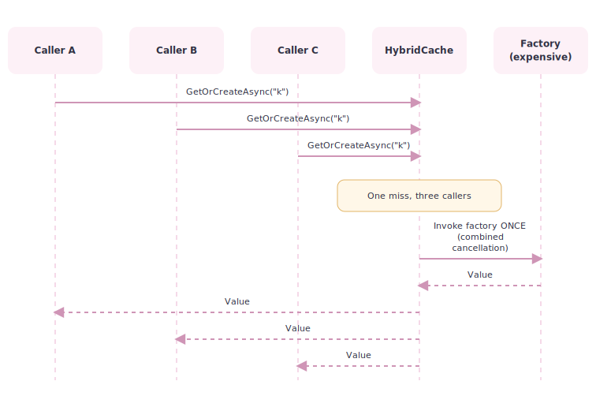
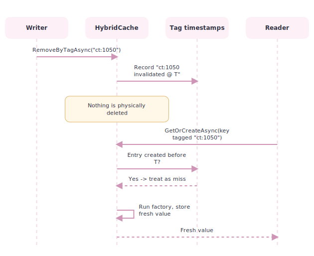
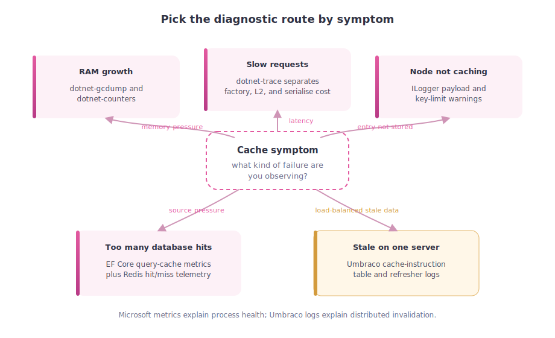
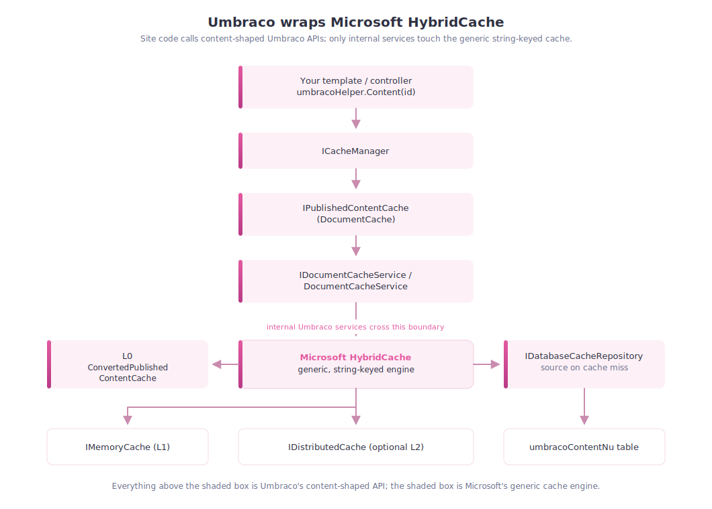
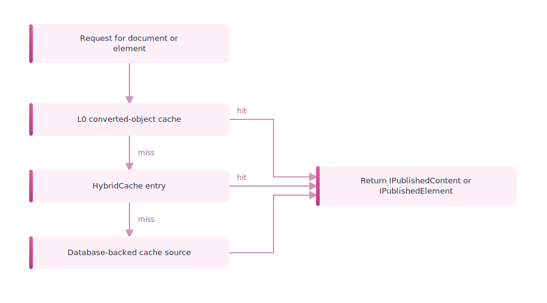
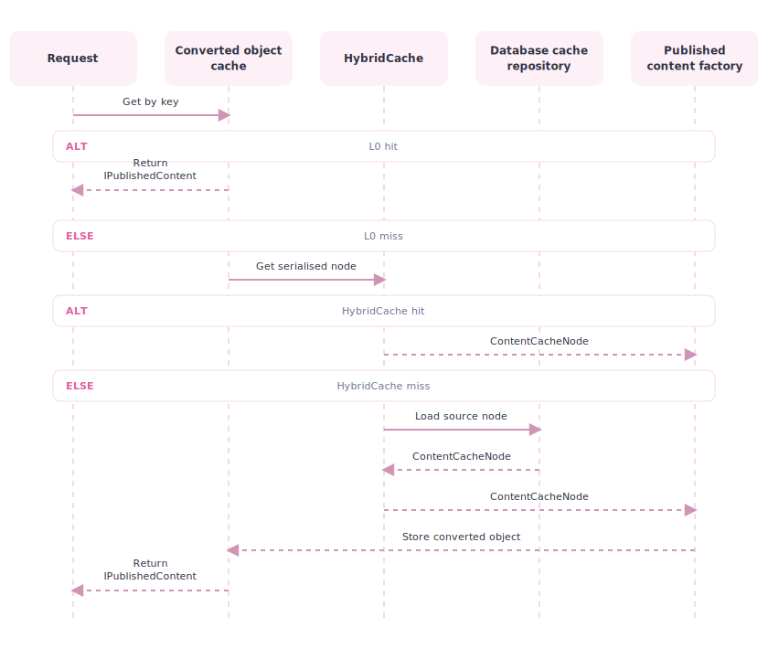
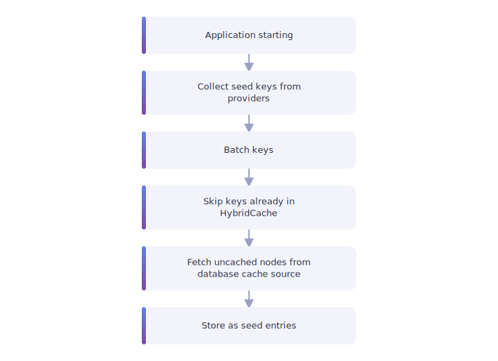
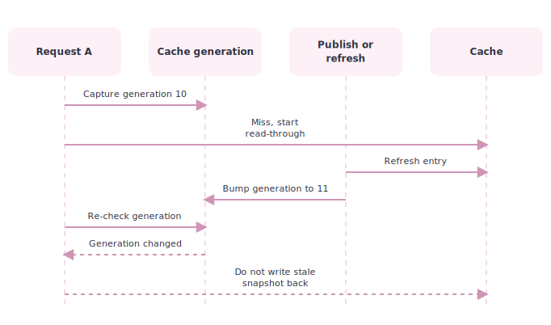

# 07. How the Hybrid Cache Engine Works

> **Start here.** This is the deep architecture chapter, and it describes the engine that is *already live*: Hybrid Cache has been Umbraco's published-content cache since v15, and it is what v17 runs today. It is not one bucket of cached objects — it is a layered pipeline that stages published content through a tiny hot cache, serialised entries, and a database-backed source, with notification-driven refresh, rebuild, and seeding on top. By the end you will be able to trace a request through every layer and understand why each one exists.

This chapter is one of the main pillars of the book.

It reads the implementation from the `main` branch, where the model is spelled out most fully:

- `src/Umbraco.PublishedCache.HybridCache`

That matters because this is where the cache model is most explicit — far more than the earlier "HybridCache plus a few settings" story. The same core architecture is what v17 runs today; where a detail is newer, such as the separate element cache in v18, the text says so.

> **Building the read model.** Every layer in this pipeline exists to produce one thing: a materialised `IPublishedContent` ([Chapter 2 - The Published Object](./02-the-published-object.md)). The L0 hot tier holds the finished object so it can be handed back untouched; every layer below it is the cost of building one from scratch.

## The most important idea

The Hybrid Cache is not one cache.

It is a layered published-content system with at least four different responsibilities:

1. a tiny local hot cache of already converted published objects
2. serialised `HybridCache` entries
3. a database-backed source cache
4. notification-driven refresh, rebuild, and seeding workflows

That is why it is worth studying as a system, not just as a library call.

## Start with Microsoft

Before we talk about Umbraco, we should be clear about the base layer.

Microsoft's official `HybridCache` is the cache primitive Umbraco is building on.[^10-msbase]

From the broader Microsoft caching guidance, the relevant stack is:

- `IMemoryCache`
- `IDistributedCache`
- `HybridCache`

For Umbraco, the important point is not to memorise every Microsoft cache API.

It is to understand that `HybridCache` is Microsoft's higher-level cache layer that sits above plain memory caching and raw distributed-cache storage.

From Microsoft's official docs and blog, `HybridCache` provides:

- a unified API for in-memory and distributed caching
- primary local caching plus optional secondary distributed caching
- stampede protection
- configurable serialisation
- tag-based invalidation
- configurable entry options for overall and local cache duration

So for this book, Microsoft is not just background context.

Microsoft is a primary source for understanding the base engine.

## What is relevant for Umbraco, and what is not

Not every Microsoft caching detail matters equally for this book.

The Microsoft topics most relevant to Umbraco are:[^10-relevant]

- the difference between plain memory cache and hybrid cache
- the optional secondary distributed cache layer
- stampede protection
- tag-based invalidation
- entry durations for local and remote layers
- serialiser hooks

The less relevant topics for this book are:

- generic one-off examples unrelated to published content
- caching patterns that do not interact with Umbraco's published-content pipeline
- broad .NET caching guidance that never changes how Umbraco actually behaves

So when we use Microsoft sources, we should keep filtering them through one question:

> "Does this help explain Umbraco's actual cache behaviour?"

## What comes from Microsoft, and what Umbraco adds

<div class="pdf-keep-together" style="break-inside: avoid; page-break-inside: avoid; -webkit-column-break-inside: avoid; margin: 1rem 0;">

![Two-column comparison: Microsoft HybridCache provides primary memory cache, optional secondary distributed cache, the GetOrCreateAsync read-through pattern, stampede protection, tags, and serialiser hooks. Umbraco's PublishedCache.HybridCache builds on top with ContentCacheNode payloads, a database-backed cache source, document/media/member/element/domain services, seed-key providers, draft/published key separation, notification-driven refresh and invalidation, and local converted-object L0 caches.](./assets/hybridcache-vs-umbraco-layers.svg)

</div>

## Microsoft HybridCache in one sentence

Microsoft `HybridCache` is the engine.

Umbraco's Hybrid Cache module is the published-content system built around that engine.[^10-umbracoblog]

## Under the hood: the problem Microsoft's engine removes

Before Microsoft's `HybridCache`, the idiomatic way to cache an expensive lookup was the *cache-aside* pattern written by hand against `IDistributedCache`.[^10-msoverview] It looks harmless until you count everything it has to get right:

```csharp
// The old cache-aside pattern, written by hand against IDistributedCache.
public async Task<SomeInformation> GetSomeInformationAsync(
    string name, int id, CancellationToken token = default)
{
    var key = $"someinfo:{name}:{id}";

    // 1. Try the cache. This returns bytes, so we own deserialisation.
    var bytes = await _cache.GetAsync(key, token);
    if (bytes is not null)
    {
        return JsonSerializer.Deserialize<SomeInformation>(bytes)!;
    }

    // 2. Cache miss — go to the real source. Every concurrent caller
    //    that missed is now here at the same time (a cache stampede).
    var info = await SomeExpensiveOperationAsync(name, id, token);

    // 3. Serialise and write back, choosing expiry by hand.
    var payload = JsonSerializer.SerializeToUtf8Bytes(info);
    await _cache.SetAsync(key, payload,
        new DistributedCacheEntryOptions { AbsoluteExpirationRelativeToNow = TimeSpan.FromMinutes(5) },
        token);

    return info;
}
```

The same behaviour with `HybridCache` collapses to a single call, and the library owns the serialisation, the write-back, and — crucially — the stampede:[^10-msoverview]

```csharp
public class SomeService(HybridCache cache)
{
    public async Task<SomeInformation> GetSomeInformationAsync(
        string name, int id, CancellationToken token = default)
    {
        return await cache.GetOrCreateAsync(
            $"someinfo:{name}:{id}",                                   // unique key
            async cancel => await SomeExpensiveOperationAsync(name, id, cancel), // factory on miss
            cancellationToken: token);
    }
}
```

> **Key term — read-through and `GetOrCreateAsync`.** A *read-through* cache is one you always ask first; on a miss it calls your *factory* to fetch the real value, stores it, and hands it back. `GetOrCreateAsync` is that single door. Umbraco's `DocumentCacheService` is essentially a large, content-aware read-through built on this exact method.

That `cancel` token is not the caller's token. When several requests miss the same key at once, `HybridCache` runs the factory **once** and gives the factory a *combined* cancellation token representing all the waiting callers — so one caller walking away does not cancel the fetch that the others are still waiting on.[^10-msrelnotes]

## Registering the engine and tuning an entry

Registration is one line, with an options overload for global defaults:[^10-mshybrid]

```csharp
builder.Services.AddHybridCache(options =>
{
    options.MaximumPayloadBytes = 1024 * 1024; // 1 MB — the default
    options.MaximumKeyLength    = 1024;         // characters — the default
    options.DefaultEntryOptions = new HybridCacheEntryOptions
    {
        Expiration          = TimeSpan.FromMinutes(5), // lifetime in L2 (distributed)
        LocalCacheExpiration = TimeSpan.FromMinutes(2), // lifetime in L1 (in-process)
    };
});
```

The two durations are the detail people miss. An entry has **two clocks**:[^10-msentryoptions]

- `Expiration` — how long the entry lives overall, including the distributed L2 layer.
- `LocalCacheExpiration` — how long the *in-process* L1 copy is trusted before the entry is re-fetched from L2.

This is exactly the shape Umbraco reuses when it gives *seeded* entries their own, longer durations without forcing that lifetime onto every other entry.

## The entry flags: switching layers off per call

A single call can opt out of individual layers through `HybridCacheEntryFlags`. This is the mechanism behind "warm this, but don't pollute the rest of the cache" behaviour:[^10-msflags]

| Flag | Effect |
| --- | --- |
| `DisableLocalCacheRead` / `DisableLocalCacheWrite` | Skip reading from / writing to the in-process L1 |
| `DisableLocalCache` | Both of the above |
| `DisableDistributedCacheRead` / `DisableDistributedCacheWrite` | Skip reading from / writing to the distributed L2 |
| `DisableDistributedCache` | Both of the above |
| `DisableUnderlyingData` | Serve only from cache; never call the factory / data store |
| `DisableCompression` | Store this payload uncompressed |

These flags map directly onto Umbraco concerns. A background warm-up that should populate the shared store without evicting hot local objects is an `L1`-vs-`L2` decision. A "is this already cached?" probe that must not trigger an expensive rebuild is exactly `DisableUnderlyingData`. And `DisableCompression` is the counterpart to Umbraco's deliberate choice to compress `ContentCacheNode` payloads with LZ4 (see below).

## Stampede protection, concretely

<div class="pdf-keep-together" style="break-inside: avoid; page-break-inside: avoid; -webkit-column-break-inside: avoid; margin: 1rem 0;">



</div>

> **Gotcha — stampede protection is per process, not per cluster.** The coalescing above happens inside one server's L1. There is no built-in distributed lock in the initial `HybridCache` releases, so on a load-balanced farm each node can still run the factory once for the same key. For Umbraco that is usually fine — the factory reads the prepared database cache source, not the full content graph — but do not assume "stampede protection" means "exactly one fetch across the whole cluster."

<div style="page-break-before: always; break-before: page;"></div>

## Tag invalidation is logical, not physical

This is the single most important Microsoft detail for understanding Umbraco's tag-based busting — and the easiest to get wrong. `RemoveByTagAsync` does **not** walk the cache and delete entries. Neither `IMemoryCache` nor `IDistributedCache` even understands tags. Instead, invalidation records an *"ignore anything created before this moment"* rule for that tag:[^10-mstags]

- The old values stay physically in L1 and L2 until they expire naturally.
- The next `GetOrCreateAsync` for a tagged key checks whether the stored value predates the tag's invalidation timestamp. If it does, it is treated as a miss and the factory runs.
- `RemoveByTagAsync("*")` is a reserved wildcard that logically invalidates **everything**, even untagged entries. Glob patterns like `"foo*"` are not supported.

<div class="pdf-keep-together" style="break-inside: avoid; page-break-inside: avoid; -webkit-column-break-inside: avoid; margin: 1rem 0;">



</div>

<div class="pdf-keep-together" style="break-inside: avoid; page-break-inside: avoid; -webkit-column-break-inside: avoid; margin: 1rem 0;">

> **Gotcha — tag busting does not free memory.** Because invalidation is a logical timestamp gate, calling `RemoveByTagAsync` on a huge content type does not immediately reclaim RAM; the stale entries linger until their own expiry. If you are chasing memory, tag invalidation is the wrong lever — expiry and payload size are the right ones.

This is precisely why Umbraco can afford to tag *every* document and element and still invalidate a whole content type in one call: the operation is cheap because it is a timestamp bump, not a sweep.

</div>

<div style="page-break-before: always; break-before: page;"></div>

## Limits: payload and key size

Two limits bite silently, so they are worth stating plainly:[^10-mshybrid]

- **`MaximumPayloadBytes` (default 1 MB).** A serialised entry larger than this is **not cached** — the attempt is logged and the value is simply fetched from source every time.
- **`MaximumKeyLength` (default 1024 characters).** Longer keys bypass the cache mechanism to prevent saturation.

> **Gotcha — the 1 MB default would silently drop real Umbraco content, so Umbraco overrides it.** A single published document with a few languages and some block content easily serialises past a megabyte — and at the default a node that big would quietly stop being cached, making every request pay full price. This is not hypothetical: Umbraco raises the ceiling **one hundredfold** at registration, and the source even says why.[^10-umbregister]
>
> ```csharp
> // Umbraco.PublishedCache.HybridCache/DependencyInjection/UmbracoBuilderExtensions.cs
> builder.Services.AddHybridCache(options =>
> {
>     // We'll be a bit friendlier and default this to a higher value, you quickly hit the 1MB
>     // limit with a few languages and especially blocks.
>     // This can be overwritten later if needed.
>     options.MaximumPayloadBytes = 1024 * 1024 * 100; // 100MB
> }).AddSerializer<ContentCacheNode, HybridCacheSerializer>();
> ```
>
> So Umbraco pulls *two* levers against payload size: it lifts the limit to 100 MB **and** registers a MessagePack + LZ4 serialiser to keep the bytes small. Both matter — the limit stops large nodes falling out, and compression keeps even large ones cheap to store and move.

## Object reuse and immutability

By default `HybridCache` deserialises a **fresh instance per caller**, exactly as hand-written `IDistributedCache` code would, so two concurrent callers can never trample each other's object. That safety has a cost: repeated deserialisation of large or hot objects. You can opt into instance reuse — but only by promising the type is genuinely immutable, on two conditions:[^10-msreuse]

- mark the type `sealed`, and
- apply `[ImmutableObject(true)]`.

> **Gotcha — do not lie about immutability.** Marking a type `sealed` + `[ImmutableObject(true)]` tells `HybridCache` it may hand the *same* instance to many callers concurrently. If any code path then mutates it, you have a data-corruption bug that only appears under load. This is the counterpart to Umbraco's own defence — the L0 converted-object cache and the generation counter — for keeping shared published objects safe.

## The secondary cache (L2)

Without an `IDistributedCache` registered, `HybridCache` is still a fully working in-process cache with stampede protection. Register one — Redis, SQL Server, Postgres, Garnet, CosmosDB — and it becomes the shared L2 automatically, using the configured serialiser:[^10-mshybrid]

```csharp
builder.Services.AddStackExchangeRedisCache(options =>
{
    options.Configuration = builder.Configuration.GetConnectionString("RedisConnectionString");
});
builder.Services.AddHybridCache();
```

The newer Redis, SQL Server, and Postgres cache packages implement `IBufferDistributedCache`, which lets `HybridCache` avoid `byte[]` allocations on the L2 round-trip — a real throughput win for large or frequently accessed entries.[^10-msbuffer]

> **Gotcha — L2 invalidation does not reach other servers' L1.** When you remove an entry by key or tag, it is invalidated on the *current* server and in the shared L2 store — but the in-memory L1 copies held by *other* servers are untouched and live on until they expire locally. This is the whole reason Umbraco keeps its own `DistributedCache` invalidation layer on top of Microsoft's: Microsoft coordinates storage, Umbraco coordinates *"every server, drop this now."* Confusing the two is the classic load-balancing bug.

## Serialiser hooks

Serialisation is configured when the service is registered. Out of the box the library handles `string` and `byte[]` natively and uses `System.Text.Json` for everything else; type-specific and general-purpose serialisers (protobuf, XML, MessagePack) are attached with `AddSerializer` / `AddSerializerFactory` chained off `AddHybridCache`:[^10-mshybrid]

```csharp
builder.Services
    .AddHybridCache()
    .AddSerializer<SomeMessage, SomeMessageSerializer>();       // one type
    // .AddSerializerFactory<SomeGeneralPurposeSerializerFactory>(); // many types
```

Umbraco plugs into this exact hook to register its MessagePack + LZ4 serialiser for `ContentCacheNode`, which is why a *change* of serialiser is a database-cache rebuild event rather than a trivial toggle.

## Microsoft engine at a glance

| Capability | Microsoft `HybridCache` gives you | Where Umbraco leans on it |
| --- | --- | --- |
| Read-through API | `GetOrCreateAsync` (stateless + `TState`), `SetAsync` | `DocumentCacheService` / `ElementCacheService` lookups |
| Two-tier storage | L1 in-process + optional L2 `IDistributedCache` | L1/L2 middle of Umbraco's layer stack |
| Stampede protection | One factory call per key, combined cancellation | Prevents duplicate database-cache reads on a node |
| Tag invalidation | Logical "ignore before T" via `RemoveByTagAsync` | `ct:{id}` / `et:{id}` content-type busting |
| Per-call flags | `HybridCacheEntryFlags` (disable L1/L2/source/compression) | Warm-up and probe behaviours |
| Serialiser hook | `AddSerializer` / `AddSerializerFactory` | MessagePack + LZ4 for `ContentCacheNode` |
| Two clocks | `Expiration` (L2) + `LocalCacheExpiration` (L1) | Longer durations for seeded entries |
| Limits | `MaximumPayloadBytes`, `MaximumKeyLength` | Motivates compact serialised payloads |

## Version, compatibility, and swappability

Three facts worth keeping straight about the base engine:[^10-msrelnotes]

- **Timeline.** `HybridCache` was introduced with .NET 9 (initially in preview) and reached GA in a later `Microsoft.Extensions.Caching.Hybrid` release. Umbraco 15 adopted it as the published-cache engine around the same window.
- **Reach.** The library targets down to **.NET Framework 4.7.2** and **.NET Standard 2.0**, so it is not tied to the newest runtime.
- **Swappability.** `HybridCache` is an *abstract class* with a default implementation supplied by DI. Third parties can supply their own — [FusionCache](https://github.com/ZiggyCreatures/FusionCache) is a well-known drop-in. Umbraco consumes the default implementation, but the contract is deliberately open.

> **Gotcha — Native AOT needs help serialising.** `HybridCache`'s default reflection-based `System.Text.Json` path does not work under Native AOT. If you publish AOT, you must use source-generated serialisers and keep cached types from being trimmed. This is a general .NET caveat rather than an Umbraco one, but it is the kind of thing that turns a "worked in debug" cache into a runtime failure.

## Debugging the engine: Microsoft's diagnostics toolbox

A fair question at this point is: when the cache misbehaves, what does Microsoft actually give you to look inside it? The honest answer sets expectations. `HybridCache` does **not** ship a dedicated debugger, and — as of the current releases — it does not publish a documented metrics *meter* of its own. What Microsoft provides is the general .NET diagnostics stack, which you point *at* the cache, plus whatever your L2 backend emits.[^10-msdiag]

### Live investigation you can attach to a running process

| Tool | What it is good for with a cache | Install |
| --- | --- | --- |
| `dotnet-counters` | Live memory/GC pressure and any published `Meter`/`EventCounter` values — watch GC generation and LOH size while the cache fills to catch "seeded too much" | `dotnet tool install -g dotnet-counters` |
| `dotnet-trace` | Root-causing *slow* requests — see whether time goes into deserialisation, the factory (database read), or the L2 round-trip | `dotnet tool install -g dotnet-trace` |
| `dotnet-monitor` | Production farms — collect dumps, traces, logs, and metrics on demand or by rule, without attaching a debugger | agent / sidecar |
| `dotnet-gcdump` / `dotnet-dump` | "The cache is eating RAM" — a GC dump shows what is retained, so you can literally see `ContentCacheNode` or converted objects piling up | `dotnet tool install -g dotnet-gcdump` |

### Structured signals baked into the framework

- **`ILogger`.** This is where the *silent* limits surface. A payload over `MaximumPayloadBytes` (dropped, not cached) and an over-length key are both logged. If a fat node "won't cache", the log is the first place to look.
- **`System.Diagnostics.Metrics` + OpenTelemetry.** The modern path: export runtime and ASP.NET Core metrics to Prometheus, App Insights, or Grafana. EF Core also publishes `compiled_query_cache_hits` / `compiled_query_cache_misses`, which help when a cache *miss storm* is really hammering the database behind `IDatabaseCacheRepository`.[^10-msmetrics]
- **EventSource / EventPipe.** The low-level tracing bus underneath every CLI tool above, for custom in-process `EventListener` instrumentation.

### The L2 layer brings its own metrics

If Redis is wired as the secondary cache, **Azure Monitor** exposes `cachehits`, `cachemisses`, `cachemissrate`, `evictedkeys`, and `connectedclients` directly — often the fastest way to prove "L1 is fine, L2 is thrashing."[^10-msredismon]

<div class="pdf-keep-together" style="break-inside: avoid; page-break-inside: avoid; -webkit-column-break-inside: avoid; margin: 1rem 0;">



</div>

> **Gotcha — Microsoft's tools stop at the process boundary.** There is no built-in dashboard that says "document X is stale on server 2." Microsoft's metrics see storage and process health; they know nothing about Umbraco's *distributed invalidation*. For the "other server never dropped its L1" bug (the classic load-balancing failure described above), you debug through **Umbraco's** `umbracoCacheInstruction` table and cache-refresher logs — not through `dotnet-counters`. Likewise, HybridCache's stampede and tag internals are not surfaced as counters, so "did tag invalidation actually fire?" is an `ILogger`/trace question, not a metrics one.

That boundary is the perfect segue into how Umbraco wraps the engine.

## How Umbraco builds on the interface

Here is the part that ties it together: **Umbraco does not hand you `HybridCache`.** Microsoft's engine is a private dependency of the published-cache module, not a public surface a site developer calls. Umbraco wraps it in its own, content-shaped interfaces.[^10-umbinterfaces]

Microsoft's `HybridCache` is deliberately generic. Its whole vocabulary is:

- an abstract `HybridCache` class,
- `GetOrCreateAsync<T>(string key, factory, options, tags)`,
- `SetAsync`, `RemoveAsync`, and `RemoveByTagAsync`.

Everything is `<T>`, everything is keyed by an opaque `string`, and *you* supply the factory. It knows nothing about documents, drafts, cultures, or content types.

Umbraco's published cache is the opposite: it is entirely content-shaped. Site code talks to `IPublishedContentCache`, `IPublishedMediaCache`, `IPublishedMemberCache`, and `IDomainCache` (with `IPublishedElementCache` from v18), all aggregated behind `ICacheManager` and reached through the familiar `UmbracoHelper` / `IPublishedContentQuery` calls. Beneath those sit the internal services — `IDocumentCacheService`, `IElementCacheService`, `IMemberCacheService`, `MediaCacheService`, `DomainCacheService` — and *those* are the only things that ever touch Microsoft's `HybridCache`.

<div class="pdf-keep-together" style="break-inside: avoid; page-break-inside: avoid; -webkit-column-break-inside: avoid; margin: 1rem 0;">



</div>

The shaded box is the entire Microsoft footprint. Everything above it is Umbraco's own interface stack; everything beside and below it (L0, the database repository) is Umbraco filling gaps the generic engine does not address.

### The interface differences, side by side

| Concern | Microsoft `HybridCache` | Umbraco's published cache |
| --- | --- | --- |
| Public type | abstract `HybridCache` class | `IPublishedContentCache` & friends via `ICacheManager` |
| Return type | generic `T` | `IPublishedContent` / `IPublishedElement` |
| Key | opaque `string` you choose | GUID key, with a `+draft` suffix convention for preview |
| Factory / source | a delegate *you* pass to `GetOrCreateAsync` | fixed: read `IDatabaseCacheRepository`, then materialise |
| Lookup verb | `GetOrCreateAsync(key, factory)` | `GetById(...)`, `umbracoHelper.Content(id)` |
| Invalidation trigger | you call `RemoveByTagAsync(...)` | content notifications drive it for you |
| Tag meaning | arbitrary strings | content-typed: `ct:{id}`, `et:{id}`, broad content/element tags |
| Cross-server correctness | not covered (L2 storage only) | Umbraco's own `DistributedCache` + `ICacheRefresher` |
| Materialised-object tier | none | the L0 `ConvertedPublishedContentCache` |

> **Key term — Umbraco's `DistributedCache` is not Microsoft's distributed cache.** Two things share the word "distributed" and mean opposite halves of the problem. Microsoft's `IDistributedCache` is *shared storage* (the L2 bytes). Umbraco's `DistributedCache` + `ICacheRefresher` is *shared instructions* — the "every server, drop key X now" broadcast that Microsoft's engine explicitly does **not** provide for other servers' L1. Umbraco layers its own interface on top precisely to fill that gap.

So the relationship is not "Umbraco uses `HybridCache` instead of its own interfaces." It is "Umbraco keeps its long-standing content interfaces and swaps the *engine underneath* them for Microsoft's." An upgrade changed the plumbing behind `IPublishedContentCache`; the interface your Razor views call did not move.

### Seeing it in Umbraco's own source

The wrapping is easiest to believe when you read it. Everything below is from the v17 `Umbraco.PublishedCache.HybridCache` project.[^10-umbsource]

**The DI wiring is where the swap happens.** `AddUmbracoHybridCache` registers Microsoft's engine, hooks in Umbraco's serialiser, then binds the *content* interfaces to concrete caches that sit on top of it:

```csharp
// DependencyInjection/UmbracoBuilderExtensions.cs
builder.Services.AddHybridCache(options => { /* 100MB payload limit */ })
    .AddSerializer<ContentCacheNode, HybridCacheSerializer>();

builder.Services.AddSingleton<IDatabaseCacheRepository, DatabaseCacheRepository>();
builder.Services.AddSingleton<IPublishedContentCache, DocumentCache>();
builder.Services.AddSingleton<IPublishedMediaCache, MediaCache>();
```

**Microsoft has no `TryGet`, so Umbraco writes one.** The generic engine only offers `GetOrCreateAsync` — there is no "is this key present, without materialising it?" call. Umbraco needs exactly that (for seeding probes and read-through control), so it builds `TryGetValueAsync` *out of* `GetOrCreateAsync`: run the factory, flip a flag if it fires (that means it was a miss), and delete the placeholder the factory just created — all under a per-key lock so nothing observes the temporary entry:

```csharp
// Extensions/HybridCacheExtensions.cs  (trimmed)
public static async Task<(bool Exists, T? Value)> TryGetValueAsync<T>(
    this HybridCache cache, string key, CancellationToken token)
{
    var exists = true;
    // ... per-key SemaphoreSlim acquired here ...
    T? result = await cache.GetOrCreateAsync<T?>(
        key,
        _ => { exists = false; return default; }, // factory only runs on a miss
        new HybridCacheEntryOptions(), null, token);

    if (exists is false)
    {
        await cache.RemoveAsync(key); // undo the placeholder the miss just created
    }
    return (exists, result);
}
```

That method is a small monument to the interface difference: a whole helper exists purely because the base API is create-on-miss, not peek.

**Content-shaped keys.** Microsoft wants an opaque string; Umbraco encodes the draft/published split into it:

```csharp
// Services/DocumentCacheService.cs
private static string GetCacheKey(Guid key, bool preview)
    => preview ? $"{key}+draft" : $"{key}";
```

**Content-shaped tags.** Microsoft's tags are arbitrary strings; Umbraco gives them meaning — and the comment captures the negative-entry correctness rule the pitfalls section warned about:

```csharp
// Services/DocumentCacheService.cs
// The Content tag is always included — even for null entries — so that a tag-based
// clear can evict negative-cache entries. Without this, null entries survive tag
// clears and become permanently stale.
private static HashSet<string> GenerateTags(ContentCacheNode? cacheNode) =>
    cacheNode is null
        ? [Constants.Cache.Tags.Content]                                  // "content"
        : [Constants.Cache.Tags.Content, ContentTypeIdTag(cacheNode.ContentTypeId)];

private static string ContentTypeIdTag(int contentTypeId) => $"ct:{contentTypeId}";
```

**Two clocks, and seeded entries get their own.** Umbraco maps its cache settings straight onto Microsoft's `Expiration` (L2) and `LocalCacheExpiration` (L1), and hands seed keys a deliberately different lifetime:

```csharp
// Services/DocumentCacheService.cs
private HybridCacheEntryOptions GetEntryOptions(Guid key, bool preview)
{
    if (SeedKeys.Contains(key) && preview is false)
    {
        return GetSeedEntryOptions(); // Expiration == LocalCacheExpiration == SeedCacheDuration
    }
    return new HybridCacheEntryOptions
    {
        Expiration           = _cacheSettings.Entry.Document.RemoteCacheDuration, // L2
        LocalCacheExpiration = _cacheSettings.Entry.Document.LocalCacheDuration,  // L1
    };
}
```

**The serialiser Umbraco plugs into the hook** is a MessagePack implementation with LZ4 block compression — the payload-size lever in action:

```csharp
// Serialization/HybridCacheSerializer.cs  (an IHybridCacheSerializer<ContentCacheNode>)
_options = ContractlessStandardResolver.Options
    .WithResolver(resolver)
    .WithCompression(MessagePackCompression.Lz4BlockArray)
    .WithSecurity(MessagePackSecurity.UntrustedData);
```

Read together, these snippets are the whole thesis of the chapter in miniature: Microsoft supplies a generic, string-and-`T` cache engine, and Umbraco wraps it in GUID-plus-`draft` keys, `ct:`-typed tags, negative-entry correctness, seed-aware durations, a content serialiser, and even a missing `TryGet` — all behind the same `IPublishedContentCache` your templates already call.

## The four layers

<div class="pdf-keep-together" style="break-inside: avoid; page-break-inside: avoid; -webkit-column-break-inside: avoid; margin: 1rem 0;">



</div>

## Why this is more than "memory plus Redis"

When people hear `HybridCache`, they often imagine:

- local memory
- remote cache

That is true, but incomplete.

In Umbraco's model, Hybrid Cache also sits between:

- a high-speed cache of already materialised published objects
- and a database cache repository that stores serialised published data ready for read-through loading

So the architecture is really:

- L0 converted objects
- L1 and optional L2 inside `HybridCache`
- database-backed cache source

The Microsoft layer mainly gives Umbraco the middle line.

Umbraco adds the top and bottom lines.

That is also why Umbraco's own `DistributedCache` should not be confused with Microsoft's distributed cache layer.

- Microsoft distributed cache is about shared cache storage
- Umbraco distributed cache is about telling servers what to refresh or remove

Umbraco can use Microsoft's distributed storage layer underneath `HybridCache`, while still using its own distributed invalidation layer for correctness across servers.

## The caches Umbraco registers

The `AddUmbracoHybridCache()` builder method registers first-class caches for:[^10-registers]

- documents
- media
- members
- elements
- domains

It also wires in:

- cache seeding
- notification handlers
- rebuild services
- serialiser selection
- database cache rebuild logic

That is a strong sign that this is the centre of the published-cache subsystem, not a side experiment.

## The local L0 hot cache

One of the most important implementation details is easy to miss. `DocumentCacheService` and `ElementCacheService` both keep a local converted-object cache:[^10-l0]

- `ConvertedPublishedContentCache<string, IPublishedContent>`
- `ConvertedPublishedContentCache<string, IPublishedElement>`

This is not just another generic cache layer; it is a very deliberate optimisation for the render hot path. The idea is that serialised cache nodes are good for broad storage, but once an `IPublishedContent` or `IPublishedElement` has already been built, returning it straight from an in-process dictionary is cheaper still. So the model is not only about remote caching — it is also about keeping already materialised objects in a tiny fast lane.

> **Key term — L0 converted-object cache.** Every other layer stores content *serialised*, which means it must be deserialised and turned into a live `IPublishedContent` before your template can use it. L0 skips that work entirely by holding the finished objects in memory. It is the closest, cheapest hit in the whole pipeline — and the first thing every request tries.

<div style="page-break-before: always; break-before: page;"></div>

## Request flow for a document

The document lookup path is roughly:

1. decide preview or published mode
2. try the L0 converted-object cache
3. try `HybridCache`
4. on miss, read from `DatabaseCacheRepository`
5. if safe, write the serialised node into `HybridCache`
6. convert it into `IPublishedContent`
7. store the converted object in the L0 cache

<div class="pdf-keep-together" style="break-inside: avoid; page-break-inside: avoid; -webkit-column-break-inside: avoid; margin: 1rem 0;">



</div>

To recap the layers a request falls through: the L0 converted-object cache holds finished `IPublishedContent` objects and is tried first; `HybridCache` L1 holds serialised nodes in memory, backed by an optional shared L2; and the database-backed source supplies a prepared cache on a miss rather than rebuilding from the full content graph. On top of that sits a generation counter that stops a slow, stale read overwriting a freshly published entry. The rest of the chapter walks through each of these in turn.

## Preview and published are deliberately separate

The code keeps separate cache keys for preview and published entries.

The key format is effectively:

- published: `guid`
- preview: `guid+draft`

That matters because draft and published payloads are not the same thing.

This is a nice example of correctness beating simplistic cache-sharing.

## The database-backed cache source

This is one of the most important pieces in the design. `DatabaseCacheRepository` stores and reads serialised content data from the database cache table, so on a miss Umbraco is usually not rebuilding everything from the full content graph in real time. Instead, it reads from a prepared database-backed cache source and then repopulates the in-memory layers. A full rebuild from the raw content graph happens only when it truly must.

This is a huge clue for the book:

- Hybrid Cache is not "database or cache"
- it is "database cache source feeding runtime caches"

## Why serialiser choice matters

The Hybrid Cache is built around serialised cache nodes.

The module registers a custom `HybridCacheSerializer` using:

- MessagePack
- LZ4 compression

That matters for two reasons:

1. payload size matters a lot in Umbraco
2. the database cache format can become incompatible when serialiser strategy changes

The startup handler even checks whether the configured serialiser changed and can rebuild the database cache when needed.[^10-serialiser]

So serialisation is not just an implementation detail — it is part of cache correctness. This also maps neatly onto the Microsoft design: Microsoft provides the serialiser hook, and Umbraco chooses a payload format better suited to published content by using MessagePack and LZ4 for `ContentCacheNode`.

## Seeding is first-class, not an afterthought

The current `main` model treats seeding as a normal startup workflow.

At application start, Umbraco can seed:

- documents
- media
- elements

using seed-key providers such as:

- breadth-first providers
- content-type providers

The key idea is simple:

- not everything needs to start hot
- but some things should start hot on purpose

<div style="page-break-before: always; break-before: page;"></div>

## Seeding flow

<div class="pdf-keep-together" style="break-inside: avoid; page-break-inside: avoid; -webkit-column-break-inside: avoid; margin: 1rem 0;">



</div>

## Seed entries and normal entries have different durations

This is a subtle but important detail.

The code gives seeded entries their own cache durations.

That means Umbraco can say:

- "this key is intentionally hot"
- "keep it around longer"

without forcing the same lifetime onto every other entry.

That is much more deliberate than the older all-content-hot mental model.

## Cache busting in the Hybrid Cache model

This is the part your book especially cares about.

The Hybrid Cache has several different busting paths.

### 1. Per-item refresh

When content, media, or elements refresh:

- the database cache source is updated
- draft and published entries are updated or removed as needed
- the converted-object cache is cleared for the affected key

### 2. Tag-based invalidation

Cache entries are tagged, for example by:[^10-tags]

- broad content or element tags
- content type or element type tags

That allows bulk invalidation such as:

- clear all document entries
- clear all element entries
- clear everything for a changed content type

### 3. Full memory clear and reseed

Some operations clear a whole area of cache and then seed again.

### 4. Rebuild after structural changes

Content type and media type structural changes can require rebuilding the database cache source and then clearing the matching runtime layers.

## Tag-based invalidation is a big deal

The code uses cache tags to avoid overly blunt invalidation.

For example:

- documents always carry a broad content tag
- document entries can also carry `ct:{contentTypeId}`
- elements always carry a broad element tag
- element entries can also carry `et:{elementTypeId}`

That means cache busting can be:

- broad when needed
- selective when possible

This is one of the biggest reasons the model deserves to be called smarter rather than merely newer.

It is also one of the clearest examples of the split between Microsoft and Umbraco.

Microsoft provides the tag mechanism.

Umbraco decides what those tags mean in content terms:

- all documents
- all elements
- specific content types
- specific element types

## Negative-cache entries are treated carefully

> **Gotcha — even "not found" must expire.** There is a lovely correctness detail here: document and element negative-cache entries are tagged too. If Umbraco caches "not found" and later clears by tag, those negative-cache entries have to be evicted as well — otherwise "not found" becomes permanently stale. Media avoids caching removed or null items. That is the sort of edge-case engineering that makes the architecture trustworthy.

## The stale-set clobber problem

This is one of the most interesting implementation details in the whole module. `DocumentCacheService`, `MediaCacheService`, and `ElementCacheService` keep a monotonic cache-generation counter.[^10-generation] Why? Because a request can start reading old data just before a concurrent publish or refresh updates the cache, and without protection that older in-flight read could finish later and write stale data back over the fresher entry.

The generation counter prevents exactly that. If the generation changed while the request was doing its read-through work:

- the read result is still returned to that request
- but it is not written back into the cache

That is an excellent example of a subtle bug being solved at the architecture level.

> **Key term — the generation counter.** A monotonic number the cache bumps whenever it changes. When a request starts a slow read-through, it records the current value. If a publish updates the cache meanwhile, the counter increments. When the slow request finally returns, it re-checks the counter, sees it has moved, and declines to write its now-stale result back. The request is still answered, but the fresher entry is never overwritten.

## Stale-set protection

<div class="pdf-keep-together" style="break-inside: avoid; page-break-inside: avoid; -webkit-column-break-inside: avoid; margin: 1rem 0;">



</div>

## Structural vs non-structural content-type changes

Another major improvement is that the code treats content-type changes more intelligently.

For non-structural changes such as:

- name
- icon
- description
- new property added

Umbraco can often keep the serialised cache entries and just clear converted content.

For structural changes such as:

- removed properties
- alias changes
- variation changes

Umbraco rebuilds the deeper cache source.

That is a much more precise model than "content type changed, clear everything".

## Immediate vs deferred rebuild

The model supports deferred rebuild for structural type changes. Why defer? Because rebuilding inside the original save transaction can create lock contention — the editor's save waits on a heavy rebuild that has no business blocking it. So instead the code can queue the affected IDs, deduplicate them, rebuild in the background, and only then clear the matching runtime caches.

This is a very pragmatic trade-off: correctness still matters, but so do availability and responsiveness.

> **Tip — deferred means the line keeps moving.** Immediate rebuild is re-prepping a changed menu item right now, in the middle of service, with everyone else waiting. Deferred rebuild hands that job to a background worker so the line keeps moving, then swaps the new prep in when it is ready. If a structural content-type change ever feels like it "took a moment to fully apply", this is usually why — and it is a feature, not a lag.

## Rebuild flow

<div class="pdf-keep-together" style="break-inside: avoid; page-break-inside: avoid; -webkit-column-break-inside: avoid; margin: 1rem 0;">


</div>

## Serializer change can trigger full database cache rebuild

One more detail matters a lot.

If the configured serialiser changes, Umbraco can rebuild the whole database cache source at startup.

That tells us something important:

- the database-backed cache source is a real cache artefact with a format contract
- changing that format is a rebuild event, not a tiny setting tweak

## Why this changes performance advice

The old mental model encouraged people to assume lots of content was already hot.

The current `main` Hybrid Cache still gives you hot paths, but it rewards more discipline:

- seed deliberately
- avoid broad traversal when a query would do
- avoid repeated lazy graph walking
- understand which layer you are actually hitting

In other words:

- startup and memory use can be controlled more deliberately, because only selected keys are seeded
- poor query habits become easier to feel

## What Microsoft's docs explain well

Microsoft's Learn documentation is especially useful for the generic behaviour:[^10-msdocs]

- how primary and secondary caches interact
- how `GetOrCreateAsync` works
- how stampede protection combines concurrent misses for one key
- how serialisers and tags are configured

The wider Microsoft caching page is also useful for one framing idea:

- `HybridCache` is the modern higher-level cache option
- `IMemoryCache` and `IDistributedCache` are the lower-level building blocks beneath it

Umbraco source is then the best place to learn the content-specific behaviour:

- which keys are cached
- how seed keys are chosen
- how content-type rebuilds work
- how draft and published entries differ
- how cache busting is mapped onto content notifications

## In a nutshell

The Hybrid Cache combines a database-backed cache source, serialised `HybridCache` entries, local converted-object hot caches, seeding, tagging, and notification-driven rebuild logic into a much more deliberate published-data pipeline than the old all-hot mental model.

Two sentences carry the whole chapter:

> Umbraco's Hybrid Cache is a staged delivery pipeline for published data, not a single bucket of cached objects.

> Microsoft built the cache engine; Umbraco built a published-content pipeline around it.

The layers, from nearest to furthest:

- **L0** — the in-process cache of converted `IPublishedContent` objects, tried first.
- **`HybridCache` L1 (+ optional L2)** — serialised nodes held in memory and optionally in a shared store.
- **Database-backed source** — a prepared, serialised cache in the database that feeds the runtime caches on a miss.
- **Notifications** — the refresh, tag-based invalidation, generation counter, seeding, and rebuild workflows that keep it all correct.

### Three takeaways

- **It is a pipeline, not a bucket.** A request falls through L0, then `HybridCache`, then the database source — and correctness (draft/published keys, negative-entry tags, the generation counter) is baked into each step.
- **Tags and the generation counter make it smarter, not just newer.** Cache busting can be broad or surgical, and a slow, stale read can never clobber a freshly published plate.
- **Discipline is rewarded.** Startup and memory use can be controlled more deliberately, but you seed on purpose and pay for sloppy query habits — so know which layer you are actually hitting.

### Where to go next

- [08 - NuCache vs Hybrid Cache](./08-nucache-vs-hybrid-cache.md) — how this model differs from the cache it replaces.
- [16 - Reading the Cache Code](./16-reading-the-cache-code.md) — trace `DocumentCacheService` and friends in the source yourself.
- [09 - Cache Busting and Invalidation](./09-cache-busting-and-invalidation.md) — the invalidation story this chapter builds on.
- [18 - UMB.FYI Archive Notes](./18-appendix-umbfyi-archive-notes.md) — community signals around HybridCache, search providers, headless delivery, and operations.

## Sources

- Microsoft:
  - [Caching in .NET](https://learn.microsoft.com/en-us/dotnet/core/extensions/caching)
  - [HybridCache in ASP.NET Core](https://learn.microsoft.com/en-us/aspnet/core/performance/caching/hybrid?view=aspnetcore-10.0)
  - [Caching overview in ASP.NET Core](https://learn.microsoft.com/en-us/aspnet/core/performance/caching/overview?view=aspnetcore-10.0)
  - [HybridCache is now GA (blog post)](https://devblogs.microsoft.com/dotnet/hybrid-cache-is-now-ga/)
  - [HybridCacheEntryOptions API](https://learn.microsoft.com/en-us/dotnet/api/microsoft.extensions.caching.hybrid.hybridcacheentryoptions?view=net-11.0-pp)
  - [HybridCacheOptions API](https://learn.microsoft.com/en-us/dotnet/api/microsoft.extensions.caching.hybrid.hybridcacheoptions?view=net-11.0-pp)
  - [HybridCacheEntryFlags enum API](https://learn.microsoft.com/en-us/dotnet/api/microsoft.extensions.caching.hybrid.hybridcacheentryflags?view=net-11.0-pp)
  - [What's new in ASP.NET Core in .NET 9 (HybridCache library)](https://learn.microsoft.com/en-us/aspnet/core/release-notes/aspnetcore-9.0?view=aspnetcore-10.0#miscellaneous)
  - [IBufferDistributedCache API](https://learn.microsoft.com/en-us/dotnet/api/microsoft.extensions.caching.distributed.ibufferdistributedcache)
  - [HybridCache reference source (source.dot.net)](https://source.dot.net/#Microsoft.Extensions.Caching.Abstractions/Hybrid/HybridCache.cs,8c0fe94693d1ac8d)
  - [HybridCache API proposal (dotnet/aspnetcore #54647)](https://github.com/dotnet/aspnetcore/issues/54647)
  - [FusionCache as a HybridCache implementation](https://github.com/ZiggyCreatures/FusionCache/blob/main/docs/MicrosoftHybridCache.md)
  - [.NET diagnostic tools](https://learn.microsoft.com/en-us/dotnet/core/diagnostics/tools-overview)
  - [Investigate performance counters (dotnet-counters)](https://learn.microsoft.com/en-us/dotnet/core/diagnostics/dotnet-counters)
  - [Built-in metrics in .NET](https://learn.microsoft.com/en-us/dotnet/core/diagnostics/built-in-metrics)
  - [Specialized diagnostics (EventSource, EventPipe, dumps)](https://learn.microsoft.com/en-us/dotnet/core/diagnostics/specialized-diagnostics-overview)
  - [Azure Cache for Redis monitoring data reference](https://learn.microsoft.com/en-us/azure/azure-cache-for-redis/monitor-cache-reference#metrics)
- Code:
  - `umbraco-main/src/Umbraco.PublishedCache.HybridCache/DependencyInjection/UmbracoBuilderExtensions.cs`
  - `umbraco-main/src/Umbraco.PublishedCache.HybridCache/Services/DocumentCacheService.cs`
  - `umbraco-main/src/Umbraco.PublishedCache.HybridCache/Services/ElementCacheService.cs`
  - `umbraco-main/src/Umbraco.PublishedCache.HybridCache/NotificationHandlers/CacheRefreshingNotificationHandler.cs`
  - `umbraco-main/src/Umbraco.PublishedCache.HybridCache/NotificationHandlers/DeferredCacheRebuildNotificationHandler.cs`
  - `umbraco-main/src/Umbraco.PublishedCache.HybridCache/Services/DeferredCacheRebuildService.cs`
  - `umbraco-main/src/Umbraco.PublishedCache.HybridCache/DatabaseCacheRebuilder.cs`
  - `umbraco-main/src/Umbraco.PublishedCache.HybridCache/Serialization/HybridCacheSerializer.cs`
  - `umbraco-main/src/Umbraco.PublishedCache.HybridCache/Persistence/DatabaseCacheRepository.cs`
- Supporting material:
  - [UMB.FYI archive notes](./18-appendix-umbfyi-archive-notes.md)

[^10-msbase]: See [M1](./17-appendix-sources.md#m1-caching-in-net), [M2](./17-appendix-sources.md#m2-aspnet-core-hybridcache), and [M4](./17-appendix-sources.md#m4-hybrid-cache-is-now-ga).
[^10-relevant]: See [M1](./17-appendix-sources.md#m1-caching-in-net), [M2](./17-appendix-sources.md#m2-aspnet-core-hybridcache), [M5](./17-appendix-sources.md#m5-hybridcacheentryoptions), and [M6](./17-appendix-sources.md#m6-hybridcacheoptions).
[^10-registers]: See [C4](./17-appendix-sources.md#c4-umbracopublishedcachehybridcache-on-main) and [C5](./17-appendix-sources.md#c5-claudemd-for-umbracopublishedcachehybridcache).
[^10-l0]: See [C4](./17-appendix-sources.md#c4-umbracopublishedcachehybridcache-on-main).
[^10-serialiser]: See [C4](./17-appendix-sources.md#c4-umbracopublishedcachehybridcache-on-main), [M2](./17-appendix-sources.md#m2-aspnet-core-hybridcache), and [M6](./17-appendix-sources.md#m6-hybridcacheoptions).
[^10-tags]: See [M2](./17-appendix-sources.md#m2-aspnet-core-hybridcache), [M4](./17-appendix-sources.md#m4-hybrid-cache-is-now-ga), and [C4](./17-appendix-sources.md#c4-umbracopublishedcachehybridcache-on-main).
[^10-generation]: See [C4](./17-appendix-sources.md#c4-umbracopublishedcachehybridcache-on-main).
[^10-msdocs]: See [M1](./17-appendix-sources.md#m1-caching-in-net), [M2](./17-appendix-sources.md#m2-aspnet-core-hybridcache), and [M3](./17-appendix-sources.md#m3-aspnet-core-caching-overview).
[^10-umbracoblog]: See [B1](./17-appendix-sources.md#b1-umbraco-15-release), [B2](./17-appendix-sources.md#b2-umbraco-15-release-candidate), [B3](./17-appendix-sources.md#b3-umbraco-17-beta-is-out), and [B6](./17-appendix-sources.md#b6-umbraco-product-update---q1-2025).
[^10-msoverview]: The cache-aside-vs-`HybridCache` before/after comparison is from [M3](./17-appendix-sources.md#m3-aspnet-core-caching-overview) and [M7](./17-appendix-sources.md#m7-aspnet-core-in-net-9-release-notes-new-hybridcache-library).
[^10-msrelnotes]: Combined cancellation and the `TState` overload: [M7](./17-appendix-sources.md#m7-aspnet-core-in-net-9-release-notes-new-hybridcache-library). Version timeline and compatibility (.NET Framework 4.7.2 / .NET Standard 2.0): [M2](./17-appendix-sources.md#m2-aspnet-core-hybridcache), [M4](./17-appendix-sources.md#m4-hybrid-cache-is-now-ga), and [M7](./17-appendix-sources.md#m7-aspnet-core-in-net-9-release-notes-new-hybridcache-library).
[^10-mshybrid]: Registration, options, limits (`MaximumPayloadBytes` / `MaximumKeyLength`), the Redis L2 wiring, and serialiser hooks are all from [M2](./17-appendix-sources.md#m2-aspnet-core-hybridcache).
[^10-msentryoptions]: The two-clock model (`Expiration` vs `LocalCacheExpiration`): [M5](./17-appendix-sources.md#m5-hybridcacheentryoptions) and [M2](./17-appendix-sources.md#m2-aspnet-core-hybridcache).
[^10-msflags]: The per-call layer flags: [M8](./17-appendix-sources.md#m8-hybridcacheentryflags-enum).
[^10-umbregister]: `AddUmbracoHybridCache` overrides `MaximumPayloadBytes` to 100 MB (the source comment explains that a few languages plus block content quickly exceed the 1 MB default) and registers the MessagePack serialiser via `AddSerializer<ContentCacheNode, HybridCacheSerializer>()`. Verified in the v17 source: [C14](./17-appendix-sources.md#c14-v17-hybridcache-registration-serialiser-and-service-wiring).
[^10-umbsource]: All snippets verified against the Umbraco v17 checkout: `AddUmbracoHybridCache` and the `IPublishedContentCache`→`DocumentCache` bindings; `HybridCacheExtensions.TryGetValueAsync`/`ExistsAsync`; `DocumentCacheService.GetCacheKey`, `GenerateTags`/`ContentTypeIdTag`, and `GetEntryOptions`/`GetSeedEntryOptions`; and `HybridCacheSerializer`. See [C13](./17-appendix-sources.md#c13-documentcacheservice-path-v17-hybridcache) and [C14](./17-appendix-sources.md#c14-v17-hybridcache-registration-serialiser-and-service-wiring).
[^10-msdiag]: The .NET diagnostics CLI stack (`dotnet-counters`, `dotnet-trace`, `dotnet-monitor`, `dotnet-dump`, `dotnet-gcdump`): [M13](./17-appendix-sources.md#m13-net-diagnostic-tools-overview) and [M14](./17-appendix-sources.md#m14-dotnet-counters). EventSource / EventPipe: [M16](./17-appendix-sources.md#m16-eventsource-eventpipe-and-specialized-diagnostics).
[^10-msmetrics]: The `System.Diagnostics.Metrics` API, collection/export, and EF Core query-cache metrics: [M15](./17-appendix-sources.md#m15-metrics-and-collection-in-net).
[^10-msredismon]: Redis L2 hit/miss/eviction metrics via Azure Monitor: [M17](./17-appendix-sources.md#m17-azure-cache-for-redis-monitoring-data-reference).
[^10-mstags]: Tag invalidation as a logical "ignore before this point" operation, and the `*` wildcard: [M2](./17-appendix-sources.md#m2-aspnet-core-hybridcache) and [M1](./17-appendix-sources.md#m1-caching-in-net).
[^10-msreuse]: Per-caller deserialisation and the `sealed` + `[ImmutableObject(true)]` opt-in for instance reuse: [M2](./17-appendix-sources.md#m2-aspnet-core-hybridcache) and [M7](./17-appendix-sources.md#m7-aspnet-core-in-net-9-release-notes-new-hybridcache-library).
[^10-msbuffer]: `IBufferDistributedCache` and `byte[]`-allocation avoidance: [M11](./17-appendix-sources.md#m11-ibufferdistributedcache) and [M2](./17-appendix-sources.md#m2-aspnet-core-hybridcache).
[^10-umbinterfaces]: Umbraco's published-cache interface hierarchy (`ICacheManager`, `IPublishedContentCache`, `IDocumentCacheService`, `DocumentCacheService`, `ConvertedPublishedContentCache`, `IDatabaseCacheRepository`) is traced in [chapter 16](./16-reading-the-cache-code.md); source paths at [C4](./17-appendix-sources.md#c4-umbracopublishedcachehybridcache-on-main) and [C13](./17-appendix-sources.md#c13-documentcacheservice-path-v17-hybridcache). That Umbraco keeps its own `DistributedCache` / `ICacheRefresher` invalidation layer distinct from Microsoft's `IDistributedCache` storage is covered in [C7](./17-appendix-sources.md#c7-core-cache-types-and-refreshers), [C11](./17-appendix-sources.md#c11-icacherefresher-interface-path-v17), and [C12](./17-appendix-sources.md#c12-distributedcache-implementation-path-v17).
