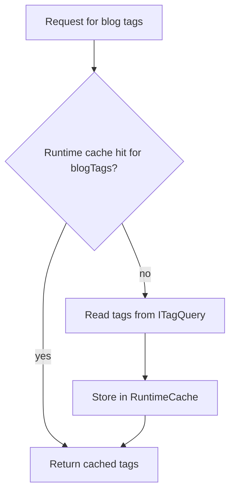
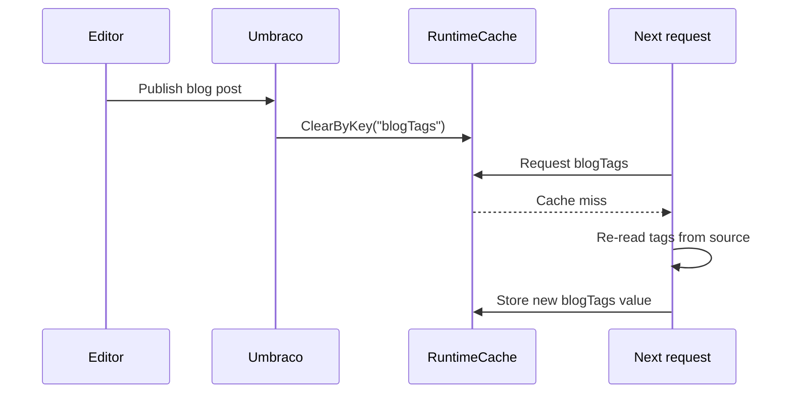
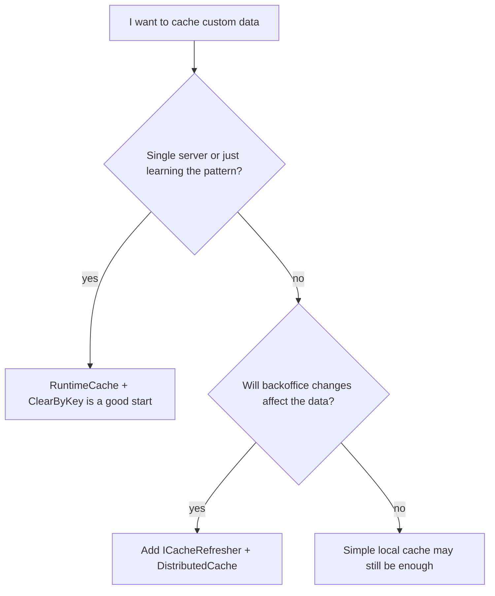

# 07. Small Local Cache Example with Tags

> **Start here.** This is the smallest possible cache pattern in Umbraco, not the full enterprise load-balanced story. You will learn the fill-and-bust loop in its purest form: cache something in `RuntimeCache`, then clear it by key when the content that affects it changes.

If the bigger cache chapters are the whole restaurant kitchen, this one is a single sticky note on the wall listing today's specials. You write it once, you wipe and rewrite it when the special changes, and everyone reads it in between. That is the entire idea, and it is the "hello world" of fill-and-bust.

## Why this example is useful

The bigger cache chapters can feel abstract, so this one strips the idea down to its bones. Pick a cache key, decide how to fill it, and decide when to bust it. That short loop is the basic muscle behind every bigger cache strategy.

> **Analogy — the sticky note.** Of all the stations in the kitchen, this is the simplest: a sticky note listing today's specials. You fill it once (fill by key), you wipe and rewrite it when the special changes (clear by key, refill on next request), and the rest of the time everyone just reads it. Master this and the fancier stations are only variations on the same move.

## The scenario from the docs

The docs use tag groups as the example:[^07-tags]

- one tag group called `default`
- one tag group called `blog`

The idea is:

- `default` tags are cached for one minute
- `blog` tags are cached until restart or manual removal
- publishing a `blogPost` clears the `blogTags` cache key

## The simple architecture

## The fill rule

The example uses:

- `AppCaches.RuntimeCache`
- `GetCacheItem(cacheKey, factory, timeout)`

So the cache fill logic becomes:

- if key exists, return cached value
- if key does not exist, fetch from `ITagQuery`
- store and return the result

## The bust rule

The example then adds a notification handler for:[^07-publish]

- `ContentPublishedNotification`

When a published entity has content type alias `blogPost`, it calls:

- `RuntimeCache.ClearByKey("blogTags")`

That means:

- publish blog post
- clear `blogTags`
- next request repopulates from source

## Why this pattern is good

For simple local caching, this is easy to reason about:

- one cache key
- one source
- one clear event

It is also easy to debug.

## Why this pattern is not enough on its own

> **Gotcha — one server only.** By itself this pattern is not the whole load-balanced story: it clears one server's sticky note, but says nothing about the others. Picture a chain of branches where every branch has its own note on its own wall. Wiping the note in one branch does nothing to the notes in the rest, so those still show the old special.

It clears a local runtime cache key, but it does not automatically describe how every other server should clear the same key. That makes it a great pattern for understanding local cache behaviour, but to be multi-server-safe it must be combined with the `ICacheRefresher` and `DistributedCache` model, which is exactly the head chef shouting "86 the salmon!" down the line so every branch wipes its note at once.

There is also a separate question hiding underneath it:

- if the problem is "remember this small computed result", `RuntimeCache` is a good fit
- if the problem is "find the right items across a large content set", Examine may be the better fit

See [12 - Examine, Indexes, and Cache-Adjacent Querying](./12-examine-indexes-and-cache-adjacent-querying.md).

## Good mental split

### Small local app cache

Use:

- `RuntimeCache`
- `GetCacheItem(...)`
- `ClearByKey(...)`

### Load-balanced-safe custom cache

Use:

- `RuntimeCache` for storage if appropriate
- plus `ICacheRefresher`
- plus `DistributedCache`

## Relation to the bigger book

This chapter is the "hello world" for cache busting.

The bigger chapters explain:

- how Umbraco core does this at scale
- how output cache uses tags and eviction handlers
- how Deploy changes the notification model
- how load balancing requires distributed invalidation

## Tiny decision chart

## Another useful connection: seed providers

This chapter is about a tiny local cache example.

The custom seed key provider example is the opposite scale:

- instead of waiting for a request
- Umbraco decides at startup which keys should already be warm

That means both patterns answer the same question from different angles:

- tags example: "what should happen on miss?"
- seed-provider example: "what should not miss in the first place?"

## In a nutshell

This tags example teaches the smallest useful cache-busting loop in Umbraco: fill by key, clear by key, refill on next request. It is the one sticky note on the wall — perfect on a single server and perfect for learning the move, but on its own it only wipes its own note, so a load-balanced setup still needs `ICacheRefresher` and `DistributedCache` to tell every branch at once.

### Three takeaways

- Local cache patterns stay useful, but they are only half the story in load-balanced setups.
- `RuntimeCache` is ideal when you already know the answer shape and just need to avoid recomputation.
- If backoffice actions can change your cached data, design the busting path first, then optimise cache hits.

### Where to go next

- [04 - Cache Busting and Invalidation](./04-cache-busting-and-invalidation.md) for the busting story in full.
- [03 - Published Cache and Load Balancing](./03-published-cache-and-load-balancing.md) for why multiple servers change everything.
- [12 - Examine, Indexes, and Cache-Adjacent Querying](./12-examine-indexes-and-cache-adjacent-querying.md) for when "search across content" beats "remember one result".

## Sources

- Docs:
  - [Cache tags example](https://docs.umbraco.com/umbraco-cms/extend-your-project/server-side-extensions/cache/examples/tags.md)
  - [Application cache](https://docs.umbraco.com/umbraco-cms/extend-your-project/server-side-extensions/cache/application-cache.md)
  - [Server-side cache extensions](https://docs.umbraco.com/umbraco-cms/extend-your-project/server-side-extensions/cache.md)

[^07-tags]: See [U10 in the appendix](./10-appendix-sources.md#u10-tags-example) and [U7](./10-appendix-sources.md#u7-application-cache-docs).
[^07-publish]: See [U10](./10-appendix-sources.md#u10-tags-example) and [U6](./10-appendix-sources.md#u6-server-side-extensions-cache-docs).
