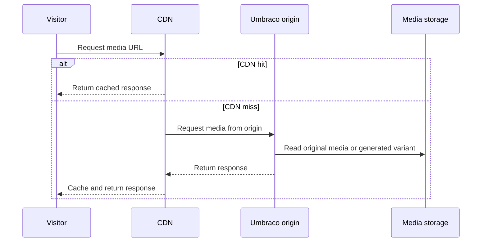
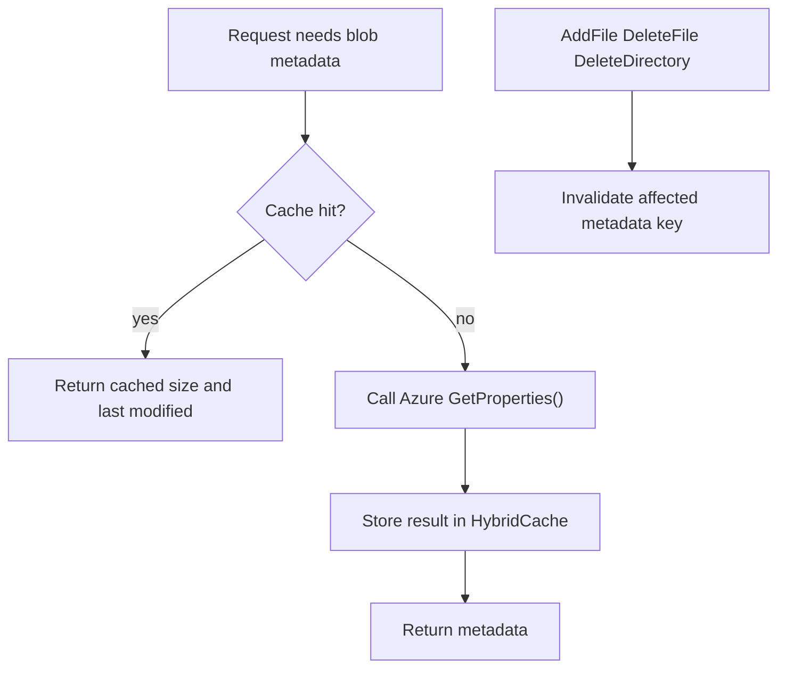
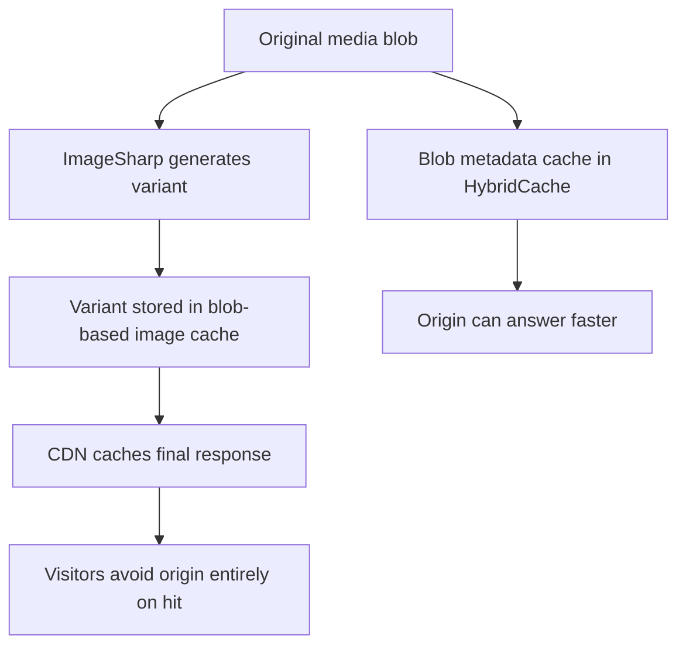

# 08. Storage Providers and Media Caching

> **Start here.** This chapter is about caching the media and files a site serves. That bottleneck differs from the published-content cache covered elsewhere in the book, and it lives in different layers. By the end you will know how `Umbraco.StorageProviders` connects Umbraco to media storage, CDN delivery, and blob-backed image caches, and why none of that is "content cache" in the usual sense.

This chapter is about a different side of caching. Most of this book focuses on the published content cache, cache refreshers, load balancing, and Deploy-related cache busting. `Umbraco.StorageProviders` is not mainly about any of those things — it is mainly about the caching and delivery story for media files.

This chapter focuses on media delivery performance rather than published-content retrieval. The same word "cache" appears in both places, but the moving parts are different.

## The short version

Storage Providers affect cache in three important ways:[^09-three]

1. they can put media behind a CDN
2. package-source notes describe Azure Blob metadata caching in `HybridCache`
3. they can move the ImageSharp image cache into Azure Blob Storage

So this is not "content cache" in the usual Umbraco sense — it is "media delivery cache".

## Why this matters

When a page renders an image, several different things may all need to be fast at once:

- finding the media URL
- checking blob metadata like file size or last modified time
- generating an image variant
- serving that variant repeatedly without recomputing it
- serving the result from a CDN edge instead of the origin server

Storage Providers plug into that whole path, and the three cache layers below each tackle a different link in the chain.

## The three cache layers

## 1. CDN media URL provider

The shared `Umbraco.StorageProviders` package includes a CDN media URL provider. Its job is not to cache media inside Umbraco memory; instead it generates media URLs that point at a CDN, so the CDN can cache the media response closer to visitors.

A CDN keeps frequently requested media near users at the edge, reducing repeated origin fetches.

That means:

- the cache lives mainly at the CDN edge
- media requests do not always need to hit the Umbraco origin
- repeated requests for the same image become much cheaper

For image-processing URLs, the CDN configuration should treat each unique URL, including its query string, as a distinct variant. Different query strings may mean different resized or cropped image outputs.

> **Gotcha — the query string counts.** If the CDN ignores the query string, it may serve a 200px thumbnail when the page asked for an 800px hero image. Each unique URL, including query string, must be treated as a distinct cache entry.

## CDN mental model

## 2. Azure Blob metadata caching

> **Evidence note.** The local Umbraco CMS source trees do not include the separate `Umbraco.StorageProviders` package source. The local docs confirm Azure Blob Storage for media and image caching; the `HybridCache`-backed metadata-cache details in this section should be treated as package-source or release-note evidence until that package source is added locally.

> **Key term — blob metadata cache.** The most obviously cache-related feature in the package: instead of asking Azure for a file's size and last-modified date on every request, Umbraco remembers them for a short while. It is the difference between glancing at a label already stuck to the box and walking to the fridge to weigh the item afresh every single time.

Package-source notes describe Azure Blob metadata caching for values such as file size and last modified time. The motivation is straightforward:

- the media file provider can otherwise call Azure `GetProperties()` on every request
- under load, retries and network delays can hold threads for a long time
- caching avoids those repeated round trips on the hot path

Those notes say this metadata caching uses Umbraco's shared `HybridCache`.[^09-hybrid] That is an interesting connection to the wider book, but it is not visible in the supplied CMS source trees.

## Why this is a good fit for `HybridCache`

Blob metadata is a nice example of the sort of data `HybridCache` handles well:

- small
- read often
- expensive enough to fetch remotely
- safe to keep briefly
- useful to protect from stampedes

The package-source notes also say this gets stampede protection, so concurrent cold requests for the same blob path share one fetch instead of all hitting Azure separately.

## Metadata cache behaviour

The package-source notes describe three especially important rules:

- metadata caching is enabled by default
- successful lookups have a hit duration
- not-found results have a shorter miss duration

That shorter miss duration is a clever touch: a "we don't have that file" answer is only trusted for a brief moment, which reduces the time a newly uploaded blob can stay invisible while the cache still insists it isn't there.

## Metadata cache busting

This is the important bit for our book. The provider notes say writes through the file system invalidate affected cache entries immediately, so operations like `AddFile`, `DeleteFile` and `DeleteDirectory` will bust the relevant metadata cache entries at once. The normal freshness story is therefore simple: the read path uses `HybridCache`, and the write path invalidates the affected key immediately.

The stale-data risk mainly comes from writes that happen *outside* the current instance, such as another process, another instance, or direct Azure SDK access. In those cases, nobody shouted the update through the local intercom, so the metadata may stay stale until the configured cache duration expires.

## Metadata cache flow

## 3. ImageSharp cache in Azure Blob Storage

The `Umbraco.StorageProviders.AzureBlob.ImageSharp` package adds ImageSharp support for storing the image cache in Azure Blob Storage. This changes where generated image variants live: instead of keeping the image cache only on local disk, you can store it centrally in blob storage.

Moving the ImageSharp cache into blob storage means generated variants can be reused across instances instead of being regenerated per node.

That matters because:

- generated image variants can be shared more easily across instances
- local disk becomes less important
- cloud hosting becomes simpler
- CDN caching of generated variants becomes more predictable

## Two different caches here

> **Gotcha — two different caches, easily muddled.** The blob metadata cache and the ImageSharp file cache sound similar but are not the same thing. One remembers the *label* on a file; the other stores the *file* itself. Keep them apart in your head and the rest of this chapter stays clear.

They differ on what they hold, where they live, and what they save you:

Blob metadata cache:

- small metadata values
- stored in `HybridCache`
- used to avoid repeated Azure property lookups

ImageSharp cache:

- actual generated image files
- stored in blob storage
- used to avoid regenerating image variants repeatedly

## Media caching stack

## How this differs from published content cache

This is worth stating plainly, because the two are easy to lump together under the single word "cache". Published content cache is about things like:

- content nodes
- routes
- navigation
- culture variants
- publish state

Storage Providers media caching is about:

- media URL delivery
- file metadata lookup
- generated image variants
- CDN edge responses

So both are "cache", but they solve very different bottlenecks — one keeps the *food* ready, the other keeps the *photos* of it loading fast.

## Where cache is created

For Storage Providers, cache is created in three quite different places:

- at the CDN edge for media responses
- in `HybridCache` for Azure blob metadata
- in blob storage for generated ImageSharp cache files

This is a good reminder that not all Umbraco-related caching lives in-memory inside the CMS process — some of it sits out at the edge, and some of it sits in the cloud.

## Where cache is busted

The most concrete busting rule we have from the package is this: writes through the Azure Blob file system invalidate the affected metadata cache entries immediately.[^09-bust]

For the other layers the story is looser. CDN cache busting depends on URL uniqueness, expiry, and CDN configuration, while ImageSharp cache freshness depends on how variants are addressed and stored. So the media side often relies more on key design, path design, query-string design, and remote cache expiry than on the classic Umbraco cache refresher pipeline.

## Practical lesson

If content caching is about "which published data is safe to serve?", then media caching is more about a different set of questions:

- "where does the file live?"
- "can we avoid remote metadata calls?"
- "have we already generated this image variant?"
- "can the CDN answer this without touching Umbraco?"

That is why Storage Providers deserves its own chapter.

## In a nutshell

`Umbraco.StorageProviders` connects Umbraco to media storage, CDN delivery, and blob-backed ImageSharp cache storage, making it a media-delivery caching story rather than a published-content caching story. Package-source notes also describe Azure blob metadata caching via `HybridCache`, but that implementation is outside the supplied CMS source trees. Pulling that apart:

- The CDN media URL provider pushes media responses out to the edge, so most requests never reach the Umbraco origin — just remember the query string is part of the cache key.
- Package-source notes say the Azure blob metadata cache keeps small values like file size and last-modified in `HybridCache`, with stampede protection and immediate invalidation on local writes.
- The ImageSharp blob cache stores generated image variants centrally, so instances share them instead of each regenerating from local disk.
- The blob metadata cache and the ImageSharp file cache are two different things: one caches the *label*, the other caches the *file*.

### Three takeaways

- This is a media-delivery bottleneck, distinct from the published-content cache the rest of the book covers.
- Not all Umbraco-related caching lives in the CMS process; here it sits at the CDN edge, in `HybridCache`, and in blob storage.
- Freshness on the media side leans on key, path, and query-string design plus remote expiry, more than on the classic cache refresher pipeline.

### Where to go next

- [Chapter 9: Future Hybrid Cache Architecture](./09-future-hybrid-cache-architecture.md) — more on the `HybridCache` model the package-source metadata-cache notes describe.
- [Chapter 10: NuCache vs Hybrid Cache](./10-nucache-vs-hybrid-cache.md) — how the published-content side compares.
- [Chapter 04: Cache Busting and Invalidation](./04-cache-busting-and-invalidation.md) — the refresher pipeline the media side deliberately sidesteps.

## Sources

- Docs:
  - [Umbraco Storage Providers](https://docs.umbraco.com/marketplace-and-integrations/packages/storage-providers)
- Source:
  - [Umbraco.StorageProviders on GitHub](https://github.com/umbraco/Umbraco.StorageProviders)

[^09-three]: See [U14 in the appendix](./14-appendix-sources.md#u14-storage-providers-docs) and [S1](./14-appendix-sources.md#s1-umbracostorageproviders-repository).
[^09-hybrid]: See [S1](./14-appendix-sources.md#s1-umbracostorageproviders-repository) and [M2](./14-appendix-sources.md#m2-aspnet-core-hybridcache).
[^09-bust]: See [S1](./14-appendix-sources.md#s1-umbracostorageproviders-repository).
