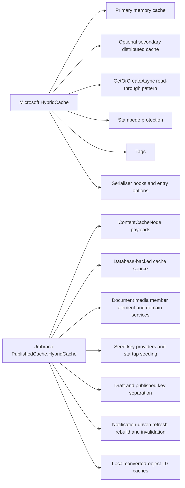
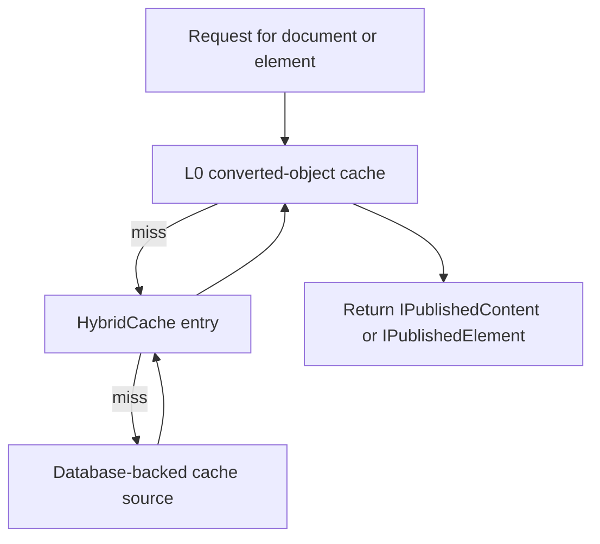
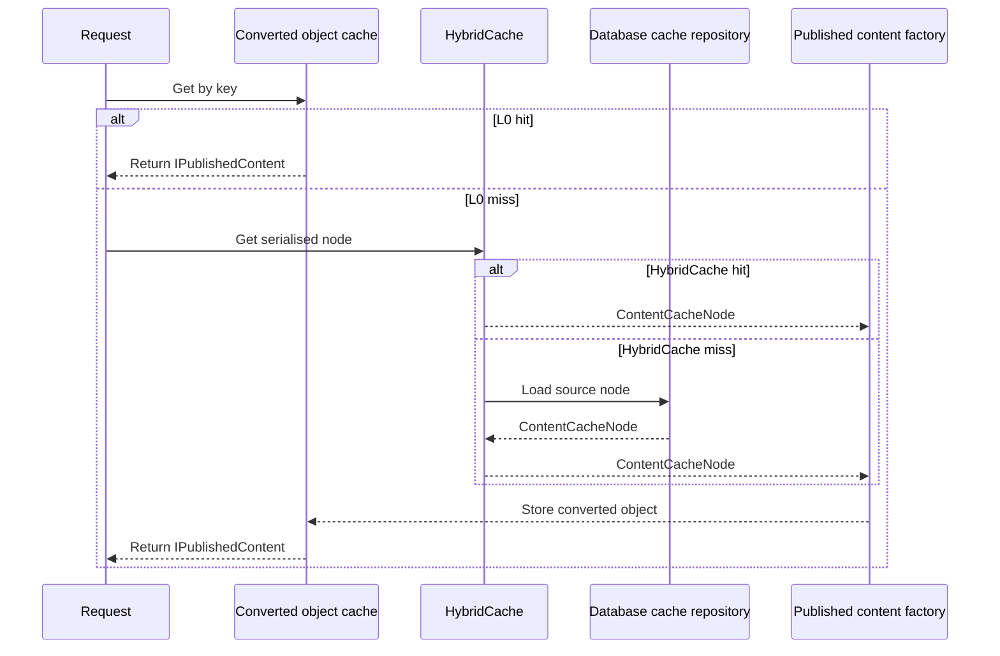
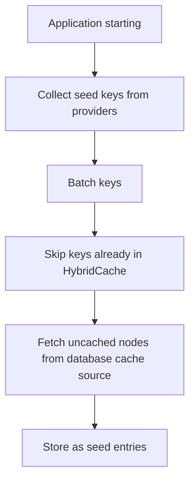
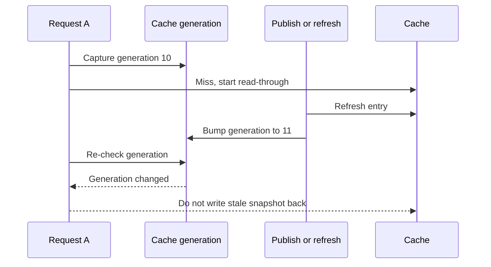
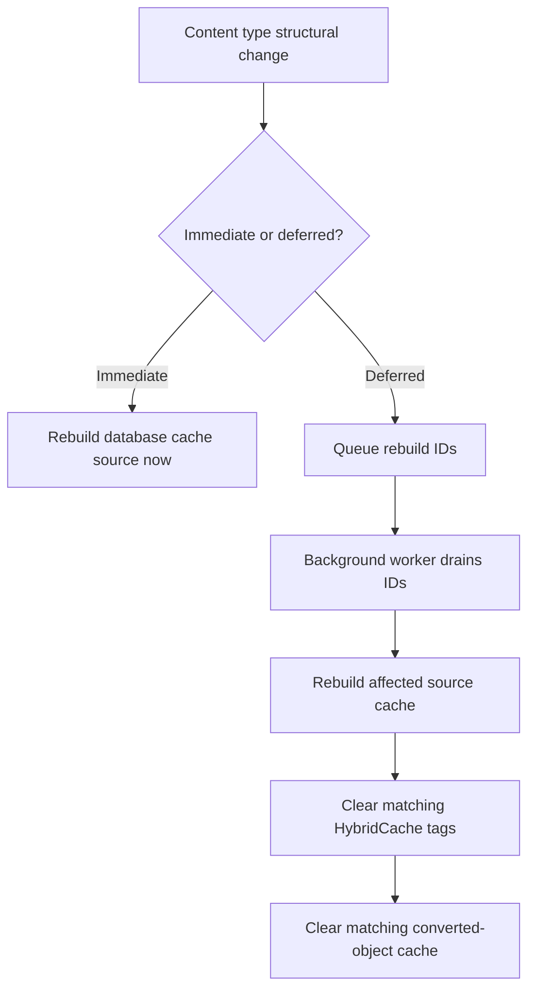

# 09. Future Hybrid Cache Architecture

> **Start here.** This is the deep architecture chapter. The future Hybrid Cache is not one bucket of cached objects — it is a layered pipeline that stages published content through a tiny hot cache, serialised entries, and a database-backed source, with notification-driven refresh, rebuild, and seeding on top. By the end you will be able to trace a request through every layer and understand why each one exists.

This chapter is one of the main pillars of the book.

It is based on the current `main` branch implementation in:

- `src/Umbraco.PublishedCache.HybridCache`

That matters because this is where we can see the cache model becoming more explicit and more ambitious than the earlier "HybridCache plus a few settings" story.

## The most important idea

The future Hybrid Cache is not one cache.

It is a layered published-content system with at least four different responsibilities:

1. a tiny local hot cache of already converted published objects
2. serialised `HybridCache` entries
3. a database-backed source cache
4. notification-driven refresh, rebuild, and seeding workflows

That is why it is worth studying as a system, not just as a library call.

## Start with Microsoft

Before we talk about Umbraco, we should be clear about the base layer.

Microsoft's official `HybridCache` is the cache primitive Umbraco is building on.[^10-msbase]

From the broader Microsoft caching guidance, the relevant stack is:

- `IMemoryCache`
- `IDistributedCache`
- `HybridCache`

For Umbraco, the important point is not to memorise every Microsoft cache API.

It is to understand that `HybridCache` is Microsoft's higher-level cache layer that sits above plain memory caching and raw distributed-cache storage.

From Microsoft's official docs and blog, `HybridCache` provides:

- a unified API for in-memory and distributed caching
- primary local caching plus optional secondary distributed caching
- stampede protection
- configurable serialisation
- tag-based invalidation
- configurable entry options for overall and local cache duration

So for this book, Microsoft is not just background context.

Microsoft is a primary source for understanding the base engine.

## What is relevant for Umbraco, and what is not

Not every Microsoft caching detail matters equally for this book.

The Microsoft topics most relevant to Umbraco are:[^10-relevant]

- the difference between plain memory cache and hybrid cache
- the optional secondary distributed cache layer
- stampede protection
- tag-based invalidation
- entry durations for local and remote layers
- serialiser hooks

The less relevant topics for this book are:

- generic one-off examples unrelated to published content
- caching patterns that do not interact with Umbraco's published-content pipeline
- broad .NET caching guidance that never changes how Umbraco actually behaves

So when we use Microsoft sources, we should keep filtering them through one question:

> "Does this help explain Umbraco's actual cache behaviour?"

## What comes from Microsoft, and what Umbraco adds

## Microsoft HybridCache in one sentence

Microsoft `HybridCache` is the engine.

Umbraco's Hybrid Cache module is the published-content system built around that engine.[^10-umbracoblog]

## The four layers

## Why this is more than "memory plus Redis"

When people hear `HybridCache`, they often imagine:

- local memory
- remote cache

That is true, but incomplete.

In Umbraco's future model, Hybrid Cache also sits between:

- a high-speed cache of already materialised published objects
- and a database cache repository that stores serialised published data ready for read-through loading

So the architecture is really:

- L0 converted objects
- L1 and optional L2 inside `HybridCache`
- database-backed cache source

The Microsoft layer mainly gives Umbraco the middle line.

Umbraco adds the top and bottom lines.

That is also why Umbraco's own `DistributedCache` should not be confused with Microsoft's distributed cache layer.

- Microsoft distributed cache is about shared cache storage
- Umbraco distributed cache is about telling servers what to refresh or remove

Umbraco can use Microsoft's distributed storage layer underneath `HybridCache`, while still using its own distributed invalidation layer for correctness across servers.

## The caches Umbraco registers

The `AddUmbracoHybridCache()` builder method registers first-class caches for:[^10-registers]

- documents
- media
- members
- elements
- domains

It also wires in:

- cache seeding
- notification handlers
- rebuild services
- serialiser selection
- database cache rebuild logic

That is a strong sign that this is the future centre of the published-cache subsystem, not a side experiment.

## The local L0 hot cache

One of the most important implementation details is easy to miss. `DocumentCacheService` and `ElementCacheService` both keep a local converted-object cache:[^10-l0]

- `ConvertedPublishedContentCache<string, IPublishedContent>`
- `ConvertedPublishedContentCache<string, IPublishedElement>`

This is not just another generic cache layer; it is a very deliberate optimisation for the render hot path. The idea is that serialised cache nodes are good for broad storage, but once an `IPublishedContent` or `IPublishedElement` has already been built, returning it straight from an in-process dictionary is cheaper still. So the future model is not only about remote caching — it is also about keeping already materialised objects in a tiny fast lane.

> **Key term — L0 converted-object cache.** The plated-and-ready shelf. Every other layer stores content *serialised*, which means it must be deserialised and turned into a live `IPublishedContent` before your template can use it. L0 skips that work entirely by holding the finished objects in memory. It is the closest, cheapest hit in the whole pipeline — and the first thing every request tries.

## Request flow for a document

The document lookup path is roughly:

1. decide preview or published mode
2. try the L0 converted-object cache
3. try `HybridCache`
4. on miss, read from `DatabaseCacheRepository`
5. if safe, write the serialised node into `HybridCache`
6. convert it into `IPublishedContent`
7. store the converted object in the L0 cache

> **Analogy — the fully modernised kitchen.** Picture the whole thing as a restaurant kitchen at the top of its game. The nearest shelf holds dishes that are already plated and ready to serve: that is the L0 converted-object cache. Behind it sit prepped ingredients, portioned and labelled — the `HybridCache` L1, with an optional shared store (L2) for the whole chain. Further back is the walk-in fridge, and it has a dedicated section of pre-prepped cache rather than raw ingredients — the database-backed source. You almost never start a plate from scratch. And the head chef keeps a clipboard with a running order number so that a slow, stale order can never overwrite a freshly updated plate. Hold on to that kitchen; the rest of the chapter walks through each station in turn.

## Preview and published are deliberately separate

The code keeps separate cache keys for preview and published entries.

The key format is effectively:

- published: `guid`
- preview: `guid+draft`

That matters because draft and published payloads are not the same thing.

This is a nice example of correctness beating simplistic cache-sharing.

## The database-backed cache source

This is one of the most important pieces in the future design. `DatabaseCacheRepository` stores and reads serialised content data from the database cache table, so on a miss Umbraco is usually not rebuilding everything from the full content graph in real time. Instead, it reads from a prepared database-backed cache source and then repopulates the in-memory layers. This is the walk-in fridge's dedicated prepped section: you reach past it to the raw ingredients only when you truly must.

This is a huge clue for the book:

- Hybrid Cache is not "database or cache"
- it is "database cache source feeding runtime caches"

## Why serialiser choice matters

The future Hybrid Cache is built around serialised cache nodes.

The module registers a custom `HybridCacheSerializer` using:

- MessagePack
- LZ4 compression

That matters for two reasons:

1. payload size matters a lot in Umbraco
2. the database cache format can become incompatible when serialiser strategy changes

The startup handler even checks whether the configured serialiser changed and can rebuild the database cache when needed.[^10-serialiser]

So serialisation is not just an implementation detail — it is part of cache correctness. This also maps neatly onto the Microsoft design: Microsoft provides the serialiser hook, and Umbraco chooses a payload format better suited to published content by using MessagePack and LZ4 for `ContentCacheNode`.

## Seeding is first-class, not an afterthought

The future model treats seeding as a normal startup workflow.

At application start, Umbraco can seed:

- documents
- media
- elements

using seed-key providers such as:

- breadth-first providers
- content-type providers

The key idea is simple:

- not everything needs to start hot
- but some things should start hot on purpose

## Seeding flow

## Seed entries and normal entries have different durations

This is a subtle but important detail.

The code gives seeded entries their own cache durations.

That means Umbraco can say:

- "this key is intentionally hot"
- "keep it around longer"

without forcing the same lifetime onto every other entry.

That is much more deliberate than the older all-content-hot mental model.

## Cache busting in the future model

This is the part your book especially cares about.

The future Hybrid Cache has several different busting paths.

### 1. Per-item refresh

When content, media, or elements refresh:

- the database cache source is updated
- draft and published entries are updated or removed as needed
- the converted-object cache is cleared for the affected key

### 2. Tag-based invalidation

Cache entries are tagged, for example by:[^10-tags]

- broad content or element tags
- content type or element type tags

That allows bulk invalidation such as:

- clear all document entries
- clear all element entries
- clear everything for a changed content type

### 3. Full memory clear and reseed

Some operations clear a whole area of cache and then seed again.

### 4. Rebuild after structural changes

Content type and media type structural changes can require rebuilding the database cache source and then clearing the matching runtime layers.

## Tag-based invalidation is a big deal

The code uses cache tags to avoid overly blunt invalidation.

For example:

- documents always carry a broad content tag
- document entries can also carry `ct:{contentTypeId}`
- elements always carry a broad element tag
- element entries can also carry `et:{elementTypeId}`

That means cache busting can be:

- broad when needed
- selective when possible

This is one of the biggest reasons the future model deserves to be called smarter rather than merely newer.

It is also one of the clearest examples of the split between Microsoft and Umbraco.

Microsoft provides the tag mechanism.

Umbraco decides what those tags mean in content terms:

- all documents
- all elements
- specific content types
- specific element types

## Negative-cache entries are treated carefully

> **Gotcha — even "not found" must expire.** There is a lovely correctness detail here: Umbraco tags its null entries too. If it caches "not found" and later clears by tag, those negative-cache entries have to be evicted as well — otherwise "not found" becomes permanently stale. In the kitchen this is the "we're OUT of the salmon" note taped to the pass: the moment the salmon is back, someone has to remember to tear that note down, or the kitchen keeps turning away orders it could now fill. That is the sort of edge-case engineering that makes the architecture trustworthy.

## The stale-set clobber problem

This is one of the most interesting implementation details in the whole module. `DocumentCacheService` and `ElementCacheService` keep a monotonic cache-generation counter.[^10-generation] Why? Because a request can start reading old data just before a concurrent publish or refresh updates the cache, and without protection that older in-flight read could finish later and write stale data back over the fresher entry.

The generation counter prevents exactly that. If the generation changed while the request was doing its read-through work:

- the read result is still returned to that request
- but it is not written back into the cache

That is an excellent example of a subtle bug being solved at the architecture level.

> **Key term — the generation counter.** This is the head chef's clipboard with a running order number. When a request starts a slow read-through, it notes the current number. Meanwhile a publish comes in, updates the plate, and ticks the number up. When the slow request finally returns, it re-checks the clipboard, sees the number has moved, and quietly declines to slap its now-stale plate back on the shelf. The diner still gets served, but the fresher plate is never clobbered.

## Stale-set protection

## Structural vs non-structural content-type changes

Another major improvement is that the code treats content-type changes more intelligently.

For non-structural changes such as:

- name
- icon
- description

Umbraco can often keep the serialised cache entries and just clear converted content.

For structural changes such as:

- removed properties
- alias changes
- variation changes

Umbraco rebuilds the deeper cache source.

That is a much more precise model than "content type changed, clear everything".

## Immediate vs deferred rebuild

The future model supports deferred rebuild for structural type changes. Why defer? Because rebuilding inside the original save transaction can create lock contention — the editor's save waits on a heavy rebuild that has no business blocking it. So instead the code can queue the affected IDs, deduplicate them, rebuild in the background, and only then clear the matching runtime caches.

This is a very pragmatic trade-off: correctness still matters, but so do availability and responsiveness.

> **Tip — deferred means the line keeps moving.** Immediate rebuild is re-prepping a changed menu item right now, in the middle of service, with everyone else waiting. Deferred rebuild hands that job to a background worker so the line keeps moving, then swaps the new prep in when it is ready. If a structural content-type change ever feels like it "took a moment to fully apply", this is usually why — and it is a feature, not a lag.

## Rebuild flow

## Serializer change can trigger full database cache rebuild

One more future-facing detail matters a lot.

If the configured serialiser changes, Umbraco can rebuild the whole database cache source at startup.

That tells us something important:

- the database-backed cache source is a real cache artefact with a format contract
- changing that format is a rebuild event, not a tiny setting tweak

## Why this changes performance advice

The old mental model encouraged people to assume lots of content was already hot.

The future Hybrid Cache still gives you hot paths, but it rewards more discipline:

- seed deliberately
- avoid broad traversal when a query would do
- avoid repeated lazy graph walking
- understand which layer you are actually hitting

In other words:

- startup gets lighter
- memory use gets lower
- but poor query habits become easier to feel

## What Microsoft's docs explain well

Microsoft's Learn documentation is especially useful for the generic behaviour:[^10-msdocs]

- how primary and secondary caches interact
- how `GetOrCreateAsync` works
- how stampede protection combines concurrent misses for one key
- how serialisers and tags are configured

The wider Microsoft caching page is also useful for one framing idea:

- `HybridCache` is the modern higher-level cache option
- `IMemoryCache` and `IDistributedCache` are the lower-level building blocks beneath it

Umbraco source is then the best place to learn the content-specific behaviour:

- which keys are cached
- how seed keys are chosen
- how content-type rebuilds work
- how draft and published entries differ
- how cache busting is mapped onto content notifications

## In a nutshell

The future Hybrid Cache combines a database-backed cache source, serialised `HybridCache` entries, local converted-object hot caches, seeding, tagging, and notification-driven rebuild logic into a much more deliberate published-data pipeline than the old all-hot mental model.

Two sentences carry the whole chapter:

> Umbraco's future Hybrid Cache is a staged delivery pipeline for published data, not a single bucket of cached objects.

> Microsoft built the cache engine; Umbraco built a published-content pipeline around it.

The layers, from nearest to furthest:

- **L0** — the plated-and-ready shelf of converted `IPublishedContent` objects, tried first.
- **`HybridCache` L1 (+ optional L2)** — prepped, serialised nodes in memory and optionally in a shared store.
- **Database-backed source** — the fridge's dedicated prepped section that feeds the runtime caches on a miss.
- **Notifications** — the refresh, tag-based invalidation, generation counter, seeding, and rebuild workflows that keep it all correct.

### Three takeaways

- **It is a pipeline, not a bucket.** A request falls through L0, then `HybridCache`, then the database source — and correctness (draft/published keys, negative-entry tags, the generation counter) is baked into each step.
- **Tags and the generation counter make it smarter, not just newer.** Cache busting can be broad or surgical, and a slow, stale read can never clobber a freshly published plate.
- **Discipline is rewarded.** Startup gets lighter and memory use lower, but you seed on purpose and pay for sloppy query habits — so know which layer you are actually hitting.

### Where to go next

- [12. NuCache vs Hybrid Cache](./11-nucache-vs-hybrid-cache.md) — how this future model differs from the cache it replaces.
- [15. Reading the cache code](./14-reading-the-cache-code.md) — trace `DocumentCacheService` and friends in the source yourself.
- [04. Cache busting and invalidation](./04-cache-busting-and-invalidation.md) — the invalidation story this chapter builds on.

## Sources

- Microsoft:
  - [Caching in .NET](https://learn.microsoft.com/en-us/dotnet/core/extensions/caching)
  - [HybridCache in ASP.NET Core](https://learn.microsoft.com/en-us/aspnet/core/performance/caching/hybrid?view=aspnetcore-10.0)
  - [Caching overview in ASP.NET Core](https://learn.microsoft.com/en-us/aspnet/core/performance/caching/overview?view=aspnetcore-10.0)
  - [HybridCache is now GA (blog post)](https://devblogs.microsoft.com/dotnet/hybrid-cache-is-now-ga/)
  - [HybridCacheEntryOptions API](https://learn.microsoft.com/en-us/dotnet/api/microsoft.extensions.caching.hybrid.hybridcacheentryoptions?view=net-11.0-pp)
  - [HybridCacheOptions API](https://learn.microsoft.com/en-us/dotnet/api/microsoft.extensions.caching.hybrid.hybridcacheoptions?view=net-11.0-pp)
- Code:
  - `umbraco-main/src/Umbraco.PublishedCache.HybridCache/DependencyInjection/UmbracoBuilderExtensions.cs`
  - `umbraco-main/src/Umbraco.PublishedCache.HybridCache/Services/DocumentCacheService.cs`
  - `umbraco-main/src/Umbraco.PublishedCache.HybridCache/Services/ElementCacheService.cs`
  - `umbraco-main/src/Umbraco.PublishedCache.HybridCache/NotificationHandlers/CacheRefreshingNotificationHandler.cs`
  - `umbraco-main/src/Umbraco.PublishedCache.HybridCache/NotificationHandlers/DeferredCacheRebuildNotificationHandler.cs`
  - `umbraco-main/src/Umbraco.PublishedCache.HybridCache/Services/DeferredCacheRebuildService.cs`
  - `umbraco-main/src/Umbraco.PublishedCache.HybridCache/DatabaseCacheRebuilder.cs`
  - `umbraco-main/src/Umbraco.PublishedCache.HybridCache/Serialization/HybridCacheSerializer.cs`
  - `umbraco-main/src/Umbraco.PublishedCache.HybridCache/Persistence/DatabaseCacheRepository.cs`

[^10-msbase]: See [M1](./10-appendix-sources.md#m1-caching-in-net), [M2](./10-appendix-sources.md#m2-aspnet-core-hybridcache), and [M4](./10-appendix-sources.md#m4-hybrid-cache-is-now-ga).
[^10-relevant]: See [M1](./10-appendix-sources.md#m1-caching-in-net), [M2](./10-appendix-sources.md#m2-aspnet-core-hybridcache), [M5](./10-appendix-sources.md#m5-hybridcacheentryoptions), and [M6](./10-appendix-sources.md#m6-hybridcacheoptions).
[^10-registers]: See [C4](./10-appendix-sources.md#c4-umbracopublishedcachehybridcache-on-main) and [C5](./10-appendix-sources.md#c5-claudemd-for-umbracopublishedcachehybridcache).
[^10-l0]: See [C4](./10-appendix-sources.md#c4-umbracopublishedcachehybridcache-on-main).
[^10-serialiser]: See [C4](./10-appendix-sources.md#c4-umbracopublishedcachehybridcache-on-main), [M2](./10-appendix-sources.md#m2-aspnet-core-hybridcache), and [M6](./10-appendix-sources.md#m6-hybridcacheoptions).
[^10-tags]: See [M2](./10-appendix-sources.md#m2-aspnet-core-hybridcache), [M4](./10-appendix-sources.md#m4-hybrid-cache-is-now-ga), and [C4](./10-appendix-sources.md#c4-umbracopublishedcachehybridcache-on-main).
[^10-generation]: See [C4](./10-appendix-sources.md#c4-umbracopublishedcachehybridcache-on-main).
[^10-msdocs]: See [M1](./10-appendix-sources.md#m1-caching-in-net), [M2](./10-appendix-sources.md#m2-aspnet-core-hybridcache), and [M3](./10-appendix-sources.md#m3-aspnet-core-caching-overview).
[^10-umbracoblog]: See [B1](./10-appendix-sources.md#b1-umbraco-15-release), [B2](./10-appendix-sources.md#b2-umbraco-15-release-candidate), [B3](./10-appendix-sources.md#b3-umbraco-17-beta-is-out), and [B6](./10-appendix-sources.md#b6-umbraco-product-update---q1-2025).
