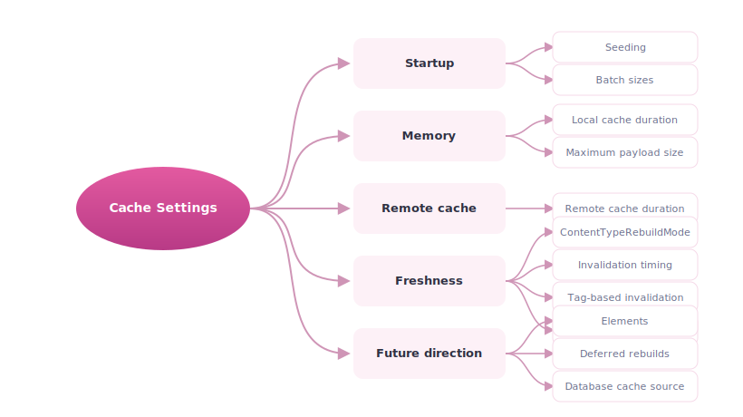
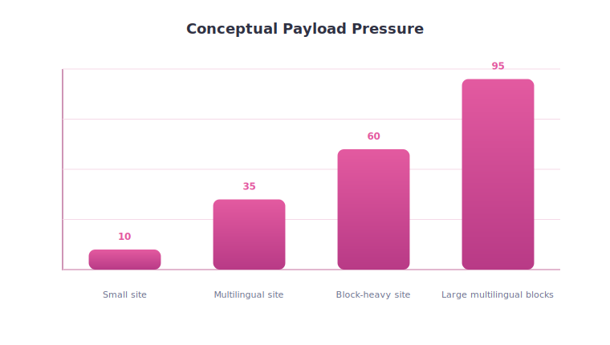
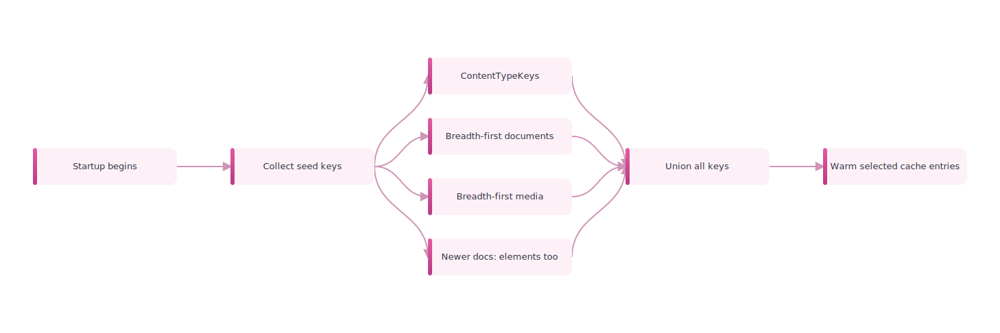
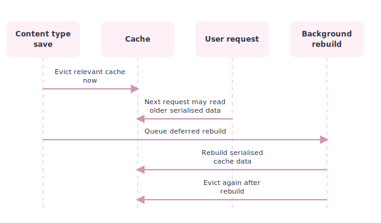
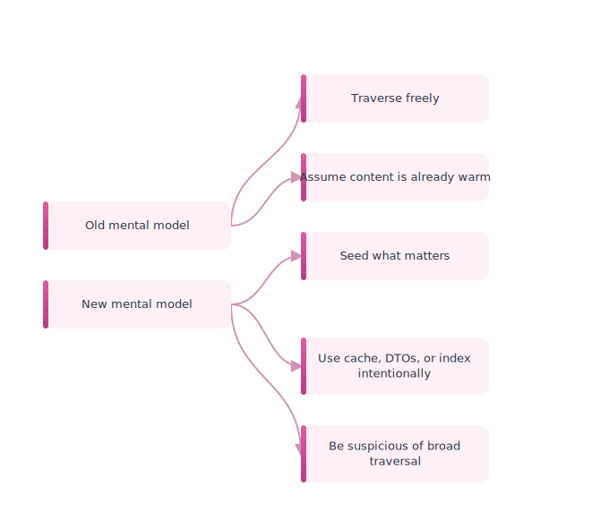
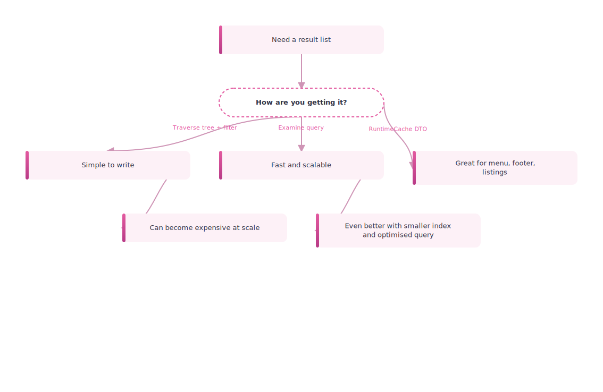
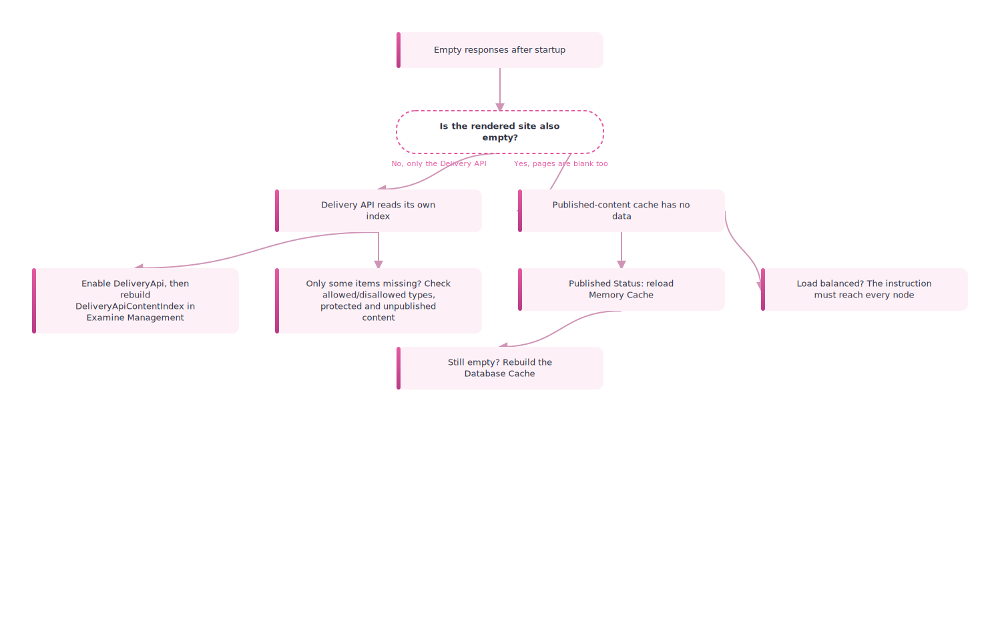
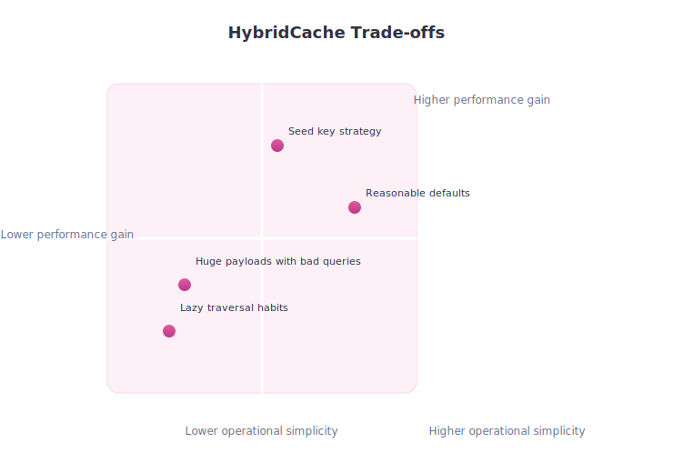

# 11. Cache Settings, Talks, and Field Notes

> **Start here.** This chapter is the control panel: the settings, talks, and field notes that explain not just what Umbraco caching does but why it does it that way. Once you have seen the earlier mechanics, these are the settings you actually tune. You will leave knowing which options control prewarming, payload limits, entry lifetimes, and content-type rebuild timing.

This chapter maps the most important cache settings to real operational outcomes: startup cost, memory pressure, cache lifetime, and rebuild behaviour.

This chapter gathers the settings and supporting material that help explain not just what Umbraco does, but why it does it that way.

> **Tuning the read model's cache.** Most of the settings here govern how the published cache builds and holds `IPublishedContent` ([Chapter 2 - The Published Object](./02-the-published-object.md)): prewarming it (seeding), bounding its payload size, and timing its rebuilds.

## Why this chapter exists

Three sources each tell a different part of the story. The code tells us how the cache behaves, and the docs tell us how to configure it, but neither quite explains the pressure that shaped the new design. For that, the talk, PDF, and product posts are invaluable, because they name the problems the team was trying to solve:[^06-talks]

- too much startup memory
- too much warm-up cost
- too much assumption that all content should stay hot

The newer `main` branch code also reveals more of the actual mechanics behind those pressures:

- a local converted-object hot cache
- serialised `HybridCache` entries
- a database-backed cache source
- tag-based invalidation
- deferred rebuild workflows
- generation guards against stale write-back

## One-picture summary

<div class="pdf-keep-together" style="break-inside: avoid; page-break-inside: avoid; -webkit-column-break-inside: avoid; margin: 1rem 0;">



</div>

## Two cache-settings pages matter

### The versioned Umbraco 17 page

Use this as the safest reference for confirmed v17 behaviour:

- [Umbraco 17.latest cache settings](https://docs.umbraco.com/umbraco-cms/17.latest/develop-with-umbraco/configuration/cache-settings.md)

### The newer unversioned page

Use this as a signal for where the platform is moving:

- [Current cache settings page](https://docs.umbraco.com/umbraco-cms/develop-with-umbraco/configuration/cache-settings.md)

It includes newer element-related settings that go beyond the earlier v17-focused page.

## Cache settings reference

Here is the quick "what does this dial actually touch?" reference. Some names still say `NuCache`; in Umbraco 17 and newer these settings feed the Hybrid Cache implementation rather than selecting the old NuCache engine.[^06-settings-reference]

| Setting or option | Layer | What it changes | Beginner caution |
| --- | --- | --- | --- |
| `HybridCacheOptions.MaximumPayloadBytes` | Microsoft `HybridCache`, as configured by Umbraco | Maximum size of one serialised cache entry; Umbraco raises the generic Microsoft default to 100 MB | If large pages appear not to cache, check this before blaming invalidation |
| `Umbraco:CMS:NuCache:NuCacheSerializerType` | Published-content Hybrid Cache | Chooses the serialiser used for database-backed cache payloads, commonly MessagePack | Old name, real effect; it is not a switch back to NuCache |
| `Umbraco:CMS:NuCache:SqlPageSize` | Database-backed cache source | Controls how many rows are read per SQL page during cache-source work | Bigger batches are not always better; they can increase database pressure |
| `Umbraco:CMS:NuCache:UsePagedSqlQuery` | Database-backed cache source | Chooses paged SQL query behaviour for large cache-source reads | Mostly a scale knob; leave it alone unless you are investigating large-tree behaviour |
| `ContentTypeRebuildMode` | Hybrid Cache rebuild flow | Controls whether content-type structural changes rebuild immediately or defer work | `Deferred` can briefly serve old structures while the background rebuild catches up |
| `ContentTypeKeys` | Seeding | Seeds selected content and element types during startup | Useful for hot paths; wasteful if you seed everything without intent |
| `DocumentBreadthFirstSeedCount` | Seeding | Warms the first N documents using breadth-first traversal | Good for shallow top-level navigation; less useful for deep long-tail content |
| `MediaBreadthFirstSeedCount` | Seeding | Warms the first N media items using breadth-first traversal | Can help media-heavy sites, but still costs startup work |
| `ElementBreadthFirstSeedCount` | Newer seeding docs | Warms element cache entries in newer Hybrid Cache builds | Treat as a newer-direction setting when comparing v17 with later docs |
| `DocumentSeedBatchSize` | Seeding | Controls document seed processing batch size | Tunes startup pressure, not request-time correctness |
| `MediaSeedBatchSize` | Seeding | Controls media seed processing batch size | Same trade-off: warmer startup versus more upfront work |
| `ElementSeedBatchSize` | Newer seeding docs | Controls element seed processing batch size | Relevant when element seeding is available |
| `LocalCacheDuration` | Local Hybrid Cache entry lifetime | Controls how long local entries stay warm | Duration does not replace invalidation; publishes still bust stale entries |
| `RemoteCacheDuration` | Remote/distributed cache lifetime | Controls how long remote cache entries can live | Longer remote lifetime improves reuse but increases reliance on correct invalidation |
| `SeedCacheDuration` | Seeded entries | Controls how long pre-warmed entries live | Seed what matters first; duration is the second question |
| `Umbraco:CMS:Website:OutputCache:Enabled` | Website output cache | Turns website HTML output caching on or off | Output caching is opt-in and needs a busting story |
| `Umbraco:CMS:Website:OutputCache:ContentDuration` | Website output cache | Default duration for cached website responses | A longer duration without correct tag eviction is how stale pages become visible |

## The settings that matter most

### `HybridCacheOptions.MaximumPayloadBytes`

> **Key term — `MaximumPayloadBytes`.** This is the cap on how large a single serialised cache entry may be. If an entry is larger than this limit, it is not stored. Microsoft's base `HybridCache` sets this default to 1 MB, but Umbraco overrides it to 100 MB.[^06-payload]

That hundredfold jump is not arbitrary. Multilingual payloads and block editors both grow fast, and a realistic Umbraco page tree can exceed generic defaults surprisingly quickly, so the modest 1 MB ceiling would silently drop exactly the rich pages you most want cached.

It is also a tidy example of Microsoft versus Umbraco responsibilities. Microsoft exposes `MaximumPayloadBytes` as a base `HybridCache` option; Umbraco raises it because real published-content payloads are much larger than the generic default expects. The `main` branch code makes the reason even clearer: entries are serialised `ContentCacheNode` payloads that may carry a lot of culture, property, and nested data. Compression helps, but realistic sites still produce large objects.

<div class="pdf-keep-together" style="break-inside: avoid; page-break-inside: avoid; -webkit-column-break-inside: avoid; margin: 1rem 0;">



</div>

## Seeding settings

These decide which content is loaded into cache on startup rather than fetched on first request. Important settings include:

- `ContentTypeKeys`
- `DocumentBreadthFirstSeedCount`
- `MediaBreadthFirstSeedCount`

And in newer docs:

- `ElementBreadthFirstSeedCount`

<div class="pdf-keep-together" style="break-inside: avoid; page-break-inside: avoid; -webkit-column-break-inside: avoid; margin: 1rem 0;">



</div>

## Seed batch sizes

These control how seed keys are processed during startup.

- `DocumentSeedBatchSize`
- `MediaSeedBatchSize`

And in newer docs:

- `ElementSeedBatchSize`

These are more than raw performance knobs. Because they govern how seed keys are fed through in chunks, they shape the startup profile itself: how much database pressure the warm-up creates, and how quickly a freshly restarted node becomes warm again.

## Cache entry durations

These settings control how long entries stay cached before they are considered stale and must be fetched fresh.

### `LocalCacheDuration`

How long entries stay in local memory on this node.

### `RemoteCacheDuration`

How long entries stay in a configured second-level cache. This one only matters if a remote cache actually exists.

### `SeedCacheDuration`

How long seeded entries stay cached, which is especially relevant for the deliberately hot content you never want to go cold: home pages, key landing pages, and frequently reused media.

> **Going deeper — seeded entries are special twice over.** The code makes an architectural point worth pausing on. Seeded entries are not only loaded first; they can also be given a deliberately different lifetime from ordinary entries.

## Newer element settings

The newer docs show the cache model becoming more explicit for elements:

- `ContentTypeKeys` now describes document types and element types
- entry durations are described for `Element`
- seeding counts and batch sizes are described for `Element`

This matches what we saw in the 18.0.2 code.

## `ContentTypeRebuildMode`

This is one of the most revealing settings in the whole file, because it exposes a genuine invalidation trade-off rather than a simple on/off switch. It has two values:[^06-rebuildmode]

- `Immediate`
- `Deferred`

With `Deferred`, the cache is still evicted immediately, but old serialised data may be served for a short while afterwards. A background rebuild finishes later, and the cache is evicted a second time once that rebuild completes. It is the difference between reprinting every menu the instant a dish changes and quietly reprinting them between orders while the old ones stay in use.

> **Going deeper — correct busting without instant freshness.** `Deferred` is a lovely demonstration that cache busting can be correct even when freshness is not perfectly immediate. Nobody is served wrong data forever; they may briefly be served slightly stale data, and the system guarantees a clean state once the rebuild lands. That distinction — eventually correct versus instantly correct — is at the heart of most cache design.

The `main` branch code also shows how this works operationally:

- structural content-type changes can be queued
- IDs are deduplicated
- a background worker rebuilds the database cache source
- matching `HybridCache` tags are removed
- matching converted-object caches are cleared

<div class="pdf-keep-together" style="break-inside: avoid; page-break-inside: avoid; -webkit-column-break-inside: avoid; margin: 1rem 0;">



</div>

## Old `NuCache` settings that still linger

Some settings still live under:

- `Umbraco:CMS:NuCache`

Examples:

- `UsePagedSqlQuery`
- `SqlPageSize`
- `NuCacheSerializerType`

These exist mostly for backward-compatibility reasons.

> **Gotcha — old names, new engine.** Seeing `NuCache` keys in your configuration does not mean you are running the old system. The modern implementation is HybridCache-based, but not every old configuration name disappeared overnight, so a lingering key is a leftover label rather than a live gear.

For a clearer separation between the old architecture and the newer one, see [08 - NuCache vs Hybrid Cache](./08-nucache-vs-hybrid-cache.md). The deeper point is that the current architecture is no longer "just old NuCache with a new wrapper": it is a layered pipeline with explicit seeding, serialisation, rebuilding, and cache tagging, even if a few of the old names survive on the surface.

## Microsoft-first takeaway

The future Hybrid Cache story is easiest to understand in two layers:

1. Microsoft defines the generic cache primitive.
2. Umbraco defines the published-content system built on top of it.

That framing helps a lot when reading the code, because some behaviours belong mostly to Microsoft:

- primary and secondary cache flow
- stampede protection
- serialiser registration
- tags
- entry options

while other behaviours belong mostly to Umbraco:

- content and element seed keys
- `ContentCacheNode`
- database cache rebuild
- content-type rebuild strategy
- preview and published separation

## Video notes

The talk [Releasing HybridCache into the Wild with Umbraco](https://www.youtube.com/watch?v=JyXlvDoreS8) is useful because it frames the migration in plain language, without the code to slow you down. Its best high-level takeaways:

- the old model wanted too much in memory
- the new model warms what matters and lets colder entries miss
- startup and memory profile improve
- query and traversal habits matter more now

<div class="pdf-keep-together" style="break-inside: avoid; page-break-inside: avoid; -webkit-column-break-inside: avoid; margin: 1rem 0;">



</div>

## PDF notes

The PDF [Hybrid Cache förändrar allt](https://www.umbracokalaset.se/media/ccvhwzvs/hybrid-cache-forandrar-allt.pdf) is useful because it states the trade-offs bluntly, with no diplomacy softening the edges.

Big wins:

- lower memory usage
- faster startup
- better scaling for large sites

Big warnings:

- broad traversal becomes more expensive
- in-memory filtering habits become more visible
- seed strategy matters more than before

## Query strategy graph

<div class="pdf-keep-together" style="break-inside: avoid; page-break-inside: avoid; -webkit-column-break-inside: avoid; margin: 1rem 0;">



</div>

That is also the cleanest place to separate index and cache concerns:

- `Examine` is often the right answer when the hard part is discovery
- `RuntimeCache` is often the right answer when the hard part is recomputation

See [14 - Examine, Indexes, and Cache-Adjacent Querying](./14-examine-indexes-and-cache-adjacent-querying.md) for the full comparison.

## Best field note

The newer HybridCache world rewards:

- precise invalidation
- deliberate seeding
- better content-querying habits
- understanding which layer you are hitting
- knowing when a structural change needs rebuild rather than simple eviction

It punishes:

- lazy traversal
- assuming everything is already warm
- pretending startup and memory are free
- ignoring cache-busting complexity under concurrent refresh

Kenn Jacobsen's article "So you want to cache all the things?" is a useful companion field note because it says the quiet part loudly: loading every document into cache is usually a bad strategy.[^06-kjac-cache-all]

The article explains that Umbraco 15 changed the old habit of loading everything at boot. The newer model seeds a subset of documents and media at startup, then loads the rest on demand. If someone still wants to warm the whole document tree, Kenn shows a background warm-up pattern that runs after application start, walks root documents and descendants, and calls `IDocumentCacheService.GetByKeyAsync()` to force entries into cache.

But the warning matters more than the snippet:

- warming everything can be memory and CPU intensive
- forcing all content through startup seeding can bring back exaggerated boot times
- background warm-up keeps the site responsive, but it may still be slower until warm-up finishes
- in his test setup, an uncached document added only about 10-15 ms compared with a cached document, so broad warm-up was not automatically worth it

That is exactly the operational shape this chapter is trying to teach. Seeding is a scalpel, not a panic button. Use it for content that is actually hot, then measure whether warming more content changes the user experience enough to justify the cost.

A cautious background warm-up has this shape:

```csharp
using Umbraco.Cms.Core.Events;
using Umbraco.Cms.Core.HostedServices;
using Umbraco.Cms.Core.Notifications;
using Umbraco.Cms.Core.PublishedCache;
using Umbraco.Cms.Core.Services.Navigation;

public class DocumentCacheWarmUpHandler
  : INotificationHandler<UmbracoApplicationStartedNotification>
{
  private readonly IBackgroundTaskQueue _backgroundTaskQueue;
  private readonly IDocumentNavigationQueryService _navigationQueryService;
  private readonly IDocumentCacheService _documentCacheService;

  public DocumentCacheWarmUpHandler(
    IBackgroundTaskQueue backgroundTaskQueue,
    IDocumentNavigationQueryService navigationQueryService,
    IDocumentCacheService documentCacheService)
  {
    _backgroundTaskQueue = backgroundTaskQueue;
    _navigationQueryService = navigationQueryService;
    _documentCacheService = documentCacheService;
  }

  public void Handle(UmbracoApplicationStartedNotification notification)
    => _backgroundTaskQueue.QueueBackgroundWorkItem(WarmRootDocumentsAsync);

  private async Task WarmRootDocumentsAsync(CancellationToken cancellationToken)
  {
    if (_navigationQueryService.TryGetRootKeys(out IEnumerable<Guid> rootKeys) is false)
    {
      return;
    }

    foreach (Guid rootKey in rootKeys)
    {
      cancellationToken.ThrowIfCancellationRequested();
      await _documentCacheService.GetByKeyAsync(rootKey, preview: false);
    }
  }
}
```

This intentionally warms only root documents. Expanding it to descendants is a project decision, not a default goal.

## Upgrade troubleshooting field note

One practical lesson from early Umbraco 16 upgrade reports is that severe post-upgrade "slowness" is not always a straightforward cache-tuning problem.

In one community report, an upgrade from Umbraco 13 to 16 led to 30 to 40 second delays in the backoffice during login and editing, while the frontend also became temporarily unresponsive.[^06-upgrade]

That pattern matters, because if the backoffice hangs and the frontend stalls at the same time, the problem may be broader than "the editor UI feels slow". In Jacob Overgaard's reply, the likely explanation was database locking, including the long-running "Failed to acquire write lock" class of problems.[^06-upgrade]

The same thread also suggested that more than one regression could overlap:

- a login-flow bug being addressed for `16.3`
- a caching regression around missing dictionary-item null values in Umbraco 16

> **Tip — "slower after upgrade" is a symptom, not a diagnosis.** When teams report that a site became slower after a major upgrade, treat that as a description of symptoms first. It may reflect lock contention, a version-specific regression, query-shape changes under HybridCache, or several of those overlapping at once, so reaching straight for the cache-tuning dials can waste hours chasing the wrong cause.[^06-upgrade]

## Troubleshooting field note: empty API responses right after startup

A very common beginner report is: "the site just started, and the API returns nothing." Before touching any of the seeding dials above, it helps to know that **a cold cache is not an empty cache**. Since Umbraco 15, startup seeds a subset of content and lazy-loads the rest, so the first request to a not-yet-seeded page is a cache *miss* that fills on read — slightly slower, not empty. A genuinely empty response means the *source* that a layer reads from has nothing in it. There are two very different sources behind "the API", and they have two different fixes.[^06-empty-startup]

The first question is not a cache-tuning question. It is: **is only the headless API empty, or is the rendered Razor site empty too?**

**Case A — the Razor site renders, but the Delivery API returns `{ "total": 0, "items": [] }`.**

The Delivery API does not read the published-content cache for its multiple-items queries. It reads a dedicated Examine index, `DeliveryApiContentIndex`. If that index was never built — a fresh install, a restored database, a brand-new environment, or the API only just enabled — the endpoint has nothing to return even though the website renders perfectly.

- Confirm `Umbraco:CMS:DeliveryApi:Enabled` is `true` in configuration.
- Rebuild the index: **Settings → Examine Management → DeliveryApiContentIndex → Rebuild index**. Once it is rebuilt, the multiple-items endpoint (`GET /umbraco/delivery/api/v2/content`) can serve content again.
- If only *some* items are missing, suspect filtering rather than caching: `AllowedContentTypeAliases` / `DisallowedContentTypeAliases`, protected content (a content item whose protection changed must be republished or the index rebuilt), or simply unpublished content — the API serves published content unless a preview `Api-Key` header is sent.

This is the same "the configuration changed but the already-built projection did not rewrite itself" point made in [Chapter 9](./09-cache-busting-and-invalidation.md) and [Chapter 14](./14-examine-indexes-and-cache-adjacent-querying.md). The index is a derived surface with its own rebuild path.

One trap deserves calling out, because it sends beginners looking in the wrong place: the index can report a healthy document count in Examine Management and *still* serve an empty response. The community field reports behind this go further than "rebuild it" — they name a few distinct causes, and knowing which one you have changes the fix.[^06-empty-fieldreports]

- **A startup race — confirmed in the v17.5 source.** Umbraco's own `RebuildOnStartupHandler` handles `UmbracoRequestBeginNotification`, so it runs on the *first HTTP request*, not before the application accepts traffic. When it finds empty indexes it *queues* the rebuild on a background thread with a one-minute delay (`RebuildIndexes(onlyEmptyIndexes, TimeSpan.FromMinutes(1))`) and returns without awaiting it. So on a cold boot the Delivery API can be queried — and answer `0 items` — during the window between that first request and the moment the background rebuild finishes. The symptom is an empty response for the first seconds-to-minutes after a restart that then heals itself. Issue #22883 proposes moving this work so that it blocks application start; until that ships, treat an empty response *immediately* after a restart as probably self-healing, and re-request once the rebuild has completed before assuming something is broken. If you cannot tolerate that window, warm the index yourself at startup — see the code below.
- **A rebuild that does not travel.** Rebuilding an index from Examine Management is a *local* operation on the server you clicked. Unlike a publish, it is not broadcast to the other servers. In a load-balanced or split management/delivery setup, front-end nodes can keep an empty or stale index after you "fixed" it on one box. The remedy is to rebuild on every node (or on the Content Management instance that owns the delivery index), not just once on whichever server you happened to open.
- **A projection that missed an update.** Some publish paths have historically not notified the index — programmatic `PublishBranch()` bulk operations were one such case, fixed in v17.0, and intermittent index resets have been reported without a confirmed cause. When core content is published but the index disagrees, a rebuild or a re-save reconciles them.

The through-line is the one this book keeps returning to: the index is a derived surface, and "the dashboard shows documents" does not prove the endpoint will return them. A rebuild is not only a first-run step; it is a recurring operational lever.

### Confirming the diagnosis

Before reaching for a warm-up handler, two quick checks tell you which case you are in.

**Search the application log for these source-verified messages.**

```
The Delivery API is not enabled, no indexing will performed for the Delivery API content index.
```

`DeliveryApiContentIndexPopulator` emits this at `Information` level at startup and when you load the Examine dashboard. If you see it, the fix is configuration, not a rebuild: set `Umbraco:CMS:DeliveryApi:Enabled` to `true` and restart. Rebuilding while the API is disabled populates nothing.

```
Could not find the index DeliveryApiContentIndex when attempting to execute a query.
```

`ApiContentQueryProvider` emits this at `Error` level on every query while the index is absent from Examine's registry. That is unusual — it means the index was never created, not merely empty. Rebuilding from the dashboard will re-register and populate it.

```
Starting async background thread for rebuilding index DeliveryApiContentIndex.
```

`ExamineIndexRebuilder` emits this at `Information` level when a background rebuild is queued. Seeing it and then immediately querying the API puts you inside the startup-race window — wait for the rebuild to finish before concluding the API is broken.

**Check the document count in Examine Management.**

Go to **Settings → Examine Management → DeliveryApiContentIndex**. The count shown is the number of documents the multiple-items endpoint will actually search. A count of zero with healthy content in the backoffice tree means the index needs a rebuild. A non-zero count that still returns an empty API response points at filtering rather than a missing source: `AllowedContentTypeAliases`, protected content, or unpublished items — not a rebuild problem.

### Code: warming the Delivery API index at startup

If you cannot live with the cold-boot window, you can rebuild the Delivery API index yourself before the site starts serving. The trap is that the obvious code *looks* like it waits but does not.

The rebuild APIs default to `useBackgroundThread: true`, which queues the work and returns straight away. Awaiting that call tells you the work was *scheduled*, not that the index is *ready*:

```csharp
using Umbraco.Cms.Core.Events;
using Umbraco.Cms.Core.Notifications;
using Umbraco.Cms.Infrastructure.Examine;

// Does NOT do what it looks like: the await returns long before the index is built.
public class NaiveIndexWarmup
    : INotificationAsyncHandler<UmbracoApplicationStartingNotification>
{
    private readonly IIndexRebuilder _indexRebuilder;

    public NaiveIndexWarmup(IIndexRebuilder indexRebuilder)
        => _indexRebuilder = indexRebuilder;

    public async Task HandleAsync(
        UmbracoApplicationStartingNotification notification,
        CancellationToken cancellationToken)
        // useBackgroundThread defaults to true, so this queues the rebuild and
        // completes immediately. The index is still empty when the await returns.
        => await _indexRebuilder.RebuildIndexesAsync(onlyEmptyIndexes: true);
}
```

The version that actually blocks rebuilds only the Delivery API index, on a background thread turned *off*, and runs on `UmbracoApplicationStartingNotification`. In the standard site template — where `Program.cs` calls `await app.BootUmbracoAsync()` before `app.Run()` — the runtime's `StartAsync` (which publishes this notification with an awaited `PublishAsync`) completes before Kestrel serves traffic, so blocking here genuinely holds off the first request. That guarantee depends on the boot sequence: a site that starts the runtime only through its hosted-service registration can begin listening before this notification fires, in which case the block narrows the window rather than closing it. By this point `MainDom` is already acquired and the runtime level is `Run`, so `CanRun()` is satisfied on the main node:

```csharp
using Microsoft.Extensions.Logging;
using Umbraco.Cms.Core;
using Umbraco.Cms.Core.Events;
using Umbraco.Cms.Core.Notifications;
using Umbraco.Cms.Infrastructure.Examine;
using Umbraco.Cms.Infrastructure.Models;

public class DeliveryApiIndexWarmup
    : INotificationAsyncHandler<UmbracoApplicationStartingNotification>
{
    private readonly IIndexRebuilder _indexRebuilder;
    private readonly ILogger<DeliveryApiIndexWarmup> _logger;

    public DeliveryApiIndexWarmup(
        IIndexRebuilder indexRebuilder,
        ILogger<DeliveryApiIndexWarmup> logger)
    {
        _indexRebuilder = indexRebuilder;
        _logger = logger;
    }

    public async Task HandleAsync(
        UmbracoApplicationStartingNotification notification,
        CancellationToken cancellationToken)
    {
        // Only a fully installed, running site should rebuild — skip install/upgrade boots.
        if (notification.RuntimeLevel != RuntimeLevel.Run)
        {
            return;
        }

        const string indexName = Constants.UmbracoIndexes.DeliveryApiContentIndexName;

        // useBackgroundThread: false makes the await wait for the rebuild to finish.
        Attempt<IndexRebuildResult> result = await _indexRebuilder.RebuildIndexAsync(
            indexName,
            delay: TimeSpan.Zero,
            useBackgroundThread: false);

        // On a subscriber node (not MainDom) the rebuilder returns NotAllowedToRun rather
        // than throwing, so the built-in first-request handler stays the fallback there.
        if (result.Success is false)
        {
            _logger.LogInformation(
                "Delivery API index warm-up skipped: {Result}", result.Result);
        }
    }
}
```

Register it in a composer:

```csharp
using Umbraco.Cms.Core.Composing;
using Umbraco.Cms.Core.DependencyInjection;
using Umbraco.Cms.Core.Notifications;

public class DeliveryApiIndexWarmupComposer : IComposer
{
    public void Compose(IUmbracoBuilder builder)
        => builder.AddNotificationAsyncHandler<
            UmbracoApplicationStartingNotification, DeliveryApiIndexWarmup>();
}
```

Be honest about the trade-off: this deliberately buys first-request correctness with slower startup, which is exactly the cost the seeding section above keeps warning about. On a large site, blocking every boot on a full index rebuild can hurt more than the occasional empty first response. There is also a sharper, load-balanced failure mode to respect: this is *why* Umbraco's own handler defers the rebuild to the first request instead of blocking boot. When many nodes restart at once — a scale-out event, a rolling deploy, an Azure recycle — a synchronous startup rebuild on every node hammers the database with indexing reads at the same moment, and can take content locks that cause SQL timeouts and failed boots. That is the same operational hazard Shannon Deminick documents for front-end Examine rebuilds (see [F12](./17-appendix-sources.md#f12-shannon-deminick-examine-field-notes) and [Chapter 14](./14-examine-indexes-and-cache-adjacent-querying.md)), and a startup health probe that times out during the rebuild can turn a slow boot into a crash loop. So reach for this only when an empty window is genuinely unacceptable; rebuild just the one index, as above, never all of them; and on a busy cluster prefer keeping a node out of the load balancer until it is warm (a readiness gate) over blocking every boot.

### Code: why a single rebuild call will not fix a cluster

The same warm-up handler quietly addresses the load-balancing case too, because it runs on *every* node as that node boots — so each server rebuilds its own copy. What does **not** work is exposing one rebuild endpoint and assuming it heals the farm:

```csharp
using Microsoft.AspNetCore.Mvc;
using Umbraco.Cms.Core;
using Umbraco.Cms.Infrastructure.Examine;

[ApiController]
[Route("/internal/rebuild-delivery-index")]
public class RebuildDeliveryIndexController : ControllerBase
{
    private readonly IIndexRebuilder _indexRebuilder;

    public RebuildDeliveryIndexController(IIndexRebuilder indexRebuilder)
        => _indexRebuilder = indexRebuilder;

    // Rebuilds ONLY the node that happens to handle this request. In a load-balanced
    // setup the other nodes keep their stale or empty index — the rebuild is not
    // broadcast the way a content publish is.
    [HttpPost]
    public async Task<IActionResult> Post()
    {
        await _indexRebuilder.RebuildIndexAsync(
            Constants.UmbracoIndexes.DeliveryApiContentIndexName);

        return Ok();
    }
}
```

There is no built-in "rebuild everywhere" broadcast. The reliable options are to let each node rebuild itself on startup (the warm-up handler above) or to hit each node individually behind the load balancer. This is the index-side echo of the whole-cache lesson in [Chapter 9](./09-cache-busting-and-invalidation.md): keep the derived data local, but make sure *every* node gets told to rebuild it.

For the third cause — a projection that simply missed an update — the fix on the v17 baseline is mostly "you already have it": programmatic `PublishBranch()` updates the Delivery API index correctly since v17.0. The lesson only bites when you bypass the notification pipeline entirely (raw database writes, low-level imports). In that case, treat a rebuild as part of the operation, not an afterthought — run the same `RebuildIndexAsync` for the Delivery API index once the bulk change is done.

**Case B — the rendered site is also empty: pages are blank and `IPublishedContent` queries return nothing.**

Now the published-content cache itself has no data to serve. Under Hybrid Cache the in-memory cache is loaded from the database cache (the `cmsContentNu` table); if that database cache was never generated or is stale — common after restoring a database copy, an interrupted upgrade, or copying an environment without its cache tables populated — there is nothing to load into memory.

- Go to the **Settings → Published Status** dashboard, **Caches** section.
- Reload the **Memory Cache** first. This entirely reloads the in-memory cache from the database cache. Use it when you suspect the memory cache did not refresh properly.
- If reloading memory is not enough, rebuild the **Database Cache**. This regenerates the `cmsContentNu` content. Use it when the database cache itself was never generated correctly.
- In a load-balanced setup, remember that each server has its own in-memory cache. A reload or rebuild has to reach every node, not just the one you are clicking on (see [Chapter 6](./06-published-cache-and-load-balancing.md) and [Chapter 9](./09-cache-busting-and-invalidation.md)).

<div class="pdf-keep-together" style="break-inside: avoid; page-break-inside: avoid; -webkit-column-break-inside: avoid; margin: 1rem 0;">



</div>

> **Tip — empty versus cold.** *Empty* means the source has nothing, so you rebuild the source: the Delivery API index, or the database cache. *Cold* means the source has data but the cache is not warmed yet, so it fills on first request — or you seed it deliberately (see [Chapter 6](./06-published-cache-and-load-balancing.md)). Reaching for seeding settings when the real problem is an unbuilt index or database cache will not help, because there is nothing to seed *from* yet.

The rule worth remembering is to **match the empty surface to the source it actually reads.** The Delivery API reads its own index; the rendered site reads the published-content cache. Rebuild the one that is genuinely empty, not the first one that comes to mind.

## What the `main` branch adds to the story

The newer source shows several details that are easy to miss in talks alone:

- the local converted-object cache is a first-class performance layer
- null entries are tagged so negative caching can also be invalidated correctly
- generation counters stop stale in-flight reads from clobbering fresher entries
- serialiser changes can trigger full database cache rebuilds at startup

None of these are small implementation details; they are the practical engineering that makes the whole architecture reliable rather than merely fast. See also [07 - How the Hybrid Cache Engine Works](./07-hybrid-cache-engine.md).

## Trade-off chart

<div class="pdf-keep-together" style="break-inside: avoid; page-break-inside: avoid; -webkit-column-break-inside: avoid; margin: 1rem 0;">



</div>

## In a nutshell

- The dials fall into four groups: what to prep before service (`ContentTypeKeys` and the breadth-first seed counts), how fast to prep it (the seed batch sizes), how big one container may be (`MaximumPayloadBytes`), and how long food stays hot (Local, Remote, and Seed durations).
- `MaximumPayloadBytes` is the one to remember: Microsoft defaults it to 1 MB, Umbraco raises it to 100 MB, because real multilingual and block-heavy pages routinely outgrow the generic ceiling.
- `ContentTypeRebuildMode` names a real trade-off. `Deferred` evicts now, may serve slightly stale data briefly, rebuilds in the background, then evicts again — correct without being instantly fresh.
- Lingering `NuCache` config keys are old labels on a new engine, not proof the old system is running.
- Talks and the PDF frame the same lesson the code enforces: seed what matters, let cold entries miss, and watch your query and traversal habits.

### Three takeaways

1. Reach for the seeding dials before the duration dials — deciding what is warmed at all matters more than how long it lingers.
2. If pages larger than 1 MB start vanishing from cache, `MaximumPayloadBytes` is your first suspect, not a bug.
3. "Slower after an upgrade" is a symptom to investigate, not a cache setting to tweak.

### Where to go next

- [08 - NuCache vs Hybrid Cache](./08-nucache-vs-hybrid-cache.md) — the clean split between the old architecture and the new one.
- [07 - How the Hybrid Cache Engine Works](./07-hybrid-cache-engine.md) — the seeding, serialisation, and rebuild machinery these dials control.
- [14 - Examine, Indexes, and Cache-Adjacent Querying](./14-examine-indexes-and-cache-adjacent-querying.md) — the query habits the talks keep warning about.
- [18 - Appendix: UMB.FYI Archive Notes](./18-appendix-umbfyi-archive-notes.md) — the archive trail for HybridCache talks, deliberate warm-up, and operational performance notes.

## Sources

- Docs:
  - [Cache settings (v17)](https://docs.umbraco.com/umbraco-cms/17.latest/develop-with-umbraco/configuration/cache-settings.md)
  - [Cache settings (latest)](https://docs.umbraco.com/umbraco-cms/develop-with-umbraco/configuration/cache-settings.md)
- Supporting material:
  - [Hybrid Cache förändrar allt — Umbraco Kalaset session (YouTube)](https://www.youtube.com/watch?v=JyXlvDoreS8)
  - [Hybrid Cache förändrar allt — Umbraco Kalaset slides (PDF)](https://www.umbracokalaset.se/media/ccvhwzvs/hybrid-cache-forandrar-allt.pdf)
  - [UMB.FYI archive notes](./18-appendix-umbfyi-archive-notes.md)

[^06-talks]: See [T1](./17-appendix-sources.md#t1-releasing-hybridcache-into-the-wild-with-umbraco), [T2](./17-appendix-sources.md#t2-hybrid-cache-forandrar-allt-pdf), [T4](./17-appendix-sources.md#t4-enkelmedia-article), [T5](./17-appendix-sources.md#t5-enkelmedia-pdf), [B1](./17-appendix-sources.md#b1-umbraco-15-release), [B5](./17-appendix-sources.md#b5-umbraco-product-update---august-2024), and [B6](./17-appendix-sources.md#b6-umbraco-product-update---q1-2025).
[^06-payload]: See [M6](./17-appendix-sources.md#m6-hybridcacheoptions), [U4](./17-appendix-sources.md#u4-cache-settings-for-umbraco-17), [U5](./17-appendix-sources.md#u5-current-cache-settings-page), and [C4](./17-appendix-sources.md#c4-umbracopublishedcachehybridcache-on-main).
[^06-settings-reference]: See [U3](./17-appendix-sources.md#u3-website-output-caching), [U4](./17-appendix-sources.md#u4-cache-settings-for-umbraco-17), [U5](./17-appendix-sources.md#u5-current-cache-settings-page), [M6](./17-appendix-sources.md#m6-hybridcacheoptions), and [C4](./17-appendix-sources.md#c4-umbracopublishedcachehybridcache-on-main).
[^06-rebuildmode]: See [U5](./17-appendix-sources.md#u5-current-cache-settings-page), [C4](./17-appendix-sources.md#c4-umbracopublishedcachehybridcache-on-main), and [C5](./17-appendix-sources.md#c5-claudemd-for-umbracopublishedcachehybridcache).
[^06-upgrade]: See [F1](./17-appendix-sources.md#f1-website-significantly-slower-since-upgrading-from-v13-to-v16), [F2](./17-appendix-sources.md#f2-failed-to-acquire-write-lock-for-id--333), and [F3](./17-appendix-sources.md#f3-umbracooauth_completecode-stuck-after-umbracologout).
[^06-kjac-cache-all]: See [F10](./17-appendix-sources.md#f10-kenn-jacobsen-umbraco-repository-field-notes), especially "So you want to cache all the things?".
[^06-empty-startup]: Rebuilding the `DeliveryApiContentIndex` is documented in the [Content Delivery API article](https://docs.umbraco.com/umbraco-cms/17.latest/develop-with-umbraco/headless-and-apis/content-delivery-api), which notes that the index must be rebuilt (or content republished) before the multiple-items endpoint returns content. The Memory Cache / Database Cache options live on the Published Status dashboard, described in [Settings dashboards](https://docs.umbraco.com/umbraco-cms/17.latest/model-your-content/content-types-and-structure/backoffice/settings-dashboards). See also [U4](./17-appendix-sources.md#u4-cache-settings-for-umbraco-17) and [U5](./17-appendix-sources.md#u5-current-cache-settings-page) for the seeding settings, and [Chapter 6](./06-published-cache-and-load-balancing.md) on why a cold cache fills on read rather than returning empty.
[^06-empty-fieldreports]: See [F13](./17-appendix-sources.md#f13-delivery-api-empty-response-and-index-reset-field-reports) for the community reports of index resets, healthy-but-empty indexes in multi-instance setups, and bulk-publish gaps, and [chapter 15](./15-lessons-from-the-issue-tracker.md) for the related startup and upgrade issues catalogued in [F4](./17-appendix-sources.md#f4-open-cache-issue-survey-v17v18) and [F6](./17-appendix-sources.md#f6-closed-cache-issue-survey-v17v18).
