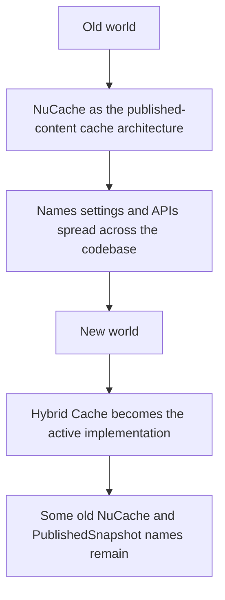
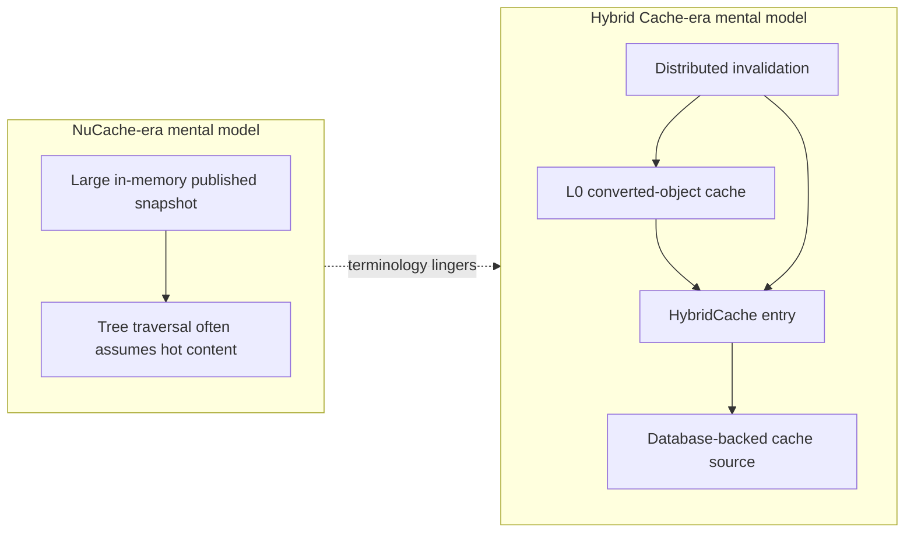

# 11. NuCache vs Hybrid Cache

> **Start here.** This chapter kills the single most common confusion in the v17 cache story: the idea that NuCache and Hybrid Cache are two engines you choose between. They are not. You will learn what each name really means, why both still appear all over the source, and why there is nothing left to "stay on" if you wanted the old one.

This chapter exists to stop one of the easiest confusions in the whole Umbraco cache story.

In Umbraco 17, `NuCache` is both:

- an older architectural name
- and a set of names, settings, comments, and compatibility seams that still live inside the newer system

So if you read the code casually, it can look as if NuCache and Hybrid Cache are the same thing.

They are not.

## The shortest true answer

Old NuCache is the earlier published-content cache architecture.

Hybrid Cache is the newer published-content cache architecture.

In Umbraco 17, the active implementation is Hybrid Cache, but NuCache terminology still survives in:

- configuration names
- serialiser names
- SQL template names
- comments
- some refresh APIs such as `RefreshAllPublishedSnapshot`

> **Analogy — same sign, new kitchen.** Think of the published-content cache as a restaurant's prep stations, kept stocked from the walk-in fridge (the database) so waiters never wait on the slow store. The sign over the door still says "NuCache", but in Umbraco 15 the whole kitchen behind it was torn out and rebuilt as Hybrid Cache. The lingering `NuCache*` names are just old job titles left painted on a few doors — the people behind them now report to Hybrid Cache.

## Why the confusion happens

The confusion is not your fault — the v17 source itself still mixes the names in several places:

- the settings model is still `NuCacheSettings`[^12-settings]
- the serialiser enum is still `NuCacheSerializerType`[^12-serializer]
- `AddUmbracoHybridCache()` is the real registration method, but its comments still say "Adds Umbraco NuCache dependencies"[^12-builder]
- SQL template names still include `NuCache`[^12-sql]
- distributed refresh helpers still talk about `PublishedSnapshot`[^12-snapshot]

That tells us Umbraco is in a migration period of vocabulary as well as architecture.

## What NuCache used to mean

Historically, NuCache was the published-content cache implementation used in older Umbraco versions.[^12-history]

The v17 serialiser enum says this very plainly:[^12-legacy]

- the JSON option existed for backward compatibility with the cache implementation used from Umbraco 8 to 14
- the newer Hybrid Cache implementation has been in place from Umbraco 15 onward[^12-legacy]

That is one of the clearest statements we have in the code.

## What Hybrid Cache means in v17

In v17, the builder pipeline calls:

- `AddUmbracoHybridCache()`[^12-active]

and the core runtime wiring clearly points at the `Umbraco.PublishedCache.HybridCache` project as the live implementation.

So for the book, the safest beginner phrasing is:

> In Umbraco 17, Hybrid Cache is the active published-content cache implementation. NuCache is mostly the historical name that still survives in compatibility seams.

> **Key term — compatibility seam.** A "seam" here is a spot where an old name lingers after the thing behind it changed: a setting, a comment, an SQL template, or an API still wearing the `NuCache` label while Hybrid Cache does the actual work. The next few sections walk through the seams one by one.

## The settings seam

The best example is `NuCacheSettings`.

That class still configures things such as:

- `NuCacheSerializerType`
- `SqlPageSize`
- `UsePagedSqlQuery`[^12-settings]

But these settings are now feeding the Hybrid Cache implementation.

So `NuCacheSettings` in v17 does **not** mean:

- "the old NuCache engine is still the main published-cache implementation"

It means:

- "the newer Hybrid Cache pipeline still uses a configuration section inherited from the old naming scheme"

## The serialiser seam

`NuCacheSerializerType` is even more revealing.

It has:

- `MessagePack`
- `JSON`

But the remarks on `JSON` say:

- it is the legacy serialiser option
- it existed for backward compatibility with the Umbraco 8 to 14 cache implementation
- it is no longer supported with the cache implementation from Umbraco 15 based on .NET's Hybrid Cache
- it remains mainly for a readable format suitable for testing[^12-legacy]

That gives us a very clean history:

1. older NuCache world
2. newer Hybrid Cache world
3. lingering compatibility vocabulary

> **Tip — leave the serialiser alone.** For a v17 project, `MessagePack` (with LZ4 compression) is the working default. Reach for `JSON` only when you want a human-readable format for testing; it is the legacy option and is no longer supported for the Hybrid Cache implementation as a production serialiser.

## The naming seam inside the Hybrid Cache module

One of the funniest details is that the Hybrid Cache builder file still contains comments like:

- "Extension methods ... for the Umbraco's NuCache"
- "Adds Umbraco NuCache dependencies"[^12-builder]

But the method name is:

- `AddUmbracoHybridCache()`

That is a perfect illustration of the transition: the code structure moved first, and some of the names are still catching up.

## The SQL seam

The database-backed source cache in the Hybrid Cache project still uses SQL template names such as:

- `NuCacheDatabaseDataSource.ContentSourcesSelect`
- `NuCacheDatabaseDataSource.MediaSourcesSelect`[^12-sql]

Again, that does not mean the old NuCache architecture is still the real engine.

It means the data-source naming has historical continuity.

## The refresher seam

Another lingering old-world phrase is:

- `RefreshAllPublishedSnapshot()`[^12-snapshot]

That method refreshes all published snapshots by triggering:

- all content cache refresh
- all media cache refresh
- all domain cache refresh

This shows that older published-snapshot language still survives in distributed invalidation APIs.

That is useful for the book because it explains why readers may see:

- NuCache
- PublishedSnapshot
- HybridCache

all in the same codebase and wonder what is going on.

## The best mental model

## What to teach beginners

If someone is learning Umbraco 17, tell them this:

### 1. Treat Hybrid Cache as the real current implementation

That is the architecture to understand first.

### 2. Treat NuCache as the historical predecessor

That is the older mental model.

### 3. Expect legacy names to remain in the code

Especially in:

- settings
- serialiser options
- SQL names
- comments
- refresh helpers

### 4. Do not assume every `NuCache` name means the old engine is still running

Often it means:

- the new engine is using an old config name
- or the old vocabulary was never fully renamed

## NuCache and Hybrid Cache are not equal alternatives in v17

> **Gotcha — not two engines to choose between.** Do not picture v17 keeping NuCache and Hybrid Cache side by side as two current implementations you pick between. That framing is misleading: the NuCache engine was removed in v15, so only its vocabulary survives.

A better framing is:

- NuCache is the older alternative
- Hybrid Cache is the newer active alternative
- v17 still contains NuCache-named compatibility seams

## "But the NuCache settings are still there — isn't it still running?"

This is one of the most reasonable questions you can ask, so let's answer it properly.

It is tempting to picture Umbraco keeping two engines side by side: Hybrid Cache for new projects, and the old NuCache still quietly running for any project that carries NuCache settings. Plenty of frameworks do exactly that kind of thing, so it is a sensible guess.

But it is not what Umbraco does.

In Umbraco 15 and later, the NuCache **engine** was removed. What survives is its **vocabulary**. There is only one published-content cache engine in v17 — Hybrid Cache — and it is the engine for every project, freshly created or upgraded alike.

We can be confident about this straight from the source:[^12-oneengine]

- There is only one published-cache project to find: `Umbraco.PublishedCache.HybridCache`. The old NuCache engine types — the published-snapshot service, the in-memory content store, the BTree-backed local cache file — are simply gone.
- There is only one registration method: `AddUmbracoHybridCache()`. There is no `AddUmbracoNuCache()` to opt back into, so there is no switch to flip.
- Every consumer of `NuCacheSettings` lives *inside* the Hybrid Cache project. Those settings tune Hybrid Cache; they do not choose a different engine.
- Even selecting the `JSON` serialiser does not bring NuCache back. It only picks a legacy, test-only serialisation format inside the Hybrid Cache pipeline.

### The version boundary that matters

This is the part worth keeping straight:

- **Umbraco 8 to 14:** NuCache really was the engine.
- **Umbraco 15 onward:** the NuCache engine was retired and Hybrid Cache took over. The names stayed behind.

So "NuCache is gone" is a statement about v15 and later — not about those older majors, where it was very much alive and doing the work.

### What this means in practice

- You cannot "stay on NuCache" in v17, because there is nothing to stay on.
- There is no per-project engine choice. An upgraded site moves onto Hybrid Cache exactly like a brand-new one.
- The NuCache-named settings still do something real — they tune Hybrid Cache (serialiser, SQL paging) — they just do not keep an old engine alive.

A friendly way to remember it:

> The NuCache engine retired in v15. Hybrid Cache does the work now — the NuCache name simply kept its old job title on a few doors.

## Quick comparison table

| Aspect | NuCache (old) | Hybrid Cache (new, active) |
| --- | --- | --- |
| Role | Published-content cache architecture | Published-content cache architecture |
| Era | Umbraco 8 to 14 | Umbraco 15 onward (active in 17 and 18) |
| Built on | Umbraco's own implementation | Microsoft's `HybridCache` (L1 memory + optional L2 distributed) |
| Default serialiser | JSON | MessagePack (with LZ4 compression) |
| Registration | legacy wiring | `AddUmbracoHybridCache()` |
| Status in v17 | historical predecessor; name survives in seams | the real, active implementation |

## Architecture sketch: old vs new

## NuCache-named leftovers in v17 at a glance

This is the "which ones are just names, which ones still affect behaviour" view.

| Leftover name | What it really is | Just a name, or real behaviour? |
| --- | --- | --- |
| `NuCacheSettings` | Configuration section now feeding Hybrid Cache | Real settings, old name |
| `NuCacheSerializerType` | Serialiser enum (`MessagePack` / `JSON`) | Real behaviour, old name |
| `NuCacheSerializerType.JSON` | Legacy serialiser for the Umbraco 8 to 14 cache | Real but legacy; kept mainly for readable test output |
| `NuCacheDatabaseDataSource.*` SQL templates | Queries for the database-backed cache source | Just historical naming |
| `RefreshAllPublishedSnapshot()` | Distributed refresh helper | Real behaviour, old "snapshot" vocabulary |
| "Adds Umbraco NuCache dependencies" comments | Comments inside `AddUmbracoHybridCache()` | Just stale comments |

## In a nutshell

In Umbraco 17, NuCache is mainly the old published-cache architecture whose names and settings still survive, while Hybrid Cache is the newer active implementation built on Microsoft's `HybridCache`. The sign over the door never changed; the kitchen behind it did.

### Three takeaways

- **One engine, two names.** Hybrid Cache is the only published-content cache engine in v17. NuCache is history plus vocabulary.
- **The `NuCache*` names are seams, not switches.** They tune Hybrid Cache (serialiser, SQL paging) or are simply stale comments — none of them keeps an old engine alive.
- **There is nothing to "stay on".** The NuCache engine retired in v15, so an upgraded site moves onto Hybrid Cache exactly like a brand-new one.

### Where to go next

- [10. Future Hybrid Cache architecture](./09-future-hybrid-cache-architecture.md) — how the active engine is actually built.
- [03. Published cache and load balancing](./03-published-cache-and-load-balancing.md) — where this cache sits across multiple servers.
- [14. Reading the cache code](./14-reading-the-cache-code.md) — for tracing these names through the source yourself.

## Sources

- Microsoft:
  - [HybridCache in ASP.NET Core](https://learn.microsoft.com/en-us/aspnet/core/performance/caching/hybrid?view=aspnetcore-10.0)
- Code:
  - `umbraco-v17/src/Umbraco.Core/Configuration/Models/NuCacheSettings.cs`
  - `umbraco-v17/src/Umbraco.Core/Configuration/Models/NuCacheSerializerType.cs`
  - `umbraco-v17/src/Umbraco.Web.Common/DependencyInjection/UmbracoBuilderExtensions.cs`
  - `umbraco-v17/src/Umbraco.PublishedCache.HybridCache/DependencyInjection/UmbracoBuilderExtensions.cs`
  - `umbraco-v17/src/Umbraco.Core/Cache/DistributedCacheExtensions.cs`
  - `umbraco-v17/src/Umbraco.Core/Constants-SqlTemplates.cs`

[^12-settings]: See [C1](./10-appendix-sources.md#c1-umbraco-17-source-checkout) and specifically [`NuCacheSettings.cs`](https://github.com/umbraco/Umbraco-CMS/blob/release-17.5.0/src/Umbraco.Core/Configuration/Models/NuCacheSettings.cs).
[^12-serializer]: See [C1](./10-appendix-sources.md#c1-umbraco-17-source-checkout) and `NuCacheSerializerType.cs`.
[^12-builder]: See [C1](./10-appendix-sources.md#c1-umbraco-17-source-checkout) and the v17 `Umbraco.PublishedCache.HybridCache/DependencyInjection/UmbracoBuilderExtensions.cs`.
[^12-sql]: See [C1](./10-appendix-sources.md#c1-umbraco-17-source-checkout) and `Constants-SqlTemplates.cs`.
[^12-snapshot]: See [C7](./10-appendix-sources.md#c7-core-cache-types-and-refreshers) and `DistributedCacheExtensions.cs`.
[^12-legacy]: See [C1](./10-appendix-sources.md#c1-umbraco-17-source-checkout) and `NuCacheSerializerType.cs`.
[^12-active]: See [C1](./10-appendix-sources.md#c1-umbraco-17-source-checkout), [C4](./10-appendix-sources.md#c4-umbracopublishedcachehybridcache-on-main), and [M2](./10-appendix-sources.md#m2-aspnet-core-hybridcache).
[^12-history]: See [B7](./10-appendix-sources.md#b7-umbraco-123-release), [B8](./10-appendix-sources.md#b8-umbraco-product-update---november-2023), [B1](./10-appendix-sources.md#b1-umbraco-15-release), and [B2](./10-appendix-sources.md#b2-umbraco-15-release-candidate).
[^12-oneengine]: See [C1](./10-appendix-sources.md#c1-umbraco-17-source-checkout) and [C4](./10-appendix-sources.md#c4-umbracopublishedcachehybridcache-on-main). The v17 source contains a single published-cache project, `Umbraco.PublishedCache.HybridCache`, registered through `AddUmbracoHybridCache()`; there is no NuCache engine project or alternative registration to fall back to, and the old engine types (published-snapshot service, in-memory content store, BTree local cache) are absent.
