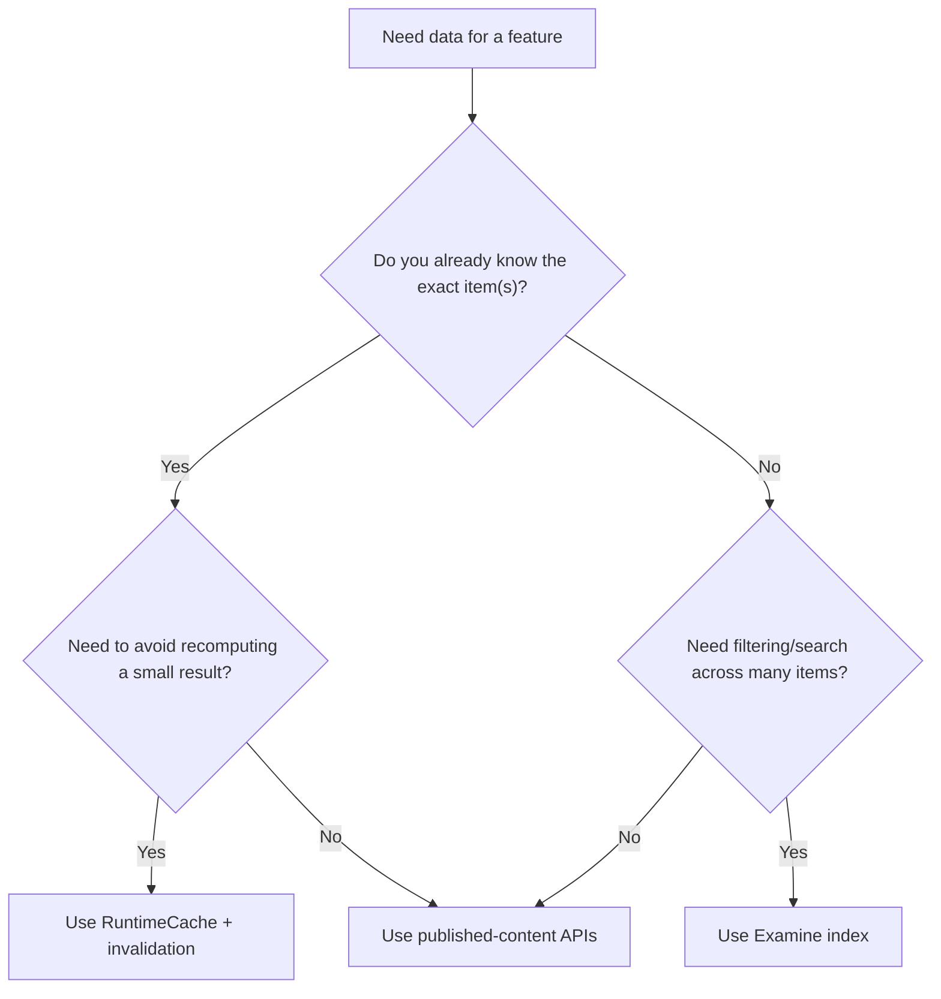
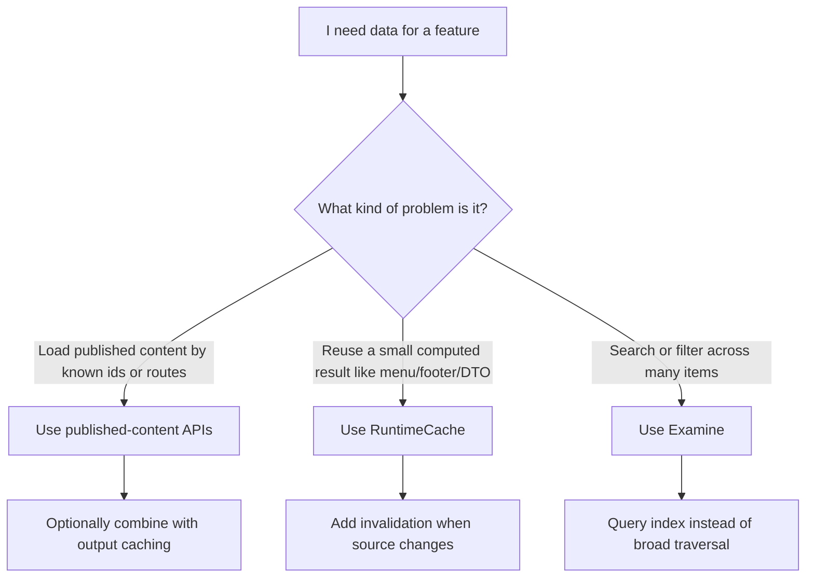

# 12. Examine, Indexes, and Cache-Adjacent Querying

> **Start here.** This is the "when NOT to reach for a cache" chapter. Examine is a search index, not a cache — but it sits close enough to be worth a chapter, because sometimes the honest fix for a slow feature is a better way to *find* things rather than another layer to *remember* things. You will learn where the line sits, why broad tree traversal is costly in the HybridCache world, and how to pick between an index, a cache, and the published-content APIs.

Examine is one of the easiest Umbraco topics to mislabel.

People often ask:

> "Is Examine a cache?"

The best beginner-safe answer is: no, not primarily. Examine is a search index, though it can play a cache-adjacent role because it stores a derived representation of content, so expensive lookups do not have to start from the published tree every time.[^13-examine]

> **Key term — Examine is an index, not a cache.** It stores a derived, searchable copy of your content so you can FIND things fast — closer to a reservation book than to the heat lamp. Reach for it when the hard part is discovery across a big set, not when the hard part is remembering one small computed result.

That distinction matters more in the HybridCache era.

## Why this chapter belongs in a caching book

This book is about caching, but HybridCache changes the query trade-offs enough that we also need one chapter about when not to solve a problem with a cache.

Markus Johansson's HybridCache talk and PDF make that point clearly:

- broad traversal is more expensive than many teams expect
- filtering after loading content can become much more visible
- some workloads are better served by `Examine` than by repeated published-content traversal[^13-talk]

So this chapter is really about choosing the right tool:

- published-content cache for published-content retrieval
- `RuntimeCache` for your own small computed results
- `Examine` for index-shaped query problems

## The shortest possible distinction

### Published-content cache

This is Umbraco's internal content retrieval layer.

Its job is:

- load published content correctly
- keep repeated content access fast
- stay coherent after invalidation

### `RuntimeCache`

This is your small app-level cache.

Its job is:

- store a computed result
- avoid recomputing it for every request
- clear it when the underlying data changes

### Examine

This is a search/indexing system built on Lucene.[^13-examine]

Its job is:

- store a derived searchable representation
- answer search/filter/query requests efficiently
- avoid walking large parts of the content tree just to find matches

## Why Examine can feel cache-like

Even though Examine is not Umbraco's general-purpose cache, it does share some cache-like properties:

- it stores derived data rather than the original source object
- it is built so repeated queries become cheap
- it must be refreshed or rebuilt when underlying content changes

That is why it is fair to call it cache-adjacent.

But "index" is still the better primary word.

If you call Examine a cache without qualification, beginners may assume it behaves like:

- `RuntimeCache`
- `HybridCache`
- `IMemoryCache`

and that will lead them toward the wrong mental model.

## Searchers are the clue

The Umbraco docs describe Examine management in terms of `indexes` and `searchers`.[^13-searchers] That wording is revealing: a searcher is not "the cache reader", it is the component that queries one or more indexes. That makes Examine much closer to:

- a search engine
- a read model
- a precomputed query structure

than to a simple in-memory cache entry store.

> **Analogy — the maitre d's reservation book.** Picture the kitchen from the rest of the book: the database is the walk-in fridge, the published-content cache is the prep stations, the output cache is the heat lamp. Examine is none of those. It is the maitre d's reservation book, a box of index cards by the door — not the food itself, but a fast way to look up which table or which dish you need without walking the whole floor. When the hard part is "find the right items across a big set", you flick through the book (Examine). When the hard part is "remember one small computed result", you glance at a station sticky-note (`RuntimeCache`). When you want the actual dish, you ask the pass — the published-content APIs.

## When Markus recommends Examine instead of cache

The HybridCache material is helpful because it does not say "cache more".

Instead, it often says:

- stop broad tree traversal
- stop loading lots of content just to filter it afterwards
- query more intentionally

That is where Examine comes in.[^13-talk]

For some workloads, the best answer is not:

- "put the result in `RuntimeCache`"

but:

- "query an index that already knows how to find the right subset"

Examples Markus calls out include cases like sitemap generation and content selection patterns where a query can be expressed more naturally as indexed retrieval than as full traversal and filtering.[^13-talk]

## A practical decision rule

Ask this question first:

> Am I trying to remember a small result, or am I trying to find the right items across a larger set?

If the answer is "remember a small result", a cache is often right.

If the answer is "find the right items", an index is often right.

## Quick comparison

| Problem | Best fit | Why |
| --- | --- | --- |
| Reuse a small computed object | `RuntimeCache` | You already know the shape of the answer and just want to avoid recomputing it. |
| Load published content by route or id | Published-content APIs | This is the platform's native retrieval path. |
| Find many matching items across a large set | `Examine` | The hard part is discovery, so an index is better than broad traversal. |
| Cache rendered HTML | Output cache | The expensive step is rendering the page, not looking up content. |
| Keep one custom app projection warm | `RuntimeCache` plus invalidation | Good when the source is small and change events are well defined. |

## Selection graph

The important shape of the decision is this:

- caches remember answers
- indexes help you find answers
- published-content APIs retrieve the source of truth

## Troubleshooting checklist

> **Gotcha — a slow feature is not automatically a cache miss.** When something feels slow, resist the reflex to bolt on "add a cache". A cache hides the cost of *recomputing an answer you already have the shape of*; it does nothing for the cost of *walking half the tree to discover the answer in the first place*. Diagnose the shape of the slowness before you pick the tool.

Check these in order:

1. Are you traversing a large part of the tree and filtering afterwards?
1. Are you reusing a computed result that belongs in `RuntimeCache`?
1. Are you really trying to search or filter across many items, which is where Examine fits better?
1. Is the problem actually lock contention, rebuild lag, or another operational issue?

That checklist is the practical version of the chapter's main message:

- not every slow query is a cache miss
- not every repeated lookup should become a cache
- not every search problem should be solved by walking content

## Decision chart

## Good examples for `RuntimeCache`

- menu DTOs
- footer link groups
- a small settings projection
- a compact lookup table built from a known source

These are all cases where your code already knows what data shape it wants and just wants to avoid rebuilding it repeatedly.

## Good examples for Examine

- search pages
- filtered listings
- sitemap-like discovery workloads
- "find all matching content" queries across a large set

These are cases where the main cost is not recomputing one tiny DTO — it is discovering the right set of content in the first place.

## Bad pattern to watch for

This is the trap the HybridCache material warns about:

1. load a broad part of the tree
2. materialise many content items
3. filter in memory
4. call that "fine because it is cached"

That may have felt acceptable in older mental models, but it is much less safe in the newer world.

## In a nutshell

If you want one clean sentence to reuse elsewhere, this is probably it:

> Examine is not Umbraco's general-purpose cache, but it is a derived index that can play a cache-adjacent role by making expensive discovery queries cheap enough to avoid broad published-content traversal.[^13-examine]

### Three takeaways

- Caches remember answers, indexes help you find answers, and the published-content APIs retrieve the source of truth — match the tool to the shape of the problem.
- In the HybridCache world, "load a broad slice of the tree and filter in memory" is no longer a cheap habit, so discovery-shaped work often belongs in `Examine` rather than in another cache.
- Before you add a cache, ask whether you are remembering a small result or finding items across a large set; only the first is really a cache's job.

### Where to go next

- For the internal published-content cache story, see [03 - Published Content Cache, AppCaches, and Load Balancing](./03-published-cache-and-load-balancing.md).
- For the practical query-strategy warning from the HybridCache talk, see [06 - Cache Settings, Talks, and Field Notes](./06-cache-settings-talks-and-field-notes.md).
- For the tiny custom cache example using `RuntimeCache`, see [07 - Small Local Cache Example with Tags](./07-small-local-cache-example-with-tags.md).
- For Deploy's effect on index refresh, see [05 - HQ Extensions and Cache](./05-hq-extensions-and-cache.md).

## Sources

- Docs:
  - [Examine](https://docs.umbraco.com/umbraco-cms/develop-with-umbraco/application-code/examine)
  - [Examine management](https://docs.umbraco.com/umbraco-cms/develop-with-umbraco/application-code/examine/examine-management)
- Supporting material:
  - [Hybrid Cache förändrar allt — Umbraco Kalaset slides (PDF)](https://www.umbracokalaset.se/media/ccvhwzvs/hybrid-cache-forandrar-allt.pdf)
  - [Examine ISearcher API](https://shazwazza.github.io/Examine/api/Examine.ISearcher.html)

[^13-examine]: See [U15](./10-appendix-sources.md#u15-examine-overview), [U16](./10-appendix-sources.md#u16-examine-management), and [U17](./10-appendix-sources.md#u17-examine-isearcher-api).
[^13-searchers]: See [U16](./10-appendix-sources.md#u16-examine-management) and [U17](./10-appendix-sources.md#u17-examine-isearcher-api).
[^13-talk]: See [T2](./10-appendix-sources.md#t2-hybrid-cache-forandrar-allt-pdf).
