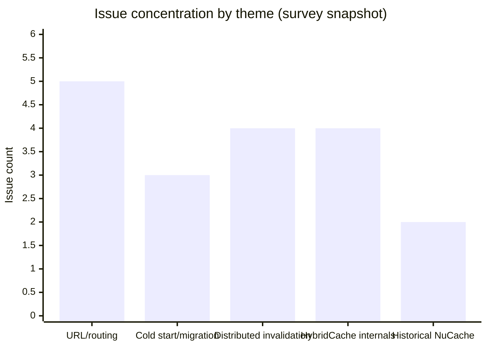
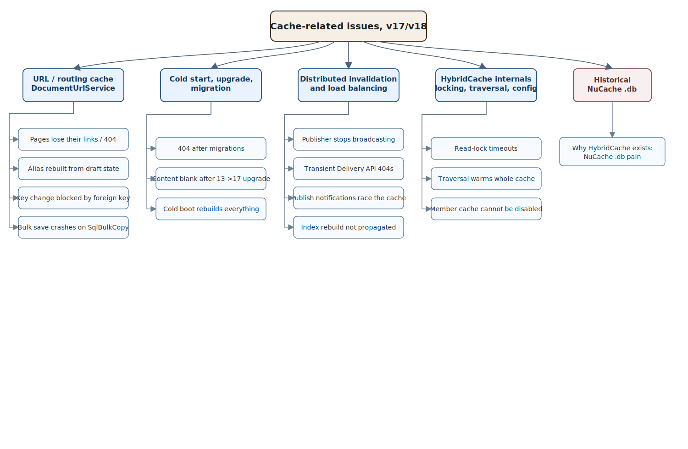

# 12. Lessons from the Issue Tracker

The earlier chapters explain how Umbraco caching is *meant* to work.

This chapter does the opposite. It looks at what actually breaks.

It is a point-in-time survey of the open, genuinely cache-related issues on the Umbraco CMS tracker, read in full (body plus comments) and grouped into the patterns that matter for Umbraco 17 and 18.[^14-survey]

## How to read this chapter

A bug report is not a source of truth in the same way source code is. So this chapter is careful about confidence:

- **Confirmed** means an Umbraco HQ maintainer acknowledged the cause or behaviour in the thread.
- **Reported** means a community reporter diagnosed it convincingly, but HQ has not yet confirmed it.
- **Unknown** means nobody has identified the cause yet.

Two more caveats:

- This is a snapshot taken on **30 June 2026**. Issue state changes over time, so treat status as "as captured", not "forever".
- Many of these issues are labelled `needs-reproduction`. That is itself a finding: cache bugs are timing- and environment-sensitive, so they are genuinely hard to reproduce on demand.

## The headline finding

The single most important pattern is this:

> Most of the *new* cache problems in v17 are not in `HybridCache` itself. They live in the **routing/URL cache** introduced alongside it: `DocumentUrlService` and the SQL-backed `umbracoDocumentUrl` table.

This layer did not exist in the NuCache era. It is keyed by document GUID, it is refreshed off `ContentTreeChangeNotification` (which fires on **save**, not only on publish), and issue reports point to weak draft-versus-published guards in places. That combination is one plausible explanation for a family of "my page suddenly 404s" reports.

The old NuCache `.db`-file complaints, by contrast, are now historical. They are useful mainly because they explain *why* the architecture moved to `HybridCache` in the first place.

## Issue cluster intensity

## A map of where the problems cluster

## Theme 1: the URL and routing cache is the new failure surface

These problems are specific to the v15+/v17 routing layer. They are the ones most likely to surprise someone coming from v13.

| Issue | What breaks | Cause | Where it stands |
| --- | --- | --- | --- |
| [#23234](https://github.com/umbraco/Umbraco-CMS/issues/23234) | Published pages randomly lose their backoffice "Links", so the front end 404s. Tends to happen after deploys or overnight restarts. | **Unknown.** Symptoms point to the `DocumentUrl` route store going stale or empty across restarts. | Open, needs investigation. Workaround: re-save and re-publish the page. |
| [#23206](https://github.com/umbraco/Umbraco-CMS/issues/23206) | Editing a `umbracoUrlAlias` and only **saving** (not publishing) can hide the still-published route. | **Reported.** `DocumentUrlAliasService` rebuilds aliases on any tree change, guards only `Trashed`/`Blueprint` (no `Published` check), and reads the alias with `published: false`, so the draft alias overwrites the published one. | Open, needs reproduction. |
| [#21131](https://github.com/umbraco/Umbraco-CMS/issues/21131) | Changing a content item's `Key` throws a SQL foreign-key error (`FK_umbracoDocumentUrl_umbracoNode_uniqueId`). Breaks tools like uSync that realign keys. | **Confirmed.** `umbracoDocumentUrl` deliberately uses the document GUID as its foreign key for performance, and there was no public API to clear those rows. | v17 workaround: delete the rows via the repository first. **v18 changes the rules**: entity keys are now immutable. |
| [#22782](https://github.com/umbraco/Umbraco-CMS/issues/22782) | Bulk save/publish of many items crashes with "There is already an open DataReader". | **Reported.** During cache refresh, `DocumentUrlRepository.Save` runs `SqlBulkCopy` on the shared parent-scope connection while a streaming `SqlDataReader` is still open. | Open, needs reproduction. Workaround: drain readers (use `Fetch`/`ToList`, not lazy `Query`); suppress `ContentTreeChangeNotification` during the batch. |
| [#21820](https://github.com/umbraco/Umbraco-CMS/issues/21820) | A custom/headless `UrlProvider` preview does not refresh on a second "Save and Preview". | **Reported.** The backoffice assumes SignalR will trigger the refresh; headless setups have none, and the preview URL is cached client-side. | Open, reproduced. *(This is a backoffice **client-side** cache, not a server one — a useful contrast case.)* |

Closed issue [#21337](https://github.com/umbraco/Umbraco-CMS/issues/21337) adds an upgrade-shaped version of the same lesson. A large v13 to v17 site started with blank links because the document URL cache appeared to have been populated too early and then treated as valid. Forcing URL generation again produced tens of thousands of expected URLs. The fix moved the rebuild to a point where migrations had completed and avoided duplicate initialisation.[^14-url-upgrade]

The v18 answer to [#21131](https://github.com/umbraco/Umbraco-CMS/issues/21131) is worth singling out, because it is a real architectural decision rather than a patch. Pull request [#21374](https://github.com/umbraco/Umbraco-CMS/pull/21374), "Entities: Prevent changing Key property on existing entities", was merged into v18.[^14-fixes] In other words, rather than make the URL cache tolerate key changes, Umbraco made entity keys **immutable**. That tells you how central the GUID-as-foreign-key choice is to the routing cache.

## Theme 2: cold start, upgrade, and migration

Here the published cache is left in a bad state at start-up, and a restart or a republish is the only cure.

| Issue | What breaks | Cause | Where it stands |
| --- | --- | --- | --- |
| [#22581](https://github.com/umbraco/Umbraco-CMS/issues/22581) | After an upgrade that runs database migrations, **every** page 404s; publishing warns "the document does not have a URL". | **Unknown.** HQ could not reproduce. | Open. Workaround: restart the site. Candidate mitigation: the cache-hardening work in [#22393](https://github.com/umbraco/Umbraco-CMS/pull/22393). |
| [#22322](https://github.com/umbraco/Umbraco-CMS/issues/22322) | After a 13.13 to 17.2.2 upgrade, content exists in the database but will not render. Only republishing each node fixes it; 17.1.0 is fine. | **Reported.** A key observation in-thread: programmatic `Publish`/`PublishBranch` only push *dirty* properties, so unchanged properties never reach the published cache. | Open, needs reproduction (regression versus 17.1). Related closed issue: [#21863](https://github.com/umbraco/Umbraco-CMS/issues/21863). |
| [#22947](https://github.com/umbraco/Umbraco-CMS/issues/22947) | On Azure **Linux** App Service, all Examine indexes rebuild on every restart. | **Reported.** Each container restart gets a new `Environment.MachineName`, so the "last synced" lookup returns nothing, the boot is treated as `SyncBootState.ColdBoot`, and everything rebuilds. | Open, reproduced, sprint candidate. Shares its root cause with the published-cache version of the same problem, [#13909](https://github.com/umbraco/Umbraco-CMS/issues/13909). |

The "only dirty properties get published" observation in [#22322](https://github.com/umbraco/Umbraco-CMS/issues/22322) is the most useful detail in this group. It is a cache-coherence subtlety, not a UI bug: a UI "Save and publish" forces a full overwrite, but a programmatic branch publish may not, so the published cache can carry forward stale values after a major upgrade.

Closed issue [#21882](https://github.com/umbraco/Umbraco-CMS/issues/21882) sharpens that point from another angle. In 17.2.0, rebuilding the database cache from an empty `cmsContentNu` table could leave property values empty until an additional restart, and a related fix landed for 17.2.1.[^14-rebuild-empty] The practical lesson is simple: a rebuild button is not only an admin convenience. It is a correctness path, and it needs the same care as normal publish-time invalidation.

## Theme 3: distributed invalidation and load balancing

This is the book's central thesis, restated by real bugs: cache **busting** across servers is the hard part.

| Issue | What breaks | Cause | Where it stands |
| --- | --- | --- | --- |
| [#23219](https://github.com/umbraco/Umbraco-CMS/issues/23219) | A publisher that loses the **MainDom** race at boot applies changes locally but **silently stops writing `umbracoCacheInstruction` rows** for the rest of the process. The cluster diverges permanently, with no error logged. | **Reported.** The broadcast gate depends on a `Lazy<SyncBootState?>` that is evaluated once and caches the failed result forever. | Open, needs reproduction. Only recovery is an app-pool restart. Not load-balancer-exclusive: an overlapped IIS recycle can trigger it on one server. |
| [#22328](https://github.com/umbraco/Umbraco-CMS/issues/22328) | In a split v17 deployment (separate Backoffice and Delivery API apps), Save and Publish causes transient Delivery API 404s (about 1 in 1000). | **Unknown.** There is a brief window during publish where already-published content is not resolvable. | Open. Workaround suggested by HQ: enable Delivery API output caching to mask the gap. |
| [#17393](https://github.com/umbraco/Umbraco-CMS/issues/17393) | Publish/unpublish notification handlers read **stale** content, because the notification fires before the cache reflects the change. | **Reported.** No notification cleanly signals "the cache is now consistent"; even `ContentCacheRefresherNotification` can fire early. | Open, reproduced, sprint candidate. Workaround: call `DistributedCache.RefreshContentCache(...)` explicitly, or read inside a fresh scope. |
| [#8060](https://github.com/umbraco/Umbraco-CMS/issues/8060) | The "Rebuild index" button only rebuilds the admin server's Examine index, not the replicas'. | **Confirmed.** By design: there is no cluster-wide rebuild instruction. | Open, stale, up-for-grabs. Workaround: use a search-as-a-service backend, or schedule rebuilds on every node. |

[#23219](https://github.com/umbraco/Umbraco-CMS/issues/23219) is the clearest cautionary tale in the whole survey. A node quietly stops emitting cache-busting instructions, so editors see their change on the publishing server only, and nothing in the logs says anything is wrong. It is the precise failure the `DistributedCache` and `IServerMessenger` machinery from [chapter 4](./04-cache-busting-and-invalidation.md) exists to prevent — and a reminder that the machinery only helps while it is actually running.

The forum field reports in [chapter 4](./04-cache-busting-and-invalidation.md#field-note-stale-instructions-are-data-too) show the noisier cousin of the same class of problem: old `umbracoCacheInstruction` rows can keep failing after the original environment mistake is gone.[^14-field-instructions]

## Theme 4: HybridCache internals — locking, traversal, and config gaps

These touch the published cache engine itself. This section is a survey conclusion, not a benchmark or a settled risk ranking from the source code.

| Issue | What breaks | Cause | Where it stands |
| --- | --- | --- | --- |
| [#20552](https://github.com/umbraco/Umbraco-CMS/issues/20552) | The documented sitemap approach traverses the whole tree, which **warms the entire content cache** on large sites. | **Reported.** Full traversal hydrates every node; the lightweight navigation services do not carry enough data (name, dates) to build a sitemap without hydration. | Open. Direction: extend the navigation query services, or build the sitemap at publish time. |
| [#21164](https://github.com/umbraco/Umbraco-CMS/issues/21164) | After a deploy, rendering a block throws `Failed to acquire read lock for id: -332` (ContentTypes). | **Unknown.** The stack shows `HybridCache` lazily materialising content during a request, taking the ContentTypes read lock, which then times out under contention (likely a concurrent post-deploy rebuild). | Open, needs reproduction. |
| [#17550](https://github.com/umbraco/Umbraco-CMS/issues/17550) | Rapid `IContentTypeService.UpdateAsync` calls deadlock the whole site. | **Reported (HQ hypothesis).** A deadlock between Examine indexing and the cache rebuild, both needing the content-type read lock. **Database-specific**: reproduces on SQLite (where the read lock is nearly a no-op), not on SQL Server. | Open, reproduced. Workaround: throttle the updates. |
| [#23070](https://github.com/umbraco/Umbraco-CMS/issues/23070) | On sites with 300k+ members, the database cache rebuild is slow and blocks all member changes, and it cannot be disabled. | **Reported.** v13's public `NuCacheContentRepository` (subclassable to skip members) was replaced by an `internal sealed DatabaseCacheRepository`, removing the extension point. | Open. Requested: a settings flag, or a public repository. |

[#20552](https://github.com/umbraco/Umbraco-CMS/issues/20552) is the canonical illustration of a recurring theme in this book: **broad traversal has a cost in the HybridCache world.** Walking the whole content tree no longer reads from a fully in-memory structure; it hydrates and caches each node you touch. The lightweight `I*NavigationQueryService` exists precisely so you can walk structure without paying that price — see [chapter 9](./09-future-hybrid-cache-architecture.md) and [chapter 11](./11-examine-indexes-and-cache-adjacent-querying.md).

## Theme 5: historical NuCache pain, and why HybridCache exists

These two issues predate HybridCache. They are "before" evidence.

| Issue | What breaks | Cause | Where it stands |
| --- | --- | --- | --- |
| [#15634](https://github.com/umbraco/Umbraco-CMS/issues/15634) | "The process cannot access `NuCache.Content.db`" aborts an upgrade. On Azure the temp directory is not accessible to delete the locked file. | **Reported.** The local BPlusTree `.db` files are locked by another process during the upgrade. | Open. Workaround: restart the web app to clear the `.db` files. |
| [#15809](https://github.com/umbraco/Umbraco-CMS/issues/15809) | NuCache `.db` (de)serialisation allocates **tens of gigabytes** at start-up on large sites (versus roughly 200 MB of files), causing long GC pauses. | **Reported.** Neither the NuCache serialiser nor the underlying `CSharpTest.Net.Collections` library pooled their buffers. | Open. A community pooling pull request, [#15808](https://github.com/umbraco/Umbraco-CMS/pull/15808), was **closed without being merged**, so the underlying cost remains in the NuCache stack. |

Read together, these explain the move to `HybridCache`: local `.db` files that lock during upgrades and balloon memory at start-up are exactly the fragilities a database-backed, `IMemoryCache`/`IDistributedCache`-layered cache was designed to remove. See [chapter 10](./10-nucache-vs-hybrid-cache.md).

## The solutions picture

Pulling the fixes and workarounds together gives a clearer view than any single issue.

### Shipped and merged

- **v18 — immutable entity keys.** [#21374](https://github.com/umbraco/Umbraco-CMS/pull/21374) closes off the key-change foreign-key problem by disallowing key changes outright.[^14-fixes]
- **v17 — published cache race hardening.** [#22393](https://github.com/umbraco/Umbraco-CMS/pull/22393), "Published Content Cache: Defensive hardening against race conditions", was merged and is the realistic candidate mitigation for the migration-and-cold-start 404 family.
- **v17 — fewer database hits in bulk operations.** [#22563](https://github.com/umbraco/Umbraco-CMS/pull/22563) adds a scope-level cache-version tier to cut repeated database reads during bulk content operations.

### Standing workarounds people actually use

- Re-save and re-publish nodes to regenerate lost links or stale content.
- Restart the site after a migration-bearing upgrade.
- Delete `umbracoDocumentUrl` rows via the repository before changing a key (v17 only).
- Enable Delivery API output caching to mask transient publish-window 404s.
- Use the navigation query services instead of full-tree traversal for sitemaps and similar sweeps.
- Drain data readers (prefer `Fetch`/`ToList` over lazy `Query`) before other database calls in bulk pipelines.
- Use a search-as-a-service backend so load-balanced servers share one index, sidestepping per-server rebuilds.

### Not solved

- The NuCache start-up memory cost: the pooling pull request [#15808](https://github.com/umbraco/Umbraco-CMS/pull/15808) was closed unmerged.
- Disabling or configuring the member cache at scale ([#23070](https://github.com/umbraco/Umbraco-CMS/issues/23070)).
- A cluster-wide Examine rebuild instruction ([#8060](https://github.com/umbraco/Umbraco-CMS/issues/8060)).

## Cross-cutting patterns

Five lessons recur across the whole survey:

1. **The routing/URL cache is the riskiest new surface.** If a v17 site mysteriously 404s, suspect `DocumentUrlService` before suspecting `HybridCache`.
2. **Save is not publish, and the cache knows the difference — sometimes too well.** Several bugs come from draft state leaking into a published cache, or from publish pushing only dirty properties.
3. **Silent divergence is the worst failure mode.** [#23219](https://github.com/umbraco/Umbraco-CMS/issues/23219) shows a cluster going wrong with nothing in the logs. Invalidation that fails quietly is worse than invalidation that throws.
4. **Traversal has a cost.** Warming the whole cache by accident is a real, reported performance problem now, not a theoretical one.
5. **Environment shapes behaviour.** Azure Linux container names, SQLite versus SQL Server lock semantics, and split Backoffice/Delivery API deployments each surface bugs that do not appear on a single Windows box with SQL Server.

## What closed issues add

The open-issue survey explains where risk is visible *today*. Closed issues add a second lens: what the platform has repeatedly fixed, and therefore where teams should keep operational guardrails.

Closed cache-related issues on the Umbraco tracker point to five practical lessons.[^14-closed]

### 1. Cold start is a first-class failure mode, not an edge case

The closed set includes repeated startup-path failures: published content dropping out of memory cache, unexpected startup query storms, and inconsistent Delivery API results after boot.[^14-closed-startup] This matters because these are not "one bad endpoint" bugs. They are systemic boot-path problems where many requests become risky at once.

What this teaches:

- Test restart behaviour explicitly in CI or pre-production, not only warm steady state.
- Measure first-request and first-minute behaviour after deploy.
- Treat cache warm-up and cache rebuild paths as part of release validation.

### 2. Distributed invalidation is a control-plane reliability problem

Closed issues show failures where cache sync workers stall or where distributed-cache-only notification flows fail to persist route state correctly, leaving content unroutable after restart.[^14-closed-distributed] That pattern is important: data can be correct in storage while invalidation state is wrong in the cluster.

What this teaches:

- Add health checks around subscriber sync loops and notification processing.
- Alert on prolonged queue lag and missed refresh instructions.
- Validate cross-node consistency after publish events, not just on the publishing node.

### 3. Performance regressions often hide in traversal and repository cache policy

Two closed examples are especially revealing: tree traversal costs regressing despite seeding, and deep cloning costs inside repository cache reads.[^14-closed-performance] Both show that "cached" does not mean "cheap", especially when object graph shape and access patterns are broad.

What this teaches:

- Benchmark traversal-heavy flows separately from route-by-id lookups.
- Watch object materialisation and clone costs, not only cache hit rate.
- Keep query-shape discipline: avoid broad sweep patterns on hot request paths.

### 4. Patch cadence is part of cache architecture

The closed sample carries release labels across multiple patch trains (`17.5.x`, `17.6.x`, `18.0.x`), showing that correctness and stability work lands incrementally, not in one major cut.[^14-closed-patches]

What this teaches:

- Staying close to current patch level is a risk-control decision, not only maintenance hygiene.
- If a cache symptom appears, map it against release-labelled fixes before designing local workarounds.
- Keep upgrade notes tied to issue IDs so operational teams know what risk was reduced by each patch.

### 5. Some gaps remain operational, not product-fixed

At least one cache-adjacent observability complaint was closed as `not_planned`.[^14-closed-observability] That means teams cannot assume every diagnosability gap will be solved upstream.

What this teaches:

- Build local telemetry around rebuild duration, refresh throughput, and sync failure counts.
- Keep runbooks for restart and post-upgrade cache recovery.
- Prefer noisy failure detection over silent drift.

### Practical synthesis

The closed issues strengthen the chapter's central argument: cache correctness is operational engineering, not only an implementation detail. In production, that means rehearsing restart scenarios, instrumenting invalidation health, and treating patch level as part of system design.

## Honest caveats

- Several causes above are marked **Reported**: convincing community diagnoses that Umbraco HQ has not confirmed. They are flagged deliberately. Do not quote them as settled fact.
- This is a point-in-time read of open issues. Some will be fixed, reclassified, or closed as not-reproducible after this snapshot.
- The survey deliberately excludes issues where "cache" appears only incidentally (for example a NuGet restore failure, or a backoffice asset-loading complaint). The aim was a true cache picture, not a keyword dump.

## In a nutshell

The v17/v18 tracker says the published-content engine (`HybridCache`) is largely behaving — and that the hard, live problems are in routing-cache coherence, cold-start population, and keeping invalidation honest across servers.

### Three takeaways

- In v17 and v18, route and URL cache coherence is the highest-risk cache surface for production correctness.
- Silent invalidation failures are more dangerous than noisy failures because clusters can drift without obvious alerts.
- Issue-tracker evidence is strongest when it explains failure patterns and mitigations, not when it is treated as final truth.

### Where to go next

- [Chapter 4 - Cache Busting and Invalidation](./04-cache-busting-and-invalidation.md) for the refresher pipeline behind the failures listed here.
- [Chapter 9 - Future Hybrid Cache Architecture](./09-future-hybrid-cache-architecture.md) for the model shaping these trade-offs.
- [Chapter 10 - NuCache vs Hybrid Cache](./10-nucache-vs-hybrid-cache.md) for historical context on why the architecture changed.

## Sources

- Issue tracker survey captured 30 June 2026; see [F4 in the appendix](./14-appendix-sources.md#f4-open-cache-issue-survey-v17v18) for the open-issue list, [F5](./14-appendix-sources.md#f5-cache-related-fixes-and-pull-requests) for referenced pull requests, and [F6](./14-appendix-sources.md#f6-closed-cache-issue-survey-v17v18) for the closed-issue sample used in this chapter.
- Related chapters: [04 - Cache Busting and Invalidation](./04-cache-busting-and-invalidation.md), [09 - Future Hybrid Cache Architecture](./09-future-hybrid-cache-architecture.md), [10 - NuCache vs Hybrid Cache](./10-nucache-vs-hybrid-cache.md), [11 - Examine, Indexes, and Cache-Adjacent Querying](./11-examine-indexes-and-cache-adjacent-querying.md).

[^14-survey]: See [F4 in the appendix](./14-appendix-sources.md#f4-open-cache-issue-survey-v17v18). All issues were read in full, including comments, on 30 June 2026.
[^14-fixes]: See [F5 in the appendix](./14-appendix-sources.md#f5-cache-related-fixes-and-pull-requests). Pull-request merge states were verified against the GitHub API on 30 June 2026.
[^14-url-upgrade]: See [#21337 in F6](./14-appendix-sources.md#f6-closed-cache-issue-survey-v17v18) and the associated fix [#21379 in F5](./14-appendix-sources.md#f5-cache-related-fixes-and-pull-requests).
[^14-rebuild-empty]: See [#21882 in F6](./14-appendix-sources.md#f6-closed-cache-issue-survey-v17v18) and the associated fix [#21890 in F5](./14-appendix-sources.md#f5-cache-related-fixes-and-pull-requests).
[^14-field-instructions]: See [F7 in the appendix](./14-appendix-sources.md#f7-distributed-cache-field-reports-v17).
[^14-closed]: See [F6 in the appendix](./14-appendix-sources.md#f6-closed-cache-issue-survey-v17v18). Closed-issue sample captured from the GitHub issue search API on 1 July 2026.
[^14-closed-startup]: Examples in [F6](./14-appendix-sources.md#f6-closed-cache-issue-survey-v17v18): [#22587](https://github.com/umbraco/Umbraco-CMS/issues/22587), [#23001](https://github.com/umbraco/Umbraco-CMS/issues/23001), [#22883](https://github.com/umbraco/Umbraco-CMS/issues/22883), [#21882](https://github.com/umbraco/Umbraco-CMS/issues/21882).
[^14-closed-distributed]: Examples in [F6](./14-appendix-sources.md#f6-closed-cache-issue-survey-v17v18): [#23106](https://github.com/umbraco/Umbraco-CMS/issues/23106), [#23214](https://github.com/umbraco/Umbraco-CMS/issues/23214), [#22570](https://github.com/umbraco/Umbraco-CMS/issues/22570).
[^14-closed-performance]: Examples in [F6](./14-appendix-sources.md#f6-closed-cache-issue-survey-v17v18): [#22646](https://github.com/umbraco/Umbraco-CMS/issues/22646), [#22250](https://github.com/umbraco/Umbraco-CMS/issues/22250).
[^14-closed-patches]: See release labels attached to closed issues in [F6](./14-appendix-sources.md#f6-closed-cache-issue-survey-v17v18), for example `release/17.5.0`, `release/17.6.0`, and `release/18.0.0`.
[^14-closed-observability]: See [#22933](https://github.com/umbraco/Umbraco-CMS/issues/22933) in [F6](./14-appendix-sources.md#f6-closed-cache-issue-survey-v17v18), closed with `state_reason = not_planned`.
