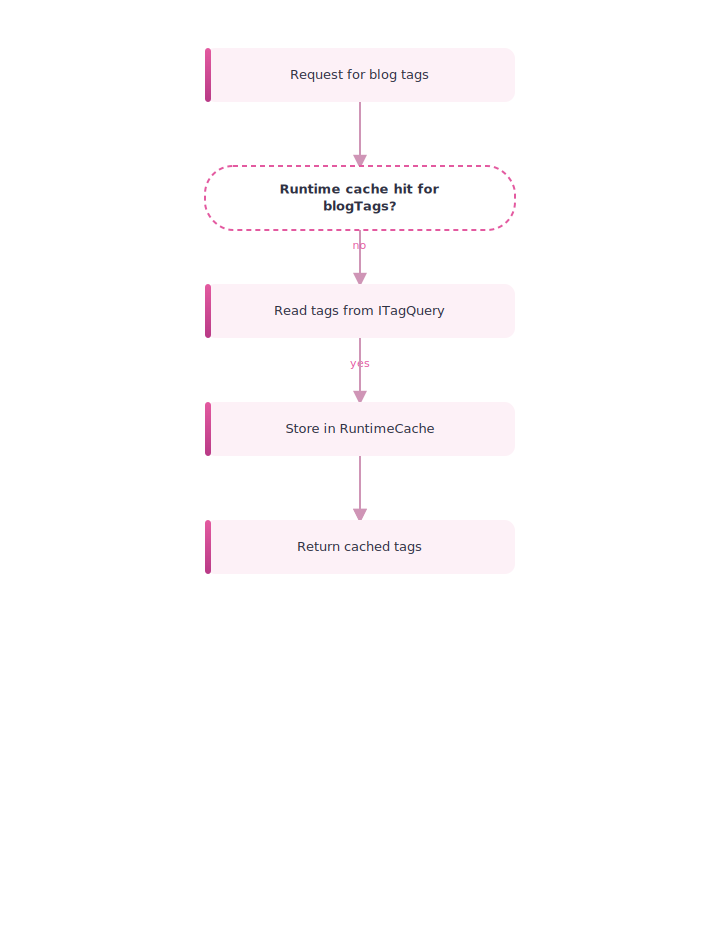
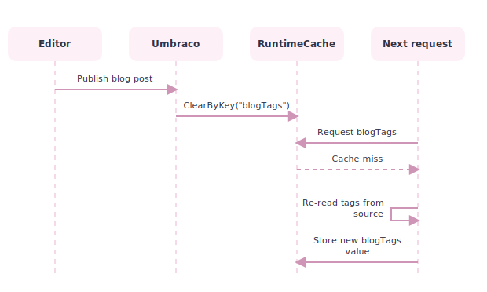
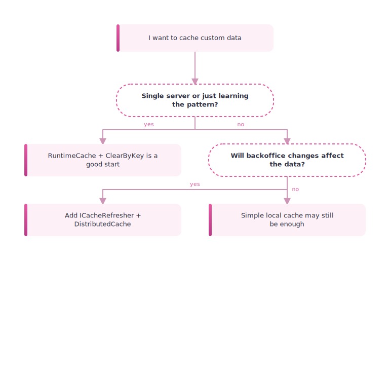

# 12. Small Local Cache Example with Tags

> **Start here.** This is the smallest possible cache pattern in Umbraco, not the full enterprise load-balanced story. You will learn the fill-and-bust loop in its purest form: cache something in `RuntimeCache`, then clear it by key when the content that affects it changes.

This is the simplest cache example in the book: a single local cache key that you fill once, clear and refill when its data changes, and read in between. That is the entire idea, and it is the "hello world" of fill-and-bust.

> **Not the read model.** This pattern caches *your own* computed data in `RuntimeCache` — not `IPublishedContent` ([Chapter 2 - The Published Object](./02-the-published-object.md)). Umbraco manages the read model's cache for you; here you are the one deciding what to store and when to bust it.

## Why this example is useful

The bigger cache chapters can feel abstract, so this one strips the idea down to its bones. Pick a cache key, decide how to fill it, and decide when to bust it. That short loop is the basic mechanism behind every bigger cache strategy.

## The scenario from the docs

The docs use tag groups as the example:[^07-tags]

- one tag group called `default`
- one tag group called `blog`

The idea is:

- `default` tags are cached for one minute
- `blog` tags are cached until restart or manual removal
- publishing a `blogPost` clears the `blogTags` cache key

## The simple architecture

<div class="pdf-keep-together" style="break-inside: avoid; page-break-inside: avoid; -webkit-column-break-inside: avoid; margin: 1rem 0;">



</div>

## The fill rule

The example uses:

- `AppCaches.RuntimeCache`
- `GetCacheItem(cacheKey, factory, timeout)`

So the cache fill logic becomes:

- if key exists, return cached value
- if key does not exist, fetch from `ITagQuery`
- store and return the result

In code, the fill side can be as small as this:

```csharp
using Umbraco.Cms.Core.Cache;
using Umbraco.Cms.Core.Models;
using Umbraco.Cms.Core.PublishedCache;
using Umbraco.Extensions;

public class BlogTagCache
{
    private const string CacheKey = "blogTags";
    private readonly AppCaches _appCaches;
    private readonly ITagQuery _tagQuery;

    public BlogTagCache(AppCaches appCaches, ITagQuery tagQuery)
    {
        _appCaches = appCaches;
        _tagQuery = tagQuery;
    }

    public IReadOnlyCollection<TagModel> GetBlogTags()
        => _appCaches.RuntimeCache.GetCacheItem(
            CacheKey,
            () => _tagQuery
                .GetAllContentTags("blog")
                .OfType<TagModel>()
                .ToArray(),
            TimeSpan.FromMinutes(30))
        ?? [];

    public void ClearBlogTags()
        => _appCaches.RuntimeCache.ClearByKey(CacheKey);
}
```

That is the smallest honest cache shape: one stable key, one source query, one fill function, and one explicit clear method.

## The bust rule

The example then adds a notification handler for:[^07-publish]

- `ContentPublishedNotification`

When a published entity has content type alias `blogPost`, it calls:

- `RuntimeCache.ClearByKey("blogTags")`

That means:

- publish blog post
- clear `blogTags`
- next request repopulates from source

The bust side is a notification handler:

```csharp
using Umbraco.Cms.Core.Events;
using Umbraco.Cms.Core.Notifications;

public class BlogTagCacheInvalidationHandler
    : INotificationHandler<ContentPublishedNotification>
{
    private readonly BlogTagCache _blogTagCache;

    public BlogTagCacheInvalidationHandler(BlogTagCache blogTagCache)
        => _blogTagCache = blogTagCache;

    public void Handle(ContentPublishedNotification notification)
    {
        if (notification.PublishedEntities.Any(content =>
                content.ContentType.Alias == "blogPost"))
        {
            _blogTagCache.ClearBlogTags();
        }
    }
}
```

Register the service and handler during composition:

```csharp
using Microsoft.Extensions.DependencyInjection;
using Umbraco.Cms.Core.Composing;
using Umbraco.Cms.Core.DependencyInjection;
using Umbraco.Cms.Core.Notifications;

public class BlogTagCacheComposer : IComposer
{
    public void Compose(IUmbracoBuilder builder)
    {
        builder.Services.AddSingleton<BlogTagCache>();
        builder.AddNotificationHandler<
            ContentPublishedNotification,
            BlogTagCacheInvalidationHandler>();
    }
}
```

<div class="pdf-keep-together" style="break-inside: avoid; page-break-inside: avoid; -webkit-column-break-inside: avoid; margin: 1rem 0;">



</div>

## Why this pattern is good

For simple local caching, this is easy to reason about:

- one cache key
- one source
- one clear event

It is also easy to debug.

## Why this pattern is not enough on its own

> **Gotcha — one server only.** By itself this pattern is not the whole load-balanced story: it clears one server's cache key, but says nothing about the others. In a load-balanced setup every server has its own copy of the runtime cache. Clearing the key on one server does nothing to the same key on the rest, so those still return the old value.

It clears a local runtime cache key, but it does not automatically describe how every other server should clear the same key. That makes it a great pattern for understanding local cache behaviour, but to be multi-server-safe it must be combined with the `ICacheRefresher` and `DistributedCache` model, which is how a change on one server tells every server to clear the same key at once.

There is also a separate question hiding underneath it:

- if the problem is "remember this small computed result", `RuntimeCache` is a good fit
- if the problem is "find the right items across a large content set", Examine may be the better fit

See [14 - Examine, Indexes, and Cache-Adjacent Querying](./14-examine-indexes-and-cache-adjacent-querying.md).

## Historical field note: derived data still needs its own busting rule

A 2013 24days article makes a useful distinction that still matters, even though its APIs are old.[^07-24days-derived]

Umbraco's published cache can make raw published values cheap to read, but a site may still spend real CPU time building menus, view models, location-specific fragments, or other derived data from those values. The article solved that with custom partial caching and singleton-style in-memory caches, then cleared them on publish events.

The modern version of that lesson is not "copy the old code". It is the same small loop this chapter teaches:

- name the derived result with a cache key
- fill it only when missing
- identify which backoffice change makes it stale
- clear it once when that change happens
- add distributed invalidation if more than one server can hold a copy

That last point is the important production warning. The old article had to send its own signal from the admin server to the load-balanced front-end servers. Current Umbraco gives you a cleaner route through `ICacheRefresher` and `DistributedCache`, but the shape of the problem has not changed: every process that can serve the stale derived value has to hear the busting instruction.

## Good mental split

### Small local app cache

Use:

- `RuntimeCache`
- `GetCacheItem(...)`
- `ClearByKey(...)`

### Load-balanced-safe custom cache

Use:

- `RuntimeCache` for storage if appropriate
- plus `ICacheRefresher`
- plus `DistributedCache`

## Relation to the bigger book

This chapter is the "hello world" for cache busting.

The bigger chapters explain:

- how Umbraco core does this at scale
- how output cache uses tags and eviction handlers
- how Deploy changes the notification model
- how load balancing requires distributed invalidation

## Tiny decision chart

<div class="pdf-keep-together" style="break-inside: avoid; page-break-inside: avoid; -webkit-column-break-inside: avoid; margin: 1rem 0;">



</div>

## Another useful connection: seed providers

This chapter is about a tiny local cache example.

The custom seed key provider example is the opposite scale:

- instead of waiting for a request
- Umbraco decides at startup which keys should already be warm

That means both patterns answer the same question from different angles:

- tags example: "what should happen on miss?"
- seed-provider example: "what should not miss in the first place?"

## In a nutshell

This tags example teaches the smallest useful cache-busting loop in Umbraco: fill by key, clear by key, refill on next request. It is a single local cache key — perfect on a single server and perfect for learning the pattern, but on its own it only clears its own copy, so a load-balanced setup still needs `ICacheRefresher` and `DistributedCache` to clear the key on every server at once.

### Three takeaways

- Local cache patterns stay useful, but they are only half the story in load-balanced setups.
- `RuntimeCache` is ideal when you already know the answer shape and just need to avoid recomputation.
- If backoffice actions can change your cached data, design the busting path first, then optimise cache hits.

### Where to go next

- [09 - Cache Busting and Invalidation](./09-cache-busting-and-invalidation.md) for the busting story in full.
- [06 - Published Cache and Load Balancing](./06-published-cache-and-load-balancing.md) for why multiple servers change everything.
- [14 - Examine, Indexes, and Cache-Adjacent Querying](./14-examine-indexes-and-cache-adjacent-querying.md) for when "search across content" beats "remember one result".

## Sources

- Docs:
  - [Cache tags example](https://docs.umbraco.com/umbraco-cms/extend-your-project/server-side-extensions/cache/examples/tags.md)
  - [Application cache](https://docs.umbraco.com/umbraco-cms/extend-your-project/server-side-extensions/cache/application-cache.md)
  - [Server-side cache extensions](https://docs.umbraco.com/umbraco-cms/extend-your-project/server-side-extensions/cache.md)

[^07-tags]: See [U10 in the appendix](./17-appendix-sources.md#u10-tags-example) and [U7](./17-appendix-sources.md#u7-application-cache-docs).
[^07-publish]: See [U10](./17-appendix-sources.md#u10-tags-example) and [U6](./17-appendix-sources.md#u6-server-side-extensions-cache-docs).
[^07-24days-derived]: See [F9 in the appendix](./17-appendix-sources.md#f9-24days-caching-field-notes), especially the 2013 server-side caching strategies article. Treat it as historical field-note evidence, not current API guidance.
