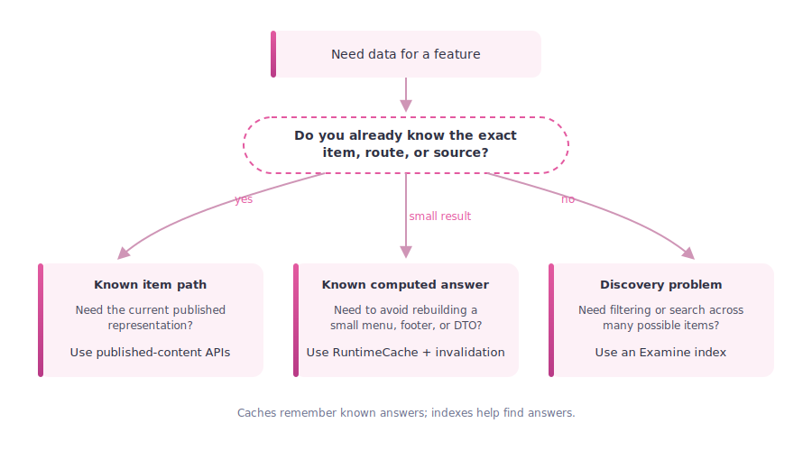
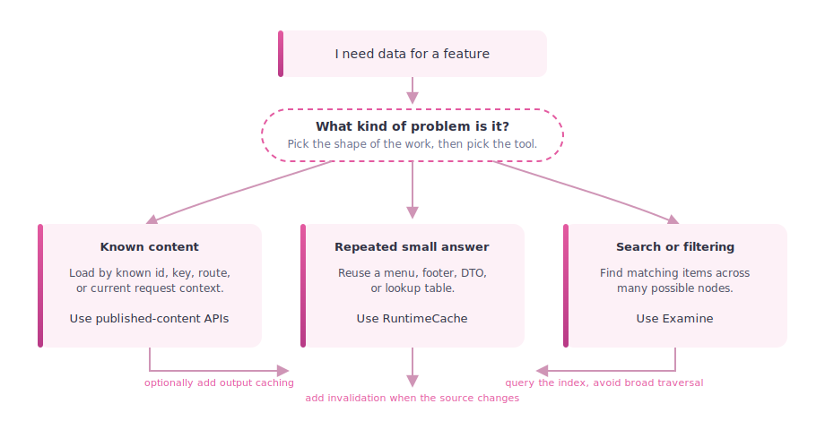

# 14. Examine, Indexes, and Cache-Adjacent Querying

> **Start here.** This is the "when NOT to reach for a cache" chapter. Examine is a search index, not a cache — but it sits close enough to be worth a chapter, because sometimes the honest fix for a slow feature is a better way to *find* things rather than another layer to *remember* things. You will learn where the line sits, why broad tree traversal is costly in the HybridCache world, and how to pick between an index, a cache, and the published-content APIs.

Examine is one of the easiest Umbraco topics to mislabel.

People often ask:

> "Is Examine a cache?"

The best beginner-safe answer is: no, not primarily. Examine is a search index, though it can play a cache-adjacent role because it stores a derived representation of content, so expensive lookups do not have to start from the published tree every time.[^13-examine]

> **Key term — Examine is an index, not a cache.** It stores a derived, searchable copy of your content so you can FIND things fast — it is built for discovery across a large set, not for serving a finished response. Reach for it when the hard part is discovery across a big set, not when the hard part is remembering one small computed result.

> **Back to the read model.** A search hit is an id, not a page. `IPublishedContentQuery` closes the loop by resolving that id back to an `IPublishedContent` ([Chapter 2 - The Published Object](./02-the-published-object.md)): the index finds things, the read model still serves them.

That distinction matters more in the HybridCache era.

## Why this chapter belongs in a caching book

This book is about caching, but HybridCache changes the query trade-offs enough that we also need one chapter about when not to solve a problem with a cache.

Markus Johansson's HybridCache talk and PDF make that point clearly:

- broad traversal is more expensive than many teams expect
- filtering after loading content can become much more visible
- some workloads are better served by `Examine` than by repeated published-content traversal[^13-talk]

So this chapter is really about choosing the right tool:

- published-content cache for published-content retrieval
- `RuntimeCache` for your own small computed results
- `Examine` for index-shaped query problems

The UMB.FYI archive is useful supporting evidence for how this distinction has been moving in the community conversation. Its cache and search entries point to four related trends: the v15+ shift away from loading all published content into memory at boot, the HybridCache warning that broad traversal now has a more visible cost, the arrival of `Umbraco.Cms.Search` as a search abstraction, and Umbraco 19's planned replacement of core Examine search handling with Umbraco Search.[^13-umbfyi]

That does not make Examine irrelevant. It makes the vocabulary more precise:

- `Examine` remains an important index technology and provider.
- `Umbraco Search` is the newer abstraction around search behaviour.
- search providers and indexes solve discovery-shaped problems, not general-purpose caching problems.

## The shortest possible distinction

### Published-content cache

This is Umbraco's internal content retrieval layer.

Its job is:

- load published content correctly
- keep repeated content access fast
- stay coherent after invalidation

### `RuntimeCache`

This is your small app-level cache.

Its job is:

- store a computed result
- avoid recomputing it for every request
- clear it when the underlying data changes

### Examine

This is a search/indexing system built on Lucene.[^13-examine]

Its job is:

- store a derived searchable representation
- answer search/filter/query requests efficiently
- avoid walking large parts of the content tree just to find matches

## Why Examine can feel cache-like

Even though Examine is not Umbraco's general-purpose cache, it does share some cache-like properties:

- it stores derived data rather than the original source object
- it is built so repeated queries become cheap
- the index, and in Umbraco Search also index-value cache data, must be refreshed or rebuilt when underlying content changes

That is why it is fair to call it cache-adjacent.

But "index" is still the better primary word.

If you call Examine a cache without qualification, beginners may assume it behaves like:

- `RuntimeCache`
- `HybridCache`
- `IMemoryCache`

and that will lead them toward the wrong mental model.

## Searchers are the clue

The Umbraco docs describe Examine management in terms of `indexes` and `searchers`.[^13-searchers] That wording is revealing: a searcher is not "the cache reader", it is the component that queries one or more indexes. That makes Examine much closer to:

- a search engine
- a read model
- a precomputed query structure

than to a simple in-memory cache entry store.

Examine is a search index — a derived, searchable copy of your content used to find the right items across a large set, distinct from the database, the published-content cache, and the output cache. When the hard part is finding the right items across a big set, query Examine. When the hard part is remembering one small computed result, use a `RuntimeCache` entry. When you want the current published representation, call the published-content APIs.

## How Umbraco hands you the index: `IPublishedContentQuery`

Most developers never touch Examine's raw API directly. Umbraco surfaces it through `IPublishedContentQuery`, the front-end query component that replaced the pile of search methods removed from `UmbracoHelper` in v8.[^13-shazwazza-ipcq] It is a thin abstraction *over* Examine: you hand it a term or an Examine query object, and instead of raw `ISearchResults` it hands back strongly-typed `PublishedSearchResult` items, each carrying an `IPublishedContent` and a relevance `Score`.

That shape is the whole chapter in miniature. The index (Examine) finds the matching items; the published-content APIs then give you the current published representation of each one. Two tools, each doing its own job — discovery, then retrieval — rather than one cache pretending to do both.

Two of Shannon's practical notes are worth carrying:

- **Page deliberately.** The `skip`/`take` overloads exist because Lucene paging has quirks; if you skip them you can end up iterating over "possibly tons of search results", which is exactly the broad-materialisation cost this chapter keeps warning about.
- **Culture is ambient by default.** When variants are enabled the culture parameter defaults to the current culture, and results include that culture's fields plus invariant fields across all documents — no extra configuration needed.

## When Markus recommends Examine instead of cache

The HybridCache material is helpful because it does not say "cache more".

Instead, it often says:

- stop broad tree traversal
- stop loading lots of content just to filter it afterwards
- query more intentionally

That is where Examine comes in.[^13-talk]

For some workloads, the best answer is not:

- "put the result in `RuntimeCache`"

but:

- "query an index that already knows how to find the right subset"

Examples Markus calls out include cases like sitemap generation and content selection patterns where a query can be expressed more naturally as indexed retrieval than as full traversal and filtering.[^13-talk]

The same theme appears in the UMB.FYI trail around Umbraco Search: the community material keeps returning to filtering, faceting, sorting, provider choice, and tailored indexing. Those are index-shaped concerns. They are adjacent to caching because both can reduce repeated work, but they are not the same kind of tool.[^13-umbfyi-search]

## A practical decision rule

Ask this question first:

> Am I trying to remember a small result, or am I trying to find the right items across a larger set?

If the answer is "remember a small result", a cache is often right.

If the answer is "find the right items", an index is often right.

## Quick comparison

| Problem | Best fit | Why |
| --- | --- | --- |
| Reuse a small computed object | `RuntimeCache` | You already know the shape of the answer and just want to avoid recomputing it. |
| Load published content by route or id | Published-content APIs | This is the platform's native retrieval path. |
| Find many matching items across a large set | `Examine` | The hard part is discovery, so an index is better than broad traversal. |
| Cache rendered HTML | Output cache | The expensive step is rendering the page, not looking up content. |
| Keep one custom app projection warm | `RuntimeCache` plus invalidation | Good when the source is small and change events are well defined. |

## Selection graph

<div class="pdf-keep-together" style="break-inside: avoid; page-break-inside: avoid; -webkit-column-break-inside: avoid; margin: 1rem 0;">



</div>

The important shape of the decision is this:

- caches remember answers
- indexes help you find answers
- published-content APIs retrieve Umbraco's current published representation; the database remains the underlying persistence source

## Troubleshooting checklist

> **Gotcha — a slow feature is not automatically a cache miss.** When something feels slow, resist the reflex to bolt on "add a cache". A cache hides the cost of *recomputing an answer you already have the shape of*; it does nothing for the cost of *walking half the tree to discover the answer in the first place*. Diagnose the shape of the slowness before you pick the tool.

Check these in order:

1. Are you traversing a large part of the tree and filtering afterwards?
1. Are you reusing a computed result that belongs in `RuntimeCache`?
1. Are you really trying to search or filter across many items, which is where Examine fits better?
1. Is the problem actually lock contention, rebuild lag, or another operational issue?

That checklist is the practical version of the chapter's main message:

- not every slow query is a cache miss
- not every repeated lookup should become a cache
- not every search problem should be solved by walking content

## Decision chart

<div class="pdf-keep-together" style="break-inside: avoid; page-break-inside: avoid; -webkit-column-break-inside: avoid; margin: 1rem 0;">



</div>

## Good examples for `RuntimeCache`

- menu DTOs
- footer link groups
- a small settings projection
- a compact lookup table built from a known source

These are all cases where your code already knows what data shape it wants and just wants to avoid rebuilding it repeatedly.

## Good examples for Examine

- search pages
- filtered listings
- sitemap-like discovery workloads
- "find all matching content" queries across a large set
- faceted listings where the index stores fields specifically shaped for filtering
- provider-backed search where Examine, Elasticsearch, Azure AI Search, or another provider answers the query

These are cases where the main cost is not recomputing one tiny DTO — it is discovering the right set of content in the first place.

## Bad pattern to watch for

This is the trap the HybridCache material warns about:

1. load a broad part of the tree
2. materialise many content items
3. filter in memory
4. call that "fine because it is cached"

That may have felt acceptable in older mental models, but it is much less safe in the newer world.

## Operational index gotchas

Indexes have their own invalidation and rebuild story.

That is another reason not to call them "just a cache". A cache entry normally has a key, a value, and an expiry or invalidation path. A search index has fields, analysers, providers, storage, searchers, rebuilds, and synchronisation concerns.

The clearest primary account of this comes from Shannon Deminick, the creator of Examine. His write-up of the Examine 3.3.0 fix explains an index-corruption bug that hit Umbraco sites using the default `SyncedFileSystemDirectoryFactory`, producing errors like `Lucene.Net.Index.CorruptIndexException: invalid deletion count`.[^13-shazwazza-corruption] The mechanism is worth understanding because it is a caching-shaped problem in disguise:

- The factory keeps two copies of each index: one on Azure's fast local drive (`C:\%temp%`) and one on slower shared network storage. The local copy exists purely so a site can start without rebuilding the whole index when it moves between workers — a performance cache layered over the durable index.
- The original implementation had no safeguard against corruption in the main (shared) copy, which could arise from misconfiguration, network latency, or a process being killed mid-write.
- The fix adds health checks on both copies. If the main index is corrupt but the local copy is healthy, it restores main from local; if both are unhealthy, it deletes the main index and lets a rebuild happen; it always syncs main to local afterwards. An optional repair mode exists but is disabled by default because it can lose documents.

The details belong to Examine rather than Umbraco's published-content cache, but the lesson fits this book perfectly: derived read models are only trustworthy when their refresh and repair paths are understood. The same event also surfaces in the UMB.FYI archive as a secondary trail.[^13-umbfyi-index-ops]

### Disabling indexes on front-end servers

Shannon's second operational lesson is about load-balanced setups.[^13-shazwazza-frontend] When each worker rebuilds its Lucene indexes on startup, that rebuild queries the database and takes content locks. In a scaled-out Azure App Service environment where several fresh workers can come online at once, those simultaneous rebuilds can pile up into SQL timeouts.

His guidance splits on whether the front-end actually uses the Examine APIs:

- If it does, move search to a hosted index (his commercial ExamineX, or another provider-backed index) so front-end workers query a shared service instead of rebuilding local indexes.
- If it does not, disable indexing on those servers: swap the index factory for an in-memory `RAMDirectory` one, set `EnableDefaultEventHandler = false`, and register no-op index populators so nothing tries to fill them.

The caution he adds is the cache-shaped one again: `RAMDirectory` indexes consume memory proportional to index size, so they suit small front-end/replica indexes, not large content servers. That is the same trade-off Kenn Jacobsen flags for in-memory Umbraco Search, reached from a different angle.

## Field note: Kenn Jacobsen's search providers

Kenn Jacobsen's recent public repositories make the index/cache distinction concrete in modern Umbraco terms.[^13-kjac-search]

Several of them implement alternative providers for Umbraco Search:

- `Kjac.SearchProvider.Typesense`
- `Kjac.SearchProvider.Elasticsearch`
- `Kjac.SearchProvider.Algolia`
- `Kjac.SearchProvider.PostgreSql`

Those names matter less than the shape of the architecture. The content still starts in Umbraco, but search is answered by a derived index owned by another provider. That provider may be a document search engine, a relational database, or a hosted search service. Either way, the index is no longer the published-content cache. It is a specialised read model built for discovery.

Two details from the READMEs are especially useful for beginners:

- the Typesense and Elasticsearch providers call out custom content-index registration for load-balanced setups
- the PostgreSQL provider warns that it is functional but not a match for document/search engines on larger content sets, and recommends benchmarking

That is the practical version of this chapter's rule. Indexes are not just faster dictionaries. They have provider choices, registration rules, rebuild paths, query costs, and operational trade-offs. If your feature is really a search problem, choose and operate an index deliberately. If your feature is just remembering one small computed answer, use a cache.

`NoCode.DeliveryApi` adds one more useful example from the Delivery API side: after filter or sorter configuration changes, existing content must be republished or `DeliveryApiContentIndex` rebuilt. In other words, changing the query rules does not automatically rewrite every already-indexed projection. The refresh path is part of the feature, not an afterthought.

The linked posts fill in the same model from several angles:

- "Trying out the new Umbraco Search" describes search as full-text search, faceting, sorting, languages, segments, protected documents, extension points, and multiple simultaneous providers. That is much richer than a key/value cache.
- "Tailored indexing for Umbraco Search" shows property value handlers, content indexers, and indexing notifications. Those are explicit places where a project chooses what shape the derived index should have.
- "In-memory Umbraco Search" shows that Search can run on in-memory Examine indexes, but warns about increased memory footprint, prolonged startup, database reindexing pressure, and load-balanced multiplication of that cost.
- "Building a search service from scratch" uses Umbraco webhooks to add, replace, or discard documents in a MiniSearch index, then persists that index to disk. That is a small, readable example of an index as an external projection with its own update and repair path.

Taken together, these examples are a good beginner test: if the design conversation includes fields, facets, analysers, providers, index options, rebuilds, seed scripts, or webhook payloads, you are probably designing an index or projection, not simply adding a cache.

## Field note: Matt Brailsford's Umbraco AI Search

`Umbraco.AI.Search` (beta, April 2026) illustrates the same architecture as Kenn's providers but with a fundamentally different indexing model: semantic vector search instead of keyword matching.[^13-brailsford-ai-search]

When content publishes, the indexer extracts text, chunks it, and converts each chunk into a high-dimensional vector via an embedding model. At query time the same model embeds the search phrase, then cosine similarity finds the nearest vectors. That means a query like "how to release my site" can surface a document titled "Deployment Guide" — something a keyword index would miss entirely.

The storage backend ships as a database-backed EF Core implementation. SQL Server 2025 uses native `VECTOR_DISTANCE()` functions; older versions fall back to .NET cosine similarity. The storage interface is swappable for external services such as Qdrant, Pinecone, or Azure AI Search — the same provider-agnostic shape as Kenn's Typesense and Elasticsearch providers.

This fits the chapter's decision rule without changing it. If the hard part is discovery across a large content set, reach for an index. Vector search is a different *kind* of index, not a different *type* of tool: the problem is still discovery, not remembering a small computed result.

## Field note: Shannon Deminick's ExamineX and hosted indexes

Examine's own creator maintains a commercial provider, ExamineX, that swaps Examine's local Lucene storage for Azure AI Search behind the same `Examine` interfaces.[^13-shazwazza-examinex] Because it implements the standard interface, code written against `IPublishedContentQuery` or Examine's searchers keeps working unchanged — the index just lives in a hosted service instead of on the worker's disk.

That places it alongside Kenn Jacobsen's Typesense, Elasticsearch, Algolia, and PostgreSQL providers and Matt Brailsford's vector search: the same provider-agnostic pattern, where the published content still originates in Umbraco but discovery is answered by a derived index owned elsewhere. It also directly solves the front-end rebuild problem above — a hosted index has nothing to rebuild on worker startup. Beyond storage, ExamineX layers on Azure AI Search features such as the typeahead *suggester* API, a reminder that once discovery moves to a dedicated engine you inherit that engine's capabilities as well as its operational model.

## Example: adding a field to an index

Kenn's tailored indexing article shows the sort of code that belongs in an index chapter rather than a cache chapter. A content indexer computes extra fields before content enters the search index:

```csharp
using Umbraco.Cms.Core.Models;
using Umbraco.Cms.Search.Core.Models.Indexing;
using Umbraco.Cms.Search.Core.Services.ContentIndexing;

public class ProductCategoryContentIndexer : IContentIndexer
{
  public async Task<IEnumerable<IndexField>> GetIndexFieldsAsync(
    IContentBase content,
    string?[] cultures,
    bool published,
    CancellationToken cancellationToken)
  {
    if (content.ContentType.Alias != "product")
    {
      return [];
    }

    string[] categories = await FindProductCategoriesAsync(content.Key, cancellationToken);

    return categories.Length == 0
      ? []
      :
      [
        new IndexField(
          "category",
          new IndexValue { Keywords = categories },
          Culture: null,
          Segment: null)
      ];
  }

  private Task<string[]> FindProductCategoriesAsync(Guid productKey, CancellationToken cancellationToken)
    => Task.FromResult<string[]>(["implement", "your", "mapping"]);
}
```

That is not a cache entry. It is a deliberate read model. The project chooses that category should exist as an indexed keyword field, so later faceted queries can ask the search provider instead of traversing content and filtering in memory.

## In a nutshell

If you want one clean sentence to reuse elsewhere, this is probably it:

> Examine is not Umbraco's general-purpose cache, but it is a derived index that can play a cache-adjacent role by making expensive discovery queries cheap enough to avoid broad published-content traversal.[^13-examine]

### Three takeaways

- Caches remember answers, indexes help you find answers, and the published-content APIs retrieve Umbraco's current published representation — match the tool to the shape of the problem.
- In the HybridCache world, "load a broad slice of the tree and filter in memory" is no longer a cheap habit, so discovery-shaped work often belongs in `Examine` rather than in another cache.
- Before you add a cache, ask whether you are remembering a small result or finding items across a large set; only the first is really a cache's job.

### Where to go next

- For the internal published-content cache story, see [06 - Published Content Cache, AppCaches, and Load Balancing](./06-published-cache-and-load-balancing.md).
- For the practical query-strategy warning from the HybridCache talk, see [11 - Cache Settings, Talks, and Field Notes](./11-cache-settings-talks-and-field-notes.md).
- For the tiny custom cache example using `RuntimeCache`, see [12 - Small Local Cache Example with Tags](./12-small-local-cache-example-with-tags.md).
- For Deploy's effect on index refresh, see [10 - HQ Extensions and Cache](./10-hq-extensions-and-cache.md).

## Sources

- Docs:
  - [Examine](https://docs.umbraco.com/umbraco-cms/develop-with-umbraco/application-code/examine)
  - [Examine management](https://docs.umbraco.com/umbraco-cms/develop-with-umbraco/application-code/examine/examine-management)
- Supporting material:
  - [Hybrid Cache förändrar allt — Umbraco Kalaset slides (PDF)](https://www.umbracokalaset.se/media/ccvhwzvs/hybrid-cache-forandrar-allt.pdf)
  - [Examine ISearcher API](https://shazwazza.github.io/Examine/api/Examine.ISearcher.html)
  - [UMB.FYI archive](https://umb.fyi/archive)
  - [Kenn Jacobsen's public Umbraco repository field notes](./17-appendix-sources.md#f10-kenn-jacobsen-umbraco-repository-field-notes)

[^13-examine]: See [U15](./17-appendix-sources.md#u15-examine-overview), [U16](./17-appendix-sources.md#u16-examine-management), and [U17](./17-appendix-sources.md#u17-examine-isearcher-api).
[^13-searchers]: See [U16](./17-appendix-sources.md#u16-examine-management) and [U17](./17-appendix-sources.md#u17-examine-isearcher-api).
[^13-talk]: See [T2](./17-appendix-sources.md#t2-hybrid-cache-forandrar-allt-pdf).
[^13-umbfyi]: See [F8](./17-appendix-sources.md#f8-umbfyi-cache-and-search-archive-trail), especially the entries for 27 November 2024, 10 June 2026, and 1 July 2026.
[^13-umbfyi-search]: See [F8](./17-appendix-sources.md#f8-umbfyi-cache-and-search-archive-trail), especially the entries for 15 January 2025, 3 September 2025, 10 September 2025, 17 September 2025, 27 May 2026, and 1 July 2026.
[^13-umbfyi-index-ops]: See [F8](./17-appendix-sources.md#f8-umbfyi-cache-and-search-archive-trail), especially the entries for 7 August 2024 and 28 August 2024.
[^13-kjac-search]: See [F10](./17-appendix-sources.md#f10-kenn-jacobsen-umbraco-repository-field-notes), especially the Umbraco Search providers, `NoCode.DeliveryApi`, `UmbracoSearchDemo`, and `UmbracoSearchInMemory`.
[^13-brailsford-ai-search]: See [F11](./17-appendix-sources.md#f11-matt-brailsford-introducing-umbraco-ai-search).
[^13-shazwazza-corruption]: See [F12](./17-appendix-sources.md#f12-shannon-deminick-examine-field-notes), "An Examine fix for Umbraco index corruption".
[^13-shazwazza-frontend]: See [F12](./17-appendix-sources.md#f12-shannon-deminick-examine-field-notes), "Can I disable Examine indexes on Umbraco front-end servers?".
[^13-shazwazza-ipcq]: See [F12](./17-appendix-sources.md#f12-shannon-deminick-examine-field-notes), "Searching with IPublishedContentQuery in Umbraco".
[^13-shazwazza-examinex]: See [F12](./17-appendix-sources.md#f12-shannon-deminick-examine-field-notes), "Configuring a Suggester with ExamineX and Azure AI Search".
