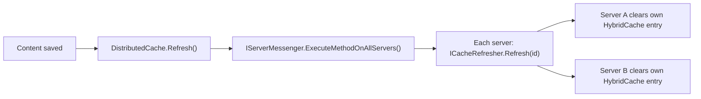
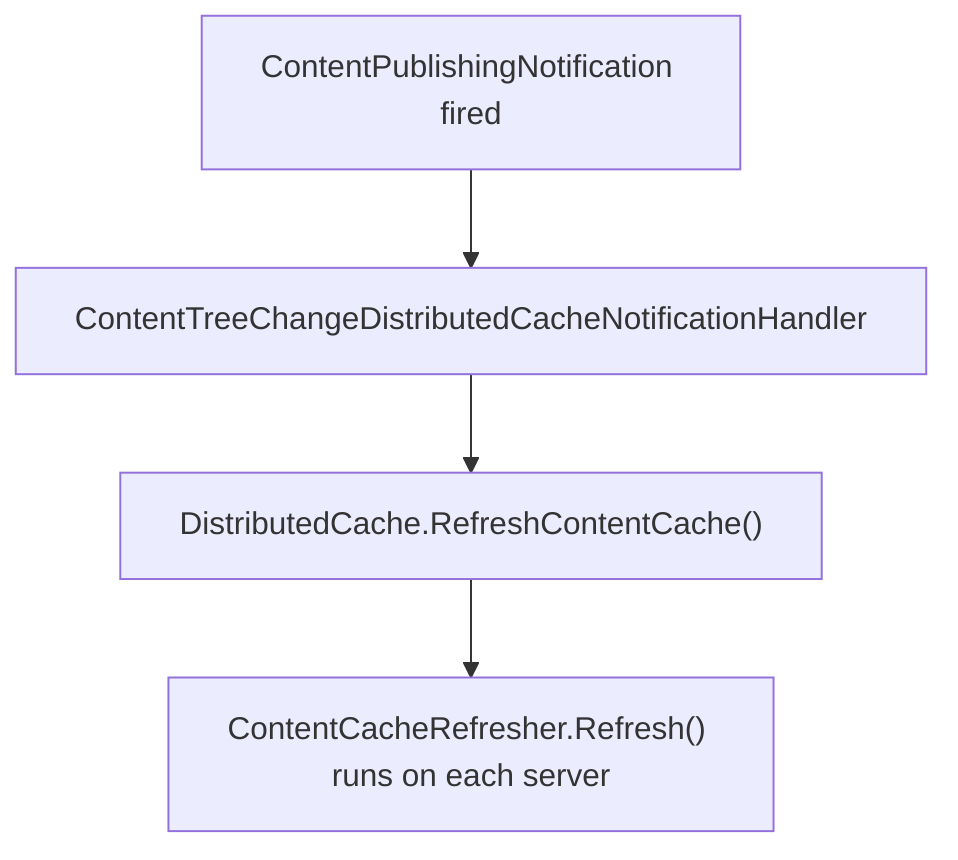
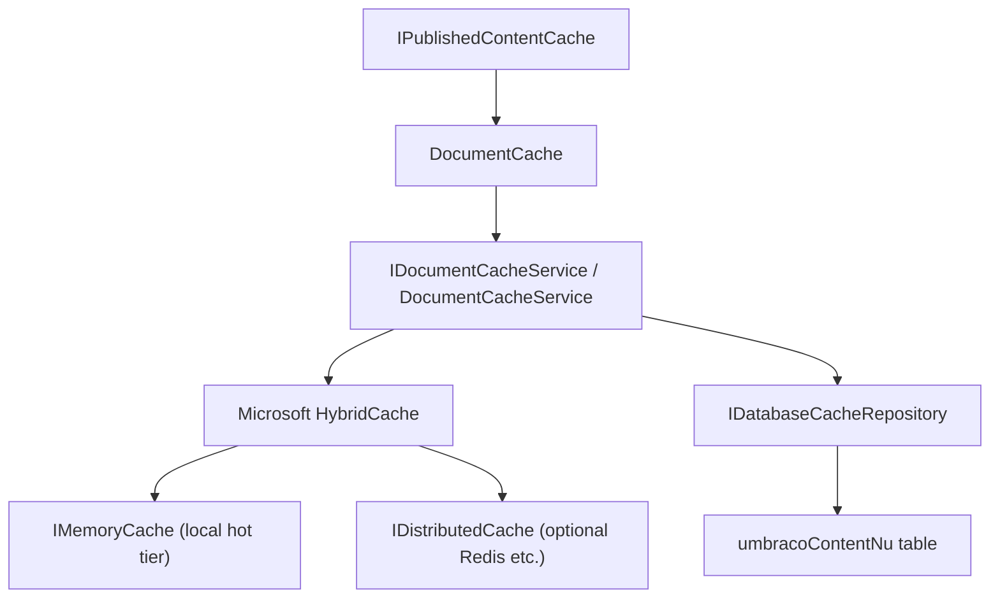
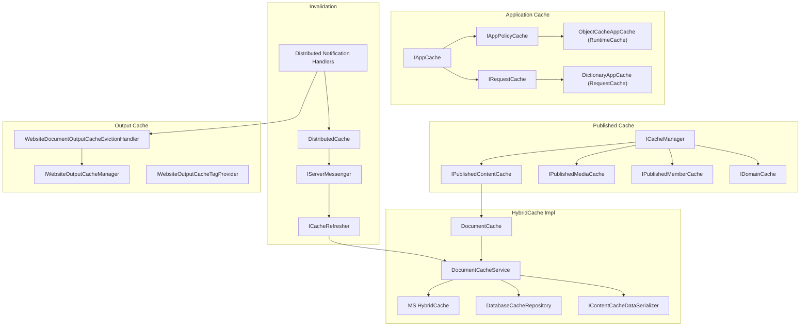

# 14. Reading the Cache Code

Opening the Umbraco source and searching for "cache" returns hundreds of files.

This chapter gives you a map so you can read those files without getting lost.

---

## The two questions that matter

Before diving into types, ask yourself which question you are actually trying to answer:

1. **"Where does Umbraco store cached things?"** — that leads you to `IAppCache` and `HybridCache`.
2. **"How does Umbraco tell all servers a thing changed?"** — that leads you to `ICacheRefresher` and `DistributedCache`.

Most confusing moments in the source code happen because these two concerns live side by side and share the word "cache".

---

## The `IAppCache` family

`IAppCache`[^15-appcache] is the base interface for all Umbraco application-level caches.

It lives in `Umbraco.Core/Cache/IAppCache.cs` and declares three essential operations:

- **Get** — retrieve a value by key, optionally creating it if absent
- **Clear** — remove one or all entries
- **Search** — find entries matching a key prefix or pattern

Two sub-interfaces extend it:

- `IAppPolicyCache` adds timeout and sliding-expiry support
- `IRequestCache` adds enumeration of current entries (one HTTP request only)

```
IAppCache
├── IAppPolicyCache      (timeout-aware, used for RuntimeCache)
└── IRequestCache        (one HTTP request lifetime)
```

### Implementations you will see in the source

| Class | What it is |
|-------|-----------|
| `ObjectCacheAppCache` | Wraps .NET `MemoryCache`; the default `RuntimeCache` |
| `DictionaryAppCache` | Simple dictionary; used for `RequestCache` |
| `FastDictionaryAppCache` | Thread-safe dictionary without lock contention |
| `DeepCloneAppCache` | Wraps another cache; deep-clones all values on read to prevent mutation bugs |
| `NoAppCache` | No-op; useful for tests or cases where caching should be skipped |

### `AppCaches`

`AppCaches`[^15-appcaches] is the container object you will see passed around:

```csharp
public class AppCaches
{
    public IAppPolicyCache RuntimeCache { get; }
    public IRequestCache RequestCache { get; }
    public IsolatedCaches IsolatedCaches { get; }
}
```

`IsolatedCaches` gives each repository or service type its own named cache bucket so they cannot accidentally clear each other's entries.

### How to use it in your own code

```csharp
public class MyService
{
    private readonly IAppPolicyCache _cache;

    public MyService(AppCaches appCaches)
    {
        _cache = appCaches.RuntimeCache;
    }

    public MyModel GetThing(int id)
    {
        return _cache.GetCacheItem($"my-thing-{id}", () => LoadFromDb(id));
    }
}
```

The factory lambda runs only on a cache miss.

---

## The `ICacheRefresher` pattern

`ICacheRefresher`[^15-refresher] is how Umbraco invalidates caches.

It lives in `Umbraco.Core/Cache/Refreshers/ICacheRefresher.cs`.

Each refresher has a unique GUID that identifies it across servers.

```csharp
public interface ICacheRefresher
{
    Guid RefresherUniqueId { get; }
    string Name { get; }

    void RefreshAll();
    void Refresh(int id);
    void Refresh(Guid id);
    void Remove(int id);
}
```

When something changes on one server, `DistributedCache`[^15-distributed] picks up the instruction and passes it to `IServerMessenger`, which broadcasts the same instruction to every server. Each server then runs the refresher locally.



### The refresher inheritance chain

```
ICacheRefresher
└── ICacheRefresher<T>           (adds Refresh(T instance))
    ├── IJsonCacheRefresher      (adds Refresh(string jsonPayload))
    └── IPayloadCacheRefresher<TPayload>  (typed payload)

Base classes (in Umbraco.Core/Cache/Refreshers/):
    CacheRefresherBase<TNotification>
    ├── JsonCacheRefresherBase<TNotification>
    └── PayloadCacheRefresherBase<TNotification, TPayload>
```

### The 17 (v17) / 19 (v18) concrete refreshers

Every significant entity type in Umbraco has a matching refresher:

| Refresher | Handles |
|-----------|---------|
| `ContentCacheRefresher` | Published documents |
| `MediaCacheRefresher` | Published media |
| `MemberCacheRefresher` | Members |
| `ContentTypeCacheRefresher` | Content type definitions |
| `DataTypeCacheRefresher` | Data type configurations |
| `TemplateCacheRefresher` | Razor templates |
| `LanguageCacheRefresher` | Language and culture settings |
| `DomainCacheRefresher` | Domain assignments |
| `DictionaryCacheRefresher` | Dictionary items |
| `UserCacheRefresher` | Users |
| `UserGroupCacheRefresher` | User groups |
| `MemberGroupCacheRefresher` | Member groups |
| `RelationTypeCacheRefresher` | Relation types |
| `PublicAccessCacheRefresher` | Public access rules |
| `ExternalMemberCacheRefresher` | External identity members |
| `ApplicationCacheRefresher` | Backoffice sections |
| `ValueEditorCacheRefresher` | Property value editors |
| `ElementCacheRefresher` *(v18)* | Block/element types |
| `ElementContainerCacheRefresher` *(v18)* | Element container types |

---

## The notification handler pattern

Cache refreshers do not observe entity saves directly.

Instead, Umbraco uses a two-step chain:

1. An entity is saved → Umbraco raises a **notification** (e.g. `ContentSavingNotification`)
2. A **distributed cache notification handler** receives that notification and calls `DistributedCache` to schedule the refresher



The handler base classes live in `Umbraco.Core/Cache/NotificationHandlers/`:

| Base class | Handles |
|------------|---------|
| `SavedDistributedCacheNotificationHandlerBase<TEntity, TNotification>` | Saved entity notifications |
| `DeletedDistributedCacheNotificationHandlerBase<TEntity, TNotification>` | Deleted entity notifications |
| `TreeChangeDistributedCacheNotificationHandlerBase<TEntity, TNotification>` | Tree structure changes |
| `ContentTypeChangedDistributedCacheNotificationHandlerBase<TEntity, TNotification>` | Type definition changes |

For example, `DataTypeSavedDistributedCacheNotificationHandler` extends `SavedDistributedCacheNotificationHandlerBase` and simply calls `DistributedCache.RefreshDataTypeCache(savedEntities)`.

There are over 30 concrete implementations in the `Implement/` subfolder — one pair (saved + deleted) for each entity type that matters for caching.

---

## The published cache type hierarchy

The "published content cache" is the cache that serves `IPublishedContent` objects for pages, media, and members.

At the top of this hierarchy are these interfaces in `Umbraco.Core/PublishedCache/`:

```
IPublishedCache               (base: GetById, GetAtRoot, HasContent)
├── IPublishedContentCache    (documents / pages)
├── IPublishedMediaCache      (media)
├── IPublishedElementCache    (block elements — v18 only)
└── IDomainCache              (domain assignments)

IPublishedMemberCache         (members — separate hierarchy)
```

`ICacheManager` aggregates all of these:

```csharp
public interface ICacheManager
{
    IPublishedContentCache Content { get; }
    IPublishedMediaCache Media { get; }
    IPublishedMemberCache Members { get; }
    IDomainCache Domains { get; }
    // v18 adds: IPublishedElementCache Elements
}
```

If you want to understand what Umbraco does when you call `umbracoHelper.Content(id)`, the trail starts here.

---

## The HybridCache implementation

The concrete published cache lives in the `Umbraco.PublishedCache.HybridCache` project.

Here is the layered structure:



### `DocumentCacheService` — the key class

`DocumentCacheService`[^15-docsvc] is where a cache miss becomes a database read.

Its `GetByKeyAsync` method:

1. Calls `HybridCache.GetOrCreateAsync(key, ...)` 
2. On cache miss, falls back to `IDatabaseCacheRepository.GetContentSourceAsync(key)`
3. Deserialises the result using `IContentCacheDataSerializer`
4. Returns the entry to `HybridCache` for storage

### Serialisation options

The cache can serialise content using either:

- **MessagePack** (default) — compact binary format with optional LZ4 compression via `LazyCompressedString`
- **JSON** — available for debugging or migration from older versions

`NuCacheSerializerType` in the settings controls this, despite the NuCache name.

### The seeding system

On startup, Umbraco does not wait for individual cache misses.

`SeedingNotificationHandler` triggers seed key providers to pre-warm the cache for common content.

The seed key provider types:

| Provider | Strategy |
|----------|---------|
| `DocumentBreadthFirstKeyProvider` | Top-level pages first, then deeper levels |
| `MediaBreadthFirstKeyProvider` | Same pattern for media |
| `ContentTypeSeedKeyProvider` | All items of specific content types |
| `ElementBreadthFirstKeyProvider` *(v18)* | Block element seeding |

---

## Repository cache policies

Repositories that deal with entities (content types, templates, languages, etc.) use a separate caching layer called **repository cache policies**.

The interface is `IRepositoryCachePolicy<TEntity, TId>`.

Available policies in `Umbraco.Infrastructure/Cache/`:

| Policy | Behaviour |
|--------|---------|
| `DefaultRepositoryCachePolicy` | Cache by ID and by GUID key |
| `FullDataSetRepositoryCachePolicy` | Cache entire result set (good for small, infrequently changed sets) |
| `SingleItemsOnlyRepositoryCachePolicy` | Cache individual fetches but not collection queries |
| `GuidReadRepositoryCachePolicy` | Cache GUID-based lookups only |
| `MemberRepositoryUsernameCachePolicy` | Adds username-keyed lookups on top |
| `NoCacheRepositoryCachePolicy` | No caching (test or admin-only repositories) |

Each repository picks its own policy when constructed.

---

## Output cache types

Output caching is a separate concern from published content caching.

The interfaces for website output caching live in `Umbraco.Core/Cache/`:

| Interface | Purpose |
|-----------|---------|
| `IWebsiteOutputCacheManager` | Evict entries programmatically |
| `IWebsiteOutputCacheDurationProvider` | Control how long pages are cached |
| `IWebsiteOutputCacheTagProvider` | Assign tags to responses so they can be evicted by group |
| `IWebsiteOutputCacheEvictionProvider` | Define extra eviction logic per content node |
| `IWebsiteOutputCacheRequestFilter` | Decide whether a request is eligible for caching |
| `IWebsiteOutputCacheVaryByProvider` | Define Vary-By dimensions (e.g. culture, cookie) |

The Delivery API has its own mirror set:

- `IDeliveryApiOutputCacheManager`
- `IDeliveryApiOutputCacheTagProvider`
- `IDeliveryApiOutputCacheEvictionProvider`
- `IDeliveryApiOutputCacheRequestFilter`
- `IDeliveryApiOutputCacheVaryByProvider`

The eviction handlers in `Umbraco.Web.Website/Caching/` are what connect entity changes to output-cache evictions:

- `WebsiteDocumentOutputCacheEvictionHandler` — evicts pages by content key tag or ancestor tag
- `WebsiteMediaOutputCacheEvictionHandler` — evicts pages referencing changed media
- `WebsiteMemberOutputCacheEvictionHandler` — evicts pages referencing changed members

In v18, `DeliveryApiElementOutputCacheEvictionHandler` adds the same pattern for block element changes.

---

## Where to look for what

When you need to understand a specific cache behaviour, start here:

| Question | Start here |
|----------|-----------|
| "What is cached and how?" | `Umbraco.Core/Cache/IAppCache.cs`, `AppCaches.cs` |
| "How does content become cached?" | `Umbraco.PublishedCache.HybridCache/Services/DocumentCacheService.cs` |
| "How is a publish turned into a cache bust?" | `Umbraco.Core/Cache/Refreshers/Implement/ContentCacheRefresher.cs` |
| "How is the bust broadcast to other servers?" | `Umbraco.Core/Cache/DistributedCache.cs` |
| "How does output cache know to evict a page?" | `Umbraco.Web.Website/Caching/WebsiteDocumentOutputCacheEvictionHandler.cs` |
| "How are repository entities cached?" | `Umbraco.Infrastructure/Cache/DefaultRepositoryCachePolicy.cs` |
| "What are all the refreshers?" | `Umbraco.Core/Cache/Refreshers/CacheRefresherCollection.cs` |
| "How is cache pre-warmed?" | `Umbraco.PublishedCache.HybridCache/NotificationHandlers/SeedingNotificationHandler.cs` |

---

## The full type map (v17)



---

## What v18 adds to the type map

The v18 additions are almost entirely about giving block/element content its own first-class slot in every layer:

```
v17 Published Cache:         v18 adds:
  IPublishedContentCache  →    IPublishedElementCache
  IDocumentCacheService   →    IElementCacheService
  ContentCacheRefresher   →    ElementCacheRefresher
                               ElementContainerCacheRefresher
  (no element handler)    →    ElementTreeChangeDistributedCacheNotificationHandler
  (no element eviction)   →    DeliveryApiElementOutputCacheEvictionHandler
  (no element seeding)    →    ElementBreadthFirstKeyProvider
                               IElementSeedKeyProvider
```

The pattern is identical to documents and media — element types just did not have their own lane before v18.

---

## Beginner rules for reading the code

- When you see `AppCaches`, think "read/write cached data for this server".
- When you see `DistributedCache`, think "tell other servers something changed".
- When you see `ICacheRefresher`, think "the actual invalidation logic that runs everywhere".
- When you see `INotificationHandler<XxxNotification>` in the cache namespace, think "the bridge between entity events and cache invalidation".
- When you see `HybridCache` being injected, think "the published content storage and retrieval layer".
- The word "distributed" in Umbraco code usually means "reaches multiple servers", not "stored in Redis".

---

## In a nutshell

If you split cache *storage* (`IAppCache` and `HybridCache`) from cache *invalidation choreography* (`ICacheRefresher` and `DistributedCache`), the Umbraco cache codebase becomes much easier to navigate.

### Three takeaways

- `AppCaches` is your local storage tool; `DistributedCache` is your cross-server signalling tool.
- Notification handlers are the bridge between domain events and invalidation actions.
- The HybridCache module is a layered published-content system, not a single cache call.

### Where to go next

- [Chapter 3 - Published Cache and Load Balancing](./03-published-cache-and-load-balancing.md) for the runtime behaviour behind these types.
- [Chapter 4 - Cache Busting and Invalidation](./04-cache-busting-and-invalidation.md) for refresher flow and change types.
- [Chapter 9 - Future Hybrid Cache Architecture](./09-future-hybrid-cache-architecture.md) for deeper internals and design direction.

## Sources

- Code:
  - `umbraco-v17/src/Umbraco.Core/Cache/IAppCache.cs`
  - `umbraco-v17/src/Umbraco.Core/Cache/AppCaches.cs`
  - `umbraco-v17/src/Umbraco.Core/Cache/DistributedCache.cs`
  - `umbraco-v17/src/Umbraco.Core/Cache/Refreshers/ICacheRefresher.cs`
  - `umbraco-v17/src/Umbraco.Core/Cache/Refreshers/CacheRefresherBase.cs`
  - `umbraco-v17/src/Umbraco.Core/Cache/Refreshers/Implement/ContentCacheRefresher.cs`
  - `umbraco-v17/src/Umbraco.Core/Cache/NotificationHandlers/`
  - `umbraco-v17/src/Umbraco.Core/PublishedCache/ICacheManager.cs`
  - `umbraco-v17/src/Umbraco.Core/PublishedCache/IPublishedContentCache.cs`
  - `umbraco-v17/src/Umbraco.PublishedCache.HybridCache/Services/DocumentCacheService.cs`
  - `umbraco-v17/src/Umbraco.PublishedCache.HybridCache/Persistence/DatabaseCacheRepository.cs`
  - `umbraco-v17/src/Umbraco.PublishedCache.HybridCache/NotificationHandlers/SeedingNotificationHandler.cs`
  - `umbraco-v17/src/Umbraco.Infrastructure/Cache/DefaultRepositoryCachePolicy.cs`
  - `umbraco-v17/src/Umbraco.Web.Website/Caching/WebsiteDocumentOutputCacheEvictionHandler.cs`
  - `umbraco-v18/src/Umbraco.Core/PublishedCache/IPublishedElementCache.cs`
  - `umbraco-v18/src/Umbraco.Core/Cache/Refreshers/Implement/ElementCacheRefresher.cs`

[^15-appcache]: `umbraco-v17/src/Umbraco.Core/Cache/IAppCache.cs`
[^15-appcaches]: `umbraco-v17/src/Umbraco.Core/Cache/AppCaches.cs`
[^15-refresher]: `umbraco-v17/src/Umbraco.Core/Cache/Refreshers/ICacheRefresher.cs`
[^15-distributed]: `umbraco-v17/src/Umbraco.Core/Cache/DistributedCache.cs`
[^15-docsvc]: `umbraco-v17/src/Umbraco.PublishedCache.HybridCache/Services/DocumentCacheService.cs`
